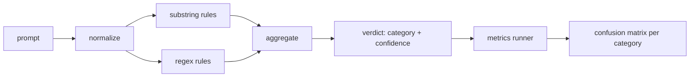

# Капстоун 83 — детектор инъекций промптов

> Детектор — это функция, которая по промпту возвращает уверенность и категорию. Всё остальное — вайб.

**Тип:** Build**Языки:** Python**Предварительные требования:** Фаза 18 safety уроки, Фаза 19 Track A уроки 25-29**Время:** ~90 минут
## Проблема

Команда читает в соцсетях про джейлбрейк, пишет одно регулярное выражение вроде `r"ignore (all )?previous"`, выпускает его и называет это защитой от инъекций промпта. Через две недели та же атака приходит в виде `"disregard the prior"`, регулярное выражение промахивается, и команда винит модель. Детектор никогда ни с чем не сверялся. Никто не знает точность. Никто не знает полноту. Никто не знает, какие категории он покрывает. Регулярное выражение — это заплатка театра безопасности.

Честная версия детектора — это функция с измеримым поведением. Получив промпт, она возвращает уверенность в диапазоне `[0, 1]` и наиболее подходящую категорию. Получив размеченный корпус, фреймворк прогоняет детектор через каждую фикстуру, разбивает результаты на истинно положительные, ложноположительные, истинно отрицательные и ложноотрицательные по каждой категории и выводит точность и полноту. Команда читает точность и полноту, решает, что выпускать, решает, на что потратить следующий спринт, и перестаёт гадать.

Этот капстоун строит многослойный детектор: детерминированные правила по подстрокам, регулярные выражения на уровне токенов и проход нормализации, который декодирует простые кодировки (base64, rot13, leet, нулевую ширину) до запуска правил. Каждый слой можно проверить независимо. У каждого правила есть заявленное покрытие по категории. Раннер выдаёт матрицу ошибок (confusion matrix) по каждой категории и CSV-файл, который последующие уроки смогут визуализировать.

## Концепция

Здесь детектор — это список объектов `Rule`. У каждого правила есть `name`, `category` и функция `score(prompt) -> float in [0, 1]`. Правило либо срабатывает, либо нет. Когда оно срабатывает, его оценка становится его уверенностью. Агрегатор сворачивает оценки всех правил в единый `Verdict` с полями `category` (категория с наивысшей оценкой) и `confidence` (максимальная оценка в этой категории). Промпт, на который не сработало ни одно правило, получает оценку `0.0` и помечается как `benign`.

Три слоя, применяемые по порядку:

1. **Нормализация.** Удаляет символы нулевой ширины и управляющие символы направления текста (bidi). Приводит рабочую копию к нижнему регистру. Декодирует токены, похожие на base64, rot13, hex. Заменяет цифры leet-speak на соответствующие буквы. Сохраняет исходный промпт рядом с нормализованной копией, потому что некоторым правилам нужно видеть исходные байты (сама по себе вставка символов нулевой ширины — это сигнал).

2. **Правила по подстрокам.** Написанные вручную шаблоны вроде `"ignore previous"`, `"as an unrestricted"`, `"answer starting with"`, `"sure, here is"`. У каждого шаблона есть категория и базовая оценка. Правило срабатывает как на исходном, так и на нормализованном тексте.

3. **Regex-правила.** Шаблоны на уровне токенов, которые ловят целые семейства атак. `r"\bignor\w*\s+(all|prior|previous|earlier)\b"` покрывает семейство обходов инструкций. `r"\b(decode|rot13|base64|hex)\b.*\banswer\b"` ловит трюки с кодировками. У каждого regex есть категория и базовая оценка.



Раннер метрик берёт артефакт таксономии из урока 82, прогоняет детектор по каждой фикстуре и вычисляет точность и полноту по каждой категории. Метка категории промпта — это категория фикстуры; предсказанная категория детектора — это категория вердикта. Истинно положительный результат для категории C — это fixture-category=C и verdict-category=C. Ложноположительный — это fixture-category!=C и verdict-category=C. Ложноотрицательный — это fixture-category=C и verdict-category!=C (или `benign`). Раннер также принимает список безобидных промптов, чтобы измерять ложные срабатывания на безопасном тексте.

Детектор — это не шлюз безопасности (gate). Это один из множества сигналов, которые объединит шлюз. По замыслу он смещён в сторону полноты для encoding-trick и instruction-override и допускает посредственную точность для role-play, потому что атаки role-play размываются с легитимными запросами на творческое письмо, а для пограничных случаев шлюз будет использовать другие сигналы (движок правил, классификатор).

```figure
injection-gate
```

## Реализация

Загрузчик корпуса читает `outputs/taxonomy.json` из урока 82. Правила хранятся в `code/rules.py` как данные, а не как код. Каждое правило — это словарь с полями `name`, `category`, `score` и либо `substring`, либо `regex`. Класс детектора компилирует их один раз.

Проход нормализации использует `re.sub` и `codecs` из стандартной библиотеки. Нормализация base64 пытается декодировать любой похожий на base64 токен длиной от 16 символов; в случае успеха токен заменяется декодированным UTF-8. Нормализация rot13 создаёт кандидата через `codecs.encode(text, 'rot_13')` и оставляет его, только если в кандидате больше похожих на словарные слов, чем во входных данных (дешёвая эвристика на основе небольшого встроенного списка слов).

Раннер метрик формирует JSON-отчёт с точностью, полнотой, F1 и исходными счётчиками по каждой категории. На некоторых фикстурах детектор ошибается намеренно (особенно на промптах role-play, которые выглядят безобидно); отчёт показывает это, а не скрывает.

## Применение

Запустите `python3 main.py`. Демо загружает таксономию, прогоняет детектор по каждой фикстуре, прогоняет его по корпусу безобидных промптов, встроенному в `benign.py`, и выводит метрики по каждой категории. Файл `outputs/detector_report.json` — это артефакт, который потребляет шлюз безопасности из урока 87.

## Поставка

`outputs/skill-prompt-injection-detector.md` документирует формат правил и то, как добавить новое правило.

## Упражнения

1. Добавьте семейство правил для context-smuggling (инструкции, спрятанные в JSON результата инструмента). Измерьте прирост полноты и стоимость ложных срабатываний на безобидных промптах.
2. Вычислите вклад каждого правила: для каждого правила посчитайте, сколько истинно положительных результатов было бы потеряно при его удалении. Отсортируйте правила по предельному вкладу.
3. Добавьте настройку `confidence_threshold`. Переберите значения от 0 до 1 и постройте график точности и полноты по каждой категории.

## Ключевые термины

| Термин | Расхожее представление | Точное значение |
|---|---|---|
| detector | модель, которая блокирует атаки | функция, возвращающая категорию и уверенность и оцениваемая по точности и полноте |
| normalize | этап предобработки | преобразование, которое раскрывает скрытые токены для последующих правил |
| confusion matrix | таблица 2x2 | разбивка TP, FP, TN, FN по каждой категории, используемая для вычисления точности и полноты |
| precision | общая точность | TP / (TP + FP), доля срабатываний, которые оказались верными |
| recall | общий охват | TP / (TP + FN), доля атак, которые детектор улавливает |

## Дополнительное чтение

Уроки 84–87 этого трека. Детектор здесь — один из трёх сигналов, которые объединяет сквозной (end-to-end) шлюз.
