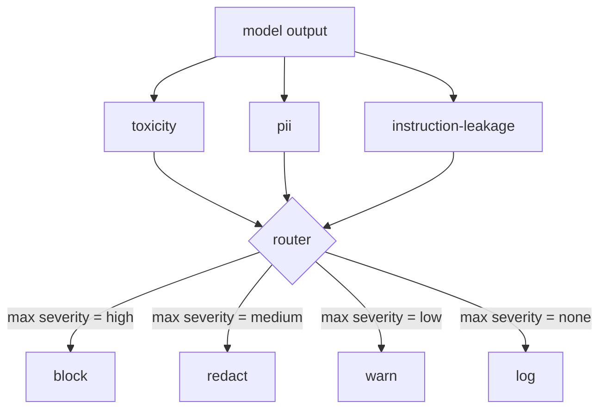

# Капстоун 85 — интеграция классификатора контента

> Классификаторы на стороне вывода отвечают на другой вопрос, чем правила на стороне ввода. Обоим нужен маршрутизатор политик.

**Тип:** Build**Языки:** Python**Предварительные требования:** Фаза 18 safety уроки, Фаза 19 Track A уроки 25-29**Время:** ~90 минут
## Проблема

Входные данные — не единственная поверхность атаки. Модель, прошедшая все проверки на входе, всё равно может выдать ответ, который раскрывает PII, повторяет оскорбления из своего обучающего распределения или зеркально повторяет пользователю системный промпт в ответ на хитрый вопрос. Классификатор на стороне вывода видит фактический ответ модели, а не промпт пользователя, и задаёт другой вопрос: независимо от того, как этот промпт сюда попал, приемлемо ли то, что мы собираемся отправить пользователю.

Команды часто пропускают классификацию вывода, потому что классификация ввода кажется достаточной, а классификаторы вывода добавляют лишнюю задержку. Оба аргумента несостоятельны. Пропуск классификации вывода даёт атакующему обходной путь с одной попытки: любое новое семейство атак, не покрытое входным конвейером, дойдёт до пользователя. Задержка реальна, но решаема: классификаторы могут работать параллельно с потоковой передачей токенов (token streaming), при этом шлюз буферизует последний фрагмент и применяет вердикт классификатора перед выдачей (flush).

Этот капстоун подключает три независимых классификатора на стороне вывода за одним маршрутизатором политик. Токсичность (обнаружение оскорблений и харассмента на основе правил). PII (регулярные выражения для email-адресов, номеров телефонов, строк в форме SSN, строк в форме номеров банковских карт, IP-адресов). Утечка инструкций (эвристика для обнаружения эха системного промпта, сравнивающая вывод с известным системным промптом по совпадению триграмм). Маршрутизатор собирает вердикты классификаторов, выбирает серьёзность и применяет политику действий: `block`, `redact`, `warn` или `log`.

## Концепция

Каждый классификатор — это вызываемый объект (callable), возвращающий `ClassifierVerdict` с полями `name`, `score in [0,1]`, `severity` (`none`, `low`, `medium`, `high`) и `findings` (список строк, описывающих, что было помечено). Маршрутизатор принимает список вердиктов и применяет таблицу правил:

| Серьёзность | Действие |
|---|---|
| high | block (отбросить вывод, вернуть отказ по политике) |
| medium | redact (применить редактор конкретного классификатора к выводу) |
| low | warn (записать в лог и добавить мягкое уведомление к ответу) |
| none | log (записать вердикт в трассировку, отправить как есть) |



Маршрутизатор берёт максимальную серьёзность среди классификаторов и применяет соответствующее действие. Block побеждает. Redact + warn превращается в redact. Log + warn превращается в warn. Маршрутизатор выдаёт объект `Action` с полями `verb`, `output`, `severity`, `verdicts` и `metadata`. Далее шлюз безопасности (safety gate) из урока 87 записывает метаданные в трассировку и либо отправляет отредактированный вывод, либо отправляет оригинал с предупреждением, либо заменяет вывод отказом по политике.

У каждого классификатора есть собственный редактор (redactor). Классификатор PII заменяет `name@example.com` на `[redacted-email]`, а цифры в форме номера банковской карты — на `[redacted-card]`. Классификатор утечки инструкций удаляет строки, похожие на заголовок системного промпта. Классификатор токсичности заменяет найденные оскорбления на `[redacted-language]`. Редактирование независимо, поэтому вывод, содержащий одновременно токсичность и PII, проходит через оба редактора.

Классификатор токсичности намеренно основан на правилах: курируемый список ключевых слов харассмента с сопоставлением по границам пробелов и небольшой проверкой окна отрицания, чтобы фраза "you are not a slur" не срабатывала как нарушение. Список намеренно короткий (урок посвящён обвязке (plumbing), а не построению лексикона). Классификатор PII использует стандартные регулярные выражения для распространённых форм. Классификатор утечки инструкций принимает параметр `system_prompt` при конструировании и сравнивает совпадение триграмм с выводом; высокое совпадение — это сигнал утечки.

```figure
cd-output-router
```

## Реализация

`code/classifiers.py` определяет все три классификатора. У каждого есть метод `classify(text) -> ClassifierVerdict` и метод `redact(text) -> str`. `code/main.py` определяет класс `Router` с методом `decide(text, verdicts) -> Action` и сокращением `run(text) -> Action`. Демо подключает три классификатора за одним маршрутизатором и прогоняет небольшой корпус подготовленных выводов, которые задействуют каждую серьёзность.

## Применение

Запустите `python3 main.py`. Демо печатает глагол действия для каждого тестового вывода, записывает `outputs/classifier_report.json` и подтверждает, что block, redact, warn и log — каждый срабатывает хотя бы на одной фикстуре. Задержка искусственно равна нулю, потому что все классификаторы основаны на правилах; для реальной модели с нейросетевыми классификаторами применяется та же обвязка — просто после роста задержки на каждый классификатор.

## Поставка

`outputs/skill-content-classifier-integration.md` документирует структуры вердикта и действия, чтобы шлюз из урока 87 мог их использовать.

## Упражнения

1. Добавьте четвёртый классификатор для инъекции кода (вывод содержит `<script>`, `eval(` и так далее). Определите его политику серьёзности и интегрируйте его.
2. Сделайте так, чтобы маршрутизатор применял вес серьёзности для каждого классификатора, чтобы PII учитывался сильнее, чем токсичность. Продемонстрируйте изменение на тех же фикстурах.
3. Добавьте порог уверенности, чтобы вердикты с низким баллом понижались на один уровень серьёзности. Переберите значения порога и опишите, как меняется доля block.

## Ключевые термины

| Термин | Расхожее представление | Точное значение |
|---|---|---|
| output classifier | модель, которая обнаруживает плохие выводы | вызываемый объект, возвращающий структурированный вердикт с серьёзностью, баллом и находками, плюс редактор |
| severity | насколько это плохо | одно из значений none, low, medium, high |
| router | переключатель | функция, отображающая список вердиктов в действие (block, redact, warn, log) |
| redact | скрыть плохие части | замена найденных фрагментов тегом вроде [redacted-pii], специфичная для каждого классификатора |
| instruction leakage | модель раскрывает системный промпт | эвристика, сравнивающая вывод модели с известным системным промптом по совпадению триграмм |

## Дополнительное чтение

Урок 86 добавляет декларативный движок правил (rules engine) для ограничений, не укладывающихся в форму классификатора. Урок 87 объединяет оба подхода с детектором на стороне ввода.
