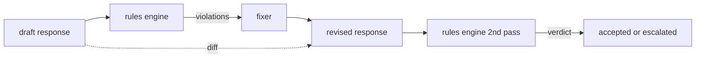

# Капстоун 86 — движок конституционных правил

> Правило — это имя, предикат и объяснение. Если хотя бы одного из этих трёх элементов не хватает, перед вами не правило, а смутное ощущение (vibe).

**Тип:** Build**Языки:** Python, YAML**Предварительные требования:** Фаза 18 safety уроки, Фаза 19 Track A уроки 25-29**Время:** ~90 минут
## Проблема

Классификаторы покрывают узнаваемые сбои. Движки правил (rules engines) покрывают контрактные требования. Команда, разрабатывающая ассистента для написания кода, хочет ограничение вида «каждый ответ, содержащий код, должен заканчиваться либо исполняемым блоком, либо явно сформулированным допущением». Команда, эксплуатирующая бота поддержки клиентов, хочет «каждый отказ должен предлагать следующий шаг». Такие ограничения — не естественная цель для классификатора. Это предикаты над ответом, беседой и системной политикой, и они должны быть понятны человеку без инженерного образования.

Честное представление таких ограничений — декларативный файл. Конституция хранится в YAML рядом с кодом, в системе контроля версий, с отдельным процессом ревью. У каждого правила есть `name`, `predicate`, `severity` и шаблон `explanation`. Движок загружает файл, оценивает каждое правило на кандидате ответа и возвращает структурированное `Violation` для каждого сработавшего правила. Движок правил в этом капстоуне комбинирует предикаты через `all_of`, `any_of` и `not_`, так что одно правило может выразить «если ответ содержит код, он должен заканчиваться исполняемым блоком И не ссылаться на библиотеку только для внутреннего использования».

Вторая половина урока — это исправление. Движок правил, который только блокирует, построен наполовину. Движок правил, который предлагает исправление, операционно полезен: ассистент составляет черновик ответа, движок помечает нарушения, исправитель (fixer) выдаёт исправленный ответ, а движок подтверждает, что исправленная версия удовлетворяет правилам. Урок поставляет минимальный исправитель (замена по регулярному выражению для каждого правила) и структурированный diff (построчные добавления, удаления, правки) между черновиком и исправленной версией.

## Концепция



Правило имеет такую форму:

```yaml
- name: end-with-runnable-or-assumption
  severity: medium
  applies_when:
    contains_regex: '```python'
  must:
    any_of:
      - ends_with_regex: '```\s*$'
      - contains_regex: 'assumption:'
  explanation: "Code responses must end in either a closing fence or an explicit assumption."
  fix:
    append_if_missing: "\n\nAssumption: example inputs are valid."
```

Предикаты атомарны: `contains_regex`, `not_contains_regex`, `ends_with_regex`, `starts_with_regex`, `max_words`, `min_words`. Композиции — это `all_of`, `any_of`, `not_`. Сначала движок вычисляет `applies_when`; если правило не применимо, нарушение записывается как `not_applicable`. В противном случае движок вычисляет `must` и выдаёт либо `pass`, либо `violation`.

Уровни серьёзности — `low`, `medium`, `high`, как и в уроке 85. Нижестоящий гейт (урок 87) обрабатывает нарушение правила с серьёзностью `high` так же, как вердикт классификатора с серьёзностью `high`: блокирует.

Исправитель — это список декларативных операций: `append_if_missing`, `prepend_if_missing`, `replace_regex`. Каждая операция сопоставляет правило по имени с преобразованием. Исправитель намеренно ограничен локальными правками; структурные переписывания относятся к отдельному слою отказа-и-помощи, который здесь не рассматривается.

diff вычисляется между исходной и исправленной версией. Это список записей `Change` с полем `op` (add, remove, edit) и соответствующим текстом. Нижестоящий гейт может логировать diff, чтобы человек-рецензент со временем проверял поведение исправителя.

```figure
cd-constitution-loop
```

## Реализация

`code/rules.yml` хранит конституцию. Загрузчик в `code/main.py` принимает либо YAML-файл (если доступен PyYAML), либо JSON-файл (встроенная поддержка). Урок поставляет `rules.yml`, который тесты урока разбирают обоими путями кода. `code/main.py` определяет классы `Engine` и `Fixer`, а также функцию `diff`. Композиции вычисляются рекурсивно с коротким замыканием на `any_of`.

Поставляемая конституция:

- `no-empty-refusal` (medium) — отказ должен включать либо предложение, либо перенаправление
- `end-with-runnable-or-assumption` (medium) — ответы с кодом должны аккуратно завершаться
- `no-pii-in-examples` (high) — примерные данные не должны содержать адреса электронной почты или структуры, похожие на номера телефонов
- `cite-when-asserting-fact` (low) — строки, начинающиеся с «According to», должны содержать цитату в скобках
- `no-internal-library-leak` (high) — слова `internal-only` и `policybot-internal` не должны присутствовать в выводе
- `bounded-length` (low) — ответы не должны превышать 800 слов

## Применение

`python3 main.py`. Демонстрация прогоняет через движок три черновика ответов, выводит нарушения, запускает исправитель, выводит diff и записывает `outputs/rules_report.json`. В одной фикстуре есть неприменимое правило (в черновике нет блока кода), и отчёт показывает `not_applicable` для этого правила, чтобы команда видела, что движок явно его оценил.

## Поставка

`outputs/skill-constitutional-rules-engine.md` документирует грамматику правил и операции исправителя.

## Упражнения

1. Добавьте правило, которое требует, чтобы каждый ответ включал фразу «If this is urgent», когда промпт упоминает безопасность. Используйте композицию.
2. Замените исправитель на регулярных выражениях на исправитель на основе шаблонов с именованными слотами. Продемонстрируйте одно правило, переписанное под новый дизайн.
3. Добавьте конечную точку метрик, которая для заданного корпуса черновиков возвращает долю нарушений по каждому правилу, чтобы команда видела, какое правило срабатывает слишком часто.

## Ключевые термины

| Термин | Расхожее представление | Точное значение |
|---|---|---|
| constitution | смутный документ с политикой | YAML-файл правил с предикатами, уровнями серьёзности и объяснениями |
| predicate | проверка | вызываемый объект, отображающий текст в bool, атомарный или составленный через all_of/any_of/not_ |
| violation | сбой | структурированная запись с именем правила, серьёзностью, объяснением и совпавшим фрагментом |
| fixer | дообучение модели | детерминированное преобразование для каждого правила, отображающее черновик в исправленную версию |
| diff | сравнение строк | структурированный список операций add, remove, edit между черновиком и исправленной версией |

## Дополнительное чтение

Урок 87 объединяет этот движок с детектором на стороне входа и классификатором на стороне выхода в единый гейт безопасности.
