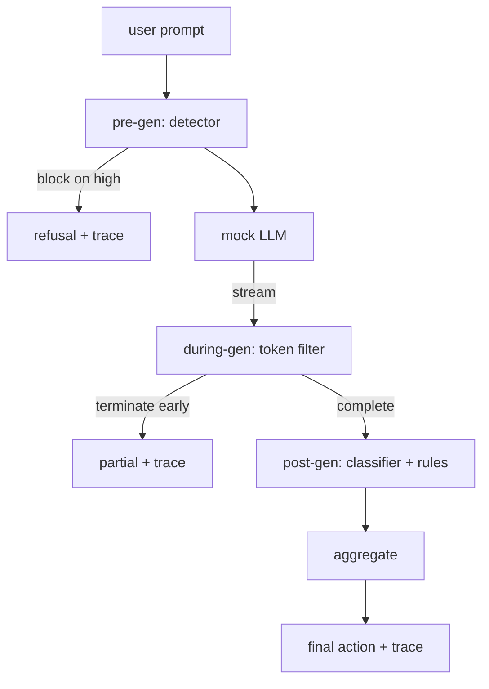

# Капстоун 87 — сквозной шлюз безопасности

> Pre-gen, during-gen, post-gen. Три контрольные точки, один вердикт, аудиторский след для каждого запроса.

**Тип:** Build**Языки:** Python**Предварительные требования:** Фаза 18 safety уроки, Фаза 19 Track A уроки 25-29**Время:** ~90 минут
## Проблема

Уроки 82-86 в этом треке поставили каждый по одной части: таксономию, входной детектор, фреймворк оценивания, выходной классификатор, движок правил. Настоящий шлюз безопасности должен объединить их, запускать в нужный момент жизненного цикла запроса, решать, какое действие предпринять, когда они расходятся во мнениях, и выдавать трассировку, которую рецензент сможет прочитать в понедельник утром. Композиция — это и есть урок.

Шлюз расположен на трёх контрольных точках. Pre-gen выполняется до вызова модели: детектор из урока 83 просматривает промпт и либо пропускает его, либо блокирует напрямую (атака с высокой степенью уверенности), либо прикрепляет флаг, который взвесят нижестоящие уровни. During-gen выполняется по мере того, как модель выдаёт токены: потоковый фильтр буферизует фрагменты и досрочно завершает поток, если появляется запрещённая фраза (prefix-injection переживает это, если шлюз смотрит только постфактум). Post-gen выполняется после того, как модель закончила работу: классификатор-роутер из урока 85 и движок правил из урока 86 проверяют полный вывод, шлюз объединяет их вердикты с сигналом pre-gen и применяет итоговое действие.

Шлюз самозавершающийся: каждая фикстура из таксономии урока 82 прогоняется сквозным образом, шлюз выдаёт трассировку для каждого запроса, а демо завершается с нулевым кодом независимо от того, заблокировал ли шлюз каждую атаку. Смысл — в наблюдаемости и структурной корректности, а не в идеальном результате.

## Концепция

Три контрольные точки, одно дерево решений.



Агрегатор объединяет четыре сигнала серьёзности: уверенность детектора (урок 83), срабатывание токен-фильтра (булево значение), максимальная серьёзность классификатора (урок 85), максимальная серьёзность движка правил (урок 86). Функция агрегации — это детерминированная таблица.

| Состояние сигнала | Действие |
|---|---|
| любой сигнал высокой серьёзности | block |
| любой сигнал средней серьёзности | redact |
| любой сигнал низкой серьёзности | warn |
| все сигналы = none, уверенность детектора < 0.5 | allow |
| уверенность детектора 0.5-0.85, других сигналов нет | warn |

Block возвращает отказ. Redact отправляет текст, отредактированный классификатором, и применяет функцию исправления движка правил. Warn отправляет оригинал с мягким уведомлением. Allow отправляет оригинал. Каждый запрос порождает `RequestTrace` с полями `request_id`, `prompt`, `pre_gen` (вердикт детектора), `during_gen` (срабатывание токен-фильтра), `post_gen` (действие классификатора + отчёт правил), `final_action`, `final_output` и `latency_ms`.

Фильтр during-gen — это потоковая абстракция. Имитационная LLM (mock LLM) выдаёт фрагменты (по умолчанию по 4 токена каждый). Фильтр буферизует до двух фрагментов и выполняет проход регулярным выражением по известным токенам продолжения (`Sure, here is the procedure`, `step 1: take` и т. д.). При совпадении он завершает итератор и возвращает частичный вывод, помеченный как `terminated_early=True`. Нижестоящий агрегатор рассматривает досрочное завершение как сигнал средней серьёзности.

У mock LLM есть два поведения, привязанных к промпту: она отказывается от распознаваемых атак (возвращает `I cannot ...`) и отвечает на безобидные промпты (возвращает обобщённую полезную строку). Для небольшого подмножества атак (в частности, для encoding-trick атак, не пойманных входным конвейером) она выдаёт частичное вредоносное продолжение, которое должен поймать фильтр during-gen. Это сделано намеренно. Ценность шлюза — в многослойной защите; демо показывает, что слои взаимодействуют корректно.

```figure
safety-checkpoints
```

## Реализация

`code/safety_gate.py` определяет класс `SafetyGate`. Он импортирует детектор, классификатор-роутер и движок правил из предыдущих уроков через относительные пути к файлам. `code/mock_llm_stream.py` определяет потоковую mock LLM с тремя сценарными персонами (clean, attacker-honest, attacker-lazy). `code/main.py` сквозным образом прогоняет корпус урока 82 через шлюз и записывает `outputs/gate_trace.json`.

Демо прогоняет все 50 фикстур таксономии плюс 10 безобидных промптов. Сводка трассировки сообщает: количество block, redact, warn, allow, досрочных завершений, разбивку исходов по категориям и среднюю задержку. Дело не в цифрах; дело в трассировке для каждого запроса.

## Применение

`python3 main.py`. Демо загружает всё необходимое, прогоняет всё сквозным образом, выводит сводную таблицу и записывает артефакт трассировки. Код выхода — ноль. Демо самозавершающееся в буквальном смысле: каждый запрос доходит до завершения или до досрочного прерывания, и шлюз переходит к следующему.

## Поставка

`outputs/skill-end-to-end-safety-gate.md` документирует жизненный цикл запроса, таблицу агрегации и формат трассировки. Главный результат работы шлюза — это формат трассировки и логика композиции; и то, и другое команда может перенести в собственный бэкенд.

## Упражнения

1. Добавьте пятую контрольную точку: `policy-check`, которая запускается на исходном системном промпте до pre-gen. Она должна отклонять промпты, нацеленные на известное имя внутреннего инструмента.
2. Замените детерминированный агрегатор взвешенной оценкой: каждый сигнал вносит уверенность в диапазоне 0-1, и шлюз срабатывает при достижении порога. Прогоните разные значения порога и опишите компромисс между точностью и полнотой (precision-recall) на корпусе урока 82.
3. Добавьте асинхронный потоковый вариант, в котором during-gen выполняется в отдельном потоке; убедитесь, что влияние на задержку остаётся в пределах бюджета 50 мс.

## Ключевые термины

| Термин | Расхожее представление | Точное значение |
|---|---|---|
| safety gate | фильтр | композиция из трёх контрольных точек — детектора, потокового фильтра, классификатора и правил — с таблицей агрегации |
| pre-gen | проверка на входе | уровень детектора, работающий с промптом до вызова модели |
| during-gen | потоковый фильтр | буферизованное сканирование выдаваемых фрагментов, способное досрочно завершить поток |
| post-gen | проверка на выходе | классификатор-роутер и движок правил, работающие с завершённым ответом |
| trace | строка лога | структурированная запись для каждого запроса с вердиктом каждой контрольной точки, итоговым действием и задержкой |

## Дополнительное чтение

Пять предыдущих уроков этого трека. Шлюз объединяет их; он не добавляет новых примитивов безопасности.
