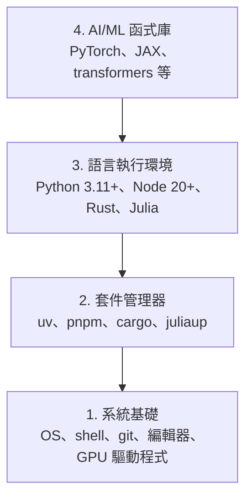

# 開發環境

> 你使用的工具會形塑你的思考方式。一次設定，務必設定妥當。

**Type:** Build
**Languages:** Python, Node.js, Rust
**Prerequisites:** None
**Time:** ~45 minutes

## Learning Objectives｜學習目標

- 從頭設定 Python 3.11+、Node.js 20+ 和 Rust 工具鏈（toolchain）
- 設定虛擬環境（virtual environment）與套件管理器（package manager），讓建置結果可重現
- 確認 GPU 可透過 CUDA/MPS 使用，並執行測試用張量（tensor）運算
- 了解四層堆疊（stack）：系統、套件（package）、執行環境（runtime）和 AI 函式庫（library）

## The Problem｜問題

你即將用 Python、TypeScript、Rust 和 Julia 學習 500 多堂 AI 工程（AI engineering）課。如果環境沒設定好，每一課都會變成和工具搏鬥，而不是專心學習。

多數人會跳過環境設定，接著花好幾個小時除錯匯入錯誤、版本衝突和缺少 CUDA 驅動程式（driver）等問題。我們要把這件事一次做好。

## The Concept｜核心概念

AI 工程的環境分成四層：



我們由底層往上安裝；每一層都依賴它下方的那一層。

```figure
s0-env-stack
```

## Build It｜動手實作

### 步驟 1：系統基礎

檢查你的系統並安裝基本工具。

```bash
# macOS
xcode-select --install
brew install git curl wget

# Ubuntu/Debian
sudo apt update && sudo apt install -y build-essential git curl wget unzip

# Windows (use WSL2)
wsl --install -d Ubuntu-24.04
```

### 步驟 2：使用 uv 安裝 Python

我們使用 `uv`——它的速度比 pip 快 10 到 100 倍，而且能自動管理虛擬環境。

```bash
curl -LsSf https://astral.sh/uv/install.sh | sh

uv python install 3.12

uv venv
source .venv/bin/activate  # or .venv\Scripts\activate on Windows

uv pip install numpy matplotlib jupyter
```

確認設定：

```python
import sys
print(f"Python {sys.version}")

import numpy as np
print(f"NumPy {np.__version__}")
a = np.array([1, 2, 3])
print(f"Vector: {a}, dot product with itself: {np.dot(a, a)}")
```

### 步驟 3：Node.js 與 pnpm

這些工具會用在 TypeScript 課程中（agents、MCP 伺服器（server）和網頁應用程式（web app））。

```bash
curl -fsSL https://fnm.vercel.app/install | bash
fnm install 22
fnm use 22

npm install -g pnpm

node -e "console.log('Node', process.version)"
```

fnm 安裝程式會先檢查是否有 `unzip`；如果沒有，便會顯示 `Not installing fnm due to missing dependencies.` 並結束。在 Linux 上，它會解開 zip 壓縮檔；在 macOS 上則透過 Homebrew 安裝。macOS 已內建 `unzip`；Ubuntu、Debian 和 WSL2 則可透過步驟 1 的 apt 指令（command）安裝（如果你略過了步驟 1，可執行 `sudo apt install -y unzip`）。

**macOS／Apple Silicon（M1/M2/M3/M4）：**如果安裝程式停止並顯示 `Error: Cannot install under Rosetta 2 in ARM default prefix (/opt/homebrew)`，表示你的終端機（terminal）正在以 Rosetta 2 執行（`arch` 會顯示 `i386`），但 Homebrew 是原生 arm64 版本。請用 arm64 強制安裝 fnm，設定 shell 載入 fnm，然後從 `fnm install 22` 開始重新執行上方指令：

```bash
arch -arm64 brew install fnm
echo 'eval "$(fnm env --use-on-cd)"' >> ~/.zshrc
source ~/.zshrc
```

### 步驟 4：安裝 Rust

Rust 適合用在效能要求較高的課程，例如推論（inference）和系統相關課程。

```bash
curl --proto '=https' --tlsv1.2 -sSf https://sh.rustup.rs | sh

rustc --version
cargo --version
```

### 步驟 5：安裝 Julia（選用）

Julia 在數學運算密集的課程中特別能發揮所長。

```bash
curl -fsSL https://install.julialang.org | sh

julia -e 'println("Julia ", VERSION)'
```

### 步驟 6：設定 GPU（如果你有 GPU）

**NVIDIA（Linux／Windows）：**

```bash
nvidia-smi

# Install PyTorch with CUDA
uv pip install torch torchvision torchaudio --index-url https://download.pytorch.org/whl/cu124
```

**macOS／Apple Silicon（M1/M2/M3/M4）：**Mac 沒有 CUDA，這是預期情況，不代表安裝失敗。請**勿**傳入 `--index-url .../cuXXX`（這些 wheel 僅適用於 Linux／Windows，否則安裝會失敗）。請安裝一般版本，其中已包含 Apple 的 MPS（Metal）GPU 後端（backend）：

```bash
uv pip install torch torchvision torchaudio
```

確認設定（適用於所有平台）：

```python
import torch
print(f"CUDA available: {torch.cuda.is_available()}")           # False on macOS — expected
print(f"MPS available:  {torch.backends.mps.is_available()}")   # True on Apple Silicon
if torch.cuda.is_available():
    print(f"GPU: {torch.cuda.get_device_name(0)}")
```

沒有 GPU 也沒關係，大多數課程都能在 CPU 上執行。需要大量訓練（training）運算的課程，可以使用 Google Colab 或雲端 GPU。

### 步驟 7：確認要開始的學習路徑

本課的所有指令都要在儲存庫（repository）的根目錄執行，也就是包含 `README.md` 和 `phases/` 的目錄。前置檢查（preflight check）只會檢查你選定路徑所需的工具；預設會略過後續課程才會用到的工具，讓初學者先看到清楚的結果，而不是一大串警告。

開始完整的初學者學習順序：

```bash
python3 phases/00-setup-and-tooling/01-dev-environment/code/verify.py --route beginner
```

或者只檢查你要走的路徑：

```bash
python3 phases/00-setup-and-tooling/01-dev-environment/code/verify.py --route ml-foundations
python3 phases/00-setup-and-tooling/01-dev-environment/code/verify.py --route llm-engineering
python3 phases/00-setup-and-tooling/01-dev-environment/code/verify.py --route agents
python3 phases/00-setup-and-tooling/01-dev-environment/code/verify.py --route mcp
python3 phases/00-setup-and-tooling/01-dev-environment/code/verify.py --route agent-skills
python3 phases/00-setup-and-tooling/01-dev-environment/code/verify.py --route certification
```

當你想讓同一項前置檢查也查看後續課程會用到的選用工具和相依套件（dependency）時，請加上 `--show-later`。缺少後續課程的工具，不會阻擋你開始目前選定的路徑。

每個失敗的必要檢查都會列出偵測到的路徑或匯入錯誤，並提供確切的修正指令。Agent Skills 和 certification 路徑也會列出需要在主機端手動確認的項目，因為 Python 程式無法證明 AI 主機是否已找到 skill，也無法確認你選定的 skill 範圍是否可寫入。

初學者路徑的前置檢查通過後，會顯示下一個可執行課程的確切指令：

```text
Ready to start Beginner course.
Next: python3 phases/01-math-foundations/01-linear-algebra-intuition/code/vectors.py
```

## Use It｜實際應用

你的環境已經準備好，可以開始你檢查過的路徑。等到某一課需要後續工具時再安裝即可，別因為還沒準備好整套工具而延後第一課。以下是整套課程會用到的工具：

| 語言 | 使用範圍 | 套件管理器 |
|----------|---------|-----------------|
| Python | 第 1–12 階段（ML、DL、NLP、電腦視覺、音訊、LLM） | uv |
| TypeScript | 第 13–17 階段（工具、agents、Swarms、基礎設施） | pnpm |
| Rust | 第 12、15–17 階段（效能要求較高的系統） | cargo |
| Julia | 第 1 階段（數學基礎） | Pkg |

## Ship It｜交付成果

本課會產出一支驗證指令碼，任何人都可以用它檢查自己的環境。

請參考 `outputs/prompt-env-check.md`，取得一份可協助 AI 助理診斷環境問題的 prompt。

## Exercises｜練習

1. 執行環境驗證指令碼，並修正所有失敗的檢查
2. 為本課程建立 Python 虛擬環境，並安裝 PyTorch
3. 用四種語言各寫一個「Hello, world!」程式，並逐一執行
