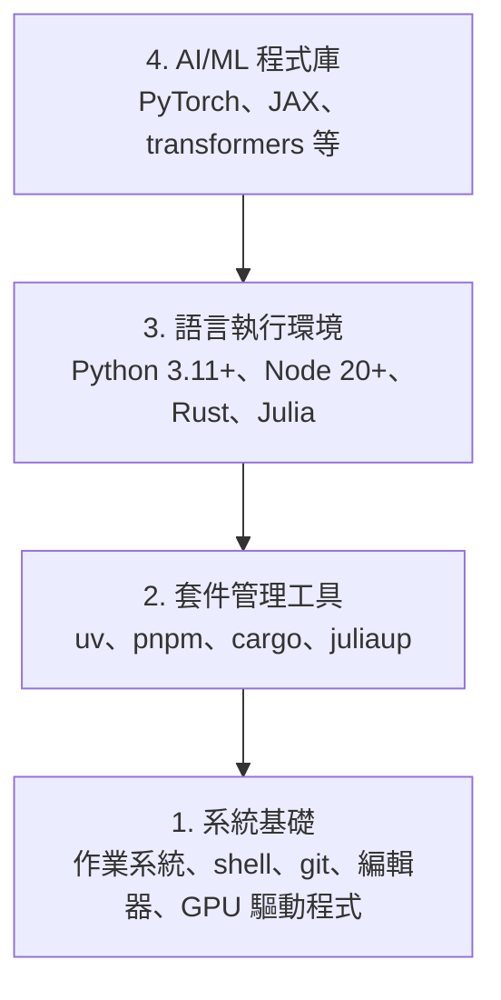

# 開發環境

> 你使用的工具會影響思考方式。一次設定妥當，之後就能專心學習。

**Type:** Build
**Languages:** Python, Node.js, Rust
**Prerequisites:** None
**Time:** ~45 minutes

## 學習目標

- 從零設定 Python 3.11+、Node.js 20+ 和 Rust 工具鏈
- 設定虛擬環境與套件管理工具，讓建置流程可重現
- 確認 CUDA/MPS 可用，並執行張量測試運算
- 理解四層技術堆疊：系統、套件、語言執行環境和 AI 程式庫

## 問題

你即將透過 500 多篇課程學習 AI 工程，會用到 Python、TypeScript、Rust 和 Julia。如果開發環境出了問題，每一篇課程都會變成和工具搏鬥，而不是專心學習。

很多人會跳過環境設定，接著花上好幾個小時排查匯入錯誤、版本衝突和遺漏的 CUDA 驅動程式。這次我們把環境一次設定妥當。

## 核心概念

AI 工程環境分成四層：



我們從底層往上安裝，每一層都仰賴下方的那一層。

```figure
s0-env-stack
```

## Build It｜動手打造

### 步驟 1：系統基礎

檢查系統並安裝基本工具。

```bash
# macOS
xcode-select --install
brew install git curl wget

# Ubuntu/Debian
sudo apt update && sudo apt install -y build-essential git curl wget unzip

# Windows (use WSL2)
wsl --install -d Ubuntu-24.04
```

### 步驟 2：使用 uv 安裝 Python

我們使用 `uv`，速度比 pip 快 10 到 100 倍，還會自動管理虛擬環境。

```bash
curl -LsSf https://astral.sh/uv/install.sh | sh

uv python install 3.12

uv venv
source .venv/bin/activate  # or .venv\Scripts\activate on Windows

uv pip install numpy matplotlib jupyter
```

確認安裝結果：

```python
import sys
print(f"Python {sys.version}")

import numpy as np
print(f"NumPy {np.__version__}")
a = np.array([1, 2, 3])
print(f"Vector: {a}, dot product with itself: {np.dot(a, a)}")
```

### 步驟 3：使用 pnpm 安裝 Node.js

供 TypeScript 課程使用（代理程式、MCP 伺服器、網頁應用程式）。

```bash
curl -fsSL https://fnm.vercel.app/install | bash
fnm install 22
fnm use 22

npm install -g pnpm

node -e "console.log('Node', process.version)"
```

fnm 安裝程式會先檢查是否有 `unzip`；若找不到，會顯示 `Not installing fnm due to missing dependencies.` 並結束。Linux 會解壓縮 zip 封存檔；macOS 則透過 Homebrew 安裝。macOS 已內建 `unzip`；Ubuntu、Debian 和 WSL2 可使用步驟 1 的 apt 指令安裝。如果略過了那個步驟，請執行 `sudo apt install -y unzip`。

**macOS／Apple Silicon（M1/M2/M3/M4）：**如果安裝程式顯示 `Error: Cannot install under Rosetta 2 in ARM default prefix (/opt/homebrew)`，代表你的終端機目前透過 Rosetta 2 執行（`arch` 會輸出 `i386`），而 Homebrew 是原生 arm64 版本。請強制以 arm64 安裝 fnm、將它設定到 shell，然後從上方的 `fnm install 22` 指令繼續：

```bash
arch -arm64 brew install fnm
echo 'eval "$(fnm env --use-on-cd)"' >> ~/.zshrc
source ~/.zshrc
```

### 步驟 4：Rust

供重視效能的課程使用（推論、系統程式）。

```bash
curl --proto '=https' --tlsv1.2 -sSf https://sh.rustup.rs | sh

rustc --version
cargo --version
```

### 步驟 5：Julia（選用）

適合使用 Julia 的數學密集型課程。

```bash
curl -fsSL https://install.julialang.org | sh

julia -e 'println("Julia ", VERSION)'
```

### 步驟 6：設定 GPU（若有 GPU）

**NVIDIA（Linux／Windows）：**

```bash
nvidia-smi

# Install PyTorch with CUDA
uv pip install torch torchvision torchaudio --index-url https://download.pytorch.org/whl/cu124
```

**macOS／Apple Silicon（M1/M2/M3/M4）：**Mac 沒有 CUDA，這是正常的。請勿使用 `--index-url .../cuXXX`（這些 wheel 僅適用 Linux／Windows，安裝會失敗）。請安裝一般版本，其中包含 Apple 的 MPS（Metal）GPU 後端：

```bash
uv pip install torch torchvision torchaudio
```

以下指令適用於任何平台，可用來確認設定：

```python
import torch
print(f"CUDA available: {torch.cuda.is_available()}")           # False on macOS — expected
print(f"MPS available:  {torch.backends.mps.is_available()}")   # True on Apple Silicon
if torch.cuda.is_available():
    print(f"GPU: {torch.cuda.get_device_name(0)}")
```

沒有 GPU 也沒關係。大多數課程都能在 CPU 上執行；需要大量訓練的課程則可使用 Google Colab 或雲端 GPU。

### 步驟 7：確認要開始的學習路線

請在儲存庫根目錄執行本課程中的所有指令，也就是同時包含 `README.md` 和 `phases/` 的目錄。
事前檢查只會確認你開始所選路線需要的項目。
預設會略過後續階段才會用到的工具，
讓初學者先看到清楚的結果，而不是一長串警告。

開始完整的初學者路線：

```bash
python3 phases/00-setup-and-tooling/01-dev-environment/code/verify.py --route beginner
```

或只檢查你要走的路線：

```bash
python3 phases/00-setup-and-tooling/01-dev-environment/code/verify.py --route ml-foundations
python3 phases/00-setup-and-tooling/01-dev-environment/code/verify.py --route llm-engineering
python3 phases/00-setup-and-tooling/01-dev-environment/code/verify.py --route agents
python3 phases/00-setup-and-tooling/01-dev-environment/code/verify.py --route mcp
python3 phases/00-setup-and-tooling/01-dev-environment/code/verify.py --route agent-skills
python3 phases/00-setup-and-tooling/01-dev-environment/code/verify.py --route certification
```

如果想讓事前檢查也查看後續課程會用到的選用工具與相依套件，請加上 `--show-later`。
缺少後續課程的工具，不會阻擋
你開始所選路線。

每項必要檢查若未通過，都會列出偵測到的路徑或匯入錯誤，
並提供確切的修正指令。Agent Skills 和認證路線也會列出需要手動檢查主機的項目，
因為 Python 程式無法確認 AI 工具是否已找到某個 skill，
也無法確認你選擇的安裝範圍是否可寫入。

初學者路線的事前檢查通過後，程式會印出第一篇可執行課程的指令：

```text
Ready to start Beginner course.
Next: python3 phases/01-math-foundations/01-linear-algebra-intuition/code/vectors.py
```

## Use It｜實際使用

你的環境已準備好，可以開始所選路線。等課程需要時再安裝後續工具，
不必一開始就把整套環境全部裝好。
以下是整個課程會用到的工具：

| 語言 | 使用範圍 | 套件管理工具 |
|----------|----------|----------------|
| Python | 階段 1–12（ML、DL、NLP、視覺、音訊、LLM） | uv |
| TypeScript | 階段 13–17（工具、代理程式、多代理系統、基礎架構） | pnpm |
| Rust | 階段 12、15–17（重視效能的系統） | cargo |
| Julia | 階段 1（數學基礎） | Pkg |

## Ship It｜交付成果

本課程會產出一支驗證腳本，任何人都能用它檢查自己的環境設定。

請參考 `outputs/prompt-env-check.md`，取得一份可協助 AI 助理診斷環境問題的提示詞。

## Exercises｜練習

1. 執行驗證腳本並修正所有未通過的項目
2. 為本課程建立 Python 虛擬環境並安裝 PyTorch
3. 用四種語言各寫一個「Hello, world!」程式並執行
