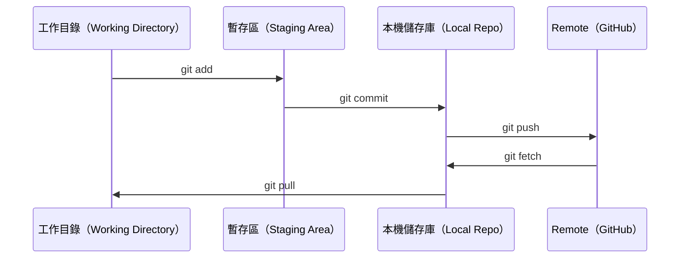

# Git 與協作

> 版本控制（version control）不可或缺。你在這裡做的每個實驗、建立的每個模型，以及撰寫的每堂課，都會納入追蹤。

**Type:** Learn
**Languages:** --
**Prerequisites:** Phase 0, Lesson 01
**Time:** ~30 minutes

## Learning Objectives｜學習目標

- 設定 Git 身分資訊，並使用 add、commit 和 push 的日常工作流程
- 建立 branch 並執行 merge，隔離各項實驗，避免影響 main
- 撰寫 `.gitignore`，排除 model checkpoint 檔案和大型二進位檔案（binary files）
- 使用 `git log` 瀏覽 commit 歷史，了解專案如何演進

## The Problem｜問題

你即將在 20 個階段中撰寫數百個程式碼檔案。沒有版本控制，你可能會遺失工作成果、造成無法復原的變更，也無法和他人協作。

Git 是版本控制工具，GitHub 則是程式碼的託管平台。本課只介紹這門課會用到的內容，不多談其他主題。

## The Concept｜核心概念



記住三件事：
1. 常常儲存變更（`git commit`）
2. 推送到 remote（`git push`）
3. 用 branch 做實驗（`git checkout -b experiment`）

```figure
s0-commit-dag
```

## Build It｜動手實作

### 步驟 1：設定 Git

```bash
git config --global user.name "Your Name"
git config --global user.email "you@example.com"
```

### 步驟 2：日常工作流程

```bash
git status
git add file.py
git commit -m "Add perceptron implementation"
git push origin main
```

### 步驟 3：使用 branch 進行實驗

```bash
git checkout -b experiment/new-optimizer

# ... make changes, commit ...

git checkout main
git merge experiment/new-optimizer
```

### 步驟 4：在本課程的儲存庫中工作

你無法直接推送到課程本身的儲存庫，因為只有維護者有寫入權限。先在 GitHub 上建立 fork（按右上方的 Fork 按鈕），讓 `origin` 指向你自己的副本：

```bash
git clone https://github.com/YOUR-USERNAME/ai-engineering-from-scratch.git
cd ai-engineering-from-scratch

git checkout -b my-progress
# work through lessons, commit your code
git push origin my-progress
```

## Use It｜實際應用

這門課只會用到以下指令：

| 指令 | 使用時機 |
|---------|------|
| `git clone` | 取得課程儲存庫 |
| `git add` + `git commit` | 儲存你的工作 |
| `git push` | 將備份推送到 GitHub |
| `git checkout -b` | 嘗試新做法而不影響 main |
| `git log --oneline` | 查看你做過的變更 |

就這些。這門課不需要 rebase、cherry-pick 或 submodules。

## Exercises｜練習

1. fork 這個儲存庫、clone 你的 fork，建立名為 `my-progress` 的 branch，新增一個檔案、commit，然後 push
2. 建立 `.gitignore`，排除模型 checkpoint 檔案（`.pt`、`.pth`、`.safetensors`）
3. 使用 `git log --oneline` 查看這個儲存庫的 commit 歷史，了解課程是如何新增的

## Key Terms｜關鍵術語

| 術語 | 常見說法 | 實際含義 |
|------|----------------|----------------------|
| Commit | 「儲存」 | 專案在某個時間點的完整快照 |
| Branch | 「副本」 | 指向某個 commit 的指標，會隨著你的工作向前移動 |
| Merge | 「合併程式碼」 | 將一個 branch 的變更套用到另一個 branch |
| Remote | 「雲端」 | 託管在其他位置（例如 GitHub、GitLab）的儲存庫副本 |
