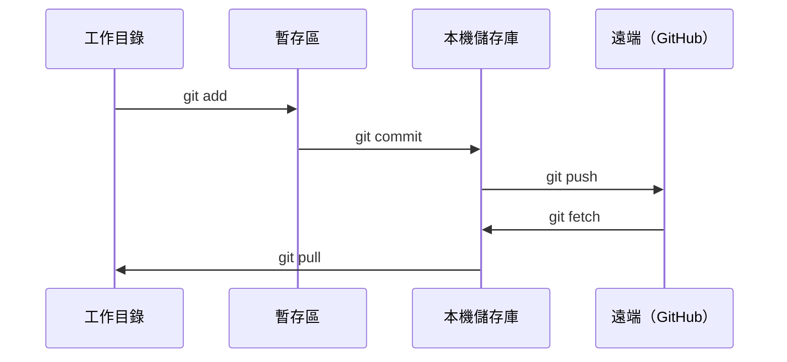

# Git 與協作

> 版本控制不可或缺。你在這裡進行的每次實驗、建立的每個模型，以及完成的每篇課程，都會納入版本控制。

**Type:** Learn
**Languages:** --
**Prerequisites:** Phase 0, Lesson 01
**Time:** ~30 minutes

## Learning Objectives

- 設定 Git 身分資訊，並使用 `add`、`commit` 和 `push` 的日常流程
- 建立並合併分支，將實驗隔離，避免影響 `main`
- 撰寫 `.gitignore`，排除模型檢查點與大型二進位檔案
- 使用 `git log` 瀏覽提交紀錄，了解專案如何演進

## The Problem｜問題

你即將在 20 個階段中撰寫數百個程式碼檔案。沒有版本控制，你可能會遺失工作成果、造成難以復原的錯誤，也無法和其他人協作。

Git 是版本控制工具，GitHub 則是存放程式碼的服務。本課只會介紹你在這門課程中需要的 Git 知識。

## The Concept｜核心概念



記住三件事：
1. 常常提交（`git commit`）
2. 推送到遠端（`git push`）
3. 用分支進行實驗（`git checkout -b experiment`）

```figure
s0-commit-dag
```

## Build It｜動手打造

### 步驟 1：設定 Git

```bash
git config --global user.name "Your Name"
git config --global user.email "you@example.com"
```

### 步驟 2：日常工作流程

```bash
git status
git add file.py
git commit -m "Add perceptron implementation"
git push origin main
```

### 步驟 3：建立分支來進行實驗

```bash
git checkout -b experiment/new-optimizer

# ... make changes, commit ...

git checkout main
git merge experiment/new-optimizer
```

### 步驟 4：使用本課程的儲存庫

你不能直接推送到本課程的儲存庫，只有維護者有寫入權限。先在 GitHub 按右上角的 Fork 按鈕，將儲存庫複製到自己的帳號，這樣 `origin` 就會指向你的副本：

```bash
git clone https://github.com/YOUR-USERNAME/ai-engineering-from-scratch.git
cd ai-engineering-from-scratch

git checkout -b my-progress
# work through lessons, commit your code
git push origin my-progress
```

## Use It｜實際使用

本課程只需要用到以下指令：

| 指令 | 使用時機 |
|---------|------|
| `git clone` | 取得本課程的儲存庫 |
| `git add` + `git commit` | 儲存你的成果 |
| `git push` | 備份到 GitHub |
| `git checkout -b` | 嘗試新做法，不影響 `main` |
| `git log --oneline` | 查看你做過哪些變更 |

就這些。修習本課程不需要用到 `rebase`、`cherry-pick` 或子模組。

## Exercises｜練習

1. 將本儲存庫 Fork 到自己的 GitHub 帳號，再複製自己的 Fork；建立名為 `my-progress` 的分支，新增一個檔案、提交，然後推送
2. 建立 `.gitignore`，排除模型檢查點檔案（`.pt`、`.pth`、`.safetensors`）
3. 使用 `git log --oneline` 查看本儲存庫的提交紀錄，了解課程是如何新增的

## Key Terms｜重要詞彙

| 詞彙 | 常見說法 | 實際意義 |
|------|----------|----------|
| Commit（提交） |「儲存」| 在某個時間點記錄整個專案狀態的快照 |
| Branch（分支） |「複本」| 指向某次提交、並隨工作進展向前移動的參照 |
| Merge（合併） |「合併程式碼」| 將另一個分支的變更套用到目前分支 |
| Remote（遠端儲存庫） |「雲端」| 託管在其他地方（例如 GitHub、GitLab）的儲存庫副本 |
