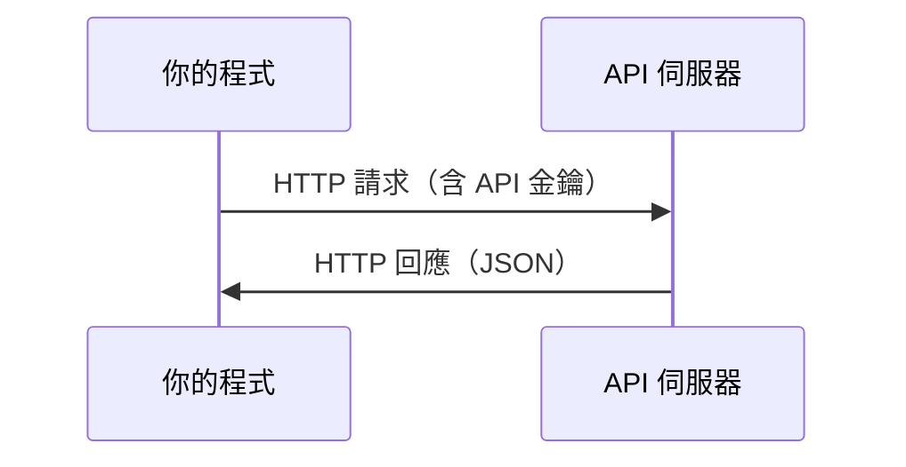

# API 與金鑰

> 每個 AI API 的運作方式都相同：送出請求，取得回應。細節會變，流程不變。

**Type:** Build
**Languages:** Python, TypeScript
**Prerequisites:** Phase 0, Lesson 01
**Time:** ~30 minutes

## Learning Objectives

- 使用環境變數與 `.env` 檔案安全地保存 API 金鑰
- 使用 Anthropic Python SDK 與原始 HTTP 請求呼叫 LLM API
- 比較 SDK 與原始 HTTP 的請求和回應格式，方便除錯
- 辨認並處理常見 API 錯誤，包括驗證失敗與速率限制

## The Problem｜問題

從第 11 階段開始，你會呼叫 LLM API（Anthropic、OpenAI、Google）；到了第 13 到第 16 階段，你會建立以迴圈方式呼叫這些 API 的代理程式。你需要了解 API 金鑰的用途、如何安全保存，以及如何進行第一次 API 呼叫。

## The Concept｜核心概念



每次 API 呼叫都包含：
1. 端點（URL）
2. API 金鑰（用於驗證）
3. 請求本文（你要的內容）
4. 回應本文（你收到的內容）

```figure
s0-secret-inject
```

## Build It｜動手打造

### 步驟 1：安全保存 API 金鑰

不要把 API 金鑰寫進程式碼，請使用環境變數。

```bash
export ANTHROPIC_API_KEY="sk-ant-..."
export OPENAI_API_KEY="sk-..."
```

也可以使用 `.env` 檔案（並將它加入 `.gitignore`）：

```bash
ANTHROPIC_API_KEY=sk-ant-...
OPENAI_API_KEY=sk-...
```

### 步驟 2：第一次 API 呼叫（Python）

```python
import os

import anthropic

client = anthropic.Anthropic()

MODEL = os.environ.get("LLM_MODEL", "claude-sonnet-5")

response = client.messages.create(
    model=MODEL,
    max_tokens=256,
    messages=[{"role": "user", "content": "What is a neural network in one sentence?"}]
)

print(response.content[0].text)
```

`LLM_MODEL` 用來指定 Anthropic 的模型 ID；預設值是不帶日期的 Sonnet 別名。其他服務商（OpenAI、Google 等）也採用「金鑰加模型 ID」的相同模式，但各自有不同的 SDK、端點，以及請求與回應格式。

### 步驟 3：第一次 API 呼叫（TypeScript）

```typescript
import Anthropic from "@anthropic-ai/sdk";

const client = new Anthropic();

const MODEL = process.env.LLM_MODEL ?? "claude-sonnet-5";

const response = await client.messages.create({
  model: MODEL,
  max_tokens: 256,
  messages: [{ role: "user", content: "What is a neural network in one sentence?" }],
});

console.log(response.content[0].text);
```

### 步驟 4：直接使用 HTTP（不使用 SDK）

```python
import os
import urllib.request
import json

url = "https://api.anthropic.com/v1/messages"
headers = {
    "Content-Type": "application/json",
    "x-api-key": os.environ["ANTHROPIC_API_KEY"],
    "anthropic-version": "2023-06-01",
}
body = json.dumps({
    "model": os.environ.get("LLM_MODEL", "claude-sonnet-5"),
    "max_tokens": 256,
    "messages": [{"role": "user", "content": "What is a neural network in one sentence?"}],
}).encode()

req = urllib.request.Request(url, data=body, headers=headers, method="POST")
with urllib.request.urlopen(req) as resp:
    result = json.loads(resp.read())
    print(result["content"][0]["text"])
```

SDK 在底層執行的就是這些操作。了解原始 HTTP 請求，有助於排查問題。

## Use It｜實際使用

本課程會在以下情況用到這些 API：

| API | 使用時機 | 免費額度 |
|-----|----------|----------|
| Anthropic（Claude） | 第 11 到第 16 階段（代理程式、工具） | 註冊可獲得 $5 額度 |
| OpenAI | 第 11 階段（比較） | 註冊可獲得 $5 額度 |
| Hugging Face | 第 4 到第 10 階段（模型、資料集） | 免費 |

你現在不必全部設定。等課程需要時再設定即可。

## Ship It｜交付成果

本課程會產出：
- `outputs/prompt-api-troubleshooter.md` - 用來診斷常見 API 錯誤

## Exercises｜練習

1. 取得 Anthropic API 金鑰，並進行第一次 API 呼叫
2. 試用原始 HTTP 版本，比較它與 SDK 版本的回應格式
3. 故意使用錯誤的 API 金鑰，閱讀錯誤訊息

## Key Terms｜重要詞彙

| 詞彙 | 常見說法 | 實際意義 |
|------|----------|----------|
| API key（API 金鑰） |「API 密碼」| 用來識別帳戶並授權請求的唯一字串 |
| Rate limit（速率限制） |「服務在限流」| 為防止濫用並公平分配資源，限制每分鐘或每小時可送出的請求數 |
| Token（詞元） |「一個字」（API 語境）| 計費單位；輸入與輸出的 Token 會分開計數與收費 |
| Streaming（串流） |「即時回應」| 逐詞傳回回應，不必等到完整內容都生成後才收到 |
