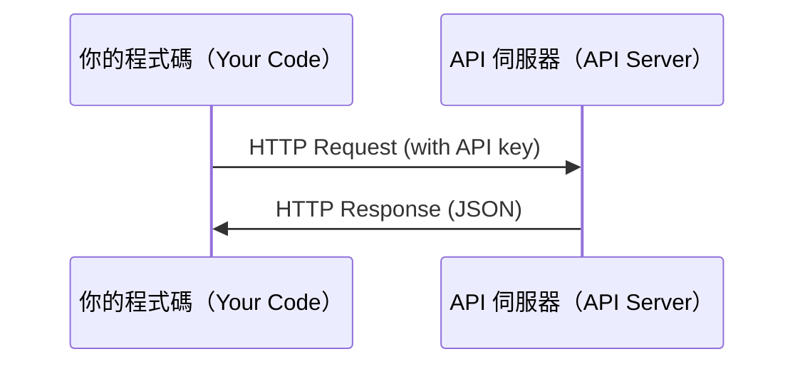

# API 與金鑰

> 所有 AI API 的運作方式都相同：送出請求（request），取得回應（response）。細節會變，模式不變。

**Type:** Build
**Languages:** Python, TypeScript
**Prerequisites:** Phase 0, Lesson 01
**Time:** ~30 minutes

## Learning Objectives｜學習目標

- 使用環境變數（environment variable）和 `.env` 檔案，安全儲存 API 金鑰（API key）
- 使用 Anthropic Python SDK 和原始 HTTP，呼叫 LLM API（API call）
- 比較 SDK 和原始 HTTP 的請求／回應格式，方便除錯
- 辨識並處理常見 API 錯誤，包括身分驗證（authentication）和速率限制（rate limit）

## The Problem｜問題

從第 11 階段開始，你會呼叫 LLM API（Anthropic、OpenAI、Google）。到了第 13–16 階段，你會建立在迴圈中使用這些 API 的 agents。你需要了解 API 金鑰的運作方式、如何安全儲存，以及如何完成第一次 API 呼叫。

## The Concept｜核心概念



每次 API 呼叫都包含：
1. API 端點（endpoint；URL）
2. API 金鑰（用於身分驗證）
3. 請求本文（request body；要傳送的內容）
4. 回應本文（response body；收到的內容）

```figure
s0-secret-inject
```

## Build It｜動手實作

### 步驟 1：安全儲存 API 金鑰

不要把 API 金鑰寫在程式碼裡。請使用環境變數。

```bash
export ANTHROPIC_API_KEY="sk-ant-..."
export OPENAI_API_KEY="sk-..."
```

也可以使用 `.env` 檔案（記得將它加入 `.gitignore`）：

```
ANTHROPIC_API_KEY=sk-ant-...
OPENAI_API_KEY=sk-...
```

### 步驟 2：第一次 API 呼叫（Python）

```python
import os

import anthropic

client = anthropic.Anthropic()

MODEL = os.environ.get("LLM_MODEL", "claude-sonnet-5")

response = client.messages.create(
    model=MODEL,
    max_tokens=256,
    messages=[{"role": "user", "content": "What is a neural network in one sentence?"}]
)

print(response.content[0].text)
```

`LLM_MODEL` 會指定 Anthropic 的模型 ID（model ID），預設值則是未帶日期標記的 Sonnet 別名。其他服務供應商（provider），例如 OpenAI、Google 等，也採用「API 金鑰加模型 ID」的相同模式，但各自有不同的 SDK、端點和請求／回應結構描述（schema）。

### 步驟 3：第一次 API 呼叫（TypeScript）

```typescript
import Anthropic from "@anthropic-ai/sdk";

const client = new Anthropic();

const MODEL = process.env.LLM_MODEL ?? "claude-sonnet-5";

const response = await client.messages.create({
  model: MODEL,
  max_tokens: 256,
  messages: [{ role: "user", content: "What is a neural network in one sentence?" }],
});

console.log(response.content[0].text);
```

### 步驟 4：直接使用原始 HTTP（不使用 SDK）

```python
import os
import urllib.request
import json

url = "https://api.anthropic.com/v1/messages"
headers = {
    "Content-Type": "application/json",
    "x-api-key": os.environ["ANTHROPIC_API_KEY"],
    "anthropic-version": "2023-06-01",
}
body = json.dumps({
    "model": os.environ.get("LLM_MODEL", "claude-sonnet-5"),
    "max_tokens": 256,
    "messages": [{"role": "user", "content": "What is a neural network in one sentence?"}],
}).encode()

req = urllib.request.Request(url, data=body, headers=headers, method="POST")
with urllib.request.urlopen(req) as resp:
    result = json.loads(resp.read())
    print(result["content"][0]["text"])
```

這就是 SDK 在幕後執行的工作。了解原始 HTTP 呼叫方式，有助於除錯。

## Use It｜實際應用

這門課會用到以下服務：

| API | 使用時機 | 免費方案（free tier） |
|-----|-----------------|-----------|
| Anthropic（Claude） | 第 11–16 階段（agents、tools） | 註冊可得 $5 額度 |
| OpenAI | 第 11 階段（比較） | 註冊可得 $5 額度 |
| Hugging Face | 第 4–10 階段（模型、資料集（dataset）） | 免費 |

現在不需要一次全部設定；等課程用到時再設定即可。

## Ship It｜交付成果

本課會產出：
- `outputs/prompt-api-troubleshooter.md`，用來診斷常見 API 錯誤

## Exercises｜練習

1. 取得 Anthropic API 金鑰，並完成第一次 API 呼叫
2. 試著使用原始 HTTP 版本，並比較它的回應格式與 SDK 版本
3. 故意使用錯誤的 API 金鑰，再閱讀錯誤訊息

## Key Terms｜關鍵術語

| 術語 | 常見說法 | 實際含義 |
|------|----------------|----------------------|
| API 金鑰 | 「API 的密碼」 | 用來識別你的帳戶，並為 API 請求授權（authorization）的唯一字串 |
| 速率限制 | 「我的請求被限速了」 | 為了防止濫用並確保公平使用，每分鐘／每小時可提出的請求上限 |
| token | 「一個詞」（API 語境） | 計費單位（billing unit）：輸入與輸出的 token 會分開計數並收費 |
| 串流（streaming） | 「即時回應」 | 逐字接收回應，而不是等完整回應產生後才一次收到 |
