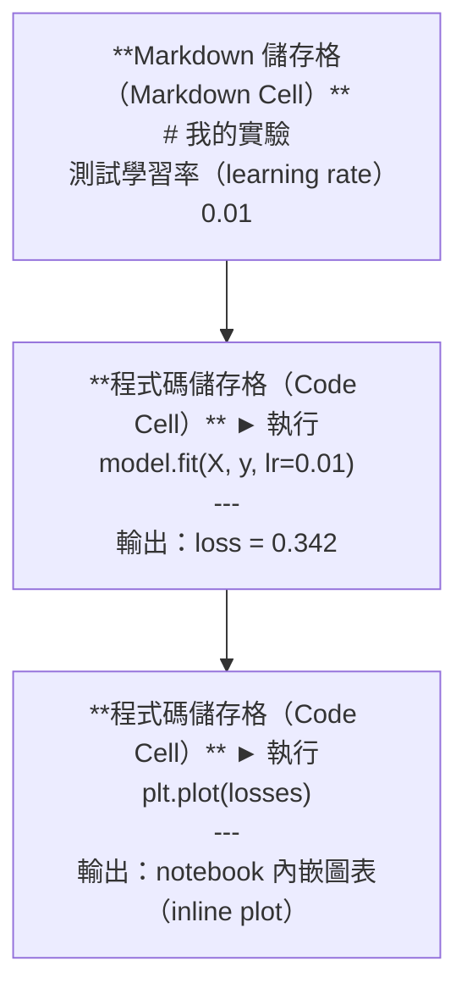
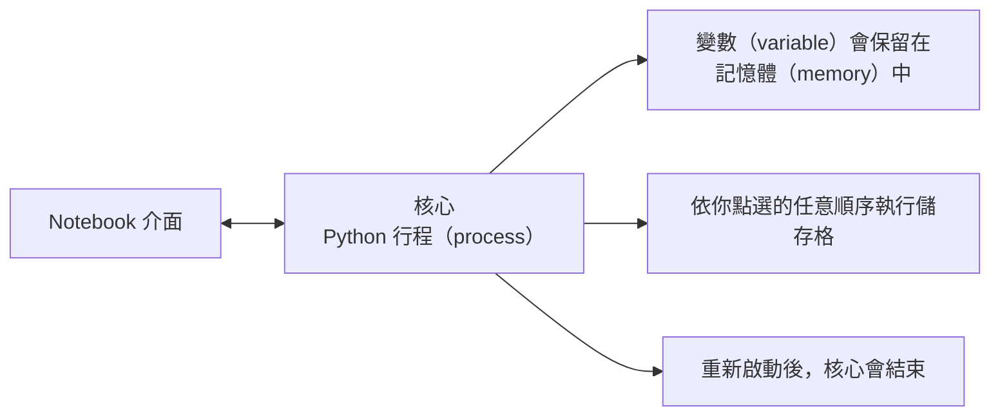

# Jupyter Notebooks

> notebook 是 AI 工程（AI engineering）的實驗台：先在這裡製作原型（prototype），確認可行後再移至正式環境。

**Type:** Build
**Languages:** Python
**Prerequisites:** Phase 0, Lesson 01
**Time:** ~30 minutes

## Learning Objectives｜學習目標

- 安裝並啟動 JupyterLab、Jupyter Notebook，或安裝了 Jupyter 擴充功能（extension）的 VS Code
- 使用 magic command（`%timeit`、`%%time`、`%matplotlib inline`）執行效能基準測試（benchmark），並在 notebook 中直接呈現圖表
- 判斷何時該用 notebook、何時該用程式檔案（script），並採用「先在 notebook 中探索，再用程式檔案交付」的工作流程
- 辨識並避開 notebook 常見的陷阱：不依序執行（out-of-order execution）、隱藏狀態（hidden state）和記憶體洩漏（memory leak）

## The Problem｜問題

每篇 AI 論文、教學文章和 Kaggle 競賽都會使用 Jupyter notebook。Notebook 讓你能分段執行程式碼（code）、直接查看輸出、混合程式碼與說明，並快速反覆嘗試。不用 notebook 學 AI，就像寫數學作業卻沒有草稿紙。

不過，notebook 也有實際的陷阱。有人無論做什麼都用 notebook，包括它最不擅長的工作。知道何時該用 notebook、何時該改用程式檔案，能避免日後陷入除錯（debugging）惡夢。

## The Concept｜核心概念

notebook 由一連串儲存格（cell）組成。每個儲存格可以是程式碼或文字。



核心（kernel）是背景執行的 Python 行程（process）。執行儲存格時，程式碼會傳送到核心，由它執行後再回傳結果。所有儲存格共用同一個核心，因此變數（variable）會在儲存格之間保留。



「想怎麼點就怎麼執行」既是 notebook 的強大之處，也可能成為陷阱。

```figure
s0-cell-order
```

## Build It｜動手實作

### 步驟 1：選擇介面（interface）

三種選擇，使用相同的檔案格式：

| 介面 | 安裝方式 | 適合情境 |
|-----------|---------|----------|
| JupyterLab | `pip install jupyterlab` 然後執行 `jupyter lab` | 完整 IDE 體驗、多個分頁、檔案瀏覽器、終端機（terminal） |
| Jupyter Notebook | `pip install notebook` 然後執行 `jupyter notebook` | 簡單、輕量，一次使用一個 notebook |
| VS Code | 安裝 "Jupyter" 擴充功能 | 已整合在編輯器（editor）中，支援 Git 整合和除錯 |

三種介面都能讀寫相同的 `.ipynb` 檔案。選你喜歡的即可。JupyterLab 是 AI 工作中最常見的選擇。

```bash
pip install jupyterlab
jupyter lab
```

### 步驟 2：重要快捷鍵（keyboard shortcuts）

你會在兩種模式間操作。按下 `Escape` 進入命令模式（command mode，左側顯示藍色列），按下 `Enter` 進入編輯模式（edit mode，左側顯示綠色列）。

**命令模式（最常用）：**

| 按鍵 | 動作 |
|-----|--------|
| `Shift+Enter` | 執行儲存格並移至下一個 |
| `A` | 在上方插入儲存格 |
| `B` | 在下方插入儲存格 |
| `DD` | 刪除儲存格 |
| `M` | 轉換為 Markdown |
| `Y` | 轉換為程式碼 |
| `Z` | 復原儲存格操作 |
| `Ctrl+Shift+H` | 顯示所有快捷鍵 |

**編輯模式：**

| 按鍵 | 動作 |
|-----|--------|
| `Tab` | 自動完成（autocomplete） |
| `Shift+Tab` | 顯示函式簽章（function signature） |
| `Ctrl+/` | 切換註解 |

`Shift+Enter` 是你一天會用上千次的快捷鍵，先學會它。

### 步驟 3：儲存格類型

**程式碼儲存格**會執行 Python 並顯示輸出：

```python
import numpy as np
data = np.random.randn(1000)
data.mean(), data.std()
```

輸出：`(0.0032, 0.9987)`

**Markdown 儲存格**會將格式化文字呈現出來。你可以用它記錄自己在做什麼，以及為什麼這麼做。它支援標題、粗體、斜體、LaTeX 數學式（`$E = mc^2$`）、表格和圖片。

### 步驟 4：Magic commands

這些不是 Python 語法，而是 Jupyter 專用指令（command）：以 `%` 開頭的 line magic，或以 `%%` 開頭的 cell magic。

**測量程式碼執行時間：**

```python
%timeit np.random.randn(10000)
```

輸出：`45.2 us +/- 1.3 us per loop`

```python
%%time
model.fit(X_train, y_train, epochs=10)
```

輸出：`Wall time: 2.34 s`

`%timeit` 會重複執行程式碼並計算平均時間；`%%time` 則只執行一次。用 `%timeit` 做微型效能基準測試（microbenchmark），用 `%%time` 測量一次訓練作業（training run）。

**啟用 notebook 內嵌圖表：**

```python
%matplotlib inline
```

現在每次呼叫 `plt.plot()` 或 `plt.show()`，圖表都會直接顯示在 notebook 中。

**不離開 notebook 就安裝套件：**

```python
!pip install scikit-learn
```

`!` 前綴可執行任何 shell 指令。

**查看環境變數（environment variable）：**

```python
%env CUDA_VISIBLE_DEVICES
```

### 步驟 5：在 notebook 中顯示豐富輸出

notebook 會自動顯示儲存格中的最後一個運算式，不過你也可以自行控制輸出：

```python
import pandas as pd

df = pd.DataFrame({
    "model": ["Linear", "Random Forest", "Neural Net"],
    "accuracy": [0.72, 0.89, 0.94],
    "training_time": [0.1, 2.3, 45.6]
})
df
```

這會呈現格式化的 HTML 表格，而不是純文字輸出。圖表也一樣：

```python
import matplotlib.pyplot as plt

plt.figure(figsize=(8, 4))
plt.plot([1, 2, 3, 4], [1, 4, 2, 3])
plt.title("Inline Plot")
plt.show()
```

圖表會出現在儲存格正下方。這正是 notebook 在 AI 工作中如此普及的原因：資料、圖表和程式碼一目了然。

若要顯示圖片：

```python
from IPython.display import Image, display
display(Image(filename="architecture.png"))
```

### 步驟 6：Google Colab

Colab 是免費的雲端 Jupyter notebook，提供 GPU、預先安裝的函式庫，並整合 Google Drive，不需要額外設定。

1. 前往 [colab.research.google.com](https://colab.research.google.com)
2. 上傳本課程的任一個 `.ipynb` 檔案
3. 選取 Runtime > Change runtime type > T4 GPU (free)

Colab 和本機 Jupyter 的差異：
- 檔案不會跨工作階段（session）保留（請存到 Drive 或下載）
- 預先安裝：numpy、pandas、matplotlib、torch、tensorflow、sklearn
- 使用 `from google.colab import files` 上傳或下載檔案
- 使用 `from google.colab import drive; drive.mount('/content/drive')` 將檔案儲存在雲端硬碟
- 免費方案（free tier）閒置 90 分鐘後，工作階段（session）會逾時

## Use It｜實際應用

### Notebook 與程式檔案：何時該用哪一種

| notebook 適用情境 | 程式檔案適用情境 |
|-------------------|-----------------|
| 探索資料集（dataset） | 訓練管線（training pipeline） |
| 為模型（model）製作原型 | 可重複使用的工具 |
| 視覺化結果 | 任何包含 `if __name__` 的程式 |
| 說明你的工作 | 依排程執行的程式碼 |
| 快速實驗 | 正式環境程式碼 |
| 課程練習 | 套件和函式庫 |

原則是：**先在 notebook 中探索，再用程式檔案交付。**

AI 工作常見的流程：
1. 在 notebook 中探索資料
2. 在 notebook 中為模型製作原型
3. 模型可行後，將程式碼移到 `.py` 檔案
4. 再把這些 `.py` 檔案匯入 notebook，繼續實驗

### 常見陷阱

**不依序執行。**你先執行儲存格 5，再執行儲存格 2，接著執行儲存格 7。你的 notebook 在本機看似正常，但別人由上而下執行時就會出錯。解法：分享前選擇 Kernel > Restart & Run All。

**隱藏狀態。**你刪除建立變數的儲存格，但該變數仍留在記憶體（memory）中。notebook 看起來乾淨，實際上卻依賴一個已消失的儲存格。解法：定期重新啟動核心。

**記憶體洩漏。**載入 4 GB 資料集、訓練模型，再載入另一個資料集；記憶體卻沒有釋放。解法：使用 `del variable_name` 和 `gc.collect()`，或重新啟動核心。

## Ship It｜交付成果

本課會產出：
- `outputs/prompt-notebook-helper.md`，用來除錯 notebook 問題

## Exercises｜練習

1. 開啟 JupyterLab，建立 notebook，使用 `%timeit` 比較串列推導式（list comprehension）和 NumPy 建立一個包含 100,000 個隨機數值的陣列（array）時，各自需要多久
2. 建立一個同時包含 Markdown 和程式碼儲存格的 notebook，讀取 CSV、顯示 DataFrame 並繪製圖表；接著選擇 Kernel > Restart & Run All，確認整份 notebook 能由上而下順利執行
3. 將 `code/notebook_tips.py` 中的程式碼貼到 Colab notebook，並使用免費 GPU 執行

## Key Terms｜關鍵術語

| 術語 | 常見說法 | 實際含義 |
|------|----------------|----------------------|
| 核心 | 「執行程式碼的東西」 | 在背景獨立執行的 Python 行程，負責執行儲存格並將變數保留在記憶體中 |
| 儲存格 | 「程式碼區塊」 | notebook 中可獨立執行的單位，可以是程式碼或 Markdown |
| magic command | 「Jupyter 小技巧」 | 以 `%` 或 `%%` 為前綴、用來控制 notebook 環境的專用命令 |
| `.ipynb` | 「notebook 檔案」 | 包含儲存格、輸出和中繼資料（metadata）的 JSON 檔案；這個副檔名代表 IPython Notebook |

## Further Reading｜延伸閱讀

- [JupyterLab 文件](https://jupyterlab.readthedocs.io/)：查看完整功能
- [Google Colab 常見問題](https://research.google.com/colaboratory/faq.html)：了解 Colab 專屬限制和功能
- [28 個 Jupyter Notebook 技巧](https://www.dataquest.io/blog/jupyter-notebook-tips-tricks-shortcuts/)：掌握進階快捷鍵
