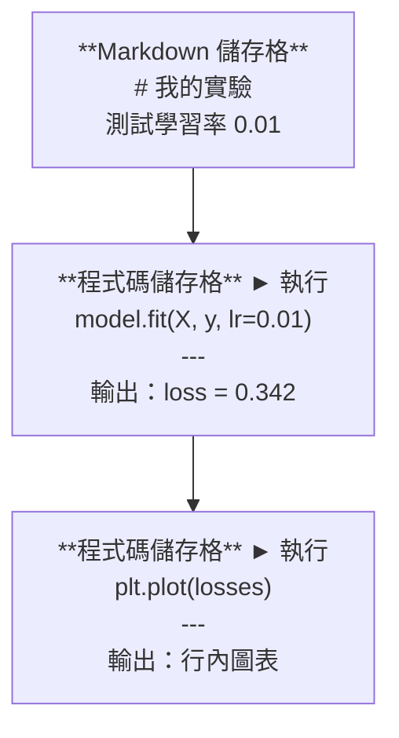
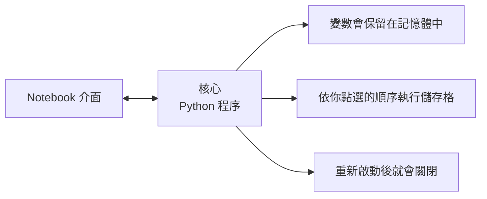

# Jupyter Notebook

> Notebook 是 AI 工程的實驗台。先在這裡試作，再把可行的成果移進正式環境。

**Type:** Build
**Languages:** Python
**Prerequisites:** Phase 0, Lesson 01
**Time:** ~30 minutes

## Learning Objectives

- 安裝並啟動 JupyterLab、Jupyter Notebook，或裝有 Jupyter 擴充功能的 VS Code
- 使用魔術指令（`%timeit`、`%%time`、`%matplotlib inline`）測量效能並直接顯示視覺化結果
- 分辨何時該用 Notebook、何時該用指令碼，並採用「在 Notebook 中探索，用指令碼交付」的工作流程
- 辨認並避開常見的 Notebook 陷阱：非依序執行、隱藏狀態和記憶體洩漏

## The Problem｜問題

每篇 AI 論文、教學和 Kaggle 競賽幾乎都會用到 Jupyter Notebook。它能讓你分段執行程式碼、直接查看輸出、混合程式碼與說明，並快速反覆嘗試。如果學 AI 卻不用 Notebook，就像做數學作業時沒有草稿紙。

不過，Notebook 也有實際的陷阱。有人什麼事都用 Notebook，即使它根本不適合。知道何時該用 Notebook、何時該改用指令碼，可以避免日後陷入難以排查的錯誤。

## The Concept｜核心概念

Notebook 是由一連串儲存格組成的清單。每個儲存格不是程式碼，就是文字。



核心（kernel）是在背景執行的 Python 程序。執行儲存格時，Notebook 會把程式碼送給核心執行，再接收結果。所有儲存格共用同一個核心，因此變數可以跨儲存格保留。



「不論先後順序都能執行」既是 Notebook 的強項，也是容易踩雷的地方。

```figure
s0-cell-order
```

## Build It｜動手打造

### 步驟 1：選擇操作介面

三種選擇，同一種檔案格式：

| 介面 | 安裝方式 | 適合用途 |
|-----------|---------|----------|
| JupyterLab | `pip install jupyterlab`，再執行 `jupyter lab` | 完整 IDE 體驗、多分頁、檔案瀏覽器、終端機 |
| Jupyter Notebook | `pip install notebook`，再執行 `jupyter notebook` | 簡單、輕量，一次操作一個 Notebook |
| VS Code | 安裝「Jupyter」擴充功能 | 整合在編輯器中，並支援 Git 與除錯 |

三者都能讀寫相同的 `.ipynb` 檔案。你可以依喜好選擇；JupyterLab 在 AI 工作中最常見。

```bash
pip install jupyterlab
jupyter lab
```

### 步驟 2：實用的鍵盤快速鍵

Notebook 有兩種操作模式。按 `Escape` 切換到命令模式（左側顯示藍色標記），按 `Enter` 切換到編輯模式（顯示綠色標記）。

**命令模式（最常用）：**

| 按鍵 | 動作 |
|-----|--------|
| `Shift+Enter` | 執行儲存格並移到下一格 |
| `A` | 在上方插入儲存格 |
| `B` | 在下方插入儲存格 |
| `DD` | 刪除儲存格 |
| `M` | 將儲存格轉為 Markdown |
| `Y` | 將儲存格轉為程式碼 |
| `Z` | 復原儲存格操作 |
| `Ctrl+Shift+H` | 顯示所有快速鍵 |

**編輯模式：**

| 按鍵 | 動作 |
|-----|--------|
| `Tab` | 自動完成 |
| `Shift+Tab` | 顯示函式簽章 |
| `Ctrl+/` | 切換註解 |

`Shift+Enter` 是你一天會用上千次的快速鍵，先學會它。

### 步驟 3：儲存格類型

**程式碼儲存格**會執行 Python 並顯示輸出：

```python
import numpy as np
data = np.random.randn(1000)
data.mean(), data.std()
```

輸出：`(0.0032, 0.9987)`

**Markdown 儲存格**會將文字排版後顯示。你可以用它記錄正在做什麼，以及這麼做的原因。它支援標題、粗體、斜體、LaTeX 數學式（`$E = mc^2$`）、表格和圖片。

### 步驟 4：魔術指令

這些不是 Python，而是 Jupyter 專用指令：以 `%` 開頭的是單行魔術指令，以 `%%` 開頭的是儲存格魔術指令。

**測量程式執行時間：**

```python
%timeit np.random.randn(10000)
```

輸出：`45.2 us +/- 1.3 us per loop`

```python
%%time
model.fit(X_train, y_train, epochs=10)
```

輸出：執行時間 `2.34 s`

`%timeit` 會重複執行程式碼並計算平均值；`%%time` 則只執行一次。微基準測試用 `%timeit`，訓練流程用 `%%time`。

**啟用行內繪圖：**

```python
%matplotlib inline
```

之後，`plt.plot()` 或 `plt.show()` 產生的圖都會直接顯示在 Notebook 中。

**不離開 Notebook 就安裝套件：**

```python
!pip install scikit-learn
```

前綴 `!` 會執行任意 shell 指令。

**檢查環境變數：**

```python
%env CUDA_VISIBLE_DEVICES
```

### 步驟 5：直接顯示豐富的輸出

Notebook 會自動顯示儲存格中的最後一個運算式，但你也可以自行控制：

```python
import pandas as pd

df = pd.DataFrame({
    "model": ["Linear", "Random Forest", "Neural Net"],
    "accuracy": [0.72, 0.89, 0.94],
    "training_time": [0.1, 2.3, 45.6]
})
df
```

輸出會是排版好的 HTML 表格，而不是純文字內容。繪圖也是如此：

```python
import matplotlib.pyplot as plt

plt.figure(figsize=(8, 4))
plt.plot([1, 2, 3, 4], [1, 4, 2, 3])
plt.title("Inline Plot")
plt.show()
```

圖表會顯示在儲存格下方。Notebook 在 AI 工作中如此普及，就是因為資料、圖表和程式碼可以一起查看。

顯示圖片：

```python
from IPython.display import Image, display
display(Image(filename="architecture.png"))
```

### 步驟 6：Google Colab

Colab 是免費的雲端 Jupyter Notebook，提供 GPU、預先安裝的程式庫，以及 Google Drive 整合，不必自行設定。

1. 前往 [colab.research.google.com](https://colab.research.google.com)
2. 上傳本課程的任一 `.ipynb` 檔案
3. 選取 `Runtime > Change runtime type > T4 GPU`（免費）

Colab 和本機 Jupyter 的差異：
- 工作階段結束後，檔案不會保留（請存到 Drive 或下載）
- 預先安裝：numpy、pandas、matplotlib、torch、tensorflow、sklearn
- 使用 `from google.colab import files` 上傳或下載檔案
- 使用 `from google.colab import drive; drive.mount('/content/drive')` 儲存檔案
- 免費方案閒置 90 分鐘後，工作階段會逾時

## Use It｜實際使用

### 何時該用 Notebook，何時該用指令碼

| 適合用 Notebook | 適合用指令碼 |
|-------------------|-----------------|
| 探索資料集 | 訓練流程 |
| 建立模型原型 | 可重複使用的工具 |
| 將結果視覺化 | 含有 `if __name__` 的程式 |
| 說明你的工作 | 按排程執行的程式碼 |
| 快速實驗 | 正式環境程式碼 |
| 課程練習 | 套件與程式庫 |

原則是：**在 Notebook 中探索，用指令碼交付。**

AI 工程常見的工作流程：
1. 在 Notebook 中探索資料
2. 在 Notebook 中建立模型原型
3. 確認可行後，將程式碼移到 `.py` 檔案
4. 再把這些 `.py` 檔匯入 Notebook，繼續實驗

### 常見陷阱

**非依序執行。** 你先執行第 5 格，再執行第 2 格，接著執行第 7 格。Notebook 在你的電腦上能跑，別人從頭到尾執行時卻會出錯。解法：分享前選取 `Kernel > Restart & Run All`。

**隱藏狀態。** 你刪除了一個儲存格，但它建立的變數仍留在記憶體中。Notebook 看起來很乾淨，實際上卻依賴一個已消失的儲存格。解法：定期重新啟動核心。

**記憶體洩漏。** 載入 4GB 資料集、訓練模型，再載入另一個資料集，記憶體卻沒有釋出。解法：使用 `del variable_name` 和 `gc.collect()`，或重新啟動核心。

## Ship It｜交付成果

本課程會產出：
- `outputs/prompt-notebook-helper.md`，用來排查 Notebook 問題

## Exercises｜練習

1. 開啟 JupyterLab 並建立 Notebook，使用 `%timeit` 比較串列推導式與 NumPy 建立 100,000 個隨機數的速度
2. 建立一份同時包含 Markdown 與程式碼儲存格的 Notebook，用它載入 CSV、顯示 DataFrame 並繪製圖表；接著選取 `Kernel > Restart & Run All`，確認從頭到尾都能執行
3. 將 `code/notebook_tips.py` 的程式碼貼到 Colab Notebook，並使用免費 GPU 執行

## Key Terms｜重要詞彙

| 詞彙 | 常見說法 | 實際意義 |
|------|----------|----------|
| Kernel（核心） |「執行程式碼的東西」| 獨立的 Python 程序，負責執行儲存格並在記憶體中保留變數 |
| Cell（儲存格） |「一段程式碼」| Notebook 中可獨立執行的單位，可以是程式碼或 Markdown |
| Magic command（魔術指令） |「Jupyter 小技巧」| 以 `%` 或 `%%` 開頭、用來控制 Notebook 環境的特殊指令 |
| `.ipynb` |「Notebook 檔案」| 以 JSON 儲存儲存格、輸出和中繼資料的檔案；名稱來自 IPython Notebook |

## Further Reading｜延伸閱讀

- [JupyterLab 文件](https://jupyterlab.readthedocs.io/)，了解完整功能
- [Google Colab 常見問題](https://research.google.com/colaboratory/faq.html)，查看 Colab 的限制與功能
- [28 個 Jupyter Notebook 技巧](https://www.dataquest.io/blog/jupyter-notebook-tips-tricks-shortcuts/)，學習進階快速鍵
