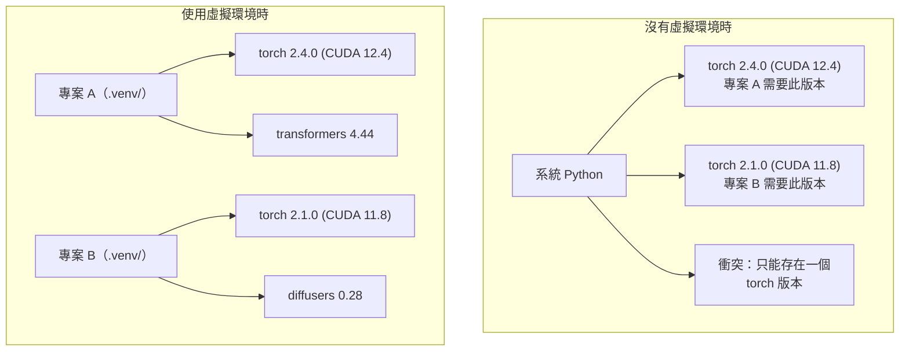

# Python 環境

> 相依地獄（dependency hell）確實存在；虛擬環境（virtual environment）就是解方。

**Type:** Build
**Languages:** Shell
**Prerequisites:** Phase 0, Lesson 01
**Time:** ~30 minutes

## Learning Objectives｜學習目標

- 使用 `uv`、`venv` 或 `conda` 建立隔離的虛擬環境
- 撰寫 `pyproject.toml`，設定選用相依套件群組（optional dependency groups），並產生 lockfile，確保可重現性（reproducibility）
- 診斷並修正常見問題：全域安裝（global install）、混用 pip/conda，以及 CUDA 版本不相容（CUDA version mismatch）
- 為相依套件衝突（dependency conflict）的專案（project），制定每階段的環境策略

## The Problem｜問題

你為 fine-tuning 專案安裝 PyTorch 2.4。下週，另一個專案因 CUDA 組建版本已固定，需要 PyTorch 2.1。你全域升級 PyTorch 後，第一個專案就壞了；降回去，第二個專案又會壞掉。

這就是相依地獄。在 AI/ML 工作中，這種情況很常見，原因包括：

- PyTorch、JAX 和 TensorFlow 各自附帶 CUDA 繫結（CUDA bindings）
- 模型（model）函式庫（libraries）會固定使用特定的框架（framework）版本
- 全域執行 `pip install` 會覆寫先前安裝的內容
- CUDA 11.8 組建無法搭配 CUDA 12.x 驅動程式（driver），反之亦然

解決方法是：每個專案都有自己的隔離環境，並在其中安裝自己的套件（package）。

## The Concept｜核心概念



```figure
s0-env-isolation
```

## Build It｜動手實作

### 選項 1：uv venv（建議）

`uv` 是速度最快的 Python 套件管理器（package manager），比 pip 快 10–100 倍。它能用單一工具管理虛擬環境、Python 版本與相依套件解析（dependency resolution）。

```bash
curl -LsSf https://astral.sh/uv/install.sh | sh

uv python install 3.12

cd your-project
uv venv
source .venv/bin/activate
```

安裝套件：

```bash
uv pip install torch numpy
```

一步建立包含 `pyproject.toml` 的專案：

```bash
uv init my-ai-project
cd my-ai-project
uv add torch numpy matplotlib
```

### 選項 2：venv（Python 內建）

如果無法安裝 `uv`，Python 內建了 `venv`：

```bash
python3 -m venv .venv
source .venv/bin/activate  # Linux/macOS
.venv\Scripts\activate     # Windows

pip install torch numpy
```

venv 比 `uv` 慢，但只要安裝了 Python 就能使用。

### 選項 3：conda（依需求使用）

conda 可以管理非 Python 相依套件（dependencies），例如 CUDA 工具套件（CUDA toolkit）、cuDNN 和 C 函式庫（C library）。以下情況適合使用 conda：

- 需要特定版本的 CUDA 工具套件，但不想將它安裝到整個系統
- 在無法安裝系統套件的共享叢集上工作
- 函式庫的安裝說明要求「use conda」

```bash
# Install miniconda (not the full Anaconda)
curl -LsSf https://repo.anaconda.com/miniconda/Miniconda3-latest-Linux-x86_64.sh -o miniconda.sh
bash miniconda.sh -b

conda create -n myproject python=3.12
conda activate myproject

conda install pytorch torchvision torchaudio pytorch-cuda=12.4 -c pytorch -c nvidia
```

規則只有一條：如果某個環境使用 conda，該環境中的所有套件也都用 conda 管理。在 conda 環境混用 `pip install`，會造成相依套件衝突，之後很難除錯。

### 本課程的每階段環境策略

你可以整門課共用一個環境，但別這麼做。不同階段需要不同的相依套件，有時還會彼此衝突。

策略如下：

```
ai-engineering-from-scratch/
├── .venv/                    <-- shared lightweight env for phases 0-3
├── phases/
│   ├── 04-neural-networks/
│   │   └── .venv/            <-- PyTorch env
│   ├── 05-cnns/
│   │   └── .venv/            <-- same PyTorch env (symlink or shared)
│   ├── 08-transformers/
│   │   └── .venv/            <-- might need different transformer versions
│   └── 11-llm-apis/
│       └── .venv/            <-- API SDKs, no torch needed
```

`code/env_setup.sh` 中的環境設定程式會建立本課程的基礎環境。

## pyproject.toml 基本概念

每個 Python 專案都應有 `pyproject.toml`。這個檔案能取代 `setup.py`、`setup.cfg` 和 `requirements.txt`。

```toml
[project]
name = "ai-engineering-from-scratch"
version = "0.1.0"
requires-python = ">=3.11"
dependencies = [
    "numpy>=1.26",
    "matplotlib>=3.8",
    "jupyter>=1.0",
    "scikit-learn>=1.4",
]

[project.optional-dependencies]
torch = ["torch>=2.3", "torchvision>=0.18"]
llm = ["anthropic>=0.39", "openai>=1.50"]
```

接著安裝：

```bash
uv pip install -e ".[torch]"    # base + PyTorch
uv pip install -e ".[llm]"     # base + LLM SDKs
uv pip install -e ".[torch,llm]" # everything
```

## lockfile 的用途

lockfile 會將每個相依套件固定到精確版本，也包含間接相依套件（transitive dependency）。這能確保可重現性：任何人依照 lockfile 安裝，都會取得完全相同的套件版本。

```bash
# uv generates uv.lock automatically when using uv add
uv add numpy

# pip-tools approach
uv pip compile pyproject.toml -o requirements.lock
uv pip install -r requirements.lock
```

將 lockfile commit 到 Git。其他人 clone 儲存庫後，依 lockfile 安裝，就能取得完全相同的版本。

## 常見錯誤

### 1. 全域安裝

```bash
pip install torch  # BAD: installs to system Python

source .venv/bin/activate
pip install torch  # GOOD: installs to virtual environment
```

查看套件安裝位置：

```bash
which python       # should show .venv/bin/python, not /usr/bin/python
which pip           # should show .venv/bin/pip
```

### 2. 混用 pip 和 conda

```bash
conda create -n myenv python=3.12
conda activate myenv
conda install pytorch -c pytorch
pip install some-other-package   # BAD: can break conda's dependency tracking
conda install some-other-package # GOOD: let conda manage everything
```

如果非得在 conda 環境中使用 pip（有些套件只提供 pip 安裝方式），先安裝所有 conda 套件，最後才安裝 pip 套件。

### 3. 忘記啟用環境（activate）

```bash
python train.py           # uses system Python, missing packages
source .venv/bin/activate
python train.py           # uses project Python, packages found
```

shell 提示字元應顯示環境名稱：

```
(.venv) $ python train.py
```

### 4. 將 .venv commit 到 git

```bash
echo ".venv/" >> .gitignore
```

虛擬環境大小可達 200 MB–2 GB，只適用於本機，無法在不同電腦間直接共用。應 commit `pyproject.toml` 和 lockfile，而不是 commit 虛擬環境。

### 5. CUDA 版本不相容

```bash
nvidia-smi                # shows driver CUDA version (e.g., 12.4)
python -c "import torch; print(torch.version.cuda)"  # shows PyTorch CUDA version

# These must be compatible.
# PyTorch CUDA version must be <= driver CUDA version.
```

## Use It｜實際應用

執行環境設定程式（setup script），建立本課程的環境：

```bash
bash phases/00-setup-and-tooling/06-python-environments/code/env_setup.sh
```

這會在儲存庫根目錄建立 `.venv`，並安裝、驗證核心相依套件。

## Exercises｜練習

1. 執行 `env_setup.sh`，確認所有檢查都通過
2. 建立第二個虛擬環境，在其中安裝不同版本的 numpy，並確認兩個環境彼此隔離
3. 為同時需要 PyTorch 和 Anthropic SDK 的專案撰寫 `pyproject.toml`
4. 刻意在未啟用 venv 的情況下全域安裝套件，觀察安裝位置，然後將它解除安裝

## Key Terms｜關鍵術語

| 術語 | 常見說法 | 實際含義 |
|------|----------------|----------------------|
| 虛擬環境 | 「venv」 | 與系統 Python 分開的獨立目錄，內含 Python 直譯器（Python interpreter）和套件 |
| lockfile | 「固定版本的相依套件」 | 列出所有套件及其精確版本的檔案，確保不同電腦安裝後的版本完全相同 |
| pyproject.toml | 「新的 setup.py」 | Python 專案的標準設定檔，取代 setup.py、setup.cfg 和 requirements.txt |
| 間接相依套件 | 「某個相依套件所依賴的套件」 | B 相依於 C；若你安裝相依於 B 的 A，C 就是 A 的間接相依套件 |
| CUDA 版本不相容 | 「GPU 無法運作」 | PyTorch 的編譯版本與 GPU 驅動程式支援的 CUDA 版本不同 |
