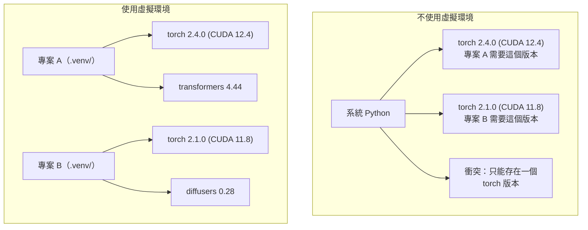

# Python 環境管理

> 相依套件地獄確實存在；虛擬環境就是解方。

**Type:** Build
**Languages:** Shell
**Prerequisites:** Phase 0, Lesson 01
**Time:** ~30 minutes

## Learning Objectives

- 使用 `uv`、`venv` 或 `conda` 建立彼此隔離的虛擬環境
- 撰寫含有選用相依套件群組的 `pyproject.toml`，並產生鎖定檔以確保可重現性
- 診斷並修正常見問題：全域安裝、混用 pip 與 conda、CUDA 版本不相容
- 為相依套件互相衝突的專案實作分階段環境策略

## The Problem｜問題

你為微調專案安裝 PyTorch 2.4。下週，另一個專案因 CUDA 建置版本已固定，需要 PyTorch 2.1。你全域升級後，第一個專案壞了；降回舊版後，第二個專案又壞了。

這就是相依套件地獄。在 AI／ML 工作中，這種情況很常見，原因包括：

- PyTorch、JAX 和 TensorFlow 各自附帶不同的 CUDA 繫結
- 模型程式庫會固定特定版本的框架
- 全域執行 `pip install` 會覆寫原本安裝的套件
- CUDA 11.8 建置版本無法搭配 CUDA 12.x 驅動程式，反過來也一樣

解法是讓每個專案都有獨立環境和自己的套件。

## The Concept｜核心概念



```figure
s0-env-isolation
```

## Build It｜動手打造

### 選項 1：uv venv（建議）

`uv` 是速度最快的 Python 套件管理工具，比 pip 快 10 到 100 倍。它能用同一個工具管理虛擬環境、Python 版本和相依套件解析。

```bash
curl -LsSf https://astral.sh/uv/install.sh | sh

uv python install 3.12

cd your-project
uv venv
source .venv/bin/activate
```

安裝套件：

```bash
uv pip install torch numpy
```

一步建立含有 `pyproject.toml` 的專案：

```bash
uv init my-ai-project
cd my-ai-project
uv add torch numpy matplotlib
```

### 選項 2：venv（Python 內建）

如果無法安裝 `uv`，Python 本身就附有 `venv`：

```bash
python3 -m venv .venv
source .venv/bin/activate  # Linux/macOS
.venv\Scripts\activate     # Windows

pip install torch numpy
```

速度比 `uv` 慢，但只要有安裝 Python 就能使用。

### 選項 3：conda（視需求使用）

Conda 能管理非 Python 相依套件，例如 CUDA 工具套件、cuDNN 和 C 程式庫。以下情況適合使用：

- 需要特定版本的 CUDA 工具套件，又不想安裝到整個系統
- 使用共用運算叢集，無法安裝系統套件
- 程式庫的安裝說明要求「使用 conda」

```bash
# Install miniconda (not the full Anaconda)
curl -LsSf https://repo.anaconda.com/miniconda/Miniconda3-latest-Linux-x86_64.sh -o miniconda.sh
bash miniconda.sh -b

conda create -n myproject python=3.12
conda activate myproject

conda install pytorch torchvision torchaudio pytorch-cuda=12.4 -c pytorch -c nvidia
```

有一個原則：在某個環境使用 conda，就用 conda 管理該環境中的所有套件。在 conda 環境中混用 `pip install` 會造成難以除錯的相依套件衝突。

### 本課程做法：各階段使用獨立環境

你可以為整個課程建立一個環境，但不要這麼做。不同階段需要的相依套件可能互相衝突。

策略：

```text
ai-engineering-from-scratch/
├── .venv/                    <-- 第 0 到第 3 階段共用的輕量環境
├── phases/
│   ├── 04-neural-networks/
│   │   └── .venv/            <-- PyTorch 環境
│   ├── 05-cnns/
│   │   └── .venv/            <-- 沿用相同的 PyTorch 環境（符號連結或共用）
│   ├── 08-transformers/
│   │   └── .venv/            <-- 可能需要不同版本的 transformers
│   └── 11-llm-apis/
│       └── .venv/            <-- API SDK，不需要 torch
```

`code/env_setup.sh` 中的指令碼會為本課程建立基礎環境。

## pyproject.toml Basics｜pyproject.toml 基礎

每個 Python 專案都應該有 `pyproject.toml`。它用一個檔案取代 `setup.py`、`setup.cfg` 和 `requirements.txt`。

```toml
[project]
name = "ai-engineering-from-scratch"
version = "0.1.0"
requires-python = ">=3.11"
dependencies = [
    "numpy>=1.26",
    "matplotlib>=3.8",
    "jupyter>=1.0",
    "scikit-learn>=1.4",
]

[project.optional-dependencies]
torch = ["torch>=2.3", "torchvision>=0.18"]
llm = ["anthropic>=0.39", "openai>=1.50"]
```

接著安裝：

```bash
uv pip install -e ".[torch]"    # base + PyTorch
uv pip install -e ".[llm]"     # base + LLM SDKs
uv pip install -e ".[torch,llm]" # everything
```

## Lockfiles｜鎖定檔

鎖定檔會將每個相依套件（包括間接相依套件）固定在確切版本，確保安裝結果可重現：任何人依鎖定檔安裝，都會取得相同版本的套件。

```bash
# uv generates uv.lock automatically when using uv add
uv add numpy

# pip-tools approach
uv pip compile pyproject.toml -o requirements.lock
uv pip install -r requirements.lock
```

請將鎖定檔提交到 Git。其他人複製儲存庫後，就能依鎖定檔安裝完全相同版本的套件。

## Common Mistakes｜常見錯誤

### 1. 全域安裝

```bash
pip install torch  # BAD: installs to system Python

source .venv/bin/activate
pip install torch  # GOOD: installs to virtual environment
```

確認套件會安裝到哪裡：

```bash
which python       # should show .venv/bin/python, not /usr/bin/python
which pip           # should show .venv/bin/pip
```

### 2. 混用 pip 和 conda

```bash
conda create -n myenv python=3.12
conda activate myenv
conda install pytorch -c pytorch
pip install some-other-package   # BAD: can break conda's dependency tracking
conda install some-other-package # GOOD: let conda manage everything
```

如果因為某些套件只能透過 pip 安裝，而必須在 conda 環境中使用 pip，請先安裝所有 conda 套件，再安裝 pip 套件。

### 3. 忘記啟用環境

```bash
python train.py           # uses system Python, missing packages
source .venv/bin/activate
python train.py           # uses project Python, packages found
```

Shell 提示字元應該會顯示環境名稱：

```console
(.venv) $ python train.py
```

### 4. 把 `.venv` 提交到 Git

```bash
echo ".venv/" >> .gitignore
```

虛擬環境佔用 200MB 到 2GB，只適合本機使用，也無法在不同電腦間直接搬用。應提交 `pyproject.toml` 和鎖定檔。

### 5. CUDA 版本不相容

```bash
nvidia-smi                # shows driver CUDA version (e.g., 12.4)
python -c "import torch; print(torch.version.cuda)"  # shows PyTorch CUDA version

# These must be compatible.
# PyTorch CUDA version must be <= driver CUDA version.
```

## Use It｜實際使用

執行設定指令碼，建立本課程的環境：

```bash
bash phases/00-setup-and-tooling/06-python-environments/code/env_setup.sh
```

它會在儲存庫根目錄建立 `.venv`，安裝核心相依套件並確認設定正確。

## Exercises｜練習

1. 執行 `env_setup.sh`，確認所有檢查都通過
2. 建立第二個虛擬環境，在裡面安裝不同版本的 numpy，並確認兩個環境彼此隔離
3. 為同時需要 PyTorch 和 Anthropic SDK 的專案撰寫 `pyproject.toml`
4. 故意不啟用虛擬環境就全域安裝套件，確認它安裝的位置，再將它移除

## Key Terms｜重要詞彙

| 詞彙 | 常見說法 | 實際意義 |
|------|----------|----------|
| Virtual environment（虛擬環境） |「venv」| 將 Python 解譯器和套件隔離在獨立目錄中，與系統 Python 分開 |
| Lockfile（鎖定檔） |「固定版本的相依套件」| 列出每個套件及其確切版本，確保不同電腦安裝結果一致的檔案 |
| `pyproject.toml` |「新版 setup.py」| Python 專案的標準設定檔，可取代 `setup.py`、`setup.cfg` 和 `requirements.txt` |
| Transitive dependency（傳遞相依套件） |「某個相依套件的相依套件」| 套件 B 依賴 C；如果安裝依賴 B 的 A，C 就是 A 的傳遞相依套件 |
| CUDA mismatch（CUDA 版本不相容） |「GPU 無法運作」| PyTorch 的編譯版本與 GPU 驅動程式支援的 CUDA 版本不同 |
