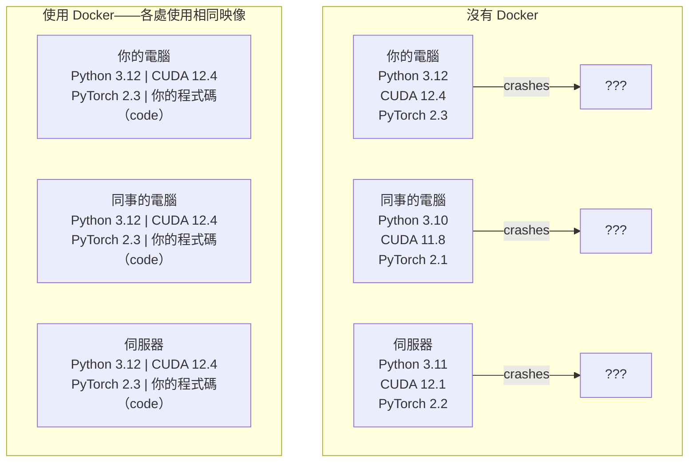

# Docker for AI

> 容器（container）讓「在我的電腦上可以運作」成為過去式。

**Type:** Build
**Languages:** Docker
**Prerequisites:** Phase 0, Lessons 01 and 03
**Time:** ~60 minutes

## Learning Objectives｜學習目標

- 使用 Dockerfile 建置（build）支援 GPU 的 Docker 映像（image），內含 CUDA、PyTorch 和 AI 函式庫
- 將主機（host）目錄掛載（mount）為磁碟區（volume），讓模型（model）、資料集和程式碼（code）在容器重建後仍能保留
- 設定 NVIDIA Container Toolkit，讓容器內可使用 GPU
- 使用 Docker Compose 編排（orchestrate）多服務（multi-service）AI 應用程式，例如推論伺服器（inference server）和向量資料庫（vector database）

## The Problem｜問題

你在筆電上使用 PyTorch 2.3、CUDA 12.4 和 Python 3.12 訓練模型；同事的環境則是 PyTorch 2.1、CUDA 11.8 和 Python 3.10，結果你的模型在同事的電腦上崩潰。你的 Dockerfile 在兩台機器上都能正常運作。

AI 專案常有棘手的相依套件（dependency）問題。常見的技術堆疊（stack）包含 Python、PyTorch、CUDA 驅動程式（driver）、cuDNN、系統層級的 C 函式庫（C libraries），以及 flash-attn 等需要精確編譯器（compiler）版本的專用套件。Docker 會把這些內容封裝成單一映像，讓它在各處都能以相同方式執行。

## The Concept｜核心概念

Docker 會把程式碼（code）、執行環境（runtime）、函式庫和系統工具包進一個隔離單位，稱為容器。你可以把容器想成輕量級虛擬機器（virtual machine），但它共用主機作業系統的核心（kernel），而不會另跑一套核心，所以幾秒就能啟動，不必等上幾分鐘。



### 為什麼 AI 專案比多數專案更需要 Docker

1. **GPU 驅動程式（GPU drivers）很脆弱。** CUDA 12.4 程式碼（code）無法在 CUDA 11.8 上執行。Docker 會把 CUDA 工具套件（CUDA toolkit）隔離在容器內，同時透過 NVIDIA Container Toolkit 共用主機的 GPU 驅動程式。

2. **模型權重（model weights）體積很大。** 一個有 7B 個參數（parameters）的模型，使用 fp16 時需要 14 GB。每次重建都重新下載模型並不實際。Docker 磁碟區可讓你掛載主機上的模型目錄。

3. **多服務架構很常見。** 真正的 AI 應用程式不只是一支 Python 程式：它可能包含推論伺服器、供 RAG 使用的向量資料庫，也可能還有網頁前端。Docker Compose 能用一個指令（command）編排這些服務。

### 關鍵詞彙

| 術語 | 意思 |
|------|------|
| 映像 | 唯讀範本，也是你的配方；由 Dockerfile 建置而成 |
| 容器 | 正在執行的映像實例，就像你的廚房 |
| Dockerfile | 逐層建置映像的指令 |
| 磁碟區 | 容器重新啟動後仍會保留的持續性儲存空間 |
| docker-compose | 以 YAML 定義多容器應用程式的工具 |

### AI 常見的容器模式

```
Dev Container
  Full toolkit. Editor support. Jupyter. Debugging tools.
  Used during development and experimentation.

Training Container
  Minimal. Just the training script and dependencies.
  Runs on GPU clusters. No editor, no Jupyter.

Inference Container
  Optimized for serving. Small image. Fast cold start.
  Runs behind a load balancer in production.
```

```figure
s0-image-layers
```

## Build It｜動手實作

### 步驟 1：安裝 Docker

```bash
# macOS
brew install --cask docker
open /Applications/Docker.app

# Ubuntu
curl -fsSL https://get.docker.com | sh
sudo usermod -aG docker $USER
# Log out and back in for group change to take effect
```

確認安裝：

```bash
docker --version
docker run hello-world
```

### 步驟 2：安裝 NVIDIA Container Toolkit（Linux 搭配 NVIDIA GPU）

這個工具能讓 Docker 容器存取 GPU。macOS 和 Windows（WSL2）使用者可以略過此步驟；Docker Desktop 在這些平台上以不同方式處理 GPU 直通（GPU passthrough）。

```bash
distribution=$(. /etc/os-release;echo $ID$VERSION_ID)
curl -fsSL https://nvidia.github.io/libnvidia-container/gpgkey | sudo gpg --dearmor -o /usr/share/keyrings/nvidia-container-toolkit-keyring.gpg
curl -s -L https://nvidia.github.io/libnvidia-container/$distribution/libnvidia-container.list | \
    sed 's#deb https://#deb [signed-by=/usr/share/keyrings/nvidia-container-toolkit-keyring.gpg] https://#g' | \
    sudo tee /etc/apt/sources.list.d/nvidia-container-toolkit.list

sudo apt-get update
sudo apt-get install -y nvidia-container-toolkit
sudo nvidia-ctk runtime configure --runtime=docker
sudo systemctl restart docker
```

在容器內測試 GPU 存取：

```bash
docker run --rm --gpus all nvidia/cuda:12.4.1-base-ubuntu22.04 nvidia-smi
```

如果看得到 GPU 資訊，代表 Toolkit 已正常運作。

### 步驟 3：了解基礎映像（base image）

選對基礎映像能省下好幾個小時的除錯（debugging）時間。

```
nvidia/cuda:12.4.1-devel-ubuntu22.04
  Full CUDA toolkit. Compilers included.
  Use for: building packages that need nvcc (flash-attn, bitsandbytes)
  Size: ~4 GB

nvidia/cuda:12.4.1-runtime-ubuntu22.04
  CUDA runtime only. No compilers.
  Use for: running pre-built code
  Size: ~1.5 GB

pytorch/pytorch:2.6.0-cuda12.4-cudnn9-runtime
  PyTorch pre-installed on top of CUDA.
  Use for: skipping the PyTorch install step
  Size: ~6 GB

python:3.12-slim
  No CUDA. CPU only.
  Use for: inference on CPU, lightweight tools
  Size: ~150 MB
```

### 步驟 4：撰寫 AI 開發用 Dockerfile

以下是 `code/Dockerfile` 的內容，逐段看懂它的設定：

```dockerfile
FROM --platform=linux/amd64 nvidia/cuda:12.4.1-devel-ubuntu22.04

ENV DEBIAN_FRONTEND=noninteractive
ENV PYTHONUNBUFFERED=1

RUN apt-get update && apt-get install -y --no-install-recommends \
    software-properties-common \
    git \
    curl \
    build-essential \
    && add-apt-repository -y ppa:deadsnakes/ppa \
    && apt-get update && apt-get install -y --no-install-recommends \
    python3.12 \
    python3.12-venv \
    python3.12-dev \
    && rm -rf /var/lib/apt/lists/*

RUN update-alternatives --install /usr/bin/python python /usr/bin/python3.12 1

RUN curl -sSL https://raw.githubusercontent.com/pypa/get-pip/3b73145063be545b649ad9ca83ea8da5fc915a4f/public/get-pip.py -o /tmp/get-pip.py \
    && echo "a341e1a43e38001c551a1508a73ff23636a11970b61d901d9a1cad2a18f57055  /tmp/get-pip.py" | sha256sum -c - \
    && python /tmp/get-pip.py \
    && rm /tmp/get-pip.py \
    && update-alternatives --install /usr/bin/pip pip /usr/local/bin/pip3.12 1

RUN python -m pip install --no-cache-dir --upgrade pip setuptools wheel

RUN python -m pip install --no-cache-dir \
    torch==2.6.0+cu124 \
    torchvision==0.21.0+cu124 \
    torchaudio==2.6.0+cu124 \
    --index-url https://download.pytorch.org/whl/cu124

RUN python -m pip install --no-cache-dir \
    numpy \
    pandas \
    scikit-learn \
    matplotlib \
    jupyter \
    transformers \
    datasets \
    accelerate \
    safetensors

WORKDIR /workspace

VOLUME ["/workspace", "/models"]

EXPOSE 8888

CMD ["python"]
```

建置映像：

```bash
docker build -t ai-dev -f phases/00-setup-and-tooling/07-docker-for-ai/code/Dockerfile .
```

第一次需要下載 CUDA 基礎映像和 PyTorch，因此會花一些時間；之後的建置會使用快取層。

**macOS／Apple Silicon（M1/M2/M3/M4）：**`FROM` 行中的 `--platform=linux/amd64` 能讓這個映像在 Mac 上順利建置。CUDA 基礎映像也有 arm64 版本，Docker Desktop 在 Apple Silicon 上會自動選用；但 PyTorch 的 `cu124` wheel 只提供 x86_64 版本，因此 `pip install torch==2.6.0+cu124` 這一層會因 `No matching distribution found for torch==2.6.0+cu124` 而失敗。固定平台後會拉取 x86_64 映像，並透過模擬執行；建置會較慢，而且容器無法使用 GPU（Mac 本來就沒有 CUDA）。在 Mac 上執行下方 `docker run` 指令時，請移除 `--gpus all`。若要在 Apple Silicon 上使用 GPU，請依第 1 課安裝原生支援 MPS 的版本，並將此映像留給搭載 NVIDIA GPU 的 x86_64 Linux 主機。

執行容器：

```bash
docker run --rm -it --gpus all \
    -v $(pwd):/workspace \
    -v ~/models:/models \
    ai-dev python -c "import torch; print(f'PyTorch {torch.__version__}, CUDA: {torch.cuda.is_available()}')"
```

在容器內執行 Jupyter：

```bash
docker run --rm -it --gpus all \
    -v $(pwd):/workspace \
    -v ~/models:/models \
    -p 8888:8888 \
    ai-dev jupyter notebook --ip=0.0.0.0 --port=8888 --no-browser --allow-root
```

### 步驟 5：掛載資料和模型磁碟區

磁碟區掛載（volume mount）對 AI 工作很重要。沒有掛載的話，容器停止後，你下載的 14 GB 模型也會消失。

```bash
# Mount your code
-v $(pwd):/workspace

# Mount a shared models directory
-v ~/models:/models

# Mount datasets
-v ~/datasets:/data
```

在訓練程式（training script）中，從掛載路徑載入模型：

```python
from transformers import AutoModel

model = AutoModel.from_pretrained("/models/llama-7b")
```

模型會儲存在主機的檔案系統（filesystem）中。你可以任意重建容器，不必重新下載模型。

### 步驟 6：用 Docker Compose 建立多服務 AI 應用程式

真正的 RAG 應用程式需要推論伺服器和向量資料庫。Docker Compose 能用一個指令（command）啟動兩者。

請參考 `code/docker-compose.yml`：

```yaml
services:
  ai-dev:
    build:
      context: .
      dockerfile: Dockerfile
    deploy:
      resources:
        reservations:
          devices:
            - driver: nvidia
              count: all
              capabilities: [gpu]
    volumes:
      - ../../../:/workspace
      - ~/models:/models
      - ~/datasets:/data
    ports:
      - "8888:8888"
    stdin_open: true
    tty: true
    command: jupyter notebook --ip=0.0.0.0 --port=8888 --no-browser --allow-root

  qdrant:
    image: qdrant/qdrant:v1.12.5
    ports:
      - "6333:6333"
      - "6334:6334"
    volumes:
      - qdrant_data:/qdrant/storage

volumes:
  qdrant_data:
```

啟動所有服務：

```bash
cd phases/00-setup-and-tooling/07-docker-for-ai/code
docker compose up -d
```

現在 AI 開發容器可以透過服務名稱 qdrant，連線到向量資料庫的 `http://qdrant:6333`。Docker Compose 會自動建立共用網路（network）。

從 AI 容器內測試連線：

```python
from qdrant_client import QdrantClient

client = QdrantClient(host="qdrant", port=6333)
print(client.get_collections())
```

停止所有服務：

```bash
docker compose down
```

加上 `-v` 也會刪除 qdrant 磁碟區：

```bash
docker compose down -v
```

### 步驟 7：AI 開發常用 Docker 指令

```bash
# List running containers
docker ps

# List all images and their sizes
docker images

# Remove unused images (reclaim disk space)
docker system prune -a

# Check GPU usage inside a running container
docker exec -it <container_id> nvidia-smi

# Copy a file from container to host
docker cp <container_id>:/workspace/results.csv ./results.csv

# View container logs
docker logs -f <container_id>
```

## Use It｜實際應用

現在你有一套可重現的 AI 開發環境。接下來的課程可以這樣使用：

- 使用 `docker compose up` 同時啟動開發環境和向量資料庫
- 將程式碼（code）、模型和資料掛載為磁碟區，避免重建容器時遺失
- 課程需要新的 Python 套件時，將它加入 Dockerfile 後重新建置
- 把 Dockerfile 分享給隊友，大家就能使用完全相同的環境

### 沒有 GPU？

移除 `--gpus all` 旗標和 NVIDIA 部署區塊，容器仍可用於 CPU 課程。PyTorch 會偵測沒有 CUDA，並自動改用 CPU。

## Exercises｜練習

1. 建置 Dockerfile，並在容器內執行 `python -c "import torch; print(torch.__version__)"`
2. 啟動 docker-compose 堆疊，確認 AI 容器可透過 `http://qdrant:6333/collections` 存取 Qdrant
3. 在 Dockerfile 加入 `flask`，重新建置，並在通訊埠（port）5000 啟動簡單的 API 伺服器（API server）；使用 `-p 5000:5000` 對應通訊埠
4. 使用 `docker images` 測量映像大小。試著將基礎映像由 `devel` 改成 `runtime`，再比較大小

## Key Terms｜關鍵術語

| 術語 | 常見說法 | 實際含義 |
|------|----------------|----------------------|
| 容器 | 「輕量虛擬機」 | 使用主機核心、擁有獨立檔案系統和網路的隔離行程 |
| 映像層（image layer） | 「快取步驟」 | Dockerfile 的每個指令都會建立一層；未變動的層會被快取，讓重建速度更快 |
| NVIDIA Container Toolkit | 「Docker 裡的 GPU」 | 透過 `--gpus` 旗標將主機 GPU 提供給容器的執行階段擴充元件 |
| 磁碟區掛載 | 「共用資料夾」 | 將主機上的目錄掛載到容器內；容器停止後，變更仍會保留 |
| 基礎映像 | 「起始點」 | Dockerfile 以 `FROM` 指定的映像，決定預先安裝哪些內容 |
