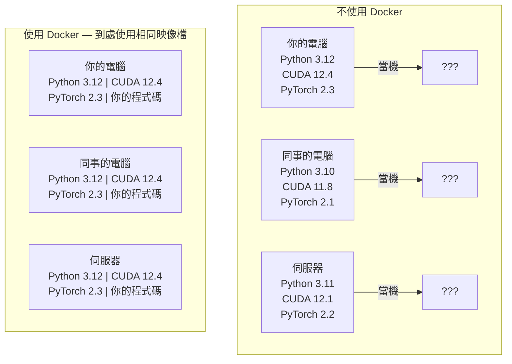

# AI 開發用 Docker

> 有了容器，「在我的電腦上可以跑」就不再是問題。

**Type:** Build
**Languages:** Docker
**Prerequisites:** Phase 0, Lessons 01 and 03
**Time:** ~60 minutes

## Learning Objectives

- 使用 Dockerfile 建立支援 GPU 的 Docker 映像檔，內含 CUDA、PyTorch 和 AI 程式庫
- 將主機目錄掛載為 Volume，讓模型、資料集和程式碼在重建容器後仍能保留
- 設定 NVIDIA Container Toolkit，讓容器能使用 GPU
- 使用 Docker Compose 編排多服務 AI 應用（推論伺服器與向量資料庫）

## The Problem｜問題

你在筆電上用 PyTorch 2.3、CUDA 12.4 和 Python 3.12 訓練模型；同事的環境卻是 PyTorch 2.1、CUDA 11.8 和 Python 3.10。模型在對方的電腦上當掉。使用 Dockerfile，兩邊都能執行相同環境。

AI 專案的相依套件錯綜複雜。常見技術堆疊包括 Python、PyTorch、CUDA 驅動程式、cuDNN、系統層級的 C 程式庫，以及需要特定編譯器版本的 `flash-attn` 等專用套件。Docker 會把這些內容封裝成單一映像檔，讓它在不同環境中都能以相同方式執行。

## The Concept｜核心概念

Docker 會把程式碼、執行環境、程式庫和系統工具包成稱為「容器」的隔離單位。你可以把它想成輕量級虛擬機器；不同之處在於，容器會共用主機的作業系統核心，不必自行執行一套核心，因此幾秒內就能啟動，不用等好幾分鐘。



### 為什麼 AI 專案特別需要 Docker

1. **GPU 驅動程式很容易出問題。** CUDA 12.4 的程式碼無法在 CUDA 11.8 上執行。Docker 會在容器內隔離 CUDA 工具套件，同時透過 NVIDIA Container Toolkit 使用主機上的 GPU 驅動程式。

2. **模型權重檔案很大。** 70 億參數的模型以 fp16 儲存時有 14 GB。每次重建容器都重新下載並不實際。Docker Volume 能讓容器掛載主機上的模型目錄。

3. **AI 應用通常由多個服務組成。** 實際的 AI 應用不只是一支 Python 程式，還可能包括推論伺服器、供 RAG 使用的向量資料庫，以及網站前端。Docker Compose 能用一個指令編排這些服務。

### 重要詞彙

| 詞彙 | 意義 |
|------|------|
| Image（映像檔） | 唯讀範本，就像食譜；由 Dockerfile 建立。 |
| Container（容器） | 映像檔正在執行的個體，就像廚房。 |
| Dockerfile | 用來逐層建置映像檔的指令。 |
| Volume（資料卷） | 容器重新啟動後仍會保留的儲存空間。 |
| docker-compose | 使用 YAML 定義多容器應用程式的工具。 |

### AI 常見的容器模式

```text
Dev Container（開發容器）
  完整工具組。支援編輯器、Jupyter 和除錯工具。
  開發與實驗時使用。

Training Container（訓練容器）
  精簡環境。只含訓練指令碼和相依套件。
  在 GPU 叢集執行。不含編輯器或 Jupyter。

Inference Container（推論容器）
  專為提供推論服務最佳化。映像檔小，冷啟動快。
  在正式環境的負載平衡器後方執行。
```

```figure
s0-image-layers
```

## Build It｜動手打造

### 步驟 1：安裝 Docker

```bash
# macOS
brew install --cask docker
open /Applications/Docker.app

# Ubuntu
curl -fsSL https://get.docker.com | sh
sudo usermod -aG docker $USER
# Log out and back in for group change to take effect
```

確認安裝成功：

```bash
docker --version
docker run hello-world
```

### 步驟 2：安裝 NVIDIA Container Toolkit（使用 NVIDIA GPU 的 Linux）

這個工具可讓 Docker 容器使用 GPU。macOS 和 Windows（WSL2）使用者可以略過；Docker Desktop 在這些平台上以不同方式處理 GPU 傳遞。

```bash
distribution=$(. /etc/os-release;echo $ID$VERSION_ID)
curl -fsSL https://nvidia.github.io/libnvidia-container/gpgkey | sudo gpg --dearmor -o /usr/share/keyrings/nvidia-container-toolkit-keyring.gpg
curl -s -L https://nvidia.github.io/libnvidia-container/$distribution/libnvidia-container.list | \
    sed 's#deb https://#deb [signed-by=/usr/share/keyrings/nvidia-container-toolkit-keyring.gpg] https://#g' | \
    sudo tee /etc/apt/sources.list.d/nvidia-container-toolkit.list

sudo apt-get update
sudo apt-get install -y nvidia-container-toolkit
sudo nvidia-ctk runtime configure --runtime=docker
sudo systemctl restart docker
```

在容器內測試 GPU 是否可用：

```bash
docker run --rm --gpus all nvidia/cuda:12.4.1-base-ubuntu22.04 nvidia-smi
```

如果輸出中看得到 GPU 資訊，表示 Toolkit 已正常運作。

### 步驟 3：認識基底映像檔

選對基底映像檔，可以省下好幾個小時的除錯時間。

```text
nvidia/cuda:12.4.1-devel-ubuntu22.04
  完整 CUDA 工具套件，包含編譯器。
  適用於：建置需要 nvcc 的套件（flash-attn、bitsandbytes）
  大小：約 4 GB

nvidia/cuda:12.4.1-runtime-ubuntu22.04
  只有 CUDA 執行環境，不含編譯器。
  適用於：執行已建置好的程式碼
  大小：約 1.5 GB

pytorch/pytorch:2.6.0-cuda12.4-cudnn9-runtime
  已在 CUDA 上安裝 PyTorch。
  適用於：略過安裝 PyTorch 的步驟
  大小：約 6 GB

python:3.12-slim
  不含 CUDA，只能使用 CPU。
  適用於：在 CPU 上推論、執行輕量工具
  大小：約 150 MB
```

### 步驟 4：撰寫 AI 開發用 Dockerfile

以下是 `code/Dockerfile` 的內容，逐段閱讀：

```dockerfile
FROM --platform=linux/amd64 nvidia/cuda:12.4.1-devel-ubuntu22.04

ENV DEBIAN_FRONTEND=noninteractive
ENV PYTHONUNBUFFERED=1

RUN apt-get update && apt-get install -y --no-install-recommends \
    software-properties-common \
    git \
    curl \
    build-essential \
    && add-apt-repository -y ppa:deadsnakes/ppa \
    && apt-get update && apt-get install -y --no-install-recommends \
    python3.12 \
    python3.12-venv \
    python3.12-dev \
    && rm -rf /var/lib/apt/lists/*

RUN update-alternatives --install /usr/bin/python python /usr/bin/python3.12 1

RUN curl -sSL https://raw.githubusercontent.com/pypa/get-pip/3b73145063be545b649ad9ca83ea8da5fc915a4f/public/get-pip.py -o /tmp/get-pip.py \
    && echo "a341e1a43e38001c551a1508a73ff23636a11970b61d901d9a1cad2a18f57055  /tmp/get-pip.py" | sha256sum -c - \
    && python /tmp/get-pip.py \
    && rm /tmp/get-pip.py \
    && update-alternatives --install /usr/bin/pip pip /usr/local/bin/pip3.12 1

RUN python -m pip install --no-cache-dir --upgrade pip setuptools wheel

RUN python -m pip install --no-cache-dir \
    torch==2.6.0+cu124 \
    torchvision==0.21.0+cu124 \
    torchaudio==2.6.0+cu124 \
    --index-url https://download.pytorch.org/whl/cu124

RUN python -m pip install --no-cache-dir \
    numpy \
    pandas \
    scikit-learn \
    matplotlib \
    jupyter \
    transformers \
    datasets \
    accelerate \
    safetensors

WORKDIR /workspace

VOLUME ["/workspace", "/models"]

EXPOSE 8888

CMD ["python"]
```

建置映像檔：

```bash
docker build -t ai-dev -f phases/00-setup-and-tooling/07-docker-for-ai/code/Dockerfile .
```

第一次建置需要一些時間，因為要下載 CUDA 基底映像檔和 PyTorch。之後重建時會使用快取層。

**macOS／Apple Silicon（M1、M2、M3、M4）：** `FROM` 行中的 `--platform=linux/amd64` 能讓映像檔在 Mac 上成功建置。CUDA 基底映像檔也提供 arm64 版本，Docker Desktop 會在 Apple Silicon 上自動選用；但 PyTorch 只為 x86_64 發布 `cu124` wheel，因此 `pip install torch==2.6.0+cu124` 這一層會出現 `No matching distribution found for torch==2.6.0+cu124` 錯誤。固定平台會下載 x86_64 映像檔，並透過模擬執行；建置速度會比較慢，而且容器無法使用 GPU（Mac 本身也沒有 CUDA）。在 Mac 上執行下方的 `docker run` 指令時，請移除 `--gpus all`。若要在 Apple Silicon 上使用 GPU，請依第 01 課直接使用 MPS 版本，並將這個映像檔留給配備 NVIDIA GPU 的 x86_64 Linux 主機。

執行容器：

```bash
docker run --rm -it --gpus all \
    -v $(pwd):/workspace \
    -v ~/models:/models \
    ai-dev python -c "import torch; print(f'PyTorch {torch.__version__}, CUDA: {torch.cuda.is_available()}')"
```

在容器內執行 Jupyter：

```bash
docker run --rm -it --gpus all \
    -v $(pwd):/workspace \
    -v ~/models:/models \
    -p 8888:8888 \
    ai-dev jupyter notebook --ip=0.0.0.0 --port=8888 --no-browser --allow-root
```

### 步驟 5：掛載資料與模型的 Volume

Volume 掛載對 AI 工作很重要。沒有掛載時，容器停止後，你下載的 14 GB 模型就會消失。

```bash
# Mount your code
-v $(pwd):/workspace

# Mount a shared models directory
-v ~/models:/models

# Mount datasets
-v ~/datasets:/data
```

在訓練指令碼中，從掛載路徑載入模型：

```python
from transformers import AutoModel

model = AutoModel.from_pretrained("/models/llama-7b")
```

模型會存放在主機的檔案系統中。你可以隨時重建容器，不必重新下載模型。

### 步驟 6：使用 Docker Compose 執行多服務 AI 應用

實際的 RAG 應用需要推論伺服器和向量資料庫。Docker Compose 能用一個指令啟動兩者。

查看 `code/docker-compose.yml`：

```yaml
services:
  ai-dev:
    build:
      context: .
      dockerfile: Dockerfile
    deploy:
      resources:
        reservations:
          devices:
            - driver: nvidia
              count: all
              capabilities: [gpu]
    volumes:
      - ../../../:/workspace
      - ~/models:/models
      - ~/datasets:/data
    ports:
      - "8888:8888"
    stdin_open: true
    tty: true
    command: jupyter notebook --ip=0.0.0.0 --port=8888 --no-browser --allow-root

  qdrant:
    image: qdrant/qdrant:v1.12.5
    ports:
      - "6333:6333"
      - "6334:6334"
    volumes:
      - qdrant_data:/qdrant/storage

volumes:
  qdrant_data:
```

啟動所有服務：

```bash
cd phases/00-setup-and-tooling/07-docker-for-ai/code
docker compose up -d
```

現在 AI 開發容器可以用服務名稱 `qdrant`，透過 `http://qdrant:6333` 連線到向量資料庫。Docker Compose 會自動建立共用網路。

在 AI 容器內測試連線：

```python
from qdrant_client import QdrantClient

client = QdrantClient(host="qdrant", port=6333)
print(client.get_collections())
```

停止所有服務：

```bash
docker compose down
```

加上 `-v` 也會刪除 qdrant Volume：

```bash
docker compose down -v
```

### 步驟 7：AI 開發常用的 Docker 指令

```bash
# List running containers
docker ps

# List all images and their sizes
docker images

# Remove unused images (reclaim disk space)
docker system prune -a

# Check GPU usage inside a running container
docker exec -it <container_id> nvidia-smi

# Copy a file from container to host
docker cp <container_id>:/workspace/results.csv ./results.csv

# View container logs
docker logs -f <container_id>
```

## Use It｜實際使用

現在你有一套可重現的 AI 開發環境。接下來的課程可以：

- 使用 `docker compose up` 一起啟動開發環境與向量資料庫
- 將程式碼、模型和資料掛載為 Volume，避免重建後遺失
- 課程需要新的 Python 套件時，將它加入 Dockerfile 並重新建置
- 把 Dockerfile 分享給隊友，讓大家使用完全相同的環境

### 沒有 GPU？

移除 `--gpus all` 旗標和 NVIDIA 部署區塊，容器仍可執行以 CPU 為主的課程。PyTorch 會偵測到沒有 CUDA，並自動改用 CPU。

## Exercises｜練習

1. 建置 Dockerfile，並在容器內執行 `python -c "import torch; print(torch.__version__)"`
2. 啟動 docker-compose 服務組合，確認 AI 容器能透過 `http://qdrant:6333/collections` 連上 Qdrant
3. 在 Dockerfile 加入 `flask`、重新建置，並在 5000 埠執行簡單的 API 伺服器；使用 `-p 5000:5000` 對應連接埠
4. 使用 `docker images` 查看映像檔大小；將基底映像檔從 `devel` 換成 `runtime`，再比較大小

## Key Terms｜重要詞彙

| 詞彙 | 常見說法 | 實際意義 |
|------|----------|----------|
| Container（容器） |「輕量級虛擬機器」| 使用主機核心的隔離程序，並有自己的檔案系統和網路 |
| Image layer（映像檔層） |「快取步驟」| Dockerfile 的每個指令都會建立一層；未變動的層會被快取，讓重建更快 |
| NVIDIA Container Toolkit |「Docker 裡的 GPU」| 透過 `--gpus` 旗標將主機 GPU 提供給容器使用的執行階段掛鉤 |
| Volume mount（Volume 掛載） |「共用資料夾」| 將主機目錄掛載到容器中；容器停止後，變更仍會保留 |
| Base image（基底映像檔） |「起點」| Dockerfile 以 `FROM` 指定的映像檔，決定預先安裝哪些內容 |
