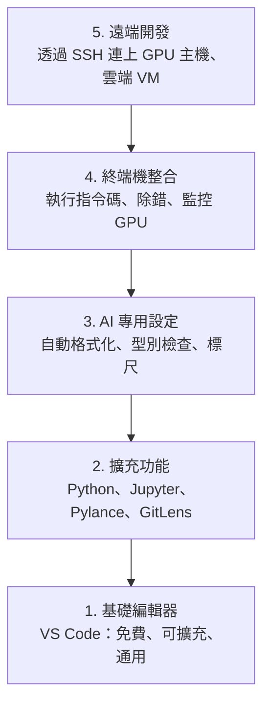

# 編輯器設定

> 編輯器就像你的副駕駛。設定一次，讓它不妨礙你，還能開始幫上忙。

**Type:** Build
**Languages:** --
**Prerequisites:** Phase 0, Lesson 01
**Time:** ~20 minutes

## Learning Objectives

- 安裝 VS Code，並加入 Python、Jupyter、程式碼檢查與 Remote SSH 等必要擴充功能
- 設定儲存時自動格式化、型別檢查，以及適用於 AI 工作流程的 Notebook 輸出捲動
- 設定 Remote SSH，像在本機一樣編輯和除錯遠端 GPU 機器上的程式碼
- 評估 Cursor、Windsurf、Neovim 等編輯器替代方案，以及它們在 AI 工作上的取捨

## The Problem｜問題

你會花上千個小時待在編輯器裡：撰寫 Python、執行 Notebook、除錯訓練迴圈，並透過 SSH 連上 GPU 主機。設定不當的編輯器會讓每次工作都卡卡的：沒有自動補全、型別提示或行內錯誤提示，還得手動格式化，終端機操作也不順手。

花 20 分鐘設定好，就能每天省下 20 分鐘。跳過設定，這 20 分鐘就會天天花掉。

## The Concept｜核心概念

AI 工程的編輯器設定需要具備五項條件：



```figure
s0-lsp-roundtrip
```

## Build It｜動手打造

### 步驟 1：安裝 VS Code

VS Code 是建議使用的編輯器。它免費、支援所有作業系統、完整支援 Jupyter Notebook，擴充功能生態系也涵蓋 AI 工作所需的功能。

請從 [code.visualstudio.com](https://code.visualstudio.com/) 下載。

在終端機確認安裝成功：

```bash
code --version
```

如果 macOS 找不到 `code` 指令，請開啟 VS Code，按下 `Cmd+Shift+P`，輸入「Shell Command」，然後選取「Install 'code' command in PATH」。

### 步驟 2：安裝必要的擴充功能

在 VS Code 開啟整合式終端機（所有平台均可按 `` Ctrl+` ``），並安裝 AI 工作所需的擴充功能：

```bash
code --install-extension ms-python.python
code --install-extension ms-python.vscode-pylance
code --install-extension ms-toolsai.jupyter
code --install-extension eamodio.gitlens
code --install-extension ms-vscode-remote.remote-ssh
code --install-extension ms-python.debugpy
code --install-extension ms-python.black-formatter
code --install-extension charliermarsh.ruff
```

各擴充功能的功能：

| 擴充功能 | 功能 |
|-----------|-----|
| Python | 語言支援、偵測虛擬環境、執行與除錯 |
| Pylance | 快速型別檢查、自動補全、解析匯入路徑 |
| Jupyter | 在 VS Code 執行 Notebook、檢視變數 |
| GitLens | 查看變更內容與作者、行內 Git blame |
| Remote SSH | 像在本機一樣開啟遠端 GPU 主機上的資料夾 |
| Debugpy | 逐步除錯 Python 程式 |
| Black Formatter | 儲存時自動格式化，維持一致的程式風格 |
| Ruff | 快速檢查程式碼，找出常見問題 |

本課程的 `code/.vscode/extensions.json` 檔案列出完整的建議清單。開啟專案資料夾時，VS Code 會提示你安裝這些擴充功能。

### 步驟 3：設定偏好

你可以複製本課程 `code/.vscode/settings.json` 的設定，或在 `Settings > Open Settings (JSON)` 中手動套用。

AI 工作常用的設定：

```jsonc
{
    "python.analysis.typeCheckingMode": "basic",
    "editor.formatOnSave": true,
    "editor.rulers": [88, 120],
    "notebook.output.scrolling": true,
    "files.autoSave": "afterDelay"
}
```

這些設定的用途：

- **基本型別檢查**：在執行前找出錯誤的引數型別，減少除錯時間，例如張量形狀不符或 API 參數錯誤。
- **儲存時自動格式化**：不用再操心格式，交給 Black 處理。
- **88 和 120 字元標尺**：Black 會在 88 字元處換行；120 字元標記則提醒你注意過長的文件字串和註解。
- **Notebook 輸出捲動**：訓練迴圈可能會輸出數千行內容。開啟捲動後，輸出面板才不會一直延伸。
- **自動儲存**：你可能會忘記存檔，結果訓練指令碼執行的還是舊程式碼。自動儲存可避免這種情況。

### 步驟 4：整合終端機

VS Code 的整合式終端機可用來執行訓練指令碼、監控 GPU，以及管理環境。

建議設定：

```jsonc
{
    "terminal.integrated.defaultProfile.osx": "zsh",
    "terminal.integrated.defaultProfile.linux": "bash",
    "terminal.integrated.fontSize": 13,
    "terminal.integrated.scrollback": 10000
}
```

常用快捷鍵：

| 動作 | macOS | Linux／Windows |
|--------|-------|---------------|
| 開啟或關閉終端機 | `` Ctrl+` `` | `` Ctrl+` `` |
| 新增終端機 | `` Ctrl+Shift+` `` | `` Ctrl+Shift+` `` |
| 分割終端機 | `Cmd+\` | `Ctrl+Shift+5` |

分割終端機很方便：一邊執行指令碼，另一邊用 `nvidia-smi -l 1` 或 `watch -n 1 nvidia-smi` 監控 GPU。

### 步驟 5：遠端開發（透過 SSH 連上 GPU 主機）

這是 AI 工作最重要的擴充功能。你會在遠端機器上執行訓練（例如雲端 VM、實驗室伺服器、Lambda 或 Vast.ai）。Remote SSH 讓你開啟遠端檔案系統、編輯檔案、使用終端機並進行除錯，就像所有操作都在本機一樣。

設定步驟：

1. 安裝 Remote SSH 擴充功能（已在步驟 2 完成）。
2. 按下 `Ctrl+Shift+P`（或 `Cmd+Shift+P`），輸入「Remote-SSH: Connect to Host」。
3. 輸入 `user@your-gpu-box-ip`。
4. VS Code 會自動在遠端機器安裝伺服器元件。

若要免密碼連線，請設定 SSH 金鑰：

```bash
ssh-keygen -t ed25519 -C "your-email@example.com"
ssh-copy-id user@your-gpu-box-ip
```

將主機資訊加入 `~/.ssh/config`，方便之後連線：

```text
Host gpu-box
    HostName 203.0.113.50
    User ubuntu
    IdentityFile ~/.ssh/id_ed25519
    ForwardAgent yes
```

之後選擇「Remote-SSH: Connect to Host > gpu-box」即可立即連線。

## Alternatives｜其他選擇

### Cursor

[cursor.com](https://cursor.com) 是內建 AI 程式碼生成功能的 VS Code 分支版本。它使用相同的擴充功能生態系和設定格式。如果你使用 Cursor，本課程介紹的設定都適用；匯入相同的 `settings.json` 和 `extensions.json` 即可。

### Windsurf

[windsurf.com](https://windsurf.com) 是另一款以 AI 為核心的 VS Code 分支版本。情況相同：擴充功能、設定格式和 Remote SSH 支援都一樣。

### Vim／Neovim

如果你已經熟悉 Vim 或 Neovim，而且用得順手，就繼續使用。AI Python 工作所需的基本設定如下：

- 使用 Mason 或手動安裝 **pyright** 或 **pylsp** 進行型別檢查
- 使用 **nvim-lspconfig** 整合語言伺服器
- 使用 **jupyter-vim** 或 **molten-nvim** 執行類似 Notebook 的工作
- 使用 **telescope.nvim** 搜尋檔案和符號
- 使用 **none-ls.nvim** 搭配 Black 和 Ruff 進行格式化與程式碼檢查

如果你還沒用過 Vim，就先別從現在開始學。學習曲線會和 AI 工程的學習互相競爭，建議使用 VS Code。

## Use It｜開始使用

設定完成後，日常工作流程會像這樣：

1. 在 VS Code 開啟專案資料夾（或透過 Remote SSH 連上 GPU 主機）。
2. 在編輯器中撰寫 Python，使用自動補全、型別提示和行內錯誤提示。
3. 使用 Jupyter 擴充功能直接執行 Notebook。
4. 使用整合式終端機執行訓練指令碼、`uv pip install` 和 GPU 監控工具。
5. 提交前使用 GitLens 檢查變更。

## Exercises｜練習

1. 安裝 VS Code 和步驟 2 列出的所有擴充功能
2. 將本課程的 `settings.json` 複製到 VS Code 設定中
3. 開啟 Python 檔案，確認 Pylance 會顯示型別提示，而且 Black 會在儲存時格式化
4. 如果你能使用遠端機器，請設定 Remote SSH 並開啟遠端資料夾

## Key Terms｜重要詞彙

| 詞彙 | 一般說法 | 實際意義 |
|------|----------|----------|
| LSP | 「自動補全引擎」 | Language Server Protocol（語言伺服器通訊協定）：讓編輯器從特定語言的伺服器取得型別資訊、自動補全和診斷結果的標準 |
| Pylance | 「Python 外掛」 | Microsoft 的 Python 語言伺服器，使用 Pyright 進行型別檢查和 IntelliSense |
| Remote SSH | 「在伺服器上工作」 | VS Code 擴充功能；會在遠端機器執行輕量伺服器，再將介面串流到本機編輯器 |
| 儲存時自動格式化 | 「自動整理格式」 | 每次儲存時，編輯器都會執行格式化工具（Black、Ruff），讓程式碼風格維持一致 |
