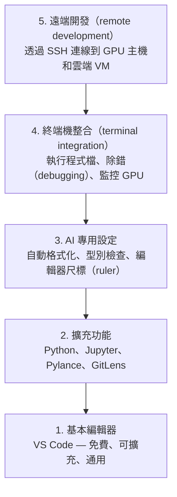

# 編輯器設定

> 編輯器（editor）是你的副駕駛。設定一次，讓它不再妨礙你，而是開始真正幫上忙。

**Type:** Build
**Languages:** --
**Prerequisites:** Phase 0, Lesson 01
**Time:** ~20 minutes

## Learning Objectives｜學習目標

- 安裝 VS Code，以及支援 Python、Jupyter、程式碼（code）檢查（linting）和 Remote SSH 的必要擴充功能（extension）
- 為 AI 工作流程設定儲存時自動格式化（format on save）、型別檢查（type checking），以及 notebook 輸出捲動
- 設定 Remote SSH，讓你能像在本機一樣，編輯遠端 GPU 主機（host）上的程式碼（code）並進行除錯（debugging）
- 評估可替代的編輯器（Cursor、Windsurf、Neovim），以及它們用於 AI 工作時的取捨

## The Problem｜問題

你會花上數千個小時，在編輯器裡撰寫 Python、執行 notebook、除錯（debugging）訓練迴圈（training loop），並透過 SSH 連線到 GPU 主機。設定不當的編輯器會讓每次工作都卡卡：沒有自動完成（autocomplete）、型別提示（type hint）、行內錯誤訊息（inline error），也無法自動格式化，終端機（terminal）工作流程也不順手。

正確的設定只要 20 分鐘。略過這一步，之後每天都要多花 20 分鐘。

## The Concept｜核心概念

AI 工程（AI engineering）的編輯器設定需要五個要素：



```figure
s0-lsp-roundtrip
```

## Build It｜動手實作

### 步驟 1：安裝 VS Code

VS Code 是建議使用的編輯器。它免費、支援所有作業系統、對 Jupyter notebook 提供一流的支援，而且擴充功能生態系涵蓋 AI 工作所需的一切。

從 [code.visualstudio.com](https://code.visualstudio.com/) 下載。

在終端機執行以下指令確認：

```bash
code --version
```

如果在 macOS 上找不到 `code`，請開啟 VS Code，按下 `Cmd+Shift+P`，輸入 "Shell Command"，再選擇 "Install 'code' command in PATH"。

### 步驟 2：安裝必要擴充功能

在 VS Code 的整合式終端機（integrated terminal）中（所有平台皆可按 `` Ctrl+` ``），安裝 AI 工作所需的擴充功能：

```bash
code --install-extension ms-python.python
code --install-extension ms-python.vscode-pylance
code --install-extension ms-toolsai.jupyter
code --install-extension eamodio.gitlens
code --install-extension ms-vscode-remote.remote-ssh
code --install-extension ms-python.debugpy
code --install-extension ms-python.black-formatter
code --install-extension charliermarsh.ruff
```

各擴充功能的用途：

| 擴充功能 | 用途 |
|-----------|-----|
| Python | 語言支援、虛擬環境偵測、執行與除錯（debugging） |
| Pylance | 快速型別檢查、自動完成、匯入解析（import resolution） |
| Jupyter | 在 VS Code 內執行 notebook、變數瀏覽器（variable explorer） |
| GitLens | 查看檔案變更者，並在程式碼（code）行內顯示 git blame 資訊 |
| Remote SSH | 將遠端 GPU 主機（host）上的資料夾當成本機資料夾開啟 |
| Debugpy | Python 逐步除錯（debugging） |
| Black Formatter | 儲存時自動格式化程式碼（code），維持一致的風格 |
| Ruff | 快速程式碼（code）檢查，抓出常見問題 |

本課的 `code/.vscode/extensions.json` 檔案列出完整的建議清單。開啟專案資料夾（project folder）後，VS Code 會提示你安裝這些擴充功能。

### 步驟 3：設定偏好設定

複製本課的 `code/.vscode/settings.json`，或透過 `Settings > Open Settings (JSON)` 手動套用。

AI 工作常用的幾項設定：

```jsonc
{
    "python.analysis.typeCheckingMode": "basic",
    "editor.formatOnSave": true,
    "editor.rulers": [88, 120],
    "notebook.output.scrolling": true,
    "files.autoSave": "afterDelay"
}
```

這些設定的重要性如下：

- **基本模式的型別檢查：** 在執行前抓出錯誤的引數型別。遇到 tensor shape 不相符或 API 參數錯誤時，可以省下除錯（debugging）時間。
- **儲存時自動格式化：** 你不必再操心程式碼（code）格式，Black 會處理。
- **88 和 120 字元尺標：** Black 會在 88 個字元處換行；120 字元的尺標則提醒你 docstring 和註解是否太長。
- **Notebook 輸出捲動：** 訓練迴圈會印出成千上萬行。沒有捲動功能，輸出面板就會被大量內容撐開。
- **自動儲存：** 你總會忘記儲存，訓練程式檔案就會執行舊程式碼（code）。自動儲存能避免這個問題。

### 步驟 4：整合終端機

VS Code 的整合式終端機可用來執行訓練程式檔案、監控 GPU，以及管理環境。

妥善設定終端機：

```jsonc
{
    "terminal.integrated.defaultProfile.osx": "zsh",
    "terminal.integrated.defaultProfile.linux": "bash",
    "terminal.integrated.fontSize": 13,
    "terminal.integrated.scrollback": 10000
}
```

常用快捷鍵：

| 動作 | macOS | Linux/Windows |
|--------|-------|---------------|
| 顯示／隱藏終端機 | `` Ctrl+` `` | `` Ctrl+` `` |
| 新增終端機 | `` Ctrl+Shift+` `` | `` Ctrl+Shift+` `` |
| 分割終端機 | `Cmd+\` | `Ctrl+Shift+5` |

分割終端機很好用：一個用來執行程式，另一個用 `nvidia-smi -l 1` 或 `watch -n 1 nvidia-smi` 監控 GPU。

### 步驟 5：遠端開發（透過 SSH 連線到 GPU 主機）

這是 AI 工作最重要的擴充功能。你會在遠端機器上執行訓練（雲端 VM、實驗室伺服器、Lambda、Vast.ai）。Remote SSH 讓你開啟遠端檔案系統（filesystem）、編輯檔案、使用終端機，並像在本機一樣除錯（debugging）。

設定步驟：

1. 安裝 Remote SSH 擴充功能（已在步驟 2 完成）。
2. 按下 `Ctrl+Shift+P`（或 `Cmd+Shift+P`），輸入 "Remote-SSH: Connect to Host"。
3. 輸入 `user@your-gpu-box-ip`。
4. VS Code 會自動在遠端機器上安裝伺服器（server）元件（component）。

若要免密碼連線，請設定 SSH 金鑰（SSH key）：

```bash
ssh-keygen -t ed25519 -C "your-email@example.com"
ssh-copy-id user@your-gpu-box-ip
```

將主機加入 `~/.ssh/config`，方便日後使用：

```
Host gpu-box
    HostName 203.0.113.50
    User ubuntu
    IdentityFile ~/.ssh/id_ed25519
    ForwardAgent yes
```

現在選擇 `Remote-SSH: Connect to Host > gpu-box`，就能立即連線。

## 替代方案

### Cursor

[cursor.com](https://cursor.com) 是內建 AI 程式碼（code）生成的 VS Code 衍生版本。它使用相同的擴充功能生態系和設定格式。如果你使用 Cursor，本課所有內容都適用。匯入相同的 `settings.json` 和 `extensions.json` 即可。

### Windsurf

[windsurf.com](https://windsurf.com) 是另一款以 AI 為核心的 VS Code 衍生版本。同樣地，它使用相同的擴充功能、設定格式，也支援 Remote SSH。

### Vim/Neovim

如果你已經使用 Vim 或 Neovim，而且工作效率不錯，就繼續使用。用於 AI Python 工作的最低限度設定如下：

- 使用 **pyright** 或 **pylsp** 進行型別檢查（透過 Mason 或手動安裝）
- 使用 **nvim-lspconfig** 整合語言伺服器（language server）
- 使用 **jupyter-vim** 或 **molten-nvim** 執行類似 notebook 的工作
- 使用 **telescope.nvim** 搜尋檔案或符號
- 使用 **none-ls.nvim** 搭配 black 和 ruff 格式化及檢查程式碼（code）

如果你目前沒有使用 Vim，就別從現在開始。學習曲線（learning curve）會和 AI 工程（AI engineering）學習互相拉扯。使用 VS Code 就好。

## Use It｜實際應用

設定完成後，你的日常工作流程會是：

1. 在 VS Code 開啟專案資料夾（project folder），或透過 Remote SSH 連線到 GPU 主機。
2. 在編輯器中撰寫 Python，使用自動完成、型別提示和行內錯誤訊息。
3. 使用 Jupyter 擴充功能，在 notebook 中直接執行程式碼（code）。
4. 使用整合式終端機執行訓練程式檔案、`uv pip install` 和監控 GPU。
5. 在 commit 前用 GitLens 檢視變更。

## Exercises｜練習

1. 安裝 VS Code 和步驟 2 列出的所有擴充功能
2. 將本課的 `settings.json` 複製到 VS Code 設定資料夾
3. 開啟 Python 檔案，確認 Pylance 會顯示型別提示，且 Black 會在儲存時格式化
4. 如果你能使用遠端機器，請設定 Remote SSH 並開啟遠端資料夾

## Key Terms｜關鍵術語

| 術語 | 一般說法 | 實際意義 |
|------|----------|----------|
| LSP | 「自動完成引擎」 | 語言伺服器（language server）通訊協定（Language Server Protocol）：一套標準，讓編輯器能向特定語言的語言伺服器（language server）取得型別資訊、程式碼（code）補全和診斷資訊 |
| Pylance | 「Python 擴充功能」 | Microsoft 的 Python 語言伺服器（language server），使用 Pyright 提供型別檢查和 IntelliSense |
| Remote SSH | 「在伺服器上工作」 | VS Code 擴充功能，會在遠端機器上執行輕量伺服器，並將介面串流到本機編輯器 |
| Format on save | 「自動排版」 | 每次儲存時，編輯器會執行格式化工具（formatter），例如 Black、Ruff，讓程式碼（code）風格保持一致 |
