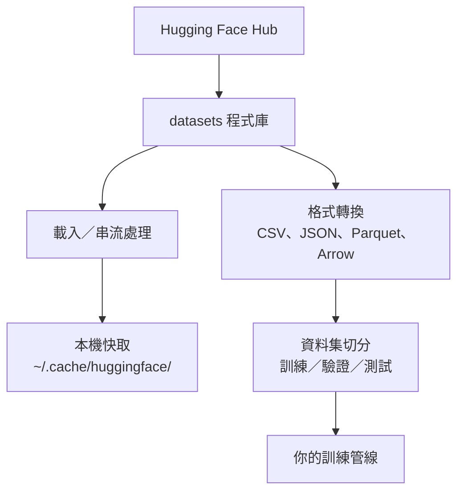

# 資料管理

> 資料是燃料。管理方式會決定你能跑多快。

**Type:** Build
**Language:** Python
**Prerequisites:** Phase 0, Lesson 01
**Time:** ~45 minutes

## Learning Objectives

- 使用 Hugging Face 的 `datasets` 程式庫載入、串流處理及快取資料集
- 在 CSV、JSON、Parquet 和 Arrow 格式之間轉換，並說明各格式的取捨
- 使用固定的亂數種子，建立可重現的訓練集、驗證集和測試集
- 使用 `.gitignore`、Git LFS 或 DVC 管理大型模型檔案和資料集

## The Problem｜問題

每個 AI 專案都從資料開始。你需要尋找資料集、下載資料、轉換格式、切分資料以供訓練和評估，並為資料加上版本管理，讓實驗可以重現。每次都手動處理既慢又容易出錯，因此你需要一套可重複使用的工作流程。

## The Concept｜核心概念



Hugging Face 的 `datasets` 程式庫是 AI 工作載入資料的標準工具。它內建下載、快取、格式轉換和串流處理功能。

```figure
s0-data-pipeline
```

## Build It｜動手打造

### 步驟 1：安裝 datasets 程式庫

```bash
pip install datasets huggingface_hub
```

### 步驟 2：載入資料集

```python
from datasets import load_dataset

dataset = load_dataset("stanfordnlp/imdb")
print(dataset)
print(dataset["train"][0])
```

這會下載 IMDB 電影評論資料集。首次下載後，資料會從 `~/.cache/huggingface/datasets/` 快取載入。

### 步驟 3：串流處理大型資料集

有些資料集太大，無法完整存進磁碟。串流處理會逐列載入資料，而不必下載整份資料集。

```python
dataset = load_dataset("wikimedia/wikipedia", "20231101.en", split="train", streaming=True)

for i, example in enumerate(dataset):
    print(example["title"])
    if i >= 4:
        break
```

串流處理會回傳 `IterableDataset`。資料列到達時就能逐筆處理；無論資料集多大，記憶體用量都維持固定。

### 步驟 4：資料集格式

`datasets` 程式庫底層使用 Apache Arrow。你可以依照管線需求轉換成其他格式。

```python
dataset = load_dataset("stanfordnlp/imdb", split="train")

dataset.to_csv("imdb_train.csv")
dataset.to_json("imdb_train.json")
dataset.to_parquet("imdb_train.parquet")
```

格式比較：

| 格式 | 檔案大小 | 讀取速度 | 適合用途 |
|--------|------|-----------|----------|
| CSV | 大 | 慢 | 人類閱讀、試算表 |
| JSON | 大 | 慢 | API、巢狀資料 |
| Parquet | 小 | 快 | 分析、欄式查詢 |
| Arrow | 小 | 最快 | 記憶體內處理（`datasets` 內部使用） |

AI 工作通常最適合用 Parquet 儲存資料；在記憶體中處理時則會用到 Arrow。CSV 和 JSON 適合用來交換資料。

### 步驟 5：切分資料集

每個機器學習專案都需要三種資料集：

- **訓練集（Train）**：模型用來學習的資料（通常占 80%）
- **驗證集（Validation）**：訓練期間用來檢查進度的資料（通常占 10%）
- **測試集（Test）**：訓練完成後用來做最終評估的資料（通常占 10%）

有些資料集已經預先切分好；如果沒有，就自行切分：

```python
dataset = load_dataset("stanfordnlp/imdb", split="train")

split = dataset.train_test_split(test_size=0.2, seed=42)
train_val = split["train"].train_test_split(test_size=0.125, seed=42)

train_ds = train_val["train"]
val_ds = train_val["test"]
test_ds = split["test"]

print(f"Train: {len(train_ds)}, Val: {len(val_ds)}, Test: {len(test_ds)}")
```

務必設定亂數種子，確保結果可重現。相同的種子每次都會產生相同的資料切分。

### 步驟 6：下載並快取模型

模型檔案很大。`huggingface_hub` 程式庫會負責下載和快取。

```python
from huggingface_hub import hf_hub_download, snapshot_download

model_path = hf_hub_download(
    repo_id="sentence-transformers/all-MiniLM-L6-v2",
    filename="config.json"
)
print(f"Cached at: {model_path}")

model_dir = snapshot_download("sentence-transformers/all-MiniLM-L6-v2")
print(f"Full model at: {model_dir}")
```

模型會快取在 `~/.cache/huggingface/hub/`。下載一次後，後續執行就能立即載入。

### 步驟 7：管理大型檔案

模型權重和大型資料集不應放進 Git。你有三種選擇：

**選項 A：.gitignore（最簡單）**

```text
*.bin
*.safetensors
*.pt
*.onnx
data/*.parquet
data/*.csv
models/
```

**選項 B：Git LFS（在 Git 中追蹤大型檔案）**

```bash
git lfs install
git lfs track "*.bin"
git lfs track "*.safetensors"
git add .gitattributes
```

Git LFS 會在儲存庫中存放指標，並把實際檔案放在另一台伺服器上。GitHub 提供 1 GB 免費空間。

**選項 C：DVC（資料版本控制）**

```bash
pip install dvc
dvc init
dvc add data/training_set.parquet
git add data/training_set.parquet.dvc data/.gitignore
git commit -m "Track training data with DVC"
```

DVC 會建立小型 `.dvc` 檔案，指向你的資料。資料本身則存放在 S3、GCS 或其他遠端儲存後端。

| 作法 | 複雜度 | 適合用途 |
|----------|-----------|----------|
| .gitignore | 低 | 個人專案、可重新下載的資料 |
| Git LFS | 中 | 團隊透過 Git 分享模型權重 |
| DVC | 高 | 可重現實驗、大型資料集、團隊協作 |

本課程使用 `.gitignore` 就足夠。需要在不同機器上重現完全相同的實驗時，再使用 DVC。

### 步驟 8：儲存方式

**本機儲存**適合約 10 GB 以下的資料集。HF 快取會自動處理。

**雲端儲存**適合更大的資料集，或需要在多台機器間共用的資料：

```python
import os

local_path = os.path.expanduser("~/.cache/huggingface/datasets/")

# s3_path = "s3://my-bucket/datasets/"
# gcs_path = "gs://my-bucket/datasets/"
```

DVC 可直接整合 S3 和 GCS：

```bash
dvc remote add -d myremote s3://my-bucket/dvc-store
dvc push
```

本課程使用本機儲存就足夠。當你在遠端 GPU 執行個體上微調模型時，雲端儲存就會派上用場。

## 本課程使用的資料集

| 資料集 | 課程 | 大小 | 學習內容 |
|---------|---------|------|----------------|
| IMDB | 詞元化、分類 | 84 MB | 文字分類基礎 |
| WikiText | 語言建模 | 181 MB | 下一詞元預測 |
| SQuAD | QA 系統 | 35 MB | 問答、文字片段定位 |
| Common Crawl（子集） | 嵌入向量 | 不定 | 大規模文字處理 |
| MNIST | 視覺基礎 | 21 MB | 影像分類基礎 |
| COCO（子集） | 多模態 | 不定 | 影像與文字配對 |

你不必現在就下載所有資料集。每一課會列出所需的資料集。

## Use It｜開始使用

執行工具指令碼，確認一切正常：

```bash
python code/data_utils.py
```

這會下載一個小型資料集、轉換格式、切分資料，並列印摘要。

## Ship It｜交付成果

本課程會產出：
- `code/data_utils.py`：可重複使用的資料載入與快取工具
- `outputs/prompt-data-helper.md`：協助依任務需求尋找合適資料集的提示詞

## Exercises｜練習

1. 載入 `glue` 資料集的 `mrpc` 設定，並檢視前 5 筆範例
2. 串流處理 `c4` 資料集，計算 10 秒內能處理多少筆資料
3. 將資料集轉成 Parquet，並比較它和 CSV 的檔案大小
4. 使用固定亂數種子建立 70／15／15 的訓練集／驗證集／測試集切分，並確認各集大小

## Key Terms｜重要詞彙

| 詞彙 | 一般說法 | 實際意義 |
|------|----------------|----------------------|
| 資料集切分 | 「訓練資料」 | 依機器學習生命週期的不同階段使用、並有名稱的資料子集（訓練／驗證／測試） |
| 串流處理 | 「延遲載入」 | 不下載整份資料集，直接從遠端來源逐列處理資料 |
| Parquet | 「壓縮過的 CSV」 | 針對分析查詢和儲存效率最佳化的欄式檔案格式 |
| Arrow | 「快速的資料框」 | `datasets` 程式庫內部使用的記憶體內欄式格式，可零複製讀取 |
| Git LFS | 「大型檔案版 Git」 | 將大型檔案存放在 Git 儲存庫之外，同時在版本控制中保留檔案指標的擴充功能 |
| DVC | 「資料版 Git」 | 可搭配雲端儲存管理資料集和模型版本的版本控制系統 |
| 快取 | 「已經下載」 | 已取得資料的本機副本，預設存放在 ~/.cache/huggingface/ |
