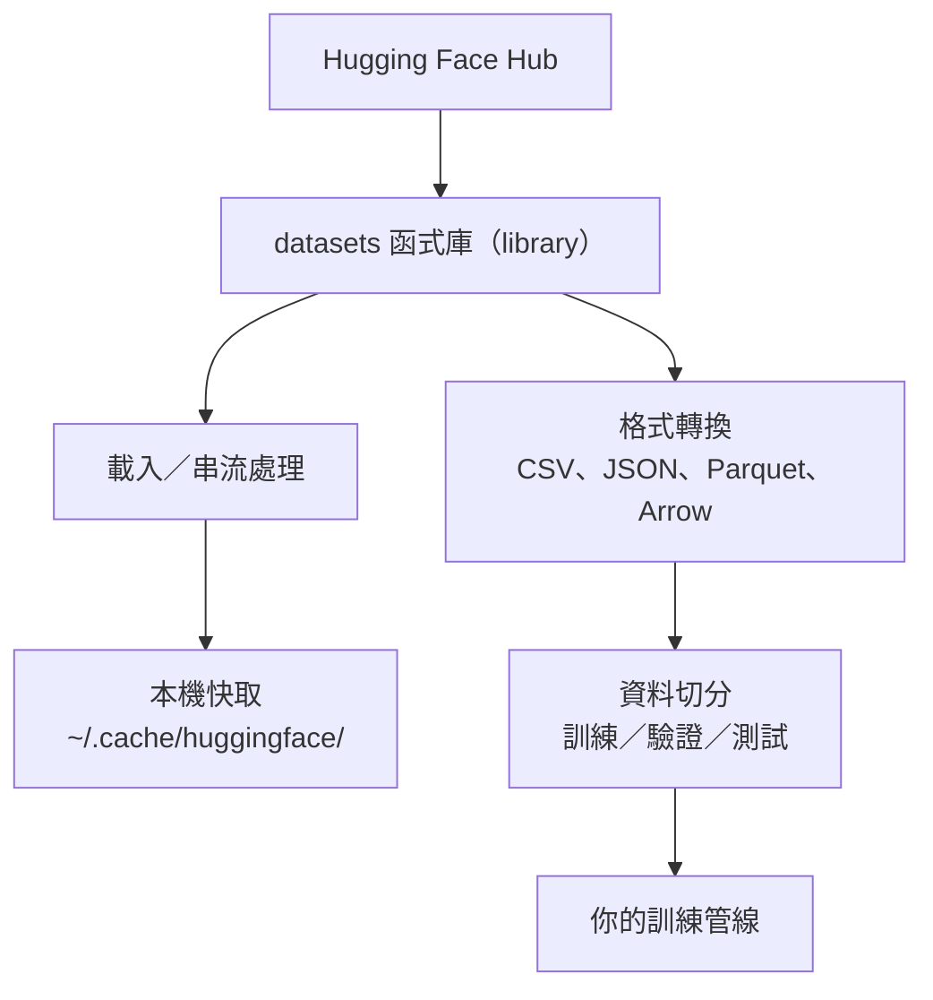

# 資料管理

> 資料（data）就是燃料；管理得好不好，決定你能跑多快。

**Type:** Build
**Language:** Python
**Prerequisites:** Phase 0, Lesson 01
**Time:** ~45 minutes

## Learning Objectives｜學習目標

- 使用 Hugging Face 的 `datasets` 函式庫（library）載入、串流（streaming）處理並快取（cache）資料集（dataset）
- 在 CSV、JSON、Parquet 和 Arrow 格式間轉換，並說明各格式的取捨
- 使用固定亂數種子（fixed random seed）建立可重現性（reproducibility）高的訓練／驗證／測試集切分（training/validation/test split）
- 使用 `.gitignore`、Git LFS 或 DVC 管理大型模型（model）與資料集檔案

## The Problem｜問題

每個 AI 專案（project）都從資料開始。你需要尋找資料集、下載資料、在不同格式間轉換、切分資料以供訓練和評估，並將資料集納入版本控制，讓實驗結果可重現。每次都手動處理既耗時又容易出錯；你需要一套可重複執行的流程。

## The Concept｜核心概念



Hugging Face 的 `datasets` 函式庫（library）是 AI 工作中載入資料的標準方式。它能直接處理下載、快取、格式轉換和串流。

```figure
s0-data-pipeline
```

## Build It｜動手實作

### 步驟 1：安裝 datasets 函式庫（library）

```bash
pip install datasets huggingface_hub
```

### 步驟 2：載入資料集

```python
from datasets import load_dataset

dataset = load_dataset("stanfordnlp/imdb")
print(dataset)
print(dataset["train"][0])
```

這會下載 IMDB 電影評論資料集。首次下載後，資料會從 `~/.cache/huggingface/datasets/` 快取載入。

### 步驟 3：串流大型資料集

有些資料集大到無法完整存放在磁碟上。串流會逐筆載入資料列，不必下載整份資料集。

```python
dataset = load_dataset("wikimedia/wikipedia", "20231101.en", split="train", streaming=True)

for i, example in enumerate(dataset):
    print(example["title"])
    if i >= 4:
        break
```

串流會產生 `IterableDataset`。資料列一到就能立即處理；無論資料集多大，記憶體（memory）用量都維持不變。

### 步驟 4：資料集格式

`datasets` 函式庫（library）底層使用 Apache Arrow。你可以依照管線需求轉換成其他格式。

```python
dataset = load_dataset("stanfordnlp/imdb", split="train")

dataset.to_csv("imdb_train.csv")
dataset.to_json("imdb_train.json")
dataset.to_parquet("imdb_train.parquet")
```

格式比較：

| 格式 | 大小 | 讀取速度 | 適用情境 |
|--------|------|-----------|----------|
| CSV | 大 | 慢 | 方便閱讀、試算表 |
| JSON | 大 | 慢 | API、巢狀資料 |
| Parquet | 小 | 快 | 分析、欄式查詢 |
| Arrow | 小 | 最快 | 記憶體內處理（in-memory processing；`datasets` 函式庫（library）使用的格式） |

AI 工作最適合用 Parquet 作為儲存格式。Arrow 則是你在記憶體中處理資料時使用的格式。CSV 和 JSON 適合用來交換資料。

### 步驟 5：切分資料集

每個機器學習專案都需要三種資料集切分：

- **訓練集（train）**：模型（model）從這份資料中學習（通常占 80%）
- **驗證集（validation）**：訓練期間用來檢查進度（通常占 10%）
- **測試集（test）**：訓練完成後用來做最終評估（通常占 10%）

有些資料集已預先切分；如果沒有，就自行切分：

```python
dataset = load_dataset("stanfordnlp/imdb", split="train")

split = dataset.train_test_split(test_size=0.2, seed=42)
train_val = split["train"].train_test_split(test_size=0.125, seed=42)

train_ds = train_val["train"]
val_ds = train_val["test"]
test_ds = split["test"]

print(f"Train: {len(train_ds)}, Val: {len(val_ds)}, Test: {len(test_ds)}")
```

務必設定亂數種子，確保結果可重現。同一個種子每次都會產生相同的資料集切分。

### 步驟 6：下載並快取模型（model）

模型（model）是大型檔案。`huggingface_hub` 函式庫（library）會負責下載並快取模型（model）。

```python
from huggingface_hub import hf_hub_download, snapshot_download

model_path = hf_hub_download(
    repo_id="sentence-transformers/all-MiniLM-L6-v2",
    filename="config.json"
)
print(f"Cached at: {model_path}")

model_dir = snapshot_download("sentence-transformers/all-MiniLM-L6-v2")
print(f"Full model at: {model_dir}")
```

模型（model）會快取到 `~/.cache/huggingface/hub/`。下載一次後，之後再次執行就能立即載入。

### 步驟 7：處理大型檔案

模型權重（model weights）和大型資料集不應放進 git。你有三種選擇：

**選項 A：.gitignore（最簡單）**

```
*.bin
*.safetensors
*.pt
*.onnx
data/*.parquet
data/*.csv
models/
```

**選項 B：Git LFS（在 git 中追蹤大型檔案）**

```bash
git lfs install
git lfs track "*.bin"
git lfs track "*.safetensors"
git add .gitattributes
```

Git LFS 會在儲存庫中存放指向實際檔案的參照，實際檔案則存放在另一台伺服器（server）上。GitHub 提供 1 GB 免費空間。

**選項 C：DVC（data version control，資料版本控制）**

```bash
pip install dvc
dvc init
dvc add data/training_set.parquet
git add data/training_set.parquet.dvc data/.gitignore
git commit -m "Track training data with DVC"
```

DVC 會建立小型 `.dvc` 檔案，指向你的資料。資料本身則存放在 S3、GCS 或其他遠端儲存後端（storage backend）。

| 方法 | 複雜度 | 適用情境 |
|----------|-----------|----------|
| .gitignore | 低 | 個人專案、可重新下載的資料 |
| Git LFS | 中 | 透過 git 分享模型（model）權重的團隊 |
| DVC | 高 | 可重現的實驗、大型資料集、團隊協作 |

本課程使用 `.gitignore` 就足夠。需要在不同電腦上重現完全相同的實驗時，再使用 DVC。

### 步驟 8：儲存方式

**本機儲存**適合小於約 10 GB 的資料集；Hugging Face 快取會自動處理。

**雲端儲存空間（cloud storage）**適合更大型，或需要在不同電腦間共用的資料：

```python
import os

local_path = os.path.expanduser("~/.cache/huggingface/datasets/")

# s3_path = "s3://my-bucket/datasets/"
# gcs_path = "gs://my-bucket/datasets/"
```

DVC 可直接整合 S3 和 GCS：

```bash
dvc remote add -d myremote s3://my-bucket/dvc-store
dvc push
```

本課程使用本機儲存即可。當你在遠端 GPU 執行個體上進行 fine-tuning 時，雲端儲存就會派上用場。

## 本課程使用的資料集

| 資料集 | 課程內容 | 大小 | 學習重點 |
|---------|---------|------|----------------|
| IMDB | tokenization、分類（classification） | 84 MB | 文字分類（text classification）基礎 |
| WikiText | 語言建模（language modeling） | 181 MB | next-token prediction |
| SQuAD | 問答（question answering） | 35 MB | 問答系統（QA systems）、文字片段 |
| Common Crawl（子集） | embedding | 不定 | 大規模文字處理（large-scale text processing） |
| MNIST | 視覺基礎 | 21 MB | 影像分類（image classification）基礎 |
| COCO（子集） | 多模態（multimodal） | 不定 | 圖文配對（image-text pairs） |

你現在不必下載所有資料集；每一課會說明需要哪些資料集。

## Use It｜實際應用

執行工具程式，確認一切正常：

```bash
python code/data_utils.py
```

這會下載一個小型資料集、轉換格式、切分資料，並列印摘要。

## Ship It｜交付成果

本課會產出：
- `code/data_utils.py`－可重複使用的資料載入與快取工具
- `outputs/prompt-data-helper.md`－協助依任務尋找合適資料集的 prompt

## Exercises｜練習

1. 使用 `mrpc` 設定載入 `glue` 資料集，並檢視前 5 筆範例
2. 串流 `c4` 資料集，計算 10 秒內能處理多少筆資料
3. 將資料集轉成 Parquet，並比較檔案大小與 CSV 的差異
4. 使用固定種子建立 70／15／15 的訓練／驗證／測試集切分，並確認各集大小

## Key Terms｜關鍵術語

| 術語 | 常見說法 | 實際意義 |
|------|----------------|----------------------|
| 資料集切分（dataset split） | 「訓練資料（training data）」 | 依機器學習生命週期的不同階段使用、具名子集（train／val／test） |
| 串流（streaming） | 「延遲載入」 | 從遠端來源逐列處理資料，不必下載整份資料集 |
| Parquet | 「壓縮過的 CSV」 | 針對分析查詢與儲存效率最佳化的欄式檔案格式（columnar file format） |
| Arrow | 「快速的 DataFrame」 | datasets 函式庫（library）在內部使用的記憶體內欄式格式，支援零複製讀取 |
| Git LFS | 「大型檔案版 git」 | 一種擴充功能（extension），會將大型檔案存放在 git 儲存庫之外，同時在版本控制中保留檔案參照 |
| DVC | 「資料版 git」 | 可與雲端儲存整合的資料集與模型（model）版本控制系統 |
| 快取（cache） | 「已經下載過」 | 先前取得資料的本機副本；預設（default）儲存在 ~/.cache/huggingface/ |
