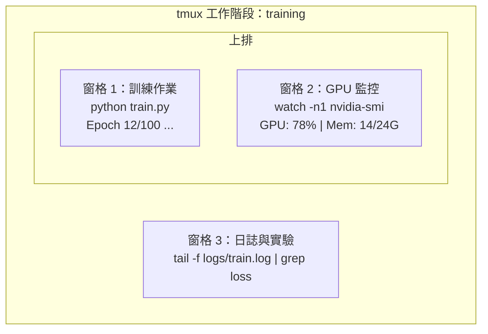

# 終端機與 Shell

> 終端機（terminal）是 AI 工程師的主場，趁早熟悉它。

**Type:** Learn
**Languages:** --
**Prerequisites:** Phase 0, Lesson 01
**Time:** ~35 minutes

## Learning Objectives｜學習目標

- 使用管線（pipe）、重新導向（redirect）和 `grep`，在命令列（command line）篩選並處理訓練（training）日誌
- 建立可持久保存、包含多個窗格（pane）的 tmux 工作階段（session），同時進行訓練與 GPU 監控
- 使用 `htop`、`nvtop` 和 `nvidia-smi` 監控系統與 GPU 資源
- 使用 SSH、`scp` 和 `rsync` 在本機與遠端機器間傳輸檔案

## The Problem｜問題

你在終端機裡花的時間會比在任何編輯器（editor）裡都多。訓練作業（training run）、GPU 監控、追蹤日誌、遠端 SSH 工作階段、環境管理——每個 AI 工作流程都離不開 shell。你在這裡慢，到處都慢。

本課只講 AI 工作真正用得上的終端機技能。不講 Unix 歷史，不深究 Bash 程式，只講你需要的東西。

## The Concept｜核心概念



三件事同時執行，只用一個終端機。你可以分離（detach）、下班回家、再用 SSH 連回來重新連接（reattach）。訓練會繼續跑。

```figure
s0-shell-pipeline
```

## Build It｜動手實作

### 步驟 1：認識你的 shell

查看你正在使用的 shell：

```bash
echo $SHELL
```

多數系統使用 `bash` 或 `zsh`，兩者都可以。本課程的指令在任一種 shell 都能執行。

需要知道的重點：

```bash
# Move around
cd ~/projects/ai-engineering-from-scratch
pwd
ls -la

# History search (most useful shortcut you'll learn)
# Ctrl+R then type part of a previous command
# Press Ctrl+R again to cycle through matches

# Clear terminal
clear   # or Ctrl+L

# Cancel a running command
# Ctrl+C

# Suspend a running command (resume with fg)
# Ctrl+Z
```

### 步驟 2：管線與重新導向

管線把指令串接起來。處理日誌、篩選輸出、串連工具都靠它，你會一直用到。

```bash
# Count how many times "loss" appears in a log
cat train.log | grep "loss" | wc -l

# Extract just the loss values from training output
grep "loss:" train.log | awk '{print $NF}' > losses.txt

# Watch a log file update in real time, filtering for errors
tail -f train.log | grep --line-buffered "ERROR"

# Sort experiments by final accuracy
grep "final_accuracy" results/*.log | sort -t= -k2 -n -r

# Redirect stdout and stderr to separate files
python train.py > output.log 2> errors.log

# Redirect both to the same file
python train.py > train_full.log 2>&1
```

你需要的三種重新導向：

| 符號 | 作用 |
|--------|-------------|
| `>` | 把標準輸出（stdout）寫入檔案（覆寫） |
| `>>` | 把標準輸出附加到檔案 |
| `2>` | 把標準錯誤（stderr）寫入檔案 |
| `2>&1` | 把標準錯誤送到與標準輸出相同的地方 |
| `\|` | 把一個指令的標準輸出，當作下一個指令的標準輸入（stdin） |

### 步驟 3：背景行程（process）

訓練動輒數小時，你不會想讓終端機一直開著。

```bash
# Run in background (output still goes to terminal)
python train.py &

# Run in background, immune to hangup (closing terminal won't kill it)
nohup python train.py > train.log 2>&1 &

# Check what's running in background
jobs
ps aux | grep train.py

# Bring a background job to foreground
fg %1

# Kill a background process
kill %1
# or find its PID and kill that
kill $(pgrep -f "train.py")
```

`&`、`nohup` 和 `screen`／`tmux` 的差異：

| 方式 | 關閉終端機後仍存活？ | 可重新連接？ |
|--------|-------------------------|---------------|
| `command &` | 否 | 否 |
| `nohup command &` | 是 | 否（查看日誌檔（log file）） |
| `screen` / `tmux` | 是 | 是 |

凡是超過幾分鐘的任務，就用 tmux。

### 步驟 4：tmux

tmux 讓你建立含多個窗格、可持久保存的終端機工作階段，是管理訓練作業最實用的工具。

```bash
# Install
# macOS
brew install tmux
# Ubuntu
sudo apt install tmux

# Start a named session
tmux new -s training

# Split horizontally
# Ctrl+B then "

# Split vertically
# Ctrl+B then %

# Navigate between panes
# Ctrl+B then arrow keys

# Detach (session keeps running)
# Ctrl+B then d

# Reattach
tmux attach -t training

# List sessions
tmux ls

# Kill a session
tmux kill-session -t training
```

典型的 AI 工作流程工作階段：

```bash
tmux new -s train

# Pane 1: start training
python train.py --epochs 100 --lr 1e-4

# Ctrl+B, " to split, then run GPU monitor
watch -n1 nvidia-smi

# Ctrl+B, % to split vertically, tail the logs
tail -f logs/experiment.log

# Now detach with Ctrl+B, d
# SSH out, go get coffee, come back
# tmux attach -t train
```

### 步驟 5：用 htop 和 nvtop 監控

```bash
# System processes (better than top)
htop

# GPU processes (if you have NVIDIA GPU)
# Install: sudo apt install nvtop (Ubuntu) or brew install nvtop (macOS)
nvtop

# Quick GPU check without nvtop
nvidia-smi

# Watch GPU usage update every second
watch -n1 nvidia-smi

# See which processes are using the GPU
nvidia-smi --query-compute-apps=pid,name,used_memory --format=csv
```

你會用到的 `htop` 按鍵：
- `F6` 或 `>` 依欄位排序（依記憶體（memory）排序可找出記憶體（memory）洩漏）
- `F5` 切換樹狀檢視（查看子行程）
- `F9` 終止行程
- `/` 搜尋行程名稱

### 步驟 6：用 SSH 連到遠端 GPU 機器

租用雲端 GPU（Lambda、RunPod、Vast.ai）時，你會透過 SSH 連線。

```bash
# Basic connection
ssh user@gpu-box-ip

# With a specific key
ssh -i ~/.ssh/my_gpu_key user@gpu-box-ip

# Copy files to remote
scp model.pt user@gpu-box-ip:~/models/

# Copy files from remote
scp user@gpu-box-ip:~/results/metrics.json ./

# Sync a whole directory (faster for many files)
rsync -avz ./data/ user@gpu-box-ip:~/data/

# Port forward (access remote Jupyter/TensorBoard locally)
ssh -L 8888:localhost:8888 user@gpu-box-ip
# Now open localhost:8888 in your browser

# SSH config for convenience
# Add to ~/.ssh/config:
# Host gpu
#     HostName 192.168.1.100
#     User ubuntu
#     IdentityFile ~/.ssh/gpu_key
#
# Then just:
# ssh gpu
```

### 步驟 7：AI 工作常用的別名

把這些加進你的 `~/.bashrc` 或 `~/.zshrc`：

```bash
source phases/00-setup-and-tooling/10-terminal-and-shell/code/shell_aliases.sh
```

或者只複製你要用的。幾個關鍵別名（alias）：

```bash
# GPU status at a glance
alias gpu='nvidia-smi --query-gpu=index,name,utilization.gpu,memory.used,memory.total,temperature.gpu --format=csv,noheader'

# Kill all Python training processes
alias killtraining='pkill -f "python.*train"'

# Quick virtual environment activate
alias ae='source .venv/bin/activate'

# Watch training loss
alias watchloss='tail -f logs/*.log | grep --line-buffered "loss"'
```

完整清單見 `code/shell_aliases.sh`。

### 步驟 8：常見的 AI 終端機用法

這些用法在實務中會不斷出現：

```bash
# Run training, log everything, notify when done
python train.py 2>&1 | tee train.log; echo "DONE" | mail -s "Training complete" you@email.com

# Compare two experiment logs side by side
diff <(grep "accuracy" exp1.log) <(grep "accuracy" exp2.log)

# Find the largest model files (clean up disk space)
find . -name "*.pt" -o -name "*.safetensors" | xargs du -h | sort -rh | head -20

# Download a model from Hugging Face
wget https://huggingface.co/model/resolve/main/model.safetensors

# Untar a dataset
tar xzf dataset.tar.gz -C ./data/

# Count lines in all Python files (see how big your project is)
find . -name "*.py" | xargs wc -l | tail -1

# Check disk space (training data fills disks fast)
df -h
du -sh ./data/*

# Environment variable check before training
env | grep -i cuda
env | grep -i torch
```

## Use It｜實際應用

以下是本課程中各工具派上用場的時機：

| 工具 | 使用時機 |
|------|----------------|
| tmux | 每次訓練作業（第 3 階段起） |
| `tail -f` + `grep` | 監控訓練（training）日誌 |
| `nohup` / `&` | 快速的背景任務 |
| `htop` / `nvtop` | 訓練變慢、OOM 錯誤時除錯 |
| SSH + `rsync` | 在雲端 GPU 上工作 |
| 管線 + 重新導向 | 處理實驗結果 |
| 別名 | 省下重複輸入指令的時間 |

## Exercises｜練習

1. 安裝 tmux，建立一個含三個窗格的工作階段：一個跑 `htop`、一個跑 `watch -n1 date`、一個跑 Python 程式檔案。分離後再重新連接。
2. 把 `code/shell_aliases.sh` 裡的別名加進你的 shell 設定檔，並用 `source ~/.zshrc`（或 `~/.bashrc`）重新載入。
3. 用 `for i in $(seq 1 100); do echo "epoch $i loss: $(echo "scale=4; 1/$i" | bc)"; sleep 0.1; done > fake_train.log` 建立一份假訓練（training）日誌，再用 `grep`、`tail` 和 `awk` 只擷取 loss 值。
4. 為一台你有權限存取的伺服器（server）設定一個 SSH config 項目（或用 `localhost` 練習語法）。

## Key Terms｜關鍵術語

| 術語 | 常見說法 | 實際意義 |
|------|----------------|----------------------|
| Shell | 「終端機」 | 直譯並執行你指令的程式（bash、zsh、fish） |
| tmux | 「終端機多工器（terminal multiplexer）」 | 讓你在一個視窗裡執行多個終端機工作階段，並可分離／重新連接的程式 |
| 管線（pipe） | 「那根直的線」 | `\|` 運算子，把一個指令的輸出送到另一個指令當輸入 |
| PID | 「Process ID」 | 指派給每個執行中行程的唯一編號，用於監控或終止行程 |
| nohup | 「No hangup」 | 讓指令不受掛斷訊號（hangup signal）影響，關閉終端機也不會終止它 |
| SSH | 「連到伺服器（server）」 | Secure Shell，用於在遠端機器上執行指令的加密協定 |
