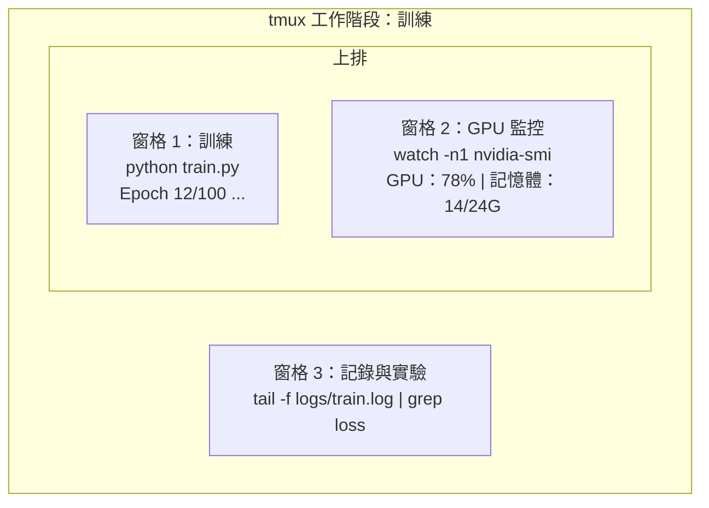

# 終端機與 Shell

> 終端機是 AI 工程師的工作基地，熟悉它就對了。

**Type:** Learn
**Languages:** --
**Prerequisites:** Phase 0, Lesson 01
**Time:** ~35 minutes

## Learning Objectives

- 使用管線、重新導向和 `grep`，從命令列篩選及處理訓練記錄
- 建立有多個窗格的持續性 tmux 工作階段，同時執行訓練並監控 GPU
- 使用 `htop`、`nvtop` 和 `nvidia-smi` 監控系統與 GPU 資源
- 使用 SSH、`scp` 和 `rsync` 在本機與遠端機器之間傳輸檔案

## The Problem｜問題

你待在終端機裡的時間會比任何編輯器都長。執行訓練、監控 GPU、追蹤記錄、建立遠端 SSH 連線、管理環境，AI 工作流程的每個環節都會用到 Shell。終端機操作慢，整體工作就會慢。

本課程會介紹 AI 工作真正用得上的終端機技巧。不講 Unix 歷史，也不深入 Bash 指令碼，只教你實際需要的內容。

## The Concept｜核心概念



一個終端機就能同時執行三項工作。你可以先離開，再透過 SSH 連回來並重新接上工作階段，訓練會持續執行。

```figure
s0-shell-pipeline
```

## Build It｜動手打造

### 步驟 1：認識你的 Shell

查看目前使用的 Shell：

```bash
echo $SHELL
```

大多數系統使用 `bash` 或 `zsh`，兩者都很好用。本課程中的命令都能在這兩種 Shell 中執行。

常用基本操作：

```bash
# Move around
cd ~/projects/ai-engineering-from-scratch
pwd
ls -la

# History search (most useful shortcut you'll learn)
# Ctrl+R then type part of a previous command
# Press Ctrl+R again to cycle through matches

# Clear terminal
clear   # or Ctrl+L

# Cancel a running command
# Ctrl+C

# Suspend a running command (resume with fg)
# Ctrl+Z
```

### 步驟 2：管線與重新導向

管線會把多個命令串接起來。你可以用它處理記錄、篩選輸出及串接工具，日常會經常用到。

```bash
# Count how many times "loss" appears in a log
cat train.log | grep "loss" | wc -l

# Extract just the loss values from training output
grep "loss:" train.log | awk '{print $NF}' > losses.txt

# Watch a log file update in real time, filtering for errors
tail -f train.log | grep --line-buffered "ERROR"

# Sort experiments by final accuracy
grep "final_accuracy" results/*.log | sort -t= -k2 -n -r

# Redirect stdout and stderr to separate files
python train.py > output.log 2> errors.log

# Redirect both to the same file
python train.py > train_full.log 2>&1
```

你需要認識這幾種重新導向符號：

| 符號 | 功能 |
|--------|-------------|
| `>` | 將標準輸出寫入檔案（覆寫） |
| `>>` | 將標準輸出附加到檔案末尾 |
| `2>` | 將標準錯誤寫入檔案 |
| `2>&1` | 將標準錯誤傳送到標準輸出的相同位置 |
| `\|` | 將一個命令的標準輸出送給下一個命令，作為標準輸入 |

### 步驟 3：背景程序

訓練可能會跑好幾個小時，你不會想整段時間都讓終端機保持開啟。

```bash
# Run in background (output still goes to terminal)
python train.py &

# Run in background, immune to hangup (closing terminal won't kill it)
nohup python train.py > train.log 2>&1 &

# Check what's running in background
jobs
ps aux | grep train.py

# Bring a background job to foreground
fg %1

# Kill a background process
kill %1
# or find its PID and kill that
kill $(pgrep -f "train.py")
```

`&`、`nohup` 和 `screen`／`tmux` 的差異：

| 方法 | 關閉終端機後會繼續執行？ | 可以重新連回去？ |
|--------|-------------------------|---------------|
| `command &` | 否 | 否 |
| `nohup command &` | 是 | 否（查看記錄檔） |
| `screen`／`tmux` | 是 | 是 |

工作時間超過幾分鐘，就使用 tmux。

### 步驟 4：tmux

tmux 能建立持續運作且包含多個窗格的終端機工作階段，是管理訓練工作的最好用工具。

```bash
# Install
# macOS
brew install tmux
# Ubuntu
sudo apt install tmux

# Start a named session
tmux new -s training

# Split horizontally
# Ctrl+B then "

# Split vertically
# Ctrl+B then %

# Navigate between panes
# Ctrl+B then arrow keys

# Detach (session keeps running)
# Ctrl+B then d

# Reattach
tmux attach -t training

# List sessions
tmux ls

# Kill a session
tmux kill-session -t training
```

典型的 AI 工作階段：

```bash
tmux new -s train

# Pane 1: start training
python train.py --epochs 100 --lr 1e-4

# Ctrl+B, " to split, then run GPU monitor
watch -n1 nvidia-smi

# Ctrl+B, % to split vertically, tail the logs
tail -f logs/experiment.log

# Now detach with Ctrl+B, d
# SSH out, go get coffee, come back
# tmux attach -t train
```

### 步驟 5：使用 htop 和 nvtop 監控

```bash
# System processes (better than top)
htop

# GPU processes (if you have NVIDIA GPU)
# Install: sudo apt install nvtop (Ubuntu) or brew install nvtop (macOS)
nvtop

# Quick GPU check without nvtop
nvidia-smi

# Watch GPU usage update every second
watch -n1 nvidia-smi

# See which processes are using the GPU
nvidia-smi --query-compute-apps=pid,name,used_memory --format=csv
```

常用的 `htop` 快捷鍵：
- `F6` 或 `>`：依欄位排序（可依記憶體排序，找出記憶體洩漏）
- `F5`：切換樹狀檢視（查看子程序）
- `F9`：結束程序
- `/`：搜尋程序名稱

### 步驟 6：透過 SSH 連線到遠端 GPU 主機

租用雲端 GPU（Lambda、RunPod、Vast.ai）時，可以透過 SSH 連線。

```bash
# Basic connection
ssh user@gpu-box-ip

# With a specific key
ssh -i ~/.ssh/my_gpu_key user@gpu-box-ip

# Copy files to remote
scp model.pt user@gpu-box-ip:~/models/

# Copy files from remote
scp user@gpu-box-ip:~/results/metrics.json ./

# Sync a whole directory (faster for many files)
rsync -avz ./data/ user@gpu-box-ip:~/data/

# Port forward (access remote Jupyter/TensorBoard locally)
ssh -L 8888:localhost:8888 user@gpu-box-ip
# Now open localhost:8888 in your browser

# SSH config for convenience
# Add to ~/.ssh/config:
# Host gpu
#     HostName 192.168.1.100
#     User ubuntu
#     IdentityFile ~/.ssh/gpu_key
#
# Then just:
# ssh gpu
```

### 步驟 7：AI 工作常用的別名

將以下內容加入 `~/.bashrc` 或 `~/.zshrc`：

```bash
source phases/00-setup-and-tooling/10-terminal-and-shell/code/shell_aliases.sh
```

也可以只複製需要的別名：

```bash
# GPU status at a glance
alias gpu='nvidia-smi --query-gpu=index,name,utilization.gpu,memory.used,memory.total,temperature.gpu --format=csv,noheader'

# Kill all Python training processes
alias killtraining='pkill -f "python.*train"'

# Quick virtual environment activate
alias ae='source .venv/bin/activate'

# Watch training loss
alias watchloss='tail -f logs/*.log | grep --line-buffered "loss"'
```

完整清單請見 `code/shell_aliases.sh`。

### 步驟 8：常見的 AI 終端機操作

實際工作中經常會用到以下操作：

```bash
# Run training, log everything, notify when done
python train.py 2>&1 | tee train.log; echo "DONE" | mail -s "Training complete" you@email.com

# Compare two experiment logs side by side
diff <(grep "accuracy" exp1.log) <(grep "accuracy" exp2.log)

# Find the largest model files (clean up disk space)
find . -name "*.pt" -o -name "*.safetensors" | xargs du -h | sort -rh | head -20

# Download a model from Hugging Face
wget https://huggingface.co/model/resolve/main/model.safetensors

# Untar a dataset
tar xzf dataset.tar.gz -C ./data/

# Count lines in all Python files (see how big your project is)
find . -name "*.py" | xargs wc -l | tail -1

# Check disk space (training data fills disks fast)
df -h
du -sh ./data/*

# Environment variable check before training
env | grep -i cuda
env | grep -i torch
```

## Use It｜開始使用

本課程期間，這些工具會在下列情境派上用場：

| 工具 | 使用時機 |
|------|----------------|
| tmux | 每次執行訓練時（第 3 階段起） |
| `tail -f` + `grep` | 監看訓練記錄 |
| `nohup`／`&` | 快速執行背景工作 |
| `htop`／`nvtop` | 除錯訓練緩慢和記憶體不足錯誤 |
| SSH + `rsync` | 在雲端 GPU 上工作 |
| 管線與重新導向 | 處理實驗結果 |
| 別名 | 節省重複操作的時間 |

## Exercises｜練習

1. 安裝 tmux，建立有三個窗格的工作階段；在其中一個窗格執行 `htop`，另一個執行 `watch -n1 date`，第三個執行 Python 指令碼。接著離開並重新連回工作階段。
2. 將 `code/shell_aliases.sh` 中的別名加入 Shell 設定檔，並執行 `source ~/.zshrc`（或 `~/.bashrc`）重新載入。
3. 使用 `for i in $(seq 1 100); do echo "epoch $i loss: $(echo "scale=4; 1/$i" | bc)"; sleep 0.1; done > fake_train.log` 建立模擬訓練記錄，再用 `grep`、`tail` 和 `awk` 擷取損失值。
4. 為你能存取的伺服器設定 SSH 設定檔項目；也可以用 `localhost` 練習語法。

## Key Terms｜重要詞彙

| 詞彙 | 一般說法 | 實際意義 |
|------|----------------|----------------------|
| Shell | 「終端機」 | 解讀命令的程式（bash、zsh、fish） |
| tmux | 「終端機多工器」 | 在同一個視窗中執行多個終端機工作階段，並可離開或重新連回的程式 |
| 管線（Pipe） | 「那個直線符號」 | `\|` 運算子，將一個命令的輸出傳給另一個命令，作為輸入 |
| PID | 「程序 ID」 | 指派給每個執行中程序的唯一編號，可用來監控或結束程序 |
| nohup | 「不掛斷」 | 讓命令不受掛斷訊號影響，因此關閉終端機也不會讓它停止 |
| SSH | 「連線到伺服器」 | Secure Shell（安全殼層）：用來在遠端機器執行命令的加密通訊協定 |
