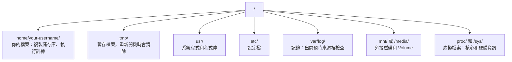

# Linux 與 AI

> 多數 AI 工作都在 Linux 上執行。你至少要熟悉到不會卡住。

**Type:** Learn
**Languages:** --
**Prerequisites:** Phase 0, Lesson 01
**Time:** ~30 minutes

## Learning Objectives

- 瀏覽 Linux 檔案系統，並從命令列執行必要的檔案操作
- 使用 `chmod` 和 `chown` 管理檔案權限，解決「Permission denied」錯誤
- 使用 `apt` 安裝系統套件，並設定全新的 GPU 主機以進行 AI 工作
- 辨識 macOS 與 Linux 的常見差異，避免在遠端機器上工作時踩雷

## The Problem｜問題

你在 macOS 或 Windows 上開發，但只要透過 SSH 連上雲端 GPU 主機、租用 Lambda 執行個體，或啟動 EC2 機器，就會進入 Ubuntu。終端機是你唯一的操作介面，沒有 Finder、檔案總管或圖形介面。如果你無法從命令列瀏覽檔案系統、安裝套件和管理程序，就只能一邊付閒置 GPU 的費用，一邊搜尋「如何在 Linux 解壓縮檔案」。

這是一份生存指南，內容只涵蓋在遠端 Linux 機器上進行 AI 工作所需的操作，不多不少。

## 檔案系統配置

Linux 以單一根目錄 `/` 為起點來整理所有內容。它沒有 `C:\` 或 `/Volumes`。你實際上會用到的目錄如下：



家目錄路徑是 `~` 或 `/home/your-username`，幾乎所有工作都會在這裡進行。

## Essential Commands｜必要命令

以下 15 個命令涵蓋你在遠端 GPU 主機上 95% 的操作。

### 瀏覽目錄

```bash
pwd                         # Where am I?
ls                          # What's here?
ls -la                      # What's here, including hidden files with details?
cd /path/to/dir             # Go there
cd ~                        # Go home
cd ..                       # Go up one level
```

### 檔案和目錄

```bash
mkdir my-project            # Create a directory
mkdir -p a/b/c              # Create nested directories in one shot

cp file.txt backup.txt      # Copy a file
cp -r src/ src-backup/      # Copy a directory (recursive)

mv old.txt new.txt          # Rename a file
mv file.txt /tmp/           # Move a file

rm file.txt                 # Delete a file (no trash, it's gone)
rm -rf my-dir/              # Delete a directory and everything inside
```

`rm -rf` 會永久刪除檔案，無法還原。按下 Enter 前，請再次確認路徑。

### 讀取檔案

```bash
cat file.txt                # Print entire file
head -20 file.txt           # First 20 lines
tail -20 file.txt           # Last 20 lines
tail -f log.txt             # Follow a log file in real time (Ctrl+C to stop)
less file.txt               # Scroll through a file (q to quit)
```

### 搜尋

```bash
grep "error" training.log           # Find lines containing "error"
grep -r "learning_rate" .           # Search all files in current directory
grep -i "cuda" config.yaml          # Case-insensitive search

find . -name "*.py"                 # Find all Python files under current dir
find . -name "*.ckpt" -size +1G     # Find checkpoint files larger than 1GB
```

## 權限

Linux 中的每個檔案都有擁有者和權限位元。當指令碼無法執行，或你無法寫入目錄時，就會遇到權限問題。

```bash
ls -l train.py
# -rwxr-xr-- 1 user group 2048 Mar 19 10:00 train.py
#  ^^^             owner permissions: read, write, execute
#     ^^^          group permissions: read, execute
#        ^^        everyone else: read only
```

常見的修正方式：

```bash
chmod +x train.sh           # Make a script executable
chmod 755 deploy.sh         # Owner: full, others: read+execute
chmod 644 config.yaml       # Owner: read+write, others: read only

chown user:group file.txt   # Change who owns a file (needs sudo)
```

出現「Permission denied」時，幾乎都是權限問題。多數情況下，使用 `chmod +x` 或 `sudo` 就能解決。

## 套件管理（apt）

Ubuntu 使用 `apt` 安裝系統層級的軟體。

```bash
sudo apt update             # Refresh the package list (always do this first)
sudo apt install -y htop    # Install a package (-y skips confirmation)
sudo apt install -y build-essential  # C compiler, make, etc. Needed by many Python packages
sudo apt install -y tmux    # Terminal multiplexer (keep sessions alive after disconnect)

apt list --installed        # What's installed?
sudo apt remove htop        # Uninstall
```

全新 GPU 主機常用的套件：

```bash
sudo apt update && sudo apt install -y \
    build-essential \
    git \
    curl \
    wget \
    tmux \
    htop \
    unzip \
    python3-venv
```

## 使用者與 sudo

你通常會以一般使用者身分登入。有些操作需要 root（管理員）權限。

```bash
whoami                      # What user am I?
sudo command                # Run a single command as root
sudo su                     # Become root (exit to go back, use sparingly)
```

雲端 GPU 執行個體通常只有你一位使用者，而且已經有 sudo 權限。不要把所有操作都用 root 執行，只在需要時使用 sudo。

## 程序與 systemd

訓練停住或你需要確認目前正在執行什麼時，可以使用以下命令：

```bash
htop                        # Interactive process viewer (q to quit)
ps aux | grep python        # Find running Python processes
kill 12345                  # Gracefully stop process with PID 12345
kill -9 12345               # Force kill (use when graceful doesn't work)
nvidia-smi                  # GPU processes and memory usage
```

systemd 負責管理服務（背景常駐程式）。執行推論伺服器時可能會用到：

```bash
sudo systemctl start nginx          # Start a service
sudo systemctl stop nginx           # Stop it
sudo systemctl restart nginx        # Restart it
sudo systemctl status nginx         # Check if it's running
sudo systemctl enable nginx         # Start automatically on boot
```

## 磁碟空間

GPU 主機的磁碟空間通常有限，模型和資料集很快就會把磁碟塞滿。

```bash
df -h                       # Disk usage for all mounted drives
df -h /home                 # Disk usage for /home specifically

du -sh *                    # Size of each item in current directory
du -sh ~/.cache             # Size of your cache (pip, huggingface models land here)
du -sh /data/checkpoints/   # Check how big your checkpoints are

# Find the biggest space hogs
du -h --max-depth=1 / 2>/dev/null | sort -hr | head -20
```

常見的空間整理方式：

```bash
# Clear pip cache
pip cache purge

# Clear apt cache
sudo apt clean

# Remove old checkpoints you don't need
rm -rf checkpoints/epoch_01/ checkpoints/epoch_02/
```

## 網路

你會從命令列下載模型、傳輸檔案和呼叫 API。

```bash
# Download files
wget https://example.com/model.bin                   # Download a file
curl -O https://example.com/data.tar.gz              # Same thing with curl
curl -s https://api.example.com/health | python3 -m json.tool  # Hit an API, pretty-print JSON

# Transfer files between machines
scp model.bin user@remote:/data/                     # Copy file to remote machine
scp user@remote:/data/results.csv .                  # Copy file from remote to local
scp -r user@remote:/data/checkpoints/ ./local-dir/   # Copy directory

# Sync directories (faster than scp for large transfers, resumes on failure)
rsync -avz --progress ./data/ user@remote:/data/
rsync -avz --progress user@remote:/results/ ./results/
```

傳輸大型檔案時，請用 `rsync` 取代 `scp`。它只會傳送變更過的位元組，連線中斷後也能接著傳。

## tmux：讓工作階段持續執行

透過 SSH 連上遠端主機時，關閉筆電會中斷訓練工作。tmux 可以避免這種情況。

```bash
tmux new -s train           # Start a new session named "train"
# ... start your training, then:
# Ctrl+B, then D            # Detach (training keeps running)

tmux ls                     # List sessions
tmux attach -t train        # Reattach to session

# Inside tmux:
# Ctrl+B, then %            # Split pane vertically
# Ctrl+B, then "            # Split pane horizontally
# Ctrl+B, then arrow keys   # Switch between panes
```

長時間訓練務必在 tmux 中執行，務必如此。

## Windows 使用者的 WSL2

如果你使用 Windows，WSL2 可以讓你不必安裝雙系統，就能使用真正的 Linux 環境。

```bash
# In PowerShell (admin)
wsl --install -d Ubuntu-24.04

# After restart, open Ubuntu from Start menu
sudo apt update && sudo apt upgrade -y
```

WSL2 執行真正的 Linux 核心。本課程介紹的所有內容都能在其中使用。從 WSL 開啟 Windows 檔案時，路徑會是 `/mnt/c/Users/YourName/`。

GPU 直通功能需要在 Windows 端安裝 NVIDIA 驅動程式。請安裝 Windows 版 NVIDIA 驅動程式（不要安裝 Linux 版），CUDA 就能在 WSL2 中使用。

## macOS 轉換到 Linux 時的注意事項

從 macOS 轉到 Linux 時，以下差異可能會讓你踩雷：

| macOS | Linux | 說明 |
|-------|-------|-------|
| `brew install` | `sudo apt install` | 有時套件名稱不同。`brew install htop` 和 `sudo apt install htop` 用法相同，但 `brew install readline` 和 `sudo apt install libreadline-dev` 就不同。 |
| `open file.txt` | `xdg-open file.txt` | 遠端主機通常沒有圖形介面，請改用 `cat` 或 `less`。 |
| `pbcopy`／`pbpaste` | 無法使用 | 透過 SSH 無法直接存取本機剪貼簿。 |
| `~/.zshrc` | `~/.bashrc` | macOS 預設使用 zsh，多數 Linux 伺服器使用 bash。 |
| `/opt/homebrew/` | `/usr/bin/`、`/usr/local/bin/` | 執行檔所在的位置不同。 |
| `sed -i '' 's/a/b/' file` | `sed -i 's/a/b/' file` | macOS 的 sed 在 `-i` 後需要空字串，Linux 則不需要。 |
| 不區分大小寫的檔案系統 | 區分大小寫的檔案系統 | Linux 上的 `Model.py` 和 `model.py` 是兩個不同檔案。 |
| 行尾 `\n` | 行尾 `\n` | 兩者相同；但 Windows 使用 `\r\n`，會讓 Bash 指令碼出問題。可用 `dos2unix` 修正。 |

## 快速參考

```text
瀏覽：           pwd, ls, cd, find
檔案：           cp, mv, rm, mkdir, cat, head, tail, less
搜尋：           grep, find
權限：           chmod, chown, sudo
套件：           apt update, apt install
程序：           htop, ps, kill, nvidia-smi
服務：           systemctl start/stop/restart/status
磁碟：           df -h, du -sh
網路：           curl, wget, scp, rsync
工作階段：       tmux new/attach/detach
```

```figure
s0-process-fork
```

## Exercises｜練習

1. SSH 連線到任一 Linux 機器（或開啟 WSL2），前往家目錄並建立一個專案資料夾，再於其中建立三個空白檔案，最後用 `ls -la` 列出檔案。
2. 使用 apt 安裝並執行 `htop`，找出目前使用最多記憶體的程序。
3. 開啟 tmux 工作階段，在其中執行 `sleep 300`，接著離開工作階段、列出工作階段，再重新連回去。
4. 使用 `df -h` 查看可用磁碟空間，再用 `du -sh ~/.cache/*` 找出快取中占用空間的項目。
5. 使用 `scp` 將本機檔案傳到遠端機器，再用 `rsync` 傳送同一個檔案，比較兩者的使用體驗。
