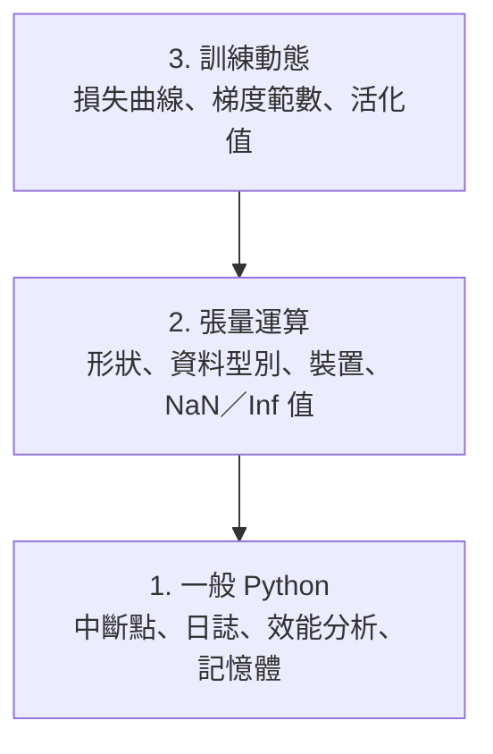

# 除錯與效能分析

> 最糟的 AI 錯誤不會讓程式崩潰，而是默默用錯誤資料訓練，最後還呈現一條漂亮的損失曲線。

**Type:** Build
**Language:** Python
**Prerequisites:** Lesson 1 (Dev Environment), basic PyTorch familiarity
**Time:** ~60 minutes

## Learning Objectives

- 使用條件式 `breakpoint()` 和 `debug_print`，在訓練途中檢查張量形狀、資料型別和 NaN 值
- 使用 `cProfile`、`line_profiler` 和 `tracemalloc` 分析訓練迴圈，找出效能瓶頸
- 偵測常見的 AI 錯誤：形狀不符、損失值為 NaN、資料洩漏，以及張量裝置錯誤
- 設定 TensorBoard，視覺化損失曲線、權重直方圖和梯度分布

## The Problem｜問題

AI 程式出錯的方式和一般程式不同。網頁應用程式出錯時會印出堆疊追蹤；設定錯誤的訓練迴圈卻可能執行 8 小時、耗掉 200 美元的 GPU 時間，最後產生一個不論輸入為何都只預測平均值的模型。程式從未報錯，問題可能是張量放在錯誤的裝置、忘了呼叫 `.detach()`，或標籤資料洩漏到特徵中。

你需要除錯工具，在這些無聲的錯誤浪費時間和運算資源之前就把它們抓出來。

## The Concept｜核心概念

AI 除錯分成三個層次：



多數人會直接跳到第 3 層（盯著 TensorBoard 看），但 80% 的 AI 錯誤其實都在第 1、2 層。

```figure
s0-flame-hot
```

## Build It｜動手打造

### Part 1：列印除錯（是的，行得通）

列印除錯常被人看輕，其實不該如此。處理張量程式碼時，有目標地列印資訊往往比逐步操作除錯器更有效，因為你需要同時查看形狀、資料型別和值的範圍。

```python
def debug_print(name, tensor):
    print(f"{name}: shape={tensor.shape}, dtype={tensor.dtype}, "
          f"device={tensor.device}, "
          f"min={tensor.min().item():.4f}, max={tensor.max().item():.4f}, "
          f"mean={tensor.mean().item():.4f}, "
          f"has_nan={tensor.isnan().any().item()}")
```

每遇到可疑的運算就呼叫這個函式。找到錯誤後，再移除列印指令，就這麼簡單。

### Part 2：Python 除錯器（pdb 和 breakpoint）

內建除錯器在 AI 工作中常被低估。把 `breakpoint()` 加進訓練迴圈，就能互動式檢查張量。

```python
def training_step(model, batch, criterion, optimizer):
    inputs, labels = batch
    outputs = model(inputs)
    loss = criterion(outputs, labels)

    if loss.item() > 100 or torch.isnan(loss):
        breakpoint()

    loss.backward()
    optimizer.step()
```

除錯器停下來後，可以使用以下命令：

- 使用 `p outputs.shape` 檢查形狀
- 使用 `p loss.item()` 查看損失值
- 使用 `p torch.isnan(outputs).sum()` 計算 NaN 的數量
- 使用 `p model.fc1.weight.grad` 檢查梯度
- 使用 `c` 繼續，或使用 `q` 離開

這種方式稱為條件式除錯，只有出現異常時才會停下來。對執行 10,000 步的訓練來說，這點很重要。

### Part 3：Python 日誌

除錯不再只是快速檢查時，就改用 logging 取代 print。

```python
import logging

logging.basicConfig(
    level=logging.INFO,
    format="%(asctime)s [%(levelname)s] %(message)s",
    handlers=[
        logging.FileHandler("training.log"),
        logging.StreamHandler()
    ]
)
logger = logging.getLogger(__name__)

logger.info("Starting training: lr=%.4f, batch_size=%d", lr, batch_size)
logger.warning("Loss spike detected: %.4f at step %d", loss.item(), step)
logger.error("NaN loss at step %d, stopping", step)
```

日誌會記錄時間戳記、嚴重程度，並可輸出到檔案。訓練在凌晨 3 點失敗時，你會需要日誌檔，而不是早已捲出螢幕的終端機輸出。

### Part 4：測量程式區段的執行時間

先找出時間花在哪裡，才能開始最佳化。

```python
import time

class Timer:
    def __init__(self, name=""):
        self.name = name

    def __enter__(self):
        self.start = time.perf_counter()
        return self

    def __exit__(self, *args):
        elapsed = time.perf_counter() - self.start
        print(f"[{self.name}] {elapsed:.4f}s")

with Timer("data loading"):
    batch = next(dataloader_iter)

with Timer("forward pass"):
    outputs = model(batch)

with Timer("backward pass"):
    loss.backward()
```

常見的分析結果是：資料載入占了訓練時間的 60%。解法是在 DataLoader 中設定 `num_workers > 0`，而不是換一張更快的 GPU。

### Part 5：cProfile 和 line_profiler

如果手動計時還不夠，可以使用以下工具：

```bash
python -m cProfile -s cumtime train.py
```

這會依累計時間排序，列出每個函式呼叫。若要逐行分析效能：

```bash
pip install line_profiler
```

```python
@profile
def train_step(model, data, target):
    output = model(data)
    loss = F.cross_entropy(output, target)
    loss.backward()
    return loss

# Run with: kernprof -l -v train.py
```

### Part 6：記憶體分析

#### 使用 tracemalloc 分析 CPU 記憶體

```python
import tracemalloc

tracemalloc.start()

# your code here
model = build_model()
data = load_dataset()

snapshot = tracemalloc.take_snapshot()
top_stats = snapshot.statistics("lineno")
for stat in top_stats[:10]:
    print(stat)
```

#### 使用 memory_profiler 分析 CPU 記憶體

```bash
pip install memory_profiler
```

```python
from memory_profiler import profile

@profile
def load_data():
    raw = read_csv("data.csv")       # watch memory jump here
    processed = preprocess(raw)       # and here
    return processed
```

執行 `python -m memory_profiler your_script.py`，即可逐行查看記憶體用量。

#### 使用 PyTorch 分析 GPU 記憶體

```python
import torch

if torch.cuda.is_available():
    print(torch.cuda.memory_summary())

    print(f"Allocated: {torch.cuda.memory_allocated() / 1e9:.2f} GB")
    print(f"Cached: {torch.cuda.memory_reserved() / 1e9:.2f} GB")
```

遇到 OOM（記憶體不足）時：

1. 降低批次大小（永遠先試這個）
2. 使用 `torch.cuda.empty_cache()` 釋放快取記憶體
3. 對大型中間張量先使用 `del tensor`，再呼叫 `torch.cuda.empty_cache()`
4. 使用混合精度（`torch.cuda.amp`），將記憶體用量減半
5. 對非常深的模型使用梯度檢查點

### Part 7：常見的 AI 錯誤與偵測方式

#### 形狀不符

這是最常見的錯誤。模型預期的張量形狀是 `[batch, channels, height, width]`，實際拿到的卻是 `[batch, features]`。

```python
def check_shapes(model, sample_input):
    print(f"Input: {sample_input.shape}")
    hooks = []

    def make_hook(name):
        def hook(module, inp, out):
            in_shape = inp[0].shape if isinstance(inp, tuple) else inp.shape
            out_shape = out.shape if hasattr(out, "shape") else type(out)
            print(f"  {name}: {in_shape} -> {out_shape}")
        return hook

    for name, module in model.named_modules():
        hooks.append(module.register_forward_hook(make_hook(name)))

    with torch.no_grad():
        model(sample_input)

    for h in hooks:
        h.remove()
```

用一個範例批次執行一次，就能列出模型中每個形狀變化。

#### 損失值為 NaN

損失值變成 NaN，代表某個數值發散了。常見原因如下：

- 學習率過高
- 自訂損失函式中發生除以零
- 對零或負數取對數
- RNN 中的梯度爆炸

```python
def detect_nan(model, loss, step):
    if torch.isnan(loss):
        print(f"NaN loss at step {step}")
        for name, param in model.named_parameters():
            if param.grad is not None:
                if torch.isnan(param.grad).any():
                    print(f"  NaN gradient in {name}")
                if torch.isinf(param.grad).any():
                    print(f"  Inf gradient in {name}")
        return True
    return False
```

#### 資料洩漏

模型在測試集上的準確率達到 99%。看起來很棒，但這可能是錯誤。

```python
def check_data_leakage(train_set, test_set, id_column="id"):
    train_ids = set(train_set[id_column].tolist())
    test_ids = set(test_set[id_column].tolist())
    overlap = train_ids & test_ids
    if overlap:
        print(f"DATA LEAKAGE: {len(overlap)} samples in both train and test")
        return True
    return False
```

也要檢查時間洩漏，也就是用未來資料預測過去。切分資料前，先依時間戳記排序。

#### 裝置錯誤

張量位於不同裝置（CPU 和 GPU）時會造成執行階段錯誤。但有時某個張量會悄悄留在 CPU，其他張量都在 GPU，結果只是讓訓練變慢。

```python
def check_devices(model, *tensors):
    model_device = next(model.parameters()).device
    print(f"Model device: {model_device}")
    for i, t in enumerate(tensors):
        if t.device != model_device:
            print(f"  WARNING: tensor {i} on {t.device}, model on {model_device}")
```

### Part 8：TensorBoard 基礎

TensorBoard 能呈現訓練過程中隨時間發生的變化。

```bash
pip install tensorboard
```

```python
from torch.utils.tensorboard import SummaryWriter

writer = SummaryWriter("runs/experiment_1")

for step in range(num_steps):
    loss = train_step(model, batch)

    writer.add_scalar("loss/train", loss.item(), step)
    writer.add_scalar("lr", optimizer.param_groups[0]["lr"], step)

    if step % 100 == 0:
        for name, param in model.named_parameters():
            writer.add_histogram(f"weights/{name}", param, step)
            if param.grad is not None:
                writer.add_histogram(f"grads/{name}", param.grad, step)

writer.close()
```

啟動 TensorBoard：

```bash
tensorboard --logdir=runs
```

觀察重點：

- **損失沒有下降**：學習率太低，或模型架構有問題
- **損失劇烈震盪**：學習率太高
- **損失變成 NaN**：數值不穩定（請參閱上方的 NaN 說明）
- **訓練損失下降，驗證損失上升**：過度擬合
- **權重直方圖逐漸集中在零附近**：梯度消失
- **梯度直方圖數值暴增**：需要梯度裁剪

### Part 9：VS Code 除錯器

若要互動式除錯，請在 VS Code 設定 `launch.json`：

```json
{
    "version": "0.2.0",
    "configurations": [
        {
            "name": "Debug Training",
            "type": "debugpy",
            "request": "launch",
            "program": "${file}",
            "console": "integratedTerminal",
            "justMyCode": false
        }
    ]
}
```

按一下編輯器左側的邊欄即可設定中斷點。使用 Variables 面板檢查張量屬性；Debug Console 則可在程式執行途中執行任意 Python 運算式。

如果你想逐步查看資料前處理管線中的每個轉換，這項功能就很實用。

## Use It｜開始使用

以下除錯流程能抓出多數 AI 錯誤：

1. **訓練前**：使用範例批次執行 `check_shapes`，確認輸入和輸出維度符合預期。
2. **前 10 步**：對損失、輸出和梯度使用 `debug_print`，確認沒有 NaN，且數值範圍合理。
3. **訓練期間**：記錄損失、學習率和梯度範數，並使用 TensorBoard 視覺化。
4. **發生錯誤時**：在出錯位置加入 `breakpoint()`，互動式檢查張量。
5. **分析效能時**：分別測量資料載入、前向傳播和反向傳播的時間。若快要遇到 OOM，就分析記憶體用量。

## Ship It｜交付成果

執行除錯工具組指令碼：

```bash
python phases/00-setup-and-tooling/12-debugging-and-profiling/code/debug_tools.py
```

請參閱 `outputs/prompt-debug-ai-code.md`，取得協助診斷 AI 專屬錯誤的提示詞。

## Exercises｜練習

1. 執行 `debug_tools.py` 並閱讀各區段的輸出。修改假資料模型，讓它產生 NaN（提示：在前向傳播中除以零），觀察偵測器如何抓出問題。
2. 使用 `cProfile` 分析訓練迴圈，找出最慢的函式。
3. 使用 `tracemalloc` 找出資料載入管線中最耗記憶體的程式行。
4. 為簡單的訓練工作設定 TensorBoard，判斷模型是否過度擬合。
5. 在訓練迴圈中使用 `breakpoint()`，練習在除錯器提示字元中檢查張量形狀、裝置和梯度值。
