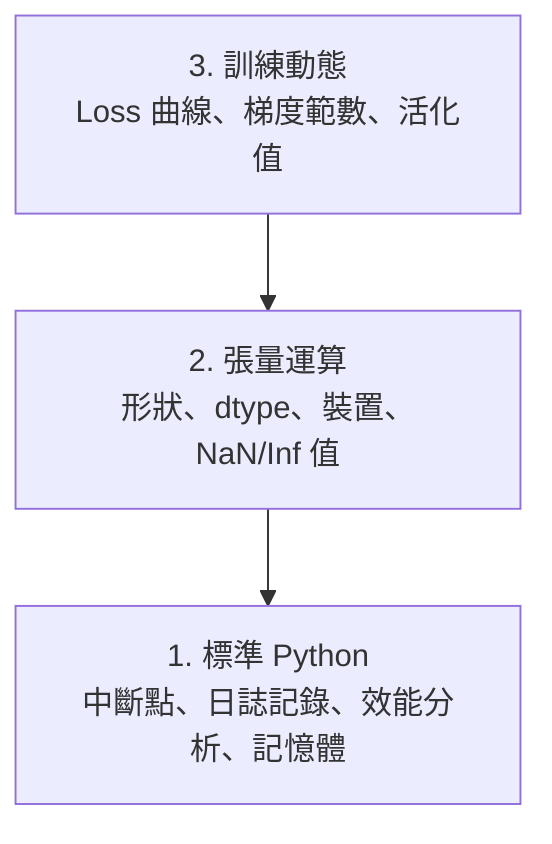

# 除錯與效能分析

> 最糟糕的 AI bug 不會讓程式崩潰。它們會讓模型悄悄用垃圾資料訓練，卻呈現漂亮的 loss 曲線。

**Type:** Build
**Language:** Python
**Prerequisites:** Lesson 1 (Dev Environment), basic PyTorch familiarity
**Time:** ~60 minutes

## Learning Objectives｜學習目標

- 使用條件式 `breakpoint()` 和 `debug_print`，在訓練途中檢查張量（tensor）的形狀、dtype 和 NaN 值
- 使用 `cProfile`、`line_profiler` 和 `tracemalloc` 對訓練迴圈做效能分析（profiling），找出瓶頸（bottleneck）
- 偵測常見的 AI bug：形狀不相符（shape mismatch）、NaN loss、資料洩漏（data leakage）和裝置放錯的張量
- 設定 TensorBoard，視覺化 loss 曲線、權重直方圖（histogram）和梯度分布

## The Problem｜問題

AI 程式出錯的方式和一般程式不同。網頁應用程式（web app）壞掉時會丟出堆疊追蹤（stack trace）；設定錯誤的訓練迴圈會跑上 8 小時、燒掉 200 美元的 GPU 時間，然後產出一個對任何輸入都只預測平均數的模型。程式從頭到尾沒有報錯——問題可能出在張量放錯裝置、一個忘記寫的 `.detach()`，或是標籤洩漏進了特徵裡。

你需要能在這些靜默失敗耗掉時間和運算資源前就將它們找出來的除錯工具（debugging tools）。

## The Concept｜核心概念

AI 除錯（debugging）分三個層次：



多數人會直接跳到第 3 層（盯著 TensorBoard 看）。但 80% 的 AI bug 出在第 1、2 層。

```figure
s0-flame-hot
```

## Build It｜動手實作

### 第 1 部分：Print 除錯（沒錯，它有用）

print 除錯常被低估，其實不該如此。對張量程式來說，一個放對位置的 print 勝過在除錯器（debugger）裡逐步執行，因為你需要一次看到形狀、dtype 和數值範圍。

```python
def debug_print(name, tensor):
    print(f"{name}: shape={tensor.shape}, dtype={tensor.dtype}, "
          f"device={tensor.device}, "
          f"min={tensor.min().item():.4f}, max={tensor.max().item():.4f}, "
          f"mean={tensor.mean().item():.4f}, "
          f"has_nan={tensor.isnan().any().item()}")
```

在每個可疑的操作後面呼叫它。找到 bug 後就把 print 移除。就是這麼簡單。

### 第 2 部分：Python 除錯器（debugger，pdb 與 breakpoint）

內建除錯器（debugger）在 AI 工作中被低估了。把 `breakpoint()` 放進訓練迴圈，就能互動式檢查張量。

```python
def training_step(model, batch, criterion, optimizer):
    inputs, labels = batch
    outputs = model(inputs)
    loss = criterion(outputs, labels)

    if loss.item() > 100 or torch.isnan(loss):
        breakpoint()

    loss.backward()
    optimizer.step()
```

進入除錯器（debugger）後，常用的指令有：

- `p outputs.shape` 檢查形狀
- `p loss.item()` 查看 loss 值
- `p torch.isnan(outputs).sum()` 計算 NaN 數量
- `p model.fc1.weight.grad` 檢查梯度
- `c` 繼續執行，`q` 離開

這就是條件式除錯：只有在看起來不對勁時才停下來。對一個一萬步的訓練作業來說，這很重要。

### 第 3 部分：Python 日誌記錄

當除錯不再只是快速看一眼時，把 print 換成日誌記錄（logging）。

```python
import logging

logging.basicConfig(
    level=logging.INFO,
    format="%(asctime)s [%(levelname)s] %(message)s",
    handlers=[
        logging.FileHandler("training.log"),
        logging.StreamHandler()
    ]
)
logger = logging.getLogger(__name__)

logger.info("Starting training: lr=%.4f, batch_size=%d", lr, batch_size)
logger.warning("Loss spike detected: %.4f at step %d", loss.item(), step)
logger.error("NaN loss at step %d, stopping", step)
```

日誌記錄給你時間戳記（timestamp）、嚴重等級和檔案輸出。當訓練作業在凌晨三點掛掉時，你要的是一份日誌檔，而不是早就被捲出畫面的終端機輸出。

### 第 4 部分：為程式碼段落計時

知道時間花在哪裡，是最佳化的第一步。

```python
import time

class Timer:
    def __init__(self, name=""):
        self.name = name

    def __enter__(self):
        self.start = time.perf_counter()
        return self

    def __exit__(self, *args):
        elapsed = time.perf_counter() - self.start
        print(f"[{self.name}] {elapsed:.4f}s")

with Timer("data loading"):
    batch = next(dataloader_iter)

with Timer("forward pass"):
    outputs = model(batch)

with Timer("backward pass"):
    loss.backward()
```

常見的發現：資料載入占了訓練時間的 60%。解法是在 DataLoader 設定 `num_workers > 0`，而不是換更快的 GPU。

### 第 5 部分：cProfile 與 line_profiler

當手動計時不夠用時：

```bash
python -m cProfile -s cumtime train.py
```

這會列出每個函式呼叫，並依累計時間排序。要逐行做效能分析：

```bash
pip install line_profiler
```

```python
@profile
def train_step(model, data, target):
    output = model(data)
    loss = F.cross_entropy(output, target)
    loss.backward()
    return loss

# Run with: kernprof -l -v train.py
```

### 第 6 部分：記憶體分析（memory profiling）

#### 用 tracemalloc 分析 CPU 記憶體

```python
import tracemalloc

tracemalloc.start()

# your code here
model = build_model()
data = load_dataset()

snapshot = tracemalloc.take_snapshot()
top_stats = snapshot.statistics("lineno")
for stat in top_stats[:10]:
    print(stat)
```

#### 用 memory_profiler 分析 CPU 記憶體

```bash
pip install memory_profiler
```

```python
from memory_profiler import profile

@profile
def load_data():
    raw = read_csv("data.csv")       # watch memory jump here
    processed = preprocess(raw)       # and here
    return processed
```

用 `python -m memory_profiler your_script.py` 執行，就能看到逐行的記憶體用量。

#### 用 PyTorch 分析 GPU 記憶體

```python
import torch

if torch.cuda.is_available():
    print(torch.cuda.memory_summary())

    print(f"Allocated: {torch.cuda.memory_allocated() / 1e9:.2f} GB")
    print(f"Cached: {torch.cuda.memory_reserved() / 1e9:.2f} GB")
```

遇到 OOM（記憶體不足）時：

1. 縮小批次大小（永遠先試這個）
2. 用 `torch.cuda.empty_cache()` 釋放快取記憶體
3. 對大型中間張量先 `del tensor`，再呼叫 `torch.cuda.empty_cache()`
4. 使用混合精度（mixed precision，`torch.cuda.amp`），記憶體用量減半
5. 對非常深的模型使用梯度檢查點（gradient checkpointing）

### 第 7 部分：常見的 AI bug 與抓法

#### 形狀不相符

最常見的 bug。模型預期 `[batch, channels, height, width]`，你的張量卻是 `[batch, features]`。

```python
def check_shapes(model, sample_input):
    print(f"Input: {sample_input.shape}")
    hooks = []

    def make_hook(name):
        def hook(module, inp, out):
            in_shape = inp[0].shape if isinstance(inp, tuple) else inp.shape
            out_shape = out.shape if hasattr(out, "shape") else type(out)
            print(f"  {name}: {in_shape} -> {out_shape}")
        return hook

    for name, module in model.named_modules():
        hooks.append(module.register_forward_hook(make_hook(name)))

    with torch.no_grad():
        model(sample_input)

    for h in hooks:
        h.remove()
```

拿一個樣本批次跑一次，它就會列出模型中每一層的形狀變化。

#### NaN Loss

Loss 變成 NaN，代表某個東西爆炸了。常見原因：

- 學習率太高
- 自訂損失函數中除以零
- 對零或負數取 log
- RNN 中的梯度爆炸

```python
def detect_nan(model, loss, step):
    if torch.isnan(loss):
        print(f"NaN loss at step {step}")
        for name, param in model.named_parameters():
            if param.grad is not None:
                if torch.isnan(param.grad).any():
                    print(f"  NaN gradient in {name}")
                if torch.isinf(param.grad).any():
                    print(f"  Inf gradient in {name}")
        return True
    return False
```

#### 資料洩漏

你的模型在測試集上拿到 99% 準確率。聽起來很棒——其實是 bug。

```python
def check_data_leakage(train_set, test_set, id_column="id"):
    train_ids = set(train_set[id_column].tolist())
    test_ids = set(test_set[id_column].tolist())
    overlap = train_ids & test_ids
    if overlap:
        print(f"DATA LEAKAGE: {len(overlap)} samples in both train and test")
        return True
    return False
```

還要檢查時間上的洩漏：用未來的資料預測過去。切分資料前先依時間戳記排序。

#### 裝置放錯

位在不同裝置（device）上的張量（CPU 和 GPU）會造成執行階段錯誤。但有時某個張量悄悄留在 CPU，其他都在 GPU，結果訓練只是變慢。

```python
def check_devices(model, *tensors):
    model_device = next(model.parameters()).device
    print(f"Model device: {model_device}")
    for i, t in enumerate(tensors):
        if t.device != model_device:
            print(f"  WARNING: tensor {i} on {t.device}, model on {model_device}")
```

### 第 8 部分：TensorBoard 基礎

TensorBoard 讓你看到訓練過程中發生的事。

```bash
pip install tensorboard
```

```python
from torch.utils.tensorboard import SummaryWriter

writer = SummaryWriter("runs/experiment_1")

for step in range(num_steps):
    loss = train_step(model, batch)

    writer.add_scalar("loss/train", loss.item(), step)
    writer.add_scalar("lr", optimizer.param_groups[0]["lr"], step)

    if step % 100 == 0:
        for name, param in model.named_parameters():
            writer.add_histogram(f"weights/{name}", param, step)
            if param.grad is not None:
                writer.add_histogram(f"grads/{name}", param.grad, step)

writer.close()
```

啟動它：

```bash
tensorboard --logdir=runs
```

觀察重點：

- **Loss 不降**：學習率太低，或模型架構有問題
- **Loss 劇烈震盪**：學習率太高
- **Loss 變成 NaN**：數值不穩定（見上方 NaN 一節）
- **訓練 loss 下降、驗證 loss 上升**：過度擬合
- **權重直方圖塌到零**：梯度消失
- **梯度直方圖爆掉**：需要梯度裁剪

### 第 9 部分：VS Code 除錯器（debugger）

要做互動式除錯，用 `launch.json` 設定 VS Code：

```json
{
    "version": "0.2.0",
    "configurations": [
        {
            "name": "Debug Training",
            "type": "debugpy",
            "request": "launch",
            "program": "${file}",
            "console": "integratedTerminal",
            "justMyCode": false
        }
    ]
}
```

點選行號旁的空白處就能設中斷點。用「變數」窗格檢查張量屬性。「偵錯主控台」讓你在執行途中執行任意 Python 運算式。

這適合用來逐步檢查資料前處理管線（preprocessing pipeline）、觀察每一個變換。

## Use It｜實際應用

以下這個除錯流程能抓到大多數 AI bug：

1. **訓練前**：用一個樣本批次執行 `check_shapes`，確認輸入和輸出維度符合預期。
2. **前 10 步**：對 loss、輸出和梯度用 `debug_print`，確認沒有 NaN、數值都在合理範圍內。
3. **訓練中**：記錄 loss、學習率和梯度範數，並用 TensorBoard 視覺化。
4. **出錯時**：在故障點放 `breakpoint()`，互動式檢查張量。
5. **效能問題**：分別測量資料載入、前向傳遞（forward pass）和反向傳遞（backward pass）的時間；快 OOM 時做記憶體分析（memory profiling）。

## Ship It｜交付成果

執行除錯工具（debugging tools）程式：

```bash
python phases/00-setup-and-tooling/12-debugging-and-profiling/code/debug_tools.py
```

`outputs/prompt-debug-ai-code.md` 有一份協助診斷 AI 專屬 bug 的 prompt。

## Exercises｜練習

1. 執行 `debug_tools.py`，閱讀每一段的輸出。修改假模型讓它產生 NaN（提示：在前向傳遞中除以零），看偵測器抓到它。
2. 用 `cProfile` 分析一個訓練迴圈，找出最慢的函式。
3. 用 `tracemalloc` 找出資料載入管線中哪一行配置最多記憶體。
4. 為一個簡單的訓練作業設定 TensorBoard，判斷模型是否過度擬合。
5. 在訓練迴圈裡使用 `breakpoint()`，練習在除錯器（debugger）提示下檢查張量形狀、裝置和梯度值。
