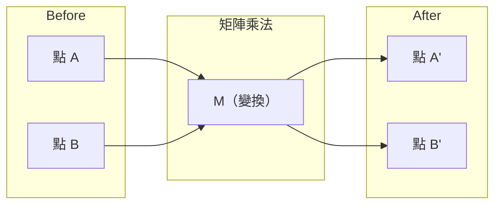
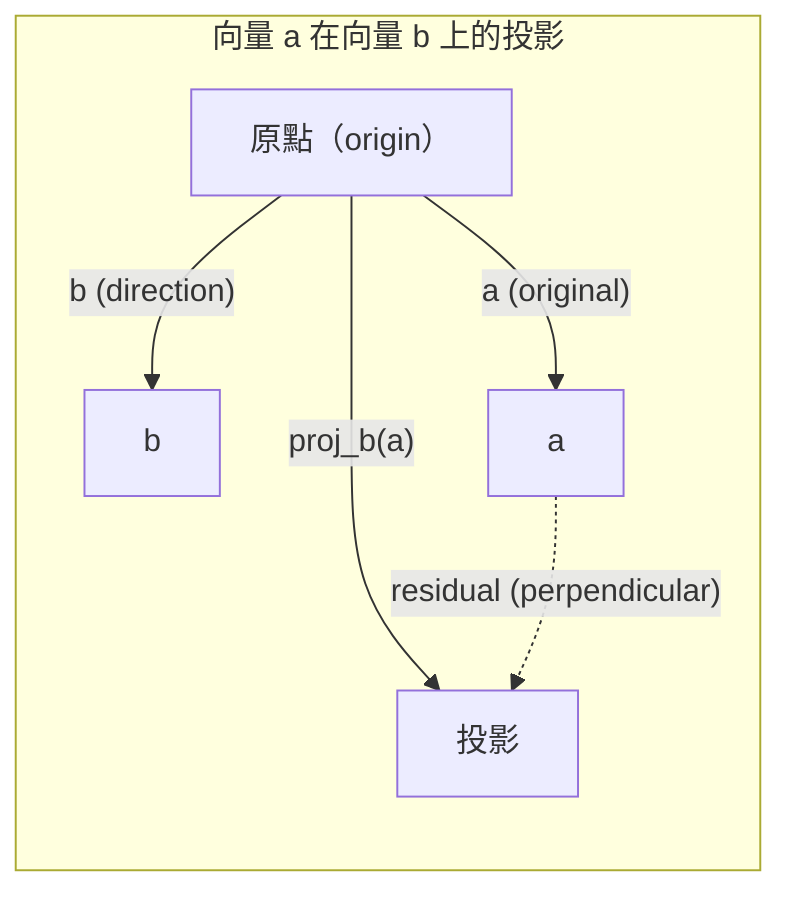

# 線性代數（linear algebra）的直覺理解

> 每個 AI 模型（model）說穿了都只是披著華麗外衣的矩陣（matrix）運算。

**Type:** Learn
**Languages:** Python, Julia
**Prerequisites:** Phase 0
**Time:** ~60 minutes

## Learning Objectives｜學習目標

- 從頭用 Python 實作向量（vector）和矩陣運算，包括加法、內積（dot product）與矩陣乘法（matrix multiply）
- 從幾何角度說明內積、投影（projection）和 Gram-Schmidt 正交化過程（Gram-Schmidt process）的作用
- 用列簡化法判斷一組向量是否線性獨立（linear independence），並求出矩陣秩（matrix rank）與基底（basis）
- 連結線性代數概念與 AI 應用：embedding、注意力分數（attention score）和 LoRA

## The Problem｜問題

翻開任何一篇 ML 論文，第一頁就會看到向量、矩陣、內積和變換（transformations）。沒有線性代數的直覺，這些都只是一堆符號；有了直覺，你就能看出神經網路（neural network）實際上在做什麼——在空間中移動點。

你不必成為數學家；你只要從幾何角度理解這些運算代表什麼，再親手把它們寫成程式。

## The Concept｜核心概念

### 向量是點（也是方向）

向量只是一串數字，但每個數字都有意義：它們是空間中的座標（coordinate）。

**2D 向量 [3, 2]：**

| x | y | 點 |
|---|---|-------|
| 3 | 2 | 這個向量從原點（origin） (0,0) 指向平面上的 (3, 2) |

向量長度（magnitude）為 sqrt(3^2 + 2^2) = sqrt(13)，方向則是右上方。

在 AI 中，向量幾乎可以表示任何事物：
- 一個詞 → 由 768 個數字組成的向量（代表它在 embedding 空間中的「意義」）
- 一張圖片 → 由數百萬個像素（pixel）值組成的向量
- 一位使用者 → 由各種偏好組成的向量

### 矩陣是一種變換

矩陣可以把一個向量轉換成另一個向量，也能旋轉、縮放、拉伸或投影。



在 AI 中，矩陣本身就是模型：
- 神經網路的權重（weight）是用來將輸入轉換成輸出的矩陣
- 注意力分數會形成矩陣，決定模型要關注什麼
- embedding 會形成將詞映射到向量的矩陣

### 內積如何衡量相似度

兩個向量的內積可以表示它們有多相似。

```
a · b = a₁×b₁ + a₂×b₂ + ... + aₙ×bₙ

Same direction:      a · b > 0  (similar)
Perpendicular:       a · b = 0  (unrelated)
Opposite direction:  a · b < 0  (dissimilar)
```

搜尋引擎、推薦系統（recommendation system）和 RAG 確實都是這樣運作：找出內積值高的向量。

### 線性獨立

一組向量若符合以下條件，就稱為線性獨立：其中沒有任何一個向量可以寫成其餘向量的線性組合（linear combination）。若 v1, v2, v3 線性獨立，它們就會張成（span）三維空間；若其中一個向量可由其餘向量組合而成，這組向量就只能張成一個平面。

這對 AI 很重要：特徵矩陣（feature matrix）的各欄應該線性獨立。如果兩個特徵完全相關，也就是線性相依（linearly dependent），模型就無法區分它們各自的影響。這會造成迴歸（regression）中的多重共線性（multicollinearity），使權重矩陣（weight matrix）不穩定，輸入稍有變動，輸出就可能大幅波動。

**具體例子：**

```
v1 = [1, 0, 0]
v2 = [0, 1, 0]
v3 = [2, 1, 0]   # v3 = 2*v1 + v2
```

v1 和 v2 線性獨立——其中一個向量不是另一個向量的純量（scalar）倍數，也不能由另一個向量組合而成。但 v3 = 2*v1 + v2，因此集合 {v1, v2, v3} 是線性相依的。這三個向量都位於 xy 平面上；無論如何組合，都無法到達 [0, 0, 1]。雖然有三個向量，實際上只有兩個自由度。

在資料集（dataset）中，若 feature_3 = 2*feature_1 + feature_2，加入 feature_3 並不會為模型帶來新資訊（information）。更糟的是，這會使正規方程組（normal equations）的係數矩陣成為奇異矩陣（singular matrix），因此權重沒有唯一解。

### 基底（basis）與秩

基底（basis）是能張成整個空間的最小線性獨立向量組。基底（basis）向量的數量就是空間的維度（dimension）。

三維空間的標準基底（standard basis）是 {[1,0,0], [0,1,0], [0,0,1]}。不過，三維空間中任意三個線性獨立的向量都能構成有效基底（basis）。選擇基底（basis），就是選擇座標系統（coordinate system）。

矩陣的秩等於線性獨立欄的數量，也等於線性獨立列的數量。若 rank < min(rows, cols)，矩陣即為秩不足（rank-deficient）。這代表：
- 方程組有無限多個解（或無解）
- 變換過程中有資訊遺失
- 矩陣不可逆

| 情況 | 秩 | 對 ML 的意義 |
|-----------|------|---------------------|
| 滿秩（full rank；rank = min(m, n)） | 最大可能值 | 存在唯一的最小平方法解（least-squares solution）。模型的數值條件良好（well-conditioned）。 |
| 秩不足（rank < min(m, n)） | 低於最大值 | 特徵有冗餘，因此權重有無限多種解；需要正則化（regularization）。 |
| 秩為 1（rank 1） | 1 | 每一欄都是同一個向量的倍數，所有資料都落在一條直線上。 |
| 接近秩不足（near rank-deficient），奇異值（singular values）很小 | 數值上偏低 | 矩陣條件不良（ill-conditioned），輸入只有微小雜訊，也可能造成輸出大幅變動。可使用 SVD 截斷（SVD truncation）或嶺迴歸（ridge regression）。 |

### 投影

將向量 **a** 投影到向量 **b** 上，得到的就是 **a** 在 **b** 方向上的向量分量（vector component）：

```
proj_b(a) = (a dot b / b dot b) * b
```

殘差（residual）(a - proj_b(a)) 垂直於 b。這種正交分解（orthogonal decomposition）是最小平方法擬合（least-squares fitting）的基礎。

投影在 ML 中無所不在：
- 線性迴歸（linear regression）會將觀測值投影到欄空間（column space），藉此最小化距離——解本身就是投影
- 主成分分析（PCA）會把資料投影到變異最大的方向上
- transformer 的注意力機制會計算 query 在 key 上的投影



**例子：** a = [3, 4], b = [1, 0]

proj_b(a) = (3*1 + 4*0) / (1*1 + 0*0) * [1, 0] = 3 * [1, 0] = [3, 0]

這個投影去掉了 y 分量，是最簡單的降維（dimensionality reduction）方式——捨去不需要的方向。

### Gram-Schmidt 正交化過程

這個過程會把任意一組線性獨立向量轉換成標準正交基底（orthonormal basis）。所謂標準正交（orthonormal），是指每個向量長度都是 1，而且任兩個向量互相垂直（orthogonal）。

演算法如下：
1. 取第一個向量，將它正規化（normalize）
2. 取第二個向量，減去它在第一個向量上的投影，再將結果正規化
3. 取第三個向量，減去它在前兩個向量上的投影，再將結果正規化
4. 依此類推，處理其餘向量

```
Input:  v1, v2, v3, ... (linearly independent)

u1 = v1 / |v1|

w2 = v2 - (v2 dot u1) * u1
u2 = w2 / |w2|

w3 = v3 - (v3 dot u1) * u1 - (v3 dot u2) * u2
u3 = w3 / |w3|

Output: u1, u2, u3, ... (orthonormal basis)
```

QR 分解（QR decomposition）的內部運作方式就是如此：Q 是由標準正交欄組成的矩陣，R 則記錄投影係數。QR 分解可用於：
- 求解線性方程組（linear system），且比高斯消去法（Gaussian elimination）穩定
- 以 QR 演算法計算特徵值（eigenvalues）
- 最小平方法迴歸（regression）（標準的數值方法）

```figure
eigen-directions
```

## Build It｜動手實作

### 步驟 1：用 Python 從頭實作向量

```python
class Vector:
    def __init__(self, components):
        self.components = list(components)
        self.dim = len(self.components)

    def __add__(self, other):
        return Vector([a + b for a, b in zip(self.components, other.components)])

    def __sub__(self, other):
        return Vector([a - b for a, b in zip(self.components, other.components)])

    def dot(self, other):
        return sum(a * b for a, b in zip(self.components, other.components))

    def magnitude(self):
        return sum(x**2 for x in self.components) ** 0.5

    def normalize(self):
        mag = self.magnitude()
        return Vector([x / mag for x in self.components])

    def cosine_similarity(self, other):
        return self.dot(other) / (self.magnitude() * other.magnitude())

    def __repr__(self):
        return f"Vector({self.components})"


a = Vector([1, 2, 3])
b = Vector([4, 5, 6])

print(f"a + b = {a + b}")
print(f"a · b = {a.dot(b)}")
print(f"|a| = {a.magnitude():.4f}")
print(f"cosine similarity = {a.cosine_similarity(b):.4f}")
```

### 步驟 2：從頭實作矩陣（Python）

```python
class Matrix:
    def __init__(self, rows):
        self.rows = [list(row) for row in rows]
        self.shape = (len(self.rows), len(self.rows[0]))

    def __matmul__(self, other):
        if isinstance(other, Vector):
            return Vector([
                sum(self.rows[i][j] * other.components[j] for j in range(self.shape[1]))
                for i in range(self.shape[0])
            ])
        rows = []
        for i in range(self.shape[0]):
            row = []
            for j in range(other.shape[1]):
                row.append(sum(
                    self.rows[i][k] * other.rows[k][j]
                    for k in range(self.shape[1])
                ))
            rows.append(row)
        return Matrix(rows)

    def transpose(self):
        return Matrix([
            [self.rows[j][i] for j in range(self.shape[0])]
            for i in range(self.shape[1])
        ])

    def __repr__(self):
        return f"Matrix({self.rows})"


rotation_90 = Matrix([[0, -1], [1, 0]])
point = Vector([3, 1])

rotated = rotation_90 @ point
print(f"Original: {point}")
print(f"Rotated 90°: {rotated}")
```

### 步驟 3：這些運算在 AI 中的用途

```python
import random

random.seed(42)
weights = Matrix([[random.gauss(0, 0.1) for _ in range(3)] for _ in range(2)])
input_vector = Vector([1.0, 0.5, -0.3])

output = weights @ input_vector
print(f"Input (3D): {input_vector}")
print(f"Output (2D): {output}")
print("This is what a neural network layer does -- matrix multiplication.")
```

### 步驟 4：Julia 版本

```julia
a = [1.0, 2.0, 3.0]
b = [4.0, 5.0, 6.0]

println("a + b = ", a + b)
println("a · b = ", a ⋅ b)       # Julia supports unicode operators
println("|a| = ", √(a ⋅ a))
println("cosine = ", (a ⋅ b) / (√(a ⋅ a) * √(b ⋅ b)))

# Matrix-vector multiplication
W = [0.1 -0.2 0.3; 0.4 0.5 -0.1]
x = [1.0, 0.5, -0.3]
println("Wx = ", W * x)
println("This is a neural network layer.")
```

### 步驟 5：從頭實作線性獨立與投影（Python）

```python
def is_linearly_independent(vectors):
    n = len(vectors)
    dim = len(vectors[0].components)
    mat = Matrix([v.components[:] for v in vectors])
    rows = [row[:] for row in mat.rows]
    rank = 0
    for col in range(dim):
        pivot = None
        for row in range(rank, len(rows)):
            if abs(rows[row][col]) > 1e-10:
                pivot = row
                break
        if pivot is None:
            continue
        rows[rank], rows[pivot] = rows[pivot], rows[rank]
        scale = rows[rank][col]
        rows[rank] = [x / scale for x in rows[rank]]
        for row in range(len(rows)):
            if row != rank and abs(rows[row][col]) > 1e-10:
                factor = rows[row][col]
                rows[row] = [rows[row][j] - factor * rows[rank][j] for j in range(dim)]
        rank += 1
    return rank == n


def project(a, b):
    scalar = a.dot(b) / b.dot(b)
    return Vector([scalar * x for x in b.components])


def gram_schmidt(vectors):
    orthonormal = []
    for v in vectors:
        w = v
        for u in orthonormal:
            proj = project(w, u)
            w = w - proj
        if w.magnitude() < 1e-10:
            continue
        orthonormal.append(w.normalize())
    return orthonormal


v1 = Vector([1, 0, 0])
v2 = Vector([1, 1, 0])
v3 = Vector([1, 1, 1])
basis = gram_schmidt([v1, v2, v3])
for i, u in enumerate(basis):
    print(f"u{i+1} = {u}")
    print(f"  |u{i+1}| = {u.magnitude():.6f}")

print(f"u1 · u2 = {basis[0].dot(basis[1]):.6f}")
print(f"u1 · u3 = {basis[0].dot(basis[2]):.6f}")
print(f"u2 · u3 = {basis[1].dot(basis[2]):.6f}")
```

## Use It｜實際應用

接著用 NumPy 做同樣的事——這才是你實務上會用的方式：

```python
import numpy as np

a = np.array([1, 2, 3], dtype=float)
b = np.array([4, 5, 6], dtype=float)

print(f"a + b = {a + b}")
print(f"a · b = {np.dot(a, b)}")
print(f"|a| = {np.linalg.norm(a):.4f}")
print(f"cosine = {np.dot(a, b) / (np.linalg.norm(a) * np.linalg.norm(b)):.4f}")

W = np.random.randn(2, 3) * 0.1
x = np.array([1.0, 0.5, -0.3])
print(f"Wx = {W @ x}")
```

### 使用 NumPy 計算秩、投影和 QR 分解

```python
import numpy as np

A = np.array([[1, 2], [2, 4]])
print(f"Rank: {np.linalg.matrix_rank(A)}")

a = np.array([3, 4])
b = np.array([1, 0])
proj = (np.dot(a, b) / np.dot(b, b)) * b
print(f"Projection of {a} onto {b}: {proj}")

Q, R = np.linalg.qr(np.random.randn(3, 3))
print(f"Q is orthogonal: {np.allclose(Q @ Q.T, np.eye(3))}")
print(f"R is upper triangular: {np.allclose(R, np.triu(R))}")
```

### PyTorch：張量（tensor）是支援自動微分（autodiff）的向量

```python
import torch

x = torch.randn(3, requires_grad=True)
y = torch.tensor([1.0, 0.0, 0.0])

similarity = torch.dot(x, y)
similarity.backward()

print(f"x = {x.data}")
print(f"y = {y.data}")
print(f"dot product = {similarity.item():.4f}")
print(f"d(dot)/dx = {x.grad}")
```

內積對 x 的梯度（gradient）就是 y。PyTorch 會自動計算這個值。神經網路中的每個運算都是由這類運算組成——矩陣乘法、內積、投影——autodiff 會追蹤所有運算的梯度。

你剛才從頭實作了 NumPy 一行就能完成的運算。現在你知道底層發生了什麼。

## Ship It｜交付成果

本課會產出：
- `outputs/prompt-linear-algebra-tutor.md`——一份引導 AI 助理以幾何直覺教授線性代數的 prompt

## 關聯

本課的每個概念都會出現在現代 AI 的特定環節：

| 概念 | 應用場景 |
|---------|------------------|
| 內積 | transformer 的注意力分數、RAG 中的餘弦相似度（cosine similarity） |
| 矩陣乘法 | 每一層神經網路、每一種線性變換（linear transformation） |
| 線性獨立 | 特徵選擇（feature selection）、避免多重共線性 |
| 秩 | 判斷系統是否可解、LoRA（low-rank adaptation） |
| 投影 | 線性迴歸（regression）（將資料投影到欄空間）、PCA |
| Gram-Schmidt／QR | 數值求解器、特徵值計算 |
| 標準正交基底（basis） | 穩定的數值計算、白化轉換（whitening transform） |

LoRA 值得特別一提：它會把權重更新（weight updates）分解成低秩矩陣，藉此 fine-tune 大型語言模型（large language model）。LoRA 不必更新一個 4096x4096 的權重矩陣（16M 個參數），而是改更新兩個矩陣，大小分別為 4096x16 和 16x4096（131K 個參數）。秩為 16 的限制代表 LoRA 假設權重更新只會落在完整 4096 維空間中的一個 16 維子空間（subspace）。這就是線性代數在實際解決問題。

## Exercises｜練習

1. 實作 `Vector.angle_between(other)`，回傳兩個向量之間的角度（以度為單位）
2. 建立一個 2D 縮放矩陣（scaling matrix），讓 x 座標乘以 2、y 座標乘以 3，然後將它套用到向量 [1, 1]
3. 建立 5 個類似詞向量的隨機向量（維度為 50），找出餘弦相似度最高的兩個
4. 確認 Gram-Schmidt 的輸出確實是標準正交的：檢查每一對向量的內積是否為 0，以及每個向量的長度是否為 1
5. 建立一個秩為 2 的 3x3 矩陣。用 `rank()` 方法確認，再說明矩陣的欄向量張成什麼樣的幾何形體。
6. 將向量 [1, 2, 3] 投影到 [1, 1, 1] 上。結果在幾何上代表什麼？

## Key Terms｜關鍵術語

| 術語 | 常見說法 | 實際意義 |
|------|----------------|----------------------|
| 向量 | 「一支箭」 | 在 n 維空間中表示一個點或方向的數字清單 |
| 矩陣 | 「一張數字表」 | 將向量從一個空間映射到另一個空間的變換 |
| 內積 | 「相乘後加總」 | 衡量兩個向量的方向有多一致；是相似度搜尋（similarity search）的核心 |
| embedding | 「某種 AI 魔法」 | 表示某個事物（詞、圖片、使用者）意義的向量 |
| 線性獨立 | 「彼此不重疊」 | 集合中的向量都無法由其餘向量組合而成 |
| 矩陣秩 | 「有幾個維度」 | 矩陣中線性獨立欄（或列）的數量 |
| 投影 | 「影子」 | 一個向量沿著另一個向量方向的分量 |
| 基底（basis） | 「座標軸」 | 能張成整個空間的最小線性獨立向量組 |
| 標準正交 | 「彼此垂直的單位向量」 | 向量彼此垂直，且每個向量的長度都是 1 |
