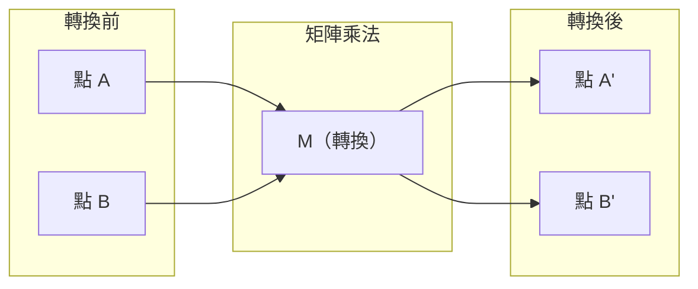
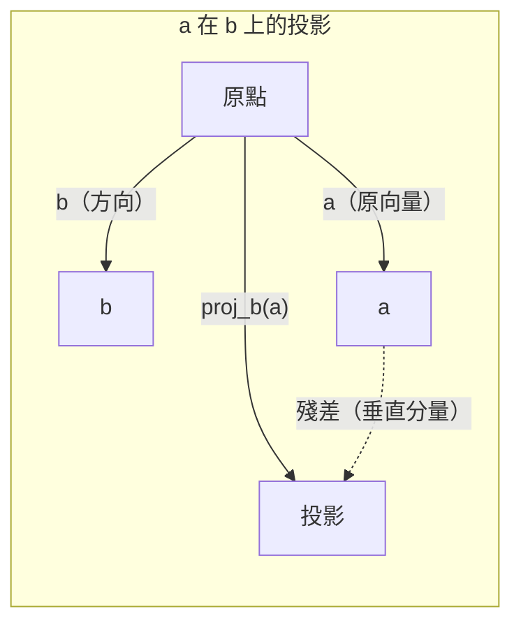

# 線性代數直覺

> 每個 AI 模型，說穿了都是套上華麗外衣的矩陣運算。

**Type:** Learn
**Languages:** Python, Julia
**Prerequisites:** Phase 0
**Time:** ~60 minutes

## Learning Objectives

- 在 Python 中從零實作向量和矩陣運算（加法、點積、矩陣乘法）
- 從幾何角度說明點積、投影和 Gram–Schmidt 過程的作用
- 使用列簡化判斷一組向量的線性獨立性、秩和基底
- 將線性代數概念連結到 AI 應用：嵌入向量、注意力分數和 LoRA

## The Problem｜問題

翻開任何一篇機器學習論文，第一頁就會看到向量、矩陣、點積和轉換。若缺乏線性代數直覺，這些不過是一堆符號；有了直覺，就能看出神經網路實際上在做什麼——在空間中移動點。

你不必成為數學家，只要看懂這些運算在幾何上的意義，再親手寫出來就行。

## The Concept｜核心概念

### 向量是點（也是方向）

向量看起來只是一串數字，但這些數字代表空間中的座標。

**二維向量 [3, 2]：**

| x | y | 點的位置 |
|---|---|-------|
| 3 | 2 | 向量由原點 (0,0) 指向平面上的 (3, 2) |

這個向量的長度是 sqrt(3^2 + 2^2) = sqrt(13)，方向朝右上方。

在 AI 中，向量可以表示各式各樣的事物：
- 一個詞 → 由 768 個數字組成的向量（它在嵌入空間中的「意義」）
- 一張影像 → 由數百萬個像素值組成的向量
- 一位使用者 → 一個偏好向量

### 矩陣是轉換

矩陣會將一個向量轉換成另一個向量。它可以旋轉、縮放、拉伸或投影向量。



在 AI 中，矩陣本身就是模型：
- 神經網路權重 → 將輸入轉換成輸出的矩陣
- 注意力分數 → 決定模型要關注哪些內容的矩陣
- 嵌入向量 → 將詞映射到向量的矩陣

### 點積用來衡量相似度

兩個向量的點積可以反映它們有多相似。

```text
a · b = a₁×b₁ + a₂×b₂ + ... + aₙ×bₙ

同方向：      a · b > 0  （相似）
互相垂直：       a · b = 0  （無關）
反方向：  a · b < 0  （不相似）
```

搜尋引擎、推薦系統和 RAG 正是用這個方式運作：找出點積較大的向量。

### 線性獨立

如果一組向量中的任何一個，都無法寫成其他向量的線性組合，這組向量就是線性獨立。若 v1、v2、v3 線性獨立，它們會張成三維空間；如果其中一個向量能由其他向量組合而成，這些向量就只會張成一個平面。

這對 AI 為什麼重要：特徵矩陣的欄應該彼此線性獨立。如果兩個特徵完全相關（線性相依），模型就無法分辨它們各自的影響。這會讓迴歸模型發生多重共線性，使權重矩陣不穩定；輸入只要稍微變動，輸出就可能大幅波動。

**具體例子：**

```text
v1 = [1, 0, 0]
v2 = [0, 1, 0]
v3 = [2, 1, 0]   # v3 = 2*v1 + v2
```

v1 和 v2 線性獨立——任一向量都不是另一個向量的倍數或組合。但 v3 = 2*v1 + v2，因此 {v1, v2, v3} 是線性相依的一組向量。這三個向量都落在 xy 平面上；無論如何組合，都無法到達 [0, 0, 1]。雖然有三個向量，實際上只有兩個自由度。

在資料集中，如果 feature_3 = 2*feature_1 + feature_2，加入 feature_3 不會提供任何新資訊，還會讓正規方程式變成奇異矩陣，導致權重沒有唯一解。

### 基底與秩

基底是能張成整個空間的一組最小線性獨立向量。基底向量的數量就是空間的維度。

三維空間的標準基底是 {[1,0,0], [0,1,0], [0,0,1]}。不過，三維空間中任意三個線性獨立的向量，都能構成有效基底。選擇基底，就是在選擇座標系。

矩陣的秩 = 線性獨立欄的數量 = 線性獨立列的數量。如果秩 < min(列數, 欄數)，矩陣就是秩不足。這表示：
- 方程組有無限多組解（或無解）
- 轉換過程中會遺失資訊
- 矩陣不可逆

| 情況 | 秩 | 對機器學習的意義 |
|-----------|------|---------------------|
| 滿秩（rank = min(m, n)） | 最大可能秩 | 最小平方法有唯一解，模型的條件良好。 |
| 秩不足（rank < min(m, n)） | 低於最大秩 | 特徵有冗餘，權重有無限多組解，需要使用正則化。 |
| 秩為 1 | 1 | 每一欄都是同一向量的倍數，所有資料都落在一條直線上。 |
| 接近秩不足（奇異值很小） | 數值上偏低 | 矩陣的條件不佳，微小輸入雜訊會造成很大的輸出變化。可使用截斷 SVD 或嶺迴歸。 |

### 投影

將向量 **a** 投影到向量 **b** 上，會得到 **a** 在 **b** 方向上的分量：

```text
proj_b(a) = (a dot b / b dot b) * b
```

殘差 (a - proj_b(a)) 與 b 垂直。這種正交分解是最小平方法的基礎。

投影在機器學習中無所不在：
- 線性迴歸會縮小觀測值到欄空間的距離；求出的解就是一種投影
- PCA 將資料投影到變異量最大的方向上
- Transformer 的注意力會計算 Query 在 Key 上的投影



**例子：** a = [3, 4]，b = [1, 0]

proj_b(a) = (3*1 + 4*0) / (1*1 + 0*0) * [1, 0] = 3 * [1, 0] = [3, 0]

投影會去掉 y 分量。這是最簡單的降維方式：捨棄你不在意的方向。

### Gram–Schmidt 正交化過程

這個過程會將任一組線性獨立向量轉換成正交單位基底。正交單位表示每個向量長度為 1，而且任兩個向量彼此垂直。

演算法步驟：
1. 取第一個向量，將它正規化。
2. 取第二個向量，減去它在第一個向量上的投影，再將結果正規化。
3. 取第三個向量，減去它在前面所有向量上的投影，再將結果正規化。
4. 對剩餘向量重複以上步驟。

```text
輸入：  v1, v2, v3, ... (linearly independent)

u1 = v1 / |v1|

w2 = v2 - (v2 dot u1) * u1
u2 = w2 / |w2|

w3 = v3 - (v3 dot u1) * u1 - (v3 dot u2) * u2
u3 = w3 / |w3|

輸出： u1, u2, u3, ... (orthonormal basis)
```

QR 分解的內部運作方式就是如此。Q 是正交單位基底，R 則保留投影係數。QR 分解可用於：
- 求解線性方程組（比高斯消去法更穩定）
- 計算特徵值（QR 演算法）
- 最小平方法迴歸（標準數值方法）

```figure
eigen-directions
```

## Build It｜動手打造

### 步驟 1：從零實作向量（Python）

```python
class Vector:
    def __init__(self, components):
        self.components = list(components)
        self.dim = len(self.components)

    def __add__(self, other):
        return Vector([a + b for a, b in zip(self.components, other.components)])

    def __sub__(self, other):
        return Vector([a - b for a, b in zip(self.components, other.components)])

    def dot(self, other):
        return sum(a * b for a, b in zip(self.components, other.components))

    def magnitude(self):
        return sum(x**2 for x in self.components) ** 0.5

    def normalize(self):
        mag = self.magnitude()
        return Vector([x / mag for x in self.components])

    def cosine_similarity(self, other):
        return self.dot(other) / (self.magnitude() * other.magnitude())

    def __repr__(self):
        return f"Vector({self.components})"


a = Vector([1, 2, 3])
b = Vector([4, 5, 6])

print(f"a + b = {a + b}")
print(f"a · b = {a.dot(b)}")
print(f"|a| = {a.magnitude():.4f}")
print(f"cosine similarity = {a.cosine_similarity(b):.4f}")
```

### 步驟 2：從零實作矩陣（Python）

```python
class Matrix:
    def __init__(self, rows):
        self.rows = [list(row) for row in rows]
        self.shape = (len(self.rows), len(self.rows[0]))

    def __matmul__(self, other):
        if isinstance(other, Vector):
            return Vector([
                sum(self.rows[i][j] * other.components[j] for j in range(self.shape[1]))
                for i in range(self.shape[0])
            ])
        rows = []
        for i in range(self.shape[0]):
            row = []
            for j in range(other.shape[1]):
                row.append(sum(
                    self.rows[i][k] * other.rows[k][j]
                    for k in range(self.shape[1])
                ))
            rows.append(row)
        return Matrix(rows)

    def transpose(self):
        return Matrix([
            [self.rows[j][i] for j in range(self.shape[0])]
            for i in range(self.shape[1])
        ])

    def __repr__(self):
        return f"Matrix({self.rows})"


rotation_90 = Matrix([[0, -1], [1, 0]])
point = Vector([3, 1])

rotated = rotation_90 @ point
print(f"Original: {point}")
print(f"Rotated 90°: {rotated}")
```

### 步驟 3：這些概念為什麼對 AI 重要

```python
import random

random.seed(42)
weights = Matrix([[random.gauss(0, 0.1) for _ in range(3)] for _ in range(2)])
input_vector = Vector([1.0, 0.5, -0.3])

output = weights @ input_vector
print(f"Input (3D): {input_vector}")
print(f"Output (2D): {output}")
print("This is what a neural network layer does -- matrix multiplication.")
```

### 步驟 4：Julia 版本

```julia
a = [1.0, 2.0, 3.0]
b = [4.0, 5.0, 6.0]

println("a + b = ", a + b)
println("a · b = ", a ⋅ b)       # Julia supports unicode operators
println("|a| = ", √(a ⋅ a))
println("cosine = ", (a ⋅ b) / (√(a ⋅ a) * √(b ⋅ b)))

# Matrix-vector multiplication
W = [0.1 -0.2 0.3; 0.4 0.5 -0.1]
x = [1.0, 0.5, -0.3]
println("Wx = ", W * x)
println("This is a neural network layer.")
```

### 步驟 5：從零實作線性獨立與投影（Python）

```python
def is_linearly_independent(vectors):
    n = len(vectors)
    dim = len(vectors[0].components)
    mat = Matrix([v.components[:] for v in vectors])
    rows = [row[:] for row in mat.rows]
    rank = 0
    for col in range(dim):
        pivot = None
        for row in range(rank, len(rows)):
            if abs(rows[row][col]) > 1e-10:
                pivot = row
                break
        if pivot is None:
            continue
        rows[rank], rows[pivot] = rows[pivot], rows[rank]
        scale = rows[rank][col]
        rows[rank] = [x / scale for x in rows[rank]]
        for row in range(len(rows)):
            if row != rank and abs(rows[row][col]) > 1e-10:
                factor = rows[row][col]
                rows[row] = [rows[row][j] - factor * rows[rank][j] for j in range(dim)]
        rank += 1
    return rank == n


def project(a, b):
    scalar = a.dot(b) / b.dot(b)
    return Vector([scalar * x for x in b.components])


def gram_schmidt(vectors):
    orthonormal = []
    for v in vectors:
        w = v
        for u in orthonormal:
            proj = project(w, u)
            w = w - proj
        if w.magnitude() < 1e-10:
            continue
        orthonormal.append(w.normalize())
    return orthonormal


v1 = Vector([1, 0, 0])
v2 = Vector([1, 1, 0])
v3 = Vector([1, 1, 1])
basis = gram_schmidt([v1, v2, v3])
for i, u in enumerate(basis):
    print(f"u{i+1} = {u}")
    print(f"  |u{i+1}| = {u.magnitude():.6f}")

print(f"u1 · u2 = {basis[0].dot(basis[1]):.6f}")
print(f"u1 · u3 = {basis[0].dot(basis[2]):.6f}")
print(f"u2 · u3 = {basis[1].dot(basis[2]):.6f}")
```

## Use It｜開始使用

接著用 NumPy 做同樣的運算——這就是實際工作中會用到的方式：

```python
import numpy as np

a = np.array([1, 2, 3], dtype=float)
b = np.array([4, 5, 6], dtype=float)

print(f"a + b = {a + b}")
print(f"a · b = {np.dot(a, b)}")
print(f"|a| = {np.linalg.norm(a):.4f}")
print(f"cosine = {np.dot(a, b) / (np.linalg.norm(a) * np.linalg.norm(b)):.4f}")

W = np.random.randn(2, 3) * 0.1
x = np.array([1.0, 0.5, -0.3])
print(f"Wx = {W @ x}")
```

### 使用 NumPy 計算秩、投影和 QR 分解

```python
import numpy as np

A = np.array([[1, 2], [2, 4]])
print(f"Rank: {np.linalg.matrix_rank(A)}")

a = np.array([3, 4])
b = np.array([1, 0])
proj = (np.dot(a, b) / np.dot(b, b)) * b
print(f"Projection of {a} onto {b}: {proj}")

Q, R = np.linalg.qr(np.random.randn(3, 3))
print(f"Q is orthogonal: {np.allclose(Q @ Q.T, np.eye(3))}")
print(f"R is upper triangular: {np.allclose(R, np.triu(R))}")
```

### PyTorch：張量就是能自動微分的向量

```python
import torch

x = torch.randn(3, requires_grad=True)
y = torch.tensor([1.0, 0.0, 0.0])

similarity = torch.dot(x, y)
similarity.backward()

print(f"x = {x.data}")
print(f"y = {y.data}")
print(f"dot product = {similarity.item():.4f}")
print(f"d(dot)/dx = {x.grad}")
```

點積對 x 的梯度就是 y，PyTorch 已自動算出結果。神經網路中的每一個運算，都是由這類運算組成——矩陣乘法、點積、投影等；自動微分會沿著這些運算追蹤梯度。

你剛才從零實作了 NumPy 一行就能完成的運算。現在你也知道這些操作背後是怎麼運作的。

## Ship It｜交付成果

本課程會產出：
- `outputs/prompt-linear-algebra-tutor.md`：一份提示詞，讓 AI 助理透過幾何直覺教授線性代數

## 概念連結

本課程的概念都能對應到現代 AI 的實際應用：

| 概念 | 應用場景 |
|---------|------------------|
| 點積 | Transformer 的注意力分數、RAG 的餘弦相似度 |
| 矩陣乘法 | 每個神經網路層、每個線性轉換 |
| 線性獨立 | 特徵選擇、避免多重共線性 |
| 秩 | 判斷方程組是否可解、LoRA（低秩調適） |
| 投影 | 線性迴歸（投影至欄空間）、PCA |
| Gram–Schmidt／QR | 數值求解器、特徵值計算 |
| 正交單位基底 | 穩定的數值計算、白化轉換 |

LoRA 值得特別一提。它透過將權重更新分解成低秩矩陣來微調大型語言模型。LoRA 不必更新 4096x4096 的權重矩陣（1,600 萬個參數），而是更新兩個大小分別為 4096x16 和 16x4096 的矩陣（13.1 萬個參數）。秩 16 的限制表示，LoRA 假設權重更新只落在完整 4096 維空間中的某個 16 維子空間。這就是線性代數實際發揮作用的地方。

## Exercises｜練習

1. 實作 `Vector.angle_between(other)`，回傳兩個向量之間的夾角（角度）。
2. 建立一個二維縮放矩陣，讓 x 座標乘以 2、y 座標乘以 3，再將它套用到向量 [1, 1]。
3. 產生 5 個類似詞向量的隨機向量（維度為 50），使用餘弦相似度找出最相似的兩個。
4. 確認 Gram–Schmidt 的輸出確實是正交單位基底：檢查任兩個向量的點積是否為 0，且每個向量的長度是否為 1。
5. 建立一個秩為 2 的 3x3 矩陣，使用 `rank()` 方法確認結果，再說明矩陣各欄張成什麼幾何物件。
6. 將向量 [1, 2, 3] 投影到 [1, 1, 1] 上。這個結果在幾何上代表什麼？

## Key Terms｜重要詞彙

| 詞彙 | 一般說法 | 實際意義 |
|------|----------------|----------------------|
| 向量 |「一支箭頭」| 在 n 維空間中表示點或方向的一串數字 |
| 矩陣 |「數字表格」| 將向量從一個空間映射到另一個空間的轉換 |
| 點積 |「相乘後加總」| 衡量兩個向量方向有多一致，是相似度搜尋的核心 |
| 嵌入向量 |「某種 AI 魔法」| 用來表示某個事物（詞、影像、使用者）意義的向量 |
| 線性獨立 |「它們不重疊」| 集合中沒有任何向量能寫成其他向量的線性組合 |
| 秩 |「有幾個維度」| 矩陣中線性獨立欄（或列）的數量 |
| 投影 |「影子」| 一個向量沿著另一個向量方向的分量 |
| 基底 |「座標軸」| 能張成整個空間的一組最小線性獨立向量 |
| 正交單位 |「互相垂直的單位向量」| 彼此垂直且長度皆為 1 的向量 |
