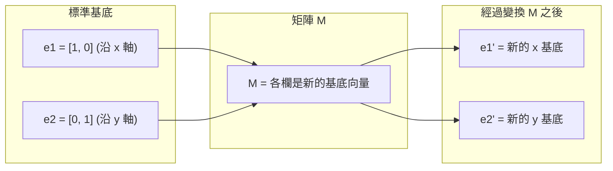
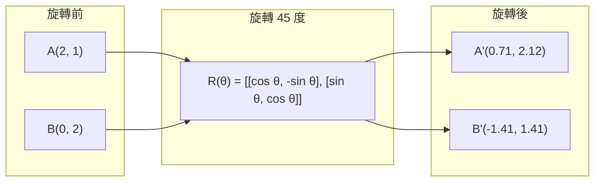
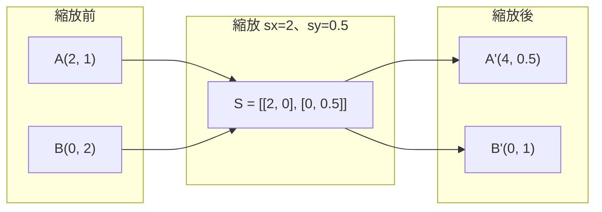
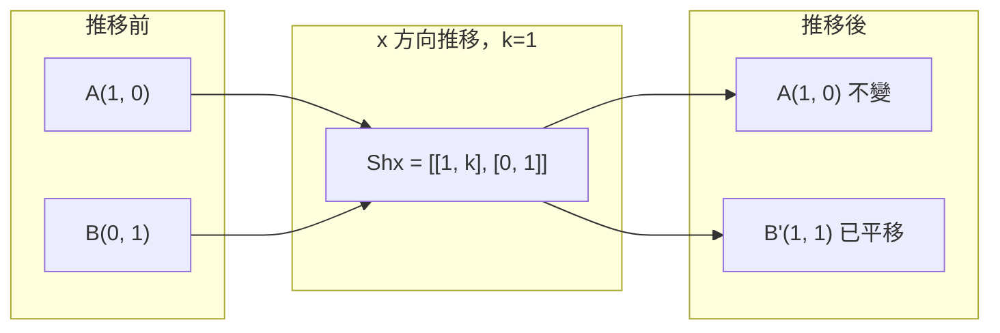
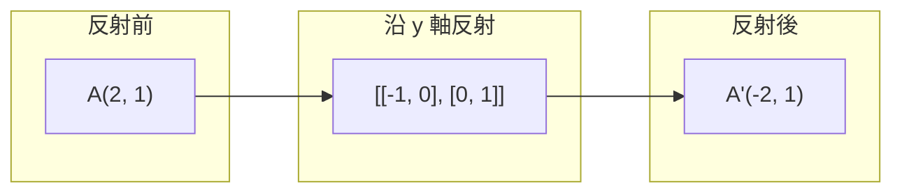
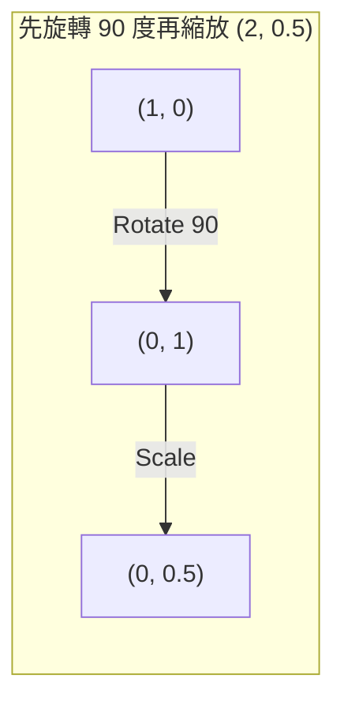
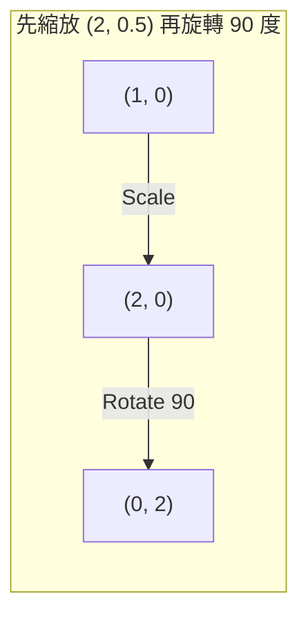

# 矩陣變換

> 矩陣就像能重塑空間的機器。了解它對每個點做了什麼，你就理解整個變換。

**Type:** Build
**Languages:** Python, Julia
**Prerequisites:** Phase 1, Lessons 01-02 (Linear Algebra Intuition, Vectors & Matrices Operations)
**Time:** ~75 minutes

## Learning Objectives｜學習目標

- 建立旋轉、縮放、推移（shearing）和反射（reflection）矩陣，並套用到 2D 與 3D 的點
- 用矩陣乘法組合多個變換，並驗證順序確實影響結果
- 用特徵方程式（characteristic equation）計算 2x2 矩陣的特徵值（eigenvalue）與特徵向量（eigenvector）
- 說明為什麼特徵值決定了主成分分析（PCA）方向、RNN 穩定性和譜分群（spectral clustering）的行為

## The Problem｜問題

讀 PCA 的資料時會看到「求共變異數矩陣（covariance matrix）的特徵向量」；讀模型（model）穩定性的資料時會看到「檢查所有特徵值的絕對值是否都小於 1」；讀資料增強（data augmentation）時會看到「套用隨機旋轉」。在理解矩陣對空間做了什麼之前，這些全都說不通。

矩陣不只是數字網格，它們是空間機器：旋轉矩陣轉動點、縮放矩陣拉伸點、推移矩陣會使點的位置傾斜。神經網路（neural network）對資料做的每個變換，都是這些運算之一，或它們的組合。本課把這些運算變得具體。

## The Concept｜核心概念

### 變換即矩陣

每個 2D 線性變換（linear transformation）都能寫成一個 2x2 矩陣。這個矩陣精確告訴你基底向量（basis vector）[1, 0] 和 [0, 1] 最終去了哪裡，其他一切就迎刃而解。



### 旋轉

旋轉角度 θ 的 2D 旋轉保持距離與角度不變，讓每個點沿著圓弧移動。



在 3D 中，你繞著一個軸旋轉。每個軸有自己的旋轉矩陣：

```
Rz(theta) = | cos  -sin  0 |     Rotate around z-axis
            | sin   cos  0 |     (x-y plane spins, z stays)
            |  0     0   1 |

Rx(theta) = | 1   0     0    |   Rotate around x-axis
            | 0  cos  -sin   |   (y-z plane spins, x stays)
            | 0  sin   cos   |

Ry(theta) = |  cos  0  sin |     Rotate around y-axis
            |   0   1   0  |     (x-z plane spins, y stays)
            | -sin  0  cos |
```

### 縮放

縮放沿每個軸獨立地拉伸或壓縮。



### 推移

推移（shearing）讓一個軸傾斜、另一個軸保持不動，把矩形變成平行四邊形。



推移矩陣：
- `Shx = [[1, k], [0, 1]]` 把 x 平移 k * y
- `Shy = [[1, 0], [k, 1]]` 把 y 平移 k * x

### 反射

反射（reflection）把點沿某個軸或直線做鏡射翻轉。



反射矩陣：
- 沿 y 軸反射：`[[-1, 0], [0, 1]]`
- 沿 x 軸反射：`[[1, 0], [0, -1]]`

### 組合：串接變換

先套用變換 A 再套用 B，等同於把它們的矩陣相乘：`result = B @ A @ point`。順序很重要——先旋轉再縮放，和先縮放再旋轉，結果不同。



組合後：`S @ R = [[0, -2], [0.5, 0]]`



組合後：`R @ S = [[0, -0.5], [2, 0]]`

結果不同。矩陣乘法不可交換（not commutative）。

### 特徵值與特徵向量

多數向量經過矩陣變換後會改變方向。特徵向量很特別：矩陣只會縮放它們，不會旋轉它們。縮放的比例就是特徵值。

```
A @ v = lambda * v

v is the eigenvector (direction that survives)
lambda is the eigenvalue (how much it stretches)

Example: A = | 2  1 |
             | 1  2 |

Eigenvector [1, 1] with eigenvalue 3:
  A @ [1,1] = [3, 3] = 3 * [1, 1]     (same direction, scaled by 3)

Eigenvector [1, -1] with eigenvalue 1:
  A @ [1,-1] = [1, -1] = 1 * [1, -1]  (same direction, unchanged)
```

這個矩陣把空間沿 [1, 1] 方向拉伸 3 倍，並保持 [1, -1] 不變。其他所有方向都是這兩者的混合。

### 特徵分解

如果一個矩陣有 n 個線性獨立的特徵向量，它可以分解為：

```
A = V @ D @ V^(-1)

V = matrix whose columns are eigenvectors
D = diagonal matrix of eigenvalues
V^(-1) = inverse of V

This says: rotate into eigenvector coordinates, scale along each axis, rotate back.
```

### 為什麼特徵值重要

**PCA。** 共變異數矩陣的特徵向量就是主成分（principal component），特徵值告訴你每個成分捕捉到多少變異數（variance）。依特徵值排序、取前 k 個，就完成降維（dimensionality reduction）。

**穩定性。** 在循環神經網路（RNN）和動態系統中，絕對值大於 1 的特徵值會讓輸出爆炸，小於 1 則讓輸出消失。這就是用一句話說完的梯度消失／爆炸問題。

**譜方法（spectral methods）。** 圖神經網路使用相鄰矩陣（adjacency matrix）的特徵值；譜分群使用拉普拉斯矩陣（Laplacian）的特徵值。特徵向量揭露了圖的結構。

### 行列式是體積縮放因子

變換矩陣的行列式告訴你它把面積（2D）或體積（3D）縮放了多少。

```
det = 1:   area preserved (rotation)
det = 2:   area doubled
det = 0:   space crushed to lower dimension (singular)
det = -1:  area preserved but orientation flipped (reflection)

| det(Rotation) | = 1        (always)
| det(Scale sx, sy) | = sx * sy
| det(Shear) | = 1           (area preserved)
| det(Reflection) | = -1     (orientation flipped)
```

```figure
matrix-transform
```

## Build It｜動手實作

### 步驟 1：從零打造變換矩陣（Python）

```python
import math

def rotation_2d(theta):
    c, s = math.cos(theta), math.sin(theta)
    return [[c, -s], [s, c]]

def scaling_2d(sx, sy):
    return [[sx, 0], [0, sy]]

def shearing_2d(kx, ky):
    return [[1, kx], [ky, 1]]

def reflection_x():
    return [[1, 0], [0, -1]]

def reflection_y():
    return [[-1, 0], [0, 1]]

def mat_vec_mul(matrix, vector):
    return [
        sum(matrix[i][j] * vector[j] for j in range(len(vector)))
        for i in range(len(matrix))
    ]

def mat_mul(a, b):
    rows_a, cols_b = len(a), len(b[0])
    cols_a = len(a[0])
    return [
        [sum(a[i][k] * b[k][j] for k in range(cols_a)) for j in range(cols_b)]
        for i in range(rows_a)
    ]

point = [1.0, 0.0]
angle = math.pi / 4

rotated = mat_vec_mul(rotation_2d(angle), point)
print(f"Rotate (1,0) by 45 deg: ({rotated[0]:.4f}, {rotated[1]:.4f})")

scaled = mat_vec_mul(scaling_2d(2, 3), [1.0, 1.0])
print(f"Scale (1,1) by (2,3): ({scaled[0]:.1f}, {scaled[1]:.1f})")

sheared = mat_vec_mul(shearing_2d(1, 0), [1.0, 1.0])
print(f"Shear (1,1) kx=1: ({sheared[0]:.1f}, {sheared[1]:.1f})")

reflected = mat_vec_mul(reflection_y(), [2.0, 1.0])
print(f"Reflect (2,1) across y: ({reflected[0]:.1f}, {reflected[1]:.1f})")
```

### 步驟 2：變換的組合

```python
R = rotation_2d(math.pi / 2)
S = scaling_2d(2, 0.5)

rotate_then_scale = mat_mul(S, R)
scale_then_rotate = mat_mul(R, S)

point = [1.0, 0.0]
result1 = mat_vec_mul(rotate_then_scale, point)
result2 = mat_vec_mul(scale_then_rotate, point)

print(f"Rotate 90 then scale: ({result1[0]:.2f}, {result1[1]:.2f})")
print(f"Scale then rotate 90: ({result2[0]:.2f}, {result2[1]:.2f})")
print(f"Same? {result1 == result2}")
```

### 步驟 3：從零計算特徵值（2x2）

對 2x2 矩陣 `[[a, b], [c, d]]`，特徵值是特徵方程式的解：`lambda^2 - (a+d)*lambda + (ad - bc) = 0`。

```python
def eigenvalues_2x2(matrix):
    a, b = matrix[0]
    c, d = matrix[1]
    trace = a + d
    det = a * d - b * c
    discriminant = trace ** 2 - 4 * det
    if discriminant < 0:
        real = trace / 2
        imag = (-discriminant) ** 0.5 / 2
        return (complex(real, imag), complex(real, -imag))
    sqrt_disc = discriminant ** 0.5
    return ((trace + sqrt_disc) / 2, (trace - sqrt_disc) / 2)

def eigenvector_2x2(matrix, eigenvalue):
    a, b = matrix[0]
    c, d = matrix[1]
    if abs(b) > 1e-10:
        v = [b, eigenvalue - a]
    elif abs(c) > 1e-10:
        v = [eigenvalue - d, c]
    else:
        if abs(a - eigenvalue) < 1e-10:
            v = [1, 0]
        else:
            v = [0, 1]
    mag = (v[0] ** 2 + v[1] ** 2) ** 0.5
    return [v[0] / mag, v[1] / mag]

A = [[2, 1], [1, 2]]
vals = eigenvalues_2x2(A)
print(f"Matrix: {A}")
print(f"Eigenvalues: {vals[0]:.4f}, {vals[1]:.4f}")

for val in vals:
    vec = eigenvector_2x2(A, val)
    result = mat_vec_mul(A, vec)
    scaled = [val * vec[0], val * vec[1]]
    print(f"  lambda={val:.1f}, v={[round(x,4) for x in vec]}")
    print(f"    A@v = {[round(x,4) for x in result]}")
    print(f"    l*v = {[round(x,4) for x in scaled]}")
```

### 步驟 4：行列式即體積縮放因子

```python
def det_2x2(matrix):
    return matrix[0][0] * matrix[1][1] - matrix[0][1] * matrix[1][0]

print(f"det(rotation 45) = {det_2x2(rotation_2d(math.pi/4)):.4f}")
print(f"det(scale 2,3)   = {det_2x2(scaling_2d(2, 3)):.1f}")
print(f"det(shear kx=1)  = {det_2x2(shearing_2d(1, 0)):.1f}")
print(f"det(reflect y)   = {det_2x2(reflection_y()):.1f}")

singular = [[1, 2], [2, 4]]
print(f"det(singular)     = {det_2x2(singular):.1f}")
print("Singular: columns are proportional, space collapses to a line.")
```

## Use It｜實際應用

NumPy 用最佳化的常式處理以上所有運算。

```python
import numpy as np

theta = np.pi / 4
R = np.array([[np.cos(theta), -np.sin(theta)],
              [np.sin(theta),  np.cos(theta)]])

point = np.array([1.0, 0.0])
print(f"Rotate (1,0) by 45 deg: {R @ point}")

S = np.diag([2.0, 3.0])
composed = S @ R
print(f"Scale(2,3) after Rotate(45): {composed @ point}")

A = np.array([[2, 1], [1, 2]], dtype=float)
eigenvalues, eigenvectors = np.linalg.eig(A)
print(f"\nEigenvalues: {eigenvalues}")
print(f"Eigenvectors (columns):\n{eigenvectors}")

for i in range(len(eigenvalues)):
    v = eigenvectors[:, i]
    lam = eigenvalues[i]
    print(f"  A @ v{i} = {A @ v}, lambda * v{i} = {lam * v}")

print(f"\ndet(R) = {np.linalg.det(R):.4f}")
print(f"det(S) = {np.linalg.det(S):.1f}")

B = np.array([[3, 1], [0, 2]], dtype=float)
vals, vecs = np.linalg.eig(B)
D = np.diag(vals)
V = vecs
reconstructed = V @ D @ np.linalg.inv(V)
print(f"\nEigendecomposition A = V @ D @ V^-1:")
print(f"Original:\n{B}")
print(f"Reconstructed:\n{reconstructed}")
```

### 用 NumPy 做 3D 旋轉

```python
def rotation_3d_z(theta):
    c, s = np.cos(theta), np.sin(theta)
    return np.array([[c, -s, 0], [s, c, 0], [0, 0, 1]])

def rotation_3d_x(theta):
    c, s = np.cos(theta), np.sin(theta)
    return np.array([[1, 0, 0], [0, c, -s], [0, s, c]])

point_3d = np.array([1.0, 0.0, 0.0])
rotated_z = rotation_3d_z(np.pi / 2) @ point_3d
rotated_x = rotation_3d_x(np.pi / 2) @ point_3d

print(f"\n3D point: {point_3d}")
print(f"Rotate 90 around z: {np.round(rotated_z, 4)}")
print(f"Rotate 90 around x: {np.round(rotated_x, 4)}")
```

## Ship It｜交付成果

本課為 PCA（第 2 階段）和神經網路權重（weight）分析打下幾何基礎。這裡寫的特徵值／特徵向量程式，和實務上的 ML 系統中驅動降維、譜分群與穩定性分析的是同一套演算法。

## Exercises｜練習

1. 對單位正方形（頂點在 [0,0]、[1,0]、[1,1]、[0,1]）套用旋轉、縮放和推移，印出每種變換後的頂點。驗證旋轉保持頂點間的距離。

2. 用特徵方程式手算矩陣 [[4, 2], [1, 3]] 的特徵值，然後用你從零寫的函式和 NumPy 驗證。

3. 組合三個變換（旋轉 30 度、依 [1.5, 0.8] 縮放、kx=0.3 的推移），套用到圓周上排列的 8 個點。印出變換前後的座標。計算組合矩陣的行列式，驗證它等於各個行列式的乘積。

## Key Terms｜關鍵術語

| 術語 | 常見說法 | 實際意義 |
|------|----------------|----------------------|
| 旋轉矩陣（rotation matrix） | 「把東西轉一轉」 | 讓點沿圓弧移動、同時保持距離與角度的正交矩陣（orthogonal matrix），行列式恆為 1。 |
| 縮放矩陣（scaling matrix） | 「把東西放大」 | 沿各軸獨立拉伸或壓縮的對角矩陣，行列式是各縮放因子的乘積。 |
| 推移矩陣（shearing matrix） | 「把東西推斜」 | 依另一座標的比例平移某一個座標的矩陣，把矩形變成平行四邊形，行列式為 1。 |
| 反射（reflection） | 「照鏡子」 | 把空間沿某個軸或平面翻轉的矩陣，行列式為 -1。 |
| 組合（composition） | 「做兩件事」 | 把變換矩陣相乘以串接運算。順序很重要：B @ A 表示先套用 A，再套用 B。 |
| 特徵向量（eigenvector） | 「特別的方向」 | 矩陣只會縮放、不會旋轉的方向，是這個變換的指紋。 |
| 特徵值（eigenvalue） | 「它拉伸多少」 | 矩陣縮放其特徵向量的純量因子。可以是負數（翻轉）或複數（旋轉）。 |
| 特徵分解（eigendecomposition） | 「把矩陣拆開」 | 把矩陣寫成 V @ D @ V^(-1)，分離出它的基本縮放方向與幅度。 |
| 行列式（determinant） | 「矩陣算出的單一數字」 | 變換對面積（2D）或體積（3D）的縮放因子。為零代表變換不可逆。 |
| 特徵方程式（characteristic equation） | 「特徵值從哪來」 | det(A - lambda * I) = 0。其根即為特徵值的多項式。 |

## Further Reading｜延伸閱讀

- [3Blue1Brown: Linear Transformations](https://www.3blue1brown.com/lessons/linear-transformations) -- 矩陣如何重塑空間的視覺直覺
- [3Blue1Brown: Eigenvectors and Eigenvalues](https://www.3blue1brown.com/lessons/eigenvalues) -- 特徵向量幾何意義的最佳視覺化解說
- [MIT 18.06 Lecture 21: Eigenvalues and Eigenvectors](https://ocw.mit.edu/courses/18-06-linear-algebra-spring-2010/) -- Gilbert Strang 的經典講授
