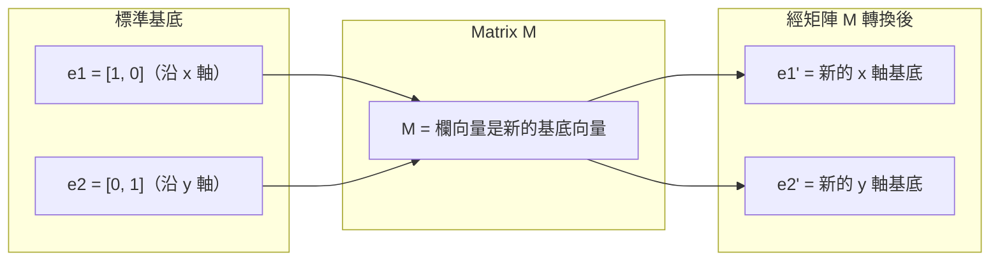
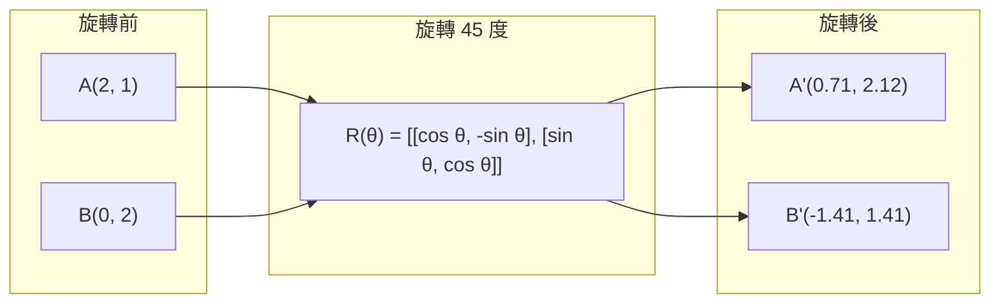
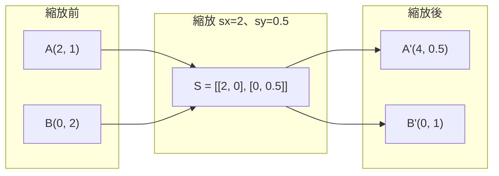
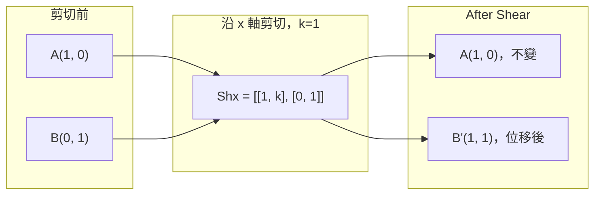
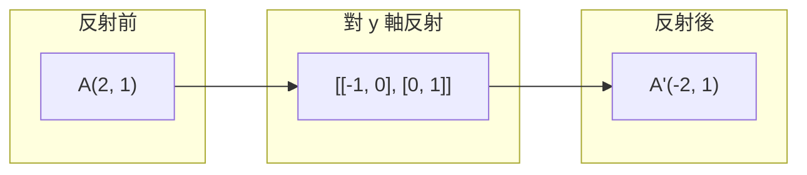
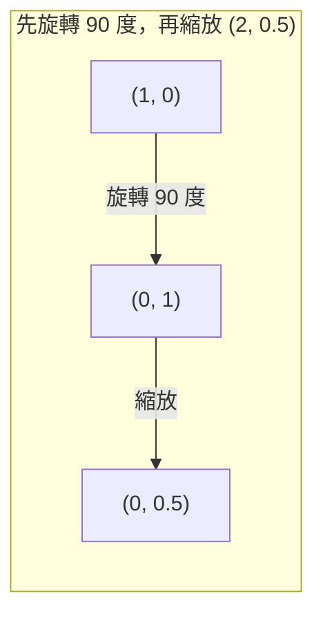
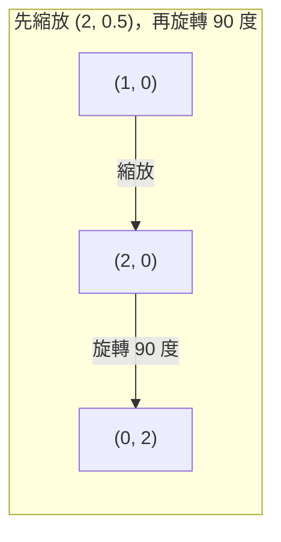

# 矩陣轉換

> 矩陣就像一台重塑空間的機器。了解它如何改變每個點，就能掌握整個轉換。

**Type:** Build
**Languages:** Python, Julia
**Prerequisites:** Phase 1, Lessons 01-02 (Linear Algebra Intuition, Vectors & Matrices Operations)
**Time:** ~75 minutes

## 學習目標

- 建立旋轉、縮放、剪切與反射矩陣，並將它們套用到二維和三維的點上
- 透過矩陣乘法組合多個轉換，並驗證運算順序會影響結果
- 從特徵方程式計算 2x2 矩陣的特徵值與特徵向量
- 說明特徵值如何決定 PCA 的方向、RNN 的穩定性，以及譜分群的行為

## The Problem｜問題

你讀到 PCA 時，看到「找出共變異數矩陣的特徵向量」；讀到模型穩定性時，看到「確認所有特徵值的大小都小於 1」；讀到資料擴增時，則看到「套用隨機旋轉」。只有先了解矩陣在幾何上如何改變空間，這些說法才有意義。

矩陣不只是數字格子，也是改變空間的機器。旋轉矩陣會轉動點，縮放矩陣會拉伸點，剪切矩陣會傾斜點。神經網路對資料套用的每一種轉換，都是這些操作之一，或是由它們組合而成。這一課會把這些操作具體呈現出來。

## The Concept｜核心概念

### 以矩陣表示轉換

二維空間中的每個線性轉換，都能寫成一個 2x2 矩陣。矩陣會明確指出基底向量 [1, 0] 和 [0, 1] 轉換後的位置；其他向量的結果也就隨之確定。



### 旋轉

二維旋轉會讓每個點沿著圓弧移動，同時保留距離與角度。



在三維空間中，旋轉會繞著某個軸進行。每個軸都有自己的旋轉矩陣：

```text
Rz(theta) = | cos  -sin  0 |     繞 z 軸旋轉
            | sin   cos  0 |     （x-y 平面旋轉，z 不變）
            |  0     0   1 |

Rx(theta) = | 1   0     0    |   繞 x 軸旋轉
            | 0  cos  -sin   |   （y-z 平面旋轉，x 不變）
            | 0  sin   cos   |

Ry(theta) = |  cos  0  sin |     繞 y 軸旋轉
            |   0   1   0  |     （x-z 平面旋轉，y 不變）
            | -sin  0  cos |
```

### 縮放

縮放會沿著各個座標軸分別拉伸或壓縮。



### 剪切

剪切會固定一個軸，並讓另一個軸傾斜，使長方形變成平行四邊形。



剪切矩陣：
- `Shx = [[1, k], [0, 1]]` 會讓 x 位移 `k * y`
- `Shy = [[1, 0], [k, 1]]` 會讓 y 位移 `k * x`

### 反射

反射會讓點沿著某個軸或直線翻轉。



反射矩陣：
- 對 y 軸反射：`[[-1, 0], [0, 1]]`
- 對 x 軸反射：`[[1, 0], [0, -1]]`

### 組合：串接多個轉換

先套用轉換 A，再套用轉換 B，等同於將矩陣相乘：`result = B @ A @ point`。順序很重要；先旋轉再縮放，和先縮放再旋轉會得到不同結果。



組合結果：`S @ R = [[0, -2], [0.5, 0]]`



組合結果：`R @ S = [[0, -0.5], [2, 0]]`

結果不同，因為矩陣乘法不符合交換律。

### 特徵值與特徵向量

矩陣作用在大多數向量上時，都會改變它們的方向。特徵向量很特別：矩陣只會縮放它們，不會讓它們旋轉；縮放倍數就是特徵值。

```text
A @ v = lambda * v

v 是特徵向量（轉換後仍維持方向的向量）
lambda 是特徵值（向量被縮放的倍數）

例子：A = | 2  1 |
             | 1  2 |

特徵向量 [1, 1] 的特徵值為 3：
  A @ [1,1] = [3, 3] = 3 * [1, 1]     （方向相同，放大 3 倍）

特徵向量 [1, -1] 的特徵值為 1：
  A @ [1,-1] = [1, -1] = 1 * [1, -1]  （方向相同，大小不變）
```

這個矩陣會沿著 [1, 1] 將空間拉伸 3 倍，並保持 [1, -1] 不變。其他所有方向都能表示成這兩個方向的組合。

### 特徵分解

如果一個矩陣有 n 個線性獨立的特徵向量，就能將它分解為：

```text
A = V @ D @ V^(-1)

V = 欄向量為特徵向量的矩陣
D = 由特徵值組成的對角矩陣
V^(-1) = V 的反矩陣

意思是：先轉到特徵向量座標系，沿各軸縮放，再轉回原座標系。
```

### 特徵值為什麼重要

**PCA。** 共變異數矩陣的特徵向量就是主成分；特徵值則表示每個主成分能捕捉多少變異量。依特徵值排序並保留最大的前 k 個，就能完成降維。

**穩定性。** 在循環網路和動態系統中，大小大於 1 的特徵值會使輸出爆增；大小小於 1 則會使輸出逐漸消失。這正是用一句話說明梯度消失／梯度爆炸問題。

**譜方法。** 圖神經網路會用到鄰接矩陣的特徵值；譜分群會用到拉普拉斯矩陣的特徵值。特徵向量則能揭示圖的結構。

### 行列式：體積縮放因子

轉換矩陣的行列式會告訴你，它將面積（二維）或體積（三維）縮放了多少。

```text
det = 1：面積不變（旋轉）
det = 2：面積加倍
det = 0：空間被壓縮至較低維度（奇異矩陣）
det = -1：面積不變，但方向翻轉（反射）

| det(旋轉) | = 1        （恆成立）
| det(縮放 sx, sy) | = sx * sy
| det(剪切) | = 1           （面積不變）
| det(反射) | = -1     （方向翻轉）
```

```figure
matrix-transform
```

## Build It｜動手打造

### 步驟 1：從零實作轉換矩陣（Python）

```python
import math

def rotation_2d(theta):
    c, s = math.cos(theta), math.sin(theta)
    return [[c, -s], [s, c]]

def scaling_2d(sx, sy):
    return [[sx, 0], [0, sy]]

def shearing_2d(kx, ky):
    return [[1, kx], [ky, 1]]

def reflection_x():
    return [[1, 0], [0, -1]]

def reflection_y():
    return [[-1, 0], [0, 1]]

def mat_vec_mul(matrix, vector):
    return [
        sum(matrix[i][j] * vector[j] for j in range(len(vector)))
        for i in range(len(matrix))
    ]

def mat_mul(a, b):
    rows_a, cols_b = len(a), len(b[0])
    cols_a = len(a[0])
    return [
        [sum(a[i][k] * b[k][j] for k in range(cols_a)) for j in range(cols_b)]
        for i in range(rows_a)
    ]

point = [1.0, 0.0]
angle = math.pi / 4

rotated = mat_vec_mul(rotation_2d(angle), point)
print(f"Rotate (1,0) by 45 deg: ({rotated[0]:.4f}, {rotated[1]:.4f})")

scaled = mat_vec_mul(scaling_2d(2, 3), [1.0, 1.0])
print(f"Scale (1,1) by (2,3): ({scaled[0]:.1f}, {scaled[1]:.1f})")

sheared = mat_vec_mul(shearing_2d(1, 0), [1.0, 1.0])
print(f"Shear (1,1) kx=1: ({sheared[0]:.1f}, {sheared[1]:.1f})")

reflected = mat_vec_mul(reflection_y(), [2.0, 1.0])
print(f"Reflect (2,1) across y: ({reflected[0]:.1f}, {reflected[1]:.1f})")
```

### 步驟 2：組合多個轉換

```python
R = rotation_2d(math.pi / 2)
S = scaling_2d(2, 0.5)

rotate_then_scale = mat_mul(S, R)
scale_then_rotate = mat_mul(R, S)

point = [1.0, 0.0]
result1 = mat_vec_mul(rotate_then_scale, point)
result2 = mat_vec_mul(scale_then_rotate, point)

print(f"Rotate 90 then scale: ({result1[0]:.2f}, {result1[1]:.2f})")
print(f"Scale then rotate 90: ({result2[0]:.2f}, {result2[1]:.2f})")
print(f"Same? {result1 == result2}")
```

### 步驟 3：從零計算特徵值（2x2）

對於 2x2 矩陣 `[[a, b], [c, d]]`，特徵值是下列特徵方程式的解：`lambda^2 - (a+d)*lambda + (ad - bc) = 0`。

```python
def eigenvalues_2x2(matrix):
    a, b = matrix[0]
    c, d = matrix[1]
    trace = a + d
    det = a * d - b * c
    discriminant = trace ** 2 - 4 * det
    if discriminant < 0:
        real = trace / 2
        imag = (-discriminant) ** 0.5 / 2
        return (complex(real, imag), complex(real, -imag))
    sqrt_disc = discriminant ** 0.5
    return ((trace + sqrt_disc) / 2, (trace - sqrt_disc) / 2)

def eigenvector_2x2(matrix, eigenvalue):
    a, b = matrix[0]
    c, d = matrix[1]
    if abs(b) > 1e-10:
        v = [b, eigenvalue - a]
    elif abs(c) > 1e-10:
        v = [eigenvalue - d, c]
    else:
        if abs(a - eigenvalue) < 1e-10:
            v = [1, 0]
        else:
            v = [0, 1]
    mag = (v[0] ** 2 + v[1] ** 2) ** 0.5
    return [v[0] / mag, v[1] / mag]

A = [[2, 1], [1, 2]]
vals = eigenvalues_2x2(A)
print(f"Matrix: {A}")
print(f"Eigenvalues: {vals[0]:.4f}, {vals[1]:.4f}")

for val in vals:
    vec = eigenvector_2x2(A, val)
    result = mat_vec_mul(A, vec)
    scaled = [val * vec[0], val * vec[1]]
    print(f"  lambda={val:.1f}, v={[round(x,4) for x in vec]}")
    print(f"    A@v = {[round(x,4) for x in result]}")
    print(f"    l*v = {[round(x,4) for x in scaled]}")
```

### 步驟 4：行列式作為體積縮放因子

```python
def det_2x2(matrix):
    return matrix[0][0] * matrix[1][1] - matrix[0][1] * matrix[1][0]

print(f"det(rotation 45) = {det_2x2(rotation_2d(math.pi/4)):.4f}")
print(f"det(scale 2,3)   = {det_2x2(scaling_2d(2, 3)):.1f}")
print(f"det(shear kx=1)  = {det_2x2(shearing_2d(1, 0)):.1f}")
print(f"det(reflect y)   = {det_2x2(reflection_y()):.1f}")

singular = [[1, 2], [2, 4]]
print(f"det(singular)     = {det_2x2(singular):.1f}")
print("Singular: columns are proportional, space collapses to a line.")
```

## Use It｜開始使用

NumPy 會透過最佳化過的函式處理以上所有運算。

```python
import numpy as np

theta = np.pi / 4
R = np.array([[np.cos(theta), -np.sin(theta)],
              [np.sin(theta),  np.cos(theta)]])

point = np.array([1.0, 0.0])
print(f"Rotate (1,0) by 45 deg: {R @ point}")

S = np.diag([2.0, 3.0])
composed = S @ R
print(f"Scale(2,3) after Rotate(45): {composed @ point}")

A = np.array([[2, 1], [1, 2]], dtype=float)
eigenvalues, eigenvectors = np.linalg.eig(A)
print(f"\nEigenvalues: {eigenvalues}")
print(f"Eigenvectors (columns):\n{eigenvectors}")

for i in range(len(eigenvalues)):
    v = eigenvectors[:, i]
    lam = eigenvalues[i]
    print(f"  A @ v{i} = {A @ v}, lambda * v{i} = {lam * v}")

print(f"\ndet(R) = {np.linalg.det(R):.4f}")
print(f"det(S) = {np.linalg.det(S):.1f}")

B = np.array([[3, 1], [0, 2]], dtype=float)
vals, vecs = np.linalg.eig(B)
D = np.diag(vals)
V = vecs
reconstructed = V @ D @ np.linalg.inv(V)
print(f"\nEigendecomposition A = V @ D @ V^-1:")
print(f"Original:\n{B}")
print(f"Reconstructed:\n{reconstructed}")
```

### 使用 NumPy 計算三維旋轉

```python
def rotation_3d_z(theta):
    c, s = np.cos(theta), np.sin(theta)
    return np.array([[c, -s, 0], [s, c, 0], [0, 0, 1]])

def rotation_3d_x(theta):
    c, s = np.cos(theta), np.sin(theta)
    return np.array([[1, 0, 0], [0, c, -s], [0, s, c]])

point_3d = np.array([1.0, 0.0, 0.0])
rotated_z = rotation_3d_z(np.pi / 2) @ point_3d
rotated_x = rotation_3d_x(np.pi / 2) @ point_3d

print(f"\n3D point: {point_3d}")
print(f"Rotate 90 around z: {np.round(rotated_z, 4)}")
print(f"Rotate 90 around x: {np.round(rotated_x, 4)}")
```

## Ship It｜交付成果

本課程建立 PCA（Phase 2）與神經網路權重分析所需的幾何基礎。這裡實作的特徵值／特徵向量程式碼，使用的演算法也正是實際機器學習系統用來執行降維、譜分群和穩定性分析的演算法。

## Exercises｜練習

1. 對單位正方形（頂點為 [0,0]、[1,0]、[1,1]、[0,1]）套用旋轉、縮放和剪切。分別印出轉換後的頂點，並確認旋轉會保留頂點之間的距離。

2. 使用特徵方程式手算矩陣 [[4, 2], [1, 3]] 的特徵值，再用你從零實作的函式和 NumPy 驗證。

3. 組合三種轉換（旋轉 30 度、依 [1.5, 0.8] 縮放、以 kx=0.3 剪切），並套用到圓周上的 8 個點。印出轉換前後的座標，計算組合矩陣的行列式，並確認它等於各轉換矩陣行列式的乘積。

## Key Terms｜重要詞彙

| 詞彙 | 一般說法 | 實際意義 |
|------|----------------|----------------------|
| 旋轉矩陣 |「讓東西轉動」| 沿著圓弧移動點，同時保留距離與角度的正交矩陣。行列式一定是 1。 |
| 縮放矩陣 |「把東西放大」| 沿各座標軸分別拉伸或壓縮的對角矩陣。行列式等於各軸縮放因子的乘積。 |
| 剪切矩陣 |「讓東西傾斜」| 依另一個座標的比例移動某一座標，使長方形變成平行四邊形的矩陣。行列式為 1。 |
| 反射 |「像鏡子一樣翻轉」| 沿著軸或平面翻轉空間的矩陣。行列式為 -1。 |
| 組合 |「連做兩件事」| 將轉換矩陣相乘以串接多個操作。順序很重要：`B @ A` 表示先套用 A，再套用 B。 |
| 特徵向量 |「特別的方向」| 矩陣只會縮放、不會旋轉的方向，也是轉換的特徵。 |
| 特徵值 |「拉伸多少」| 矩陣縮放其特徵向量的純量倍數。可以是負數（翻轉）或複數（旋轉）。 |
| 特徵分解 |「把矩陣拆開」| 將矩陣寫成 `V @ D @ V^(-1)`，拆解出基本的縮放方向與幅度。 |
| 行列式 |「矩陣算出來的一個數字」| 轉換對面積（二維）或體積（三維）的縮放因子。行列式為零表示轉換不可逆。 |
| 特徵方程式 |「特徵值的來源」| `det(A - lambda * I) = 0`。這個多項式的根就是特徵值。 |

## 延伸閱讀

- [3Blue1Brown：線性轉換](https://www.3blue1brown.com/lessons/linear-transformations) — 以視覺直覺說明矩陣如何重塑空間
- [3Blue1Brown：特徵向量與特徵值](https://www.3blue1brown.com/lessons/eigenvalues) — 以視覺方式說明特徵向量在幾何上的意義
- [MIT 18.06 第 21 講：特徵值與特徵向量](https://ocw.mit.edu/courses/18-06-linear-algebra-spring-2010/) — Gilbert Strang 的經典講解
