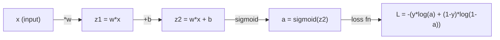
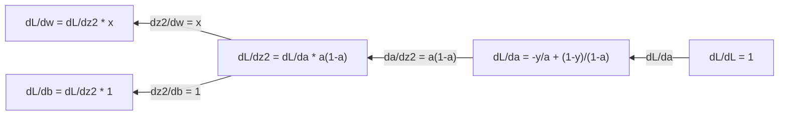
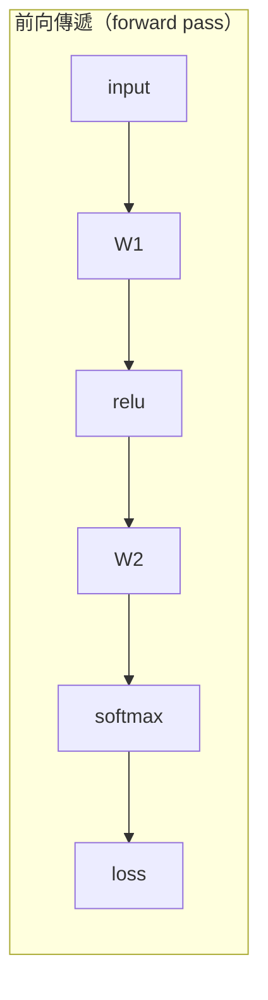
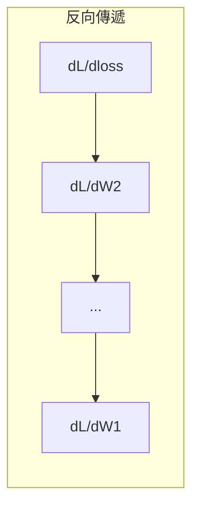

# 機器學習的微積分

> 導數（derivative）告訴你下坡往哪走。神經網路學習需要的就只是這個。

**Type:** Learn
**Language:** Python
**Prerequisites:** Phase 1, Lessons 01-03
**Time:** ~60 minutes

## Learning Objectives｜學習目標

- 為常見的 ML 函數（x^2、sigmoid、cross-entropy）計算數值微分（numerical derivative）與解析導數（analytical derivative）
- 從零實作梯度下降法（gradient descent），在 1D 和 2D 中最小化損失函數
- 推導線性迴歸（linear regression）模型的梯度，並透過手動權重更新（weight update）來訓練它
- 說明海森矩陣（Hessian）、泰勒級數（Taylor series）近似，以及它們與最佳化方法的關係

## The Problem｜問題

你有一個有數百萬個權重的神經網路。每個權重都是一個旋鈕，你得弄清楚每個旋鈕該往哪個方向轉，才能讓模型錯得少一點。微積分給你這個方向。

沒有微積分，訓練神經網路只能靠亂改一通、碰運氣。有了導數，你就能精確知道每個權重如何影響誤差——每一個旋鈕、每一次都轉對方向。

## The Concept｜核心概念

### 導數是什麼？

導數衡量變化率。對函數 y = f(x)，導數 f'(x) 告訴你：把 x 輕推一點點，y 會改變多少？

在幾何上，導數就是某點切線（tangent line）的斜率（slope）。

**f(x) = x^2：**

| x | f(x) | f'(x)（斜率） |
|---|------|---------------|
| 0 | 0    | 0（平坦，在谷底） |
| 1 | 1    | 2 |
| 2 | 4    | 4（此點的切線斜率） |
| 3 | 9    | 6 |

在 x=2，斜率是 4：把 x 往右移一點點，y 大約增加那個量的 4 倍。在 x=0，斜率是 0——你在碗底。

正式定義：

```
f'(x) = lim   f(x + h) - f(x)
        h->0  -----------------
                     h
```

在程式裡不用真的取極限，用很小的 h 就好——這就是數值微分。

### 偏導數：一次只看一個變數

真正的函數有很多輸入；神經網路的損失依賴數千個權重。偏導數（partial derivative）把其他變數都當成常數，只對其中一個變數取導數。

```
f(x, y) = x^2 + 3xy + y^2

df/dx = 2x + 3y     (treat y as a constant)
df/dy = 3x + 2y     (treat x as a constant)
```

每個偏導數回答的都是：如果我只動這一個權重，損失會怎麼變？

### 梯度：所有偏導數組成的向量

梯度（gradient）把每個偏導數收集成一個向量。對函數 f(x, y, z)，梯度是：

```
grad f = [ df/dx, df/dy, df/dz ]
```

梯度指向最陡的上升方向。要最小化一個函數，就往相反方向走。

**f(x,y) = x^2 + y^2 的等高線圖（contour plot）：**

這個函數形成碗狀，等高線是一圈圈的同心圓。最小值在 (0, 0)。

| 點 | grad f | -grad f（下降方向） |
|-------|--------|----------------------------|
| (1, 1) | [2, 2]（指向上坡，遠離最小值） | [-2, -2]（指向下坡，朝向最小值） |
| (0, 0) | [0, 0]（平坦，在最小值處） | [0, 0] |

這就是圖像化的梯度下降法：算出梯度、取負號、走一步。

### 與最佳化的連結

訓練神經網路就是最佳化（optimization）。你有一個損失函數 L(w1, w2, ..., wn) 衡量模型錯得多離譜，目標是最小化它。

```
Gradient descent update rule:

  w_new = w_old - learning_rate * dL/dw

For every weight:
  1. Compute the partial derivative of loss with respect to that weight
  2. Subtract a small multiple of it from the weight
  3. Repeat
```

學習率（learning rate）控制步長。太大會越過最低點，太小則慢如牛步。

**損失地景（loss landscape，1D 切片）：**

損失函數 L(w) 隨權重 w 變化，形成有山峰和山谷的曲線。

| 特徵 | 說明 |
|---------|-------------|
| 全域最小值（global minimum） | 整條曲線上最低的點——最佳解 |
| 局部最小值（local minimum） | 比鄰近點低、但不是全域最低的山谷 |
| 斜率 | 梯度下降法從任何起點沿著斜率往下坡走 |

梯度下降法沿斜率往下走。它可能卡在局部最小值，但在高維空間（數百萬個權重）中，這很少是實際問題。

### 數值微分 vs 解析導數

計算導數有兩種方法。

解析法：手動套用微積分規則。f(x) = x^2 的導數是 f'(x) = 2x。精確、快速。

數值法：用定義逼近。對很小的 h 計算 f(x+h) 和 f(x-h)，再取差值。

```
Numerical (central difference):

f'(x) ~= f(x + h) - f(x - h)
          -----------------------
                  2h

h = 0.0001 works well in practice
```

數值微分較慢，但對任何函數都適用。解析導數很快，但你得自己推導公式。神經網路框架用的是第三種方法：自動微分（automatic differentiation），以機械化方式算出精確導數。第 3 階段會看到。

### 簡單函數的手算導數

以下是你在 ML 中會一再看到的導數。

```
Function        Derivative       Used in
--------        ----------       -------
f(x) = x^2     f'(x) = 2x      Loss functions (MSE)
f(x) = wx + b  f'(w) = x        Linear layer (gradient w.r.t. weight)
                f'(b) = 1        Linear layer (gradient w.r.t. bias)
                f'(x) = w        Linear layer (gradient w.r.t. input)
f(x) = e^x     f'(x) = e^x     Softmax, attention
f(x) = ln(x)   f'(x) = 1/x     Cross-entropy loss
f(x) = 1/(1+e^-x)  f'(x) = f(x)(1-f(x))   Sigmoid activation
```

對 f(x) = x^2：

```
f(x) = x^2    f'(x) = 2x

  x    f(x)   f'(x)   meaning
  -2    4      -4      slope tilts left (decreasing)
  -1    1      -2      slope tilts left (decreasing)
   0    0       0      flat (minimum!)
   1    1       2      slope tilts right (increasing)
   2    4       4      slope tilts right (increasing)
```

對 f(w) = wx + b，當 x=3、b=1：

```
f(w) = 3w + 1    f'(w) = 3

The derivative with respect to w is just x.
If x is big, a small change in w causes a big change in output.
```

### 連鎖律

函數組合（composition）時，連鎖律（chain rule）告訴你如何微分。

```
If y = f(g(x)), then dy/dx = f'(g(x)) * g'(x)

Example: y = (3x + 1)^2
  outer: f(u) = u^2       f'(u) = 2u
  inner: g(x) = 3x + 1    g'(x) = 3
  dy/dx = 2(3x + 1) * 3 = 6(3x + 1)
```

神經網路是一串函數：輸入 -> 線性 -> 活化函數 -> 線性 -> 活化函數 -> 損失。反向傳播（backpropagation）就是把連鎖律從輸出到輸入反覆套用——整個演算法就這麼多。

### 海森矩陣

梯度告訴你斜率；海森矩陣告訴你曲率。

海森矩陣是二階偏導數組成的矩陣。對函數 f(x1, x2, ..., xn)，海森矩陣的第 (i, j) 項是：

```
H[i][j] = d^2f / (dx_i * dx_j)
```

對兩變數函數 f(x, y)：

```
H = | d^2f/dx^2    d^2f/dxdy |
    | d^2f/dydx    d^2f/dy^2 |
```

**海森矩陣在臨界點（critical point，梯度為零處）告訴你什麼：**

| 海森矩陣性質 | 意義 | 表面範例 |
|-----------------|---------|-----------------|
| 正定（所有特徵值（eigenvalues） > 0） | 局部最小值 | 朝上的碗 |
| 負定（所有特徵值 < 0） | 局部最大值 | 朝下的碗 |
| 不定（特徵值正負混合） | 鞍點 | 馬鞍形狀 |

**範例：** f(x, y) = x^2 - y^2（鞍點函數）

```
df/dx = 2x       df/dy = -2y
d^2f/dx^2 = 2    d^2f/dy^2 = -2    d^2f/dxdy = 0

H = | 2   0 |
    | 0  -2 |

Eigenvalues: 2 and -2 (one positive, one negative)
--> Saddle point at (0, 0)
```

對照 f(x, y) = x^2 + y^2（一個碗）：

```
H = | 2  0 |
    | 0  2 |

Eigenvalues: 2 and 2 (both positive)
--> Local minimum at (0, 0)
```

**為什麼海森矩陣在 ML 中重要：**

牛頓法（Newton's method）用海森矩陣採取比梯度下降法更好的最佳化步長。它不只看斜率，還考慮曲率：

```
Newton's update:    w_new = w_old - H^(-1) * gradient
Gradient descent:   w_new = w_old - lr * gradient
```

牛頓法收斂更快，因為海森矩陣「重新縮放」了梯度——陡的方向步子變小，平的方向步子變大。

代價是：有 N 個參數的神經網路，海森矩陣是 N x N。一百萬參數的模型需要一兆項的矩陣，這就是為什麼要用近似方法。

| 方法 | 使用什麼 | 成本 | 收斂 |
|--------|-------------|------|-------------|
| 梯度下降法 | 只用一階導數 | 每步 O(N) | 慢（線性） |
| 牛頓法 | 完整海森矩陣 | 每步 O(N^3) | 快（二次） |
| L-BFGS | 從梯度歷史近似海森矩陣 | 每步 O(N) | 中（超線性） |
| Adam | 每參數自適應速率（對角海森近似） | 每步 O(N) | 中 |
| 自然梯度 | Fisher 資訊矩陣（統計版 Hessian） | 每步 O(N^2) | 快 |

實務上，Adam 是深度學習的預設最佳化器（optimizer）。它透過追蹤每個參數梯度的移動平均數與變異數（variance），用很低的成本近似二階資訊。

### 泰勒級數近似

任何平滑函數都能在局部用多項式逼近：

```
f(x + h) = f(x) + f'(x)*h + (1/2)*f''(x)*h^2 + (1/6)*f'''(x)*h^3 + ...
```

取的項越多，近似越好——但只在 x 附近成立。

**為什麼泰勒級數對 ML 重要：**

- **一階泰勒 = 梯度下降法。** 當你用 f(x + h) ~ f(x) + f'(x)*h，就是在做線性近似。梯度下降法最小化這個線性模型，得到 h = -lr * f'(x)。

- **二階泰勒 = 牛頓法。** 用 f(x + h) ~ f(x) + f'(x)*h + (1/2)*f''(x)*h^2 得到二次模型，最小化它給出 h = -f'(x)/f''(x)——牛頓法的步長。

- **損失函數設計。** MSE 和交叉熵都是平滑的，也就是它們的泰勒展開行為良好。這不是巧合——平滑的損失讓最佳化可預測。

```
Approximation order    What it captures    Optimization method
-------------------    -----------------   -------------------
0th order (constant)   Just the value      Random search
1st order (linear)     Slope               Gradient descent
2nd order (quadratic)  Curvature           Newton's method
Higher orders          Finer structure     Rarely used in ML
```

關鍵洞見：所有基於梯度的最佳化，其實都是在局部近似損失函數，然後走向那個近似的最小值。

### ML 中的積分

導數告訴你變化率；積分（integral）計算累積量——曲線下的面積。

在 ML 中你很少手算積分，但這個概念無所不在：

**機率。** 對具有密度 p(x) 的連續隨機變數：
```
P(a < X < b) = integral from a to b of p(x) dx
```
a 到 b 之間機率密度曲線下的面積，就是落在該區間的機率。

**期望值（expected value）。** 依機率加權的平均結果：
```
E[f(X)] = integral of f(x) * p(x) dx
```
在資料分布（data distribution）上的期望損失就是一個積分；訓練最小化的是它的經驗（empirical）近似。

**KL 散度（KL divergence）。** 衡量兩個分布差多少：
```
KL(p || q) = integral of p(x) * log(p(x) / q(x)) dx
```
用於 VAE、知識蒸餾（knowledge distillation）和貝氏推論。

**正規化常數（normalization constant）。** 在貝氏推論中：
```
p(w | data) = p(data | w) * p(w) / integral of p(data | w) * p(w) dw
```
分母是對所有可能參數值的積分，往往難以求解——這就是為什麼要用 MCMC 和變分推論（variational inference）這類近似方法。

| 積分概念 | 在 ML 中的出現位置 |
|-----------------|----------------------|
| 曲線下面積 | 從密度函數算機率 |
| 期望值 | 損失函數、風險最小化 |
| KL 散度 | VAE、策略最佳化（policy optimization）、蒸餾 |
| 正規化 | 貝氏後驗、softmax 分母 |
| 邊際概似 | 模型比較、證據下界（ELBO） |

### 計算圖中的多變數連鎖律

連鎖律不只適用於排成一直線的純量函數。在神經網路中，變數會分岔又匯合。以下是導數如何流過一個簡單的前向傳遞（forward pass）：



反向傳遞從右到左計算梯度：



每個箭頭都乘上局部導數。任何參數的梯度，就是從損失到該參數路徑上所有局部導數的乘積。路徑分岔又匯合時，就把各路貢獻相加（多變數連鎖律）。

反向傳播的全部內容就是這個：在計算圖（computation graph）中，有系統地把連鎖律從輸出套用到輸入。

### 雅可比矩陣

當函數把向量映射到向量（像一個神經網路層）時，它的導數是一個矩陣。雅可比矩陣（Jacobian）包含每個輸出對每個輸入的所有偏導數。

對 f: R^n -> R^m，雅可比矩陣 J 是一個 m x n 矩陣：

| | x1 | x2 | ... | xn |
|---|---|---|---|---|
| f1 | df1/dx1 | df1/dx2 | ... | df1/dxn |
| f2 | df2/dx1 | df2/dx2 | ... | df2/dxn |
| ... | ... | ... | ... | ... |
| fm | dfm/dx1 | dfm/dx2 | ... | dfm/dxn |

你不會手算神經網路的雅可比矩陣——PyTorch 會處理。但知道它的存在有助於理解反向傳播中的形狀：如果一層把 R^n 映射到 R^m，它的雅可比矩陣就是 m x n，梯度會沿著這個矩陣的轉置向後流動。

### 為什麼這對神經網路重要

神經網路中每個權重都有一個梯度。梯度告訴你如何調整該權重以降低損失。





每個權重更新（weight update）：
- `W1 = W1 - lr * dL/dW1`
- `W2 = W2 - lr * dL/dW2`

前向傳遞（forward pass）算出預測和損失；反向傳遞算出損失對每個權重的梯度；然後每個權重往下坡走一小步。重複數百萬步——這就是深度學習。

```figure
derivative-tangent
```

## Build It｜動手實作

### 步驟 1：從零寫數值微分

```python
def numerical_derivative(f, x, h=1e-7):
    return (f(x + h) - f(x - h)) / (2 * h)

def f(x):
    return x ** 2

for x in [-2, -1, 0, 1, 2]:
    numerical = numerical_derivative(f, x)
    analytical = 2 * x
    print(f"x={x:2d}  f'(x) numerical={numerical:.6f}  analytical={analytical:.1f}")
```

數值微分與解析導數在小數點後多位都一致。

### 步驟 2：偏導數與梯度

```python
def numerical_gradient(f, point, h=1e-7):
    gradient = []
    for i in range(len(point)):
        point_plus = list(point)
        point_minus = list(point)
        point_plus[i] += h
        point_minus[i] -= h
        partial = (f(point_plus) - f(point_minus)) / (2 * h)
        gradient.append(partial)
    return gradient

def f_multi(point):
    x, y = point
    return x**2 + 3*x*y + y**2

grad = numerical_gradient(f_multi, [1.0, 2.0])
print(f"Numerical gradient at (1,2): {[f'{g:.4f}' for g in grad]}")
print(f"Analytical gradient at (1,2): [2*1+3*2, 3*1+2*2] = [{2*1+3*2}, {3*1+2*2}]")
```

### 步驟 3：用梯度下降法找 f(x) = x^2 的最小值

```python
x = 5.0
lr = 0.1
for step in range(20):
    grad = 2 * x
    x = x - lr * grad
    print(f"step {step:2d}  x={x:8.4f}  f(x)={x**2:10.6f}")
```

從 x=5 開始，每一步都更靠近 x=0（最小值）。

### 步驟 4：對 2D 函數做梯度下降法

```python
def f_2d(point):
    x, y = point
    return x**2 + y**2

point = [4.0, 3.0]
lr = 0.1
for step in range(30):
    grad = numerical_gradient(f_2d, point)
    point = [p - lr * g for p, g in zip(point, grad)]
    loss = f_2d(point)
    if step % 5 == 0 or step == 29:
        print(f"step {step:2d}  point=({point[0]:7.4f}, {point[1]:7.4f})  f={loss:.6f}")
```

### 步驟 5：比較數值微分與解析導數

```python
import math

test_functions = [
    ("x^2",      lambda x: x**2,          lambda x: 2*x),
    ("x^3",      lambda x: x**3,          lambda x: 3*x**2),
    ("sin(x)",   lambda x: math.sin(x),   lambda x: math.cos(x)),
    ("e^x",      lambda x: math.exp(x),   lambda x: math.exp(x)),
    ("1/x",      lambda x: 1/x,           lambda x: -1/x**2),
]

x = 2.0
print(f"{'Function':<12} {'Numerical':>12} {'Analytical':>12} {'Error':>12}")
print("-" * 50)
for name, f, df in test_functions:
    num = numerical_derivative(f, x)
    ana = df(x)
    err = abs(num - ana)
    print(f"{name:<12} {num:12.6f} {ana:12.6f} {err:12.2e}")
```

### 步驟 6：數值計算海森矩陣

```python
def hessian_2d(f, x, y, h=1e-5):
    fxx = (f(x + h, y) - 2 * f(x, y) + f(x - h, y)) / (h ** 2)
    fyy = (f(x, y + h) - 2 * f(x, y) + f(x, y - h)) / (h ** 2)
    fxy = (f(x + h, y + h) - f(x + h, y - h) - f(x - h, y + h) + f(x - h, y - h)) / (4 * h ** 2)
    return [[fxx, fxy], [fxy, fyy]]

def saddle(x, y):
    return x ** 2 - y ** 2

def bowl(x, y):
    return x ** 2 + y ** 2

H_saddle = hessian_2d(saddle, 0.0, 0.0)
H_bowl = hessian_2d(bowl, 0.0, 0.0)
print(f"Saddle Hessian: {H_saddle}")  # [[2, 0], [0, -2]] -- mixed signs
print(f"Bowl Hessian:   {H_bowl}")    # [[2, 0], [0, 2]]  -- both positive
```

鞍點函數的海森矩陣特徵值是 2 和 -2（一正一負，確認是鞍點）；碗形函數是 2 和 2（皆為正，確認是最小值）。

### 步驟 7：泰勒近似的實際效果

```python
import math

def taylor_approx(f, f_prime, f_double_prime, x0, h, order=2):
    result = f(x0)
    if order >= 1:
        result += f_prime(x0) * h
    if order >= 2:
        result += 0.5 * f_double_prime(x0) * h ** 2
    return result

x0 = 0.0
for h in [0.1, 0.5, 1.0, 2.0]:
    true_val = math.sin(h)
    t1 = taylor_approx(math.sin, math.cos, lambda x: -math.sin(x), x0, h, order=1)
    t2 = taylor_approx(math.sin, math.cos, lambda x: -math.sin(x), x0, h, order=2)
    print(f"h={h:.1f}  sin(h)={true_val:.4f}  order1={t1:.4f}  order2={t2:.4f}")
```

在 x0=0 附近，sin(x) ~ x（一階泰勒）。h 小時近似很好，h 大時就崩了——這就是為什麼梯度下降法搭配小學習率最有效：每一步都假設線性近似是準確的。

### 步驟 8：為什麼這對神經網路重要

```python
import random

random.seed(42)

w = random.gauss(0, 1)
b = random.gauss(0, 1)
lr = 0.01

xs = [1.0, 2.0, 3.0, 4.0, 5.0]
ys = [3.0, 5.0, 7.0, 9.0, 11.0]

for epoch in range(200):
    total_loss = 0
    dw = 0
    db = 0
    for x, y in zip(xs, ys):
        pred = w * x + b
        error = pred - y
        total_loss += error ** 2
        dw += 2 * error * x
        db += 2 * error
    dw /= len(xs)
    db /= len(xs)
    total_loss /= len(xs)
    w -= lr * dw
    b -= lr * db
    if epoch % 40 == 0 or epoch == 199:
        print(f"epoch {epoch:3d}  w={w:.4f}  b={b:.4f}  loss={total_loss:.6f}")

print(f"\nLearned: y = {w:.2f}x + {b:.2f}")
print(f"Actual:  y = 2x + 1")
```

每個基於梯度的訓練迴圈（training loop）都遵循這個模式：預測、計算損失、計算梯度、更新權重。

## Use It｜實際應用

用 NumPy，同樣的運算更快也更簡潔：

```python
import numpy as np

x = np.array([1, 2, 3, 4, 5], dtype=float)
y = np.array([3, 5, 7, 9, 11], dtype=float)

w, b = np.random.randn(), np.random.randn()
lr = 0.01

for epoch in range(200):
    pred = w * x + b
    error = pred - y
    loss = np.mean(error ** 2)
    dw = np.mean(2 * error * x)
    db = np.mean(2 * error)
    w -= lr * dw
    b -= lr * db

print(f"Learned: y = {w:.2f}x + {b:.2f}")
```

你剛從零打造了梯度下降法。PyTorch 會自動做梯度計算，但更新迴圈一模一樣。

## Exercises｜練習

1. 用 `numerical_derivative` 呼叫兩次，實作 `numerical_second_derivative(f, x)`。驗證 x^3 在 x=2 的二階導數是 12。
2. 用梯度下降法找 f(x, y) = (x - 3)^2 + (y + 1)^2 的最小值。從 (0, 0) 開始，答案應收斂到 (3, -1)。
3. 在梯度下降法迴圈中加入動量（momentum）：維護一個累積過去梯度的速度向量。在 f(x) = x^4 - 3x^2 上比較有無動量的收斂速度。

## Key Terms｜關鍵術語

| 術語 | 常見說法 | 實際意義 |
|------|----------------|----------------------|
| 導數（derivative） | 「斜率」 | 函數在某一點的變化率，告訴你輸入每變動一單位、輸出變動多少。 |
| 偏導數（partial derivative） | 「對單一變數的導數」 | 其他變數都固定時，對某一個變數取的導數。 |
| 梯度（gradient） | 「最陡上升方向」 | 由所有偏導數組成的向量，指向函數增加最快的方向。 |
| 梯度下降法（gradient descent） | 「走下坡」 | 從參數減去梯度（乘上學習率）以降低損失。神經網路訓練的核心。 |
| 學習率（learning rate） | 「步長」 | 控制每次梯度下降法步子多大的純量。太大：發散；太小：收斂緩慢。 |
| 連鎖律（chain rule） | 「把導數乘起來」 | 對組合函數微分的規則：df/dx = df/dg * dg/dx。反向傳播的數學基礎。 |
| 雅可比矩陣（Jacobian） | 「導數矩陣」 | 當函數把向量映射到向量時，雅可比矩陣是所有輸出對所有輸入的偏導數矩陣。 |
| 數值微分（numerical derivative） | 「有限差分」 | 在兩個鄰近點求函數值、再算兩點間斜率來逼近導數。 |
| 反向傳播（backpropagation） | 「反向模式自動微分」 | 用連鎖律從輸出到輸入逐層計算梯度——神經網路的學習方式。 |
| 海森矩陣（Hessian） | 「二階導數矩陣」 | 所有二階偏導數組成的矩陣，描述函數的曲率。臨界點處正定表示局部最小值。 |
| 泰勒級數（Taylor series） | 「多項式近似」 | 用函數的導數在某點附近逼近它：f(x+h) ~ f(x) + f'(x)h + (1/2)f''(x)h^2 + ...。理解梯度下降法與牛頓法為何有效的基礎。 |
| 積分（integral） | 「曲線下的面積」 | 對一個量在區間上的累積。在 ML 中，積分定義了機率、期望值和 KL 散度。 |

## Further Reading｜延伸閱讀

- [3Blue1Brown: Essence of Calculus](https://www.3blue1brown.com/topics/calculus) - 導數、積分與連鎖律的視覺直覺
- [Stanford CS231n: Backpropagation](https://cs231n.github.io/optimization-2/) - 梯度如何流過神經網路的層
