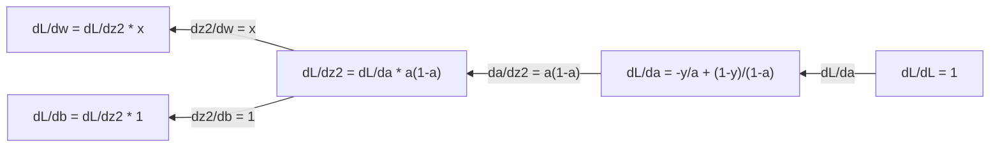
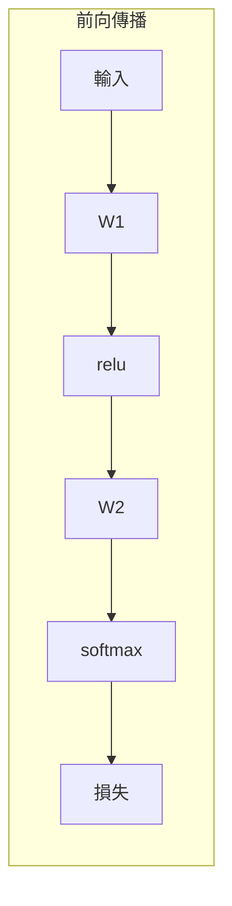
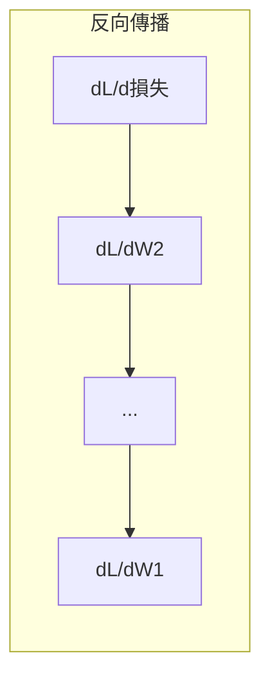

# 機器學習中的微積分

> 導數會告訴你下坡的方向，而這正是神經網路學習所需的一切。

**Type:** Learn
**Language:** Python
**Prerequisites:** Phase 1, Lessons 01-03
**Time:** ~60 minutes

## 學習目標

- 計算常見機器學習函式（x^2、sigmoid、交叉熵）的數值導數與解析導數
- 從零實作梯度下降，在一維和二維中最小化損失函式
- 推導線性迴歸模型的梯度，並透過手動更新權重來訓練模型
- 說明 Hessian 矩陣、泰勒級數近似，以及它們和最佳化方法的關聯

## The Problem｜問題

你的神經網路有數百萬個權重，每個權重就像一個旋鈕。你得找出每個旋鈕該往哪個方向調，才能讓模型少犯一點錯。微積分會告訴你方向。

沒有微積分，訓練神經網路就只能隨機調整，然後期待結果會變好。有了導數，你就能精確知道每個權重如何影響誤差，每次都朝正確方向調整。

## The Concept｜核心概念

### 什麼是導數？

導數用來衡量變化率。對函式 y = f(x) 而言，導數 f'(x) 會告訴你：如果 x 微幅變動，y 會改變多少？

從幾何角度來看，導數就是某一點上切線的斜率。

**f(x) = x^2：**

| x | f(x) | f'(x)（斜率） |
|---|------|---------------|
| 0 | 0    | 0（平坦，位於最低點） |
| 1 | 1    | 2 |
| 2 | 4    | 4（該點切線的斜率） |
| 3 | 9    | 6 |

在 x=2 時，斜率是 4。若 x 稍微往右移，y 大約會增加該位移量的 4 倍。在 x=0 時，斜率是 0，表示你正位於碗狀曲線的最低點。

正式定義如下：

```text
f'(x) = lim   f(x + h) - f(x)
        h->0  -----------------
                     h
```

在程式中，不必真的計算極限，只要使用非常小的 h，這就是數值導數。

### 偏導數：一次處理一個變數

實際的函式通常有許多輸入。神經網路的損失會受數千個權重影響。計算偏導數時，會固定其他變數，只對其中一個變數求導。

```text
f(x, y) = x^2 + 3xy + y^2

df/dx = 2x + 3y     （將 y 視為常數）
df/dy = 3x + 2y     （將 x 視為常數）
```

每個偏導數都在回答：如果只微調這個權重，損失會如何變化？

### 梯度：由所有偏導數組成的向量

梯度會把所有偏導數收集成一個向量。對函式 f(x, y, z) 而言，梯度為：

```text
grad f = [ df/dx, df/dy, df/dz ]
```

梯度指向函式上升最快的方向。要讓函式值最小，就朝相反方向前進。

**f(x,y) = x^2 + y^2 的等高線圖：**

這個函式呈碗狀，等高線是同心圓，最低點在 (0, 0)。

| 點 | grad f | -grad f（下降方向） |
|-------|--------|----------------------------|
| (1, 1) | [2, 2]（指向上坡，遠離最低點） | [-2, -2]（指向下坡，朝向最低點） |
| (0, 0) | [0, 0]（平坦，位於最低點） | [0, 0] |

這就是梯度下降的圖像化說明：計算梯度、取其相反數，再往前走一步。

### 與最佳化的關聯

訓練神經網路就是一種最佳化。損失函式 L(w1, w2, ..., wn) 用來衡量模型的錯誤程度，而你的目標是讓它最小化。

```text
梯度下降更新規則：

  w_new = w_old - learning_rate * dL/dw

對每個權重：
  1. 計算損失對該權重的偏導數
  2. 從權重中減去偏導數的一小部分
  3. 重複以上步驟
```

學習率會控制步伐大小。太大會跨過最低點，太小則會進展得很慢。

**損失地形（一維切面）：**

權重 w 改變時，損失函式 L(w) 會形成有高峰和低谷的曲線。

| 特性 | 說明 |
|---------|-------------|
| 全域最小值 | 整條曲線上的最低點，也就是最佳解 |
| 局部最小值 | 比鄰近位置低的谷底，但不是整體最低點 |
| 斜率 | 梯度下降會從任一起點沿斜率往下移動 |

梯度下降會沿著斜率往下走。它可能卡在局部最小值，但在有數百萬個權重的高維空間中，這通常不太會造成實際問題。

### 數值導數與解析導數

計算導數有兩種方式。

解析導數：手動套用微積分規則。例如 f(x) = x^2 的導數為 f'(x) = 2x，結果精確、速度也快。

數值導數：依照定義進行近似。使用極小的 h 計算 f(x+h) 和 f(x-h)，再利用兩者的差估算導數。

```text
數值導數（中心差分）：

f'(x) ~= f(x + h) - f(x - h)
          -----------------------
                  2h

h = 0.0001 works well in practice
```

數值導數速度較慢，但適用於任何函式；解析導數速度較快，但需要先推導公式。神經網路框架採用第三種方法：自動微分，以機械化方式計算精確導數。你會在 Phase 3 學到這種方法。

### 簡單函式的手算導數

以下是機器學習中會一再遇到的導數。

```text
函式            導數             用途
--------        ----------       -------
f(x) = x^2     f'(x) = 2x      Loss functions (MSE)
f(x) = wx + b  f'(w) = x        線性層（對權重求梯度）
                f'(b) = 1        線性層（對偏差項求梯度）
                f'(x) = w        線性層（對輸入求梯度）
f(x) = e^x     f'(x) = e^x     Softmax, attention
f(x) = ln(x)   f'(x) = 1/x     Cross-entropy loss
f(x) = 1/(1+e^-x)  f'(x) = f(x)(1-f(x))   Sigmoid activation
```

以 f(x) = x^2 為例：

```text
f(x) = x^2    f'(x) = 2x

  x    f(x)   f'(x)   說明
  -2    4      -4      斜率朝左（遞減）
  -1    1      -2      斜率朝左（遞減）
   0    0       0      平坦（最低點！）
   1    1       2      斜率朝右（遞增）
   2    4       4      斜率朝右（遞增）
```

以 x=3、b=1 的 f(w) = wx + b 為例：

```text
f(w) = 3w + 1    f'(w) = 3

對 w 求導，結果就是 x。
如果 x 很大，w 的微小變動就會讓輸出產生很大的變化。
```

### 鏈鎖律

函式組合在一起時，可以用鏈鎖律求導。

```text
若 y = f(g(x))，則 dy/dx = f'(g(x)) * g'(x)

例子：y = (3x + 1)^2
  外層：f(u) = u^2       f'(u) = 2u
  內層：g(x) = 3x + 1    g'(x) = 3
  dy/dx = 2(3x + 1) * 3 = 6(3x + 1)
```

神經網路是由一連串函式組成：輸入 → 線性層 → 活化函式 → 線性層 → 活化函式 → 損失。反向傳播就是從輸出到輸入反覆套用鏈鎖律，這就是整個演算法。

### Hessian 矩陣

梯度會告訴你斜率，Hessian 則會告訴你曲率。

Hessian 是由二階偏導數組成的矩陣。對函式 f(x1, x2, ..., xn) 而言，Hessian 的第 (i, j) 個元素為：

```text
H[i][j] = d^2f / (dx_i * dx_j)
```

對二變數函式 f(x, y) 而言：

```text
H = | d^2f/dx^2    d^2f/dxdy |
    | d^2f/dydx    d^2f/dy^2 |
```

**Hessian 在臨界點（梯度 = 0）能告訴你的資訊：**

| Hessian 性質 | 意義 | 曲面示例 |
|-----------------|---------|-----------------|
| 正定（所有特徵值 > 0） | 局部最小值 | 開口向上的碗狀曲面 |
| 負定（所有特徵值 < 0） | 局部最大值 | 開口向下的碗狀曲面 |
| 不定（特徵值正負混合） | 鞍點 | 馬鞍形曲面 |

**例子：** f(x, y) = x^2 - y^2（鞍形函式）

```text
df/dx = 2x       df/dy = -2y
d^2f/dx^2 = 2    d^2f/dy^2 = -2    d^2f/dxdy = 0

H = | 2   0 |
    | 0  -2 |

特徵值：2 和 -2（一正一負）
--> 鞍點位於 (0, 0)
```

與 f(x, y) = x^2 + y^2（碗狀函式）比較：

```text
H = | 2  0 |
    | 0  2 |

特徵值：2 和 2（皆為正）
--> 局部最小值位於 (0, 0)
```

**Hessian 為什麼在機器學習中重要：**

牛頓法會利用 Hessian，採取比梯度下降更好的最佳化步伐。它不只沿著斜率前進，也會考慮曲率：

```text
牛頓法更新：       w_new = w_old - H^(-1) * gradient
梯度下降：         w_new = w_old - lr * gradient
```

牛頓法收斂較快，因為 Hessian 會「重新縮放」梯度：陡峭方向的步伐較小，平坦方向的步伐較大。

問題在於：若神經網路有 N 個參數，Hessian 就是 N x N 矩陣。擁有 100 萬個參數的模型，會需要一個有 1 兆個元素的矩陣。因此我們會改用近似方法。

| 方法 | 使用資訊 | 成本 | 收斂速度 |
|--------|-------------|------|-------------|
| 梯度下降 | 只有一階導數 | 每步 O(N) | 慢（線性） |
| 牛頓法 | 完整 Hessian | 每步 O(N^3) | 快（平方） |
| L-BFGS | 根據梯度歷史近似 Hessian | 每步 O(N) | 中等（超線性） |
| Adam | 每個參數各自調整學習率（對角 Hessian 近似） | 每步 O(N) | 中等 |
| 自然梯度 | Fisher 資訊矩陣（統計上的 Hessian） | 每步 O(N^2) | 快 |

實務上，Adam 是深度學習的預設最佳化器。它會追蹤每個參數梯度的移動平均與變異數，以較低成本近似二階資訊。

### 泰勒級數近似

任何平滑函式都能在局部以多項式近似：

```text
f(x + h) = f(x) + f'(x)*h + (1/2)*f''(x)*h^2 + (1/6)*f'''(x)*h^3 + ...
```

納入的項越多，近似結果越準確，但只在 x 附近成立。

**泰勒級數為什麼在機器學習中重要：**

- **一階泰勒近似 = 梯度下降。** 使用 f(x + h) ~ f(x) + f'(x)*h，就是在做線性近似。梯度下降會將這個線性模型最小化，據此選擇 h = -lr * f'(x)。

- **二階泰勒近似 = 牛頓法。** 使用 f(x + h) ~ f(x) + f'(x)*h + (1/2)*f''(x)*h^2，就會得到二次模型。將它最小化可得 h = -f'(x)/f''(x)，也就是牛頓法的步伐。

- **損失函式設計。** MSE 和交叉熵都是平滑函式，因此泰勒展開的性質良好。這並非偶然；平滑的損失函式能讓最佳化過程更可預測。

```text
近似階數              捕捉的資訊          最佳化方法
-------------------    -----------------   -------------------
零階（常數）          只有函式值          隨機搜尋
一階（線性）          斜率                梯度下降
二階（二次）          曲率                牛頓法
更高階                更細微的結構        機器學習中很少使用
```

關鍵在於：所有以梯度為基礎的最佳化，其實都是在局部近似損失函式，再往近似函式的最低點移動。

### 積分在機器學習中的應用

導數描述變化率，積分則計算累積量，也就是曲線下的面積。

在機器學習中，你很少需要手算積分，但積分概念無所不在：

**機率。** 對機率密度為 p(x) 的連續隨機變數而言：
```text
P(a < X < b) = p(x) 從 a 到 b 的積分
```
機率密度曲線在 a 和 b 之間的面積，就是隨機變數落在該範圍內的機率。

**期望值。** 依機率加權的平均結果：
```text
E[f(X)] = f(x) * p(x) 的積分
```
資料分布上的期望損失是一個積分。訓練時會最小化它的經驗近似值。

**KL 散度。** 用來衡量兩個分布之間的差異：
```text
KL(p || q) = p(x) * log(p(x) / q(x)) 的積分
```
可用於 VAE、知識蒸餾和貝葉斯推論。

**正規化常數。** 在貝葉斯推論中：
```text
p(w | data) = p(data | w) * p(w) / p(data | w) * p(w) 對 w 的積分
```
分母是對所有可能參數值積分。這通常難以直接計算，因此會使用 MCMC 和變分推論等近似方法。

| 積分概念 | 在機器學習中的用途 |
|-----------------|----------------------|
| 曲線下面積 | 從機率密度函式計算機率 |
| 期望值 | 損失函式、風險最小化 |
| KL 散度 | VAE、策略最佳化、知識蒸餾 |
| 正規化 | 貝葉斯後驗分布、softmax 分母 |
| 邊際似然 | 模型比較、證據下界（ELBO） |

### 計算圖中的多變數鏈鎖律

鏈鎖律不只適用於一連串純量函式。在神經網路中，變數會分支並合併。以下示範導數如何流經簡單的前向傳播：


反向傳播會由右向左計算梯度：



每個箭頭都會乘上局部導數。任何參數的梯度，都是從損失到該參數路徑上的所有局部導數相乘所得。路徑分支後再合併時，則要加總各路徑的貢獻（多變數鏈鎖律）。

反向傳播就是如此：沿著計算圖，從輸出到輸入有系統地套用鏈鎖律。

### Jacobian 矩陣

當函式將向量映射到向量（例如神經網路層）時，它的導數就是一個矩陣。Jacobian 矩陣包含每個輸出對每個輸入的所有偏導數。

對 f: R^n -> R^m 而言，Jacobian 矩陣 J 的形狀是 m x n：

| | x1 | x2 | ... | xn |
|---|---|---|---|---|
| f1 | df1/dx1 | df1/dx2 | ... | df1/dxn |
| f2 | df2/dx1 | df2/dx2 | ... | df2/dxn |
| ... | ... | ... | ... | ... |
| fm | dfm/dx1 | dfm/dx2 | ... | dfm/dxn |

你不會手動計算神經網路的 Jacobian 矩陣，PyTorch 會幫你處理。不過，了解它的存在有助於理解反向傳播中的形狀：如果一層將 R^n 映射至 R^m，它的 Jacobian 就是 m x n 矩陣。梯度會透過此矩陣的轉置向後傳遞。

### 這為什麼對神經網路很重要

神經網路中的每個權重都會取得一個梯度。梯度會告訴你如何調整權重，才能降低損失。





每次權重更新：
- `W1 = W1 - lr * dL/dW1`
- `W2 = W2 - lr * dL/dW2`

前向傳播會計算預測結果和損失；反向傳播會計算損失對每個權重的梯度。接著每個權重都朝下坡方向移動一小步。重複數百萬次，這就是深度學習。

```figure
derivative-tangent
```

## Build It｜動手打造

### 步驟 1：從零計算數值導數

```python
def numerical_derivative(f, x, h=1e-7):
    return (f(x + h) - f(x - h)) / (2 * h)

def f(x):
    return x ** 2

for x in [-2, -1, 0, 1, 2]:
    numerical = numerical_derivative(f, x)
    analytical = 2 * x
    print(f"x={x:2d}  f'(x) numerical={numerical:.6f}  analytical={analytical:.1f}")
```

數值導數和解析導數在許多小數位上都相符。

### 步驟 2：偏導數與梯度

```python
def numerical_gradient(f, point, h=1e-7):
    gradient = []
    for i in range(len(point)):
        point_plus = list(point)
        point_minus = list(point)
        point_plus[i] += h
        point_minus[i] -= h
        partial = (f(point_plus) - f(point_minus)) / (2 * h)
        gradient.append(partial)
    return gradient

def f_multi(point):
    x, y = point
    return x**2 + 3*x*y + y**2

grad = numerical_gradient(f_multi, [1.0, 2.0])
print(f"Numerical gradient at (1,2): {[f'{g:.4f}' for g in grad]}")
print(f"Analytical gradient at (1,2): [2*1+3*2, 3*1+2*2] = [{2*1+3*2}, {3*1+2*2}]")
```

### 步驟 3：以梯度下降尋找 f(x) = x^2 的最小值

```python
x = 5.0
lr = 0.1
for step in range(20):
    grad = 2 * x
    x = x - lr * grad
    print(f"step {step:2d}  x={x:8.4f}  f(x)={x**2:10.6f}")
```

從 x=5 開始，每一步都會更接近 x=0（最小值）。

### 步驟 4：對二維函式執行梯度下降

```python
def f_2d(point):
    x, y = point
    return x**2 + y**2

point = [4.0, 3.0]
lr = 0.1
for step in range(30):
    grad = numerical_gradient(f_2d, point)
    point = [p - lr * g for p, g in zip(point, grad)]
    loss = f_2d(point)
    if step % 5 == 0 or step == 29:
        print(f"step {step:2d}  point=({point[0]:7.4f}, {point[1]:7.4f})  f={loss:.6f}")
```

### 步驟 5：比較數值導數與解析導數

```python
import math

test_functions = [
    ("x^2",      lambda x: x**2,          lambda x: 2*x),
    ("x^3",      lambda x: x**3,          lambda x: 3*x**2),
    ("sin(x)",   lambda x: math.sin(x),   lambda x: math.cos(x)),
    ("e^x",      lambda x: math.exp(x),   lambda x: math.exp(x)),
    ("1/x",      lambda x: 1/x,           lambda x: -1/x**2),
]

x = 2.0
print(f"{'Function':<12} {'Numerical':>12} {'Analytical':>12} {'Error':>12}")
print("-" * 50)
for name, f, df in test_functions:
    num = numerical_derivative(f, x)
    ana = df(x)
    err = abs(num - ana)
    print(f"{name:<12} {num:12.6f} {ana:12.6f} {err:12.2e}")
```

### 步驟 6：以數值方式計算 Hessian

```python
def hessian_2d(f, x, y, h=1e-5):
    fxx = (f(x + h, y) - 2 * f(x, y) + f(x - h, y)) / (h ** 2)
    fyy = (f(x, y + h) - 2 * f(x, y) + f(x, y - h)) / (h ** 2)
    fxy = (f(x + h, y + h) - f(x + h, y - h) - f(x - h, y + h) + f(x - h, y - h)) / (4 * h ** 2)
    return [[fxx, fxy], [fxy, fyy]]

def saddle(x, y):
    return x ** 2 - y ** 2

def bowl(x, y):
    return x ** 2 + y ** 2

H_saddle = hessian_2d(saddle, 0.0, 0.0)
H_bowl = hessian_2d(bowl, 0.0, 0.0)
print(f"Saddle Hessian: {H_saddle}")  # [[2, 0], [0, -2]] -- mixed signs
print(f"Bowl Hessian:   {H_bowl}")    # [[2, 0], [0, 2]]  -- both positive
```

鞍形函式的 Hessian 特徵值為 2 和 -2（正負混合，確認該點為鞍點）；碗狀函式的特徵值為 2 和 2（皆為正，確認該點為最小值）。

### 步驟 7：實際運用泰勒近似

```python
import math

def taylor_approx(f, f_prime, f_double_prime, x0, h, order=2):
    result = f(x0)
    if order >= 1:
        result += f_prime(x0) * h
    if order >= 2:
        result += 0.5 * f_double_prime(x0) * h ** 2
    return result

x0 = 0.0
for h in [0.1, 0.5, 1.0, 2.0]:
    true_val = math.sin(h)
    t1 = taylor_approx(math.sin, math.cos, lambda x: -math.sin(x), x0, h, order=1)
    t2 = taylor_approx(math.sin, math.cos, lambda x: -math.sin(x), x0, h, order=2)
    print(f"h={h:.1f}  sin(h)={true_val:.4f}  order1={t1:.4f}  order2={t2:.4f}")
```

在 x0=0 附近，sin(x) ~ x（一階泰勒近似）。h 很小時近似效果很好，但 h 變大後就會失準。這也是梯度下降使用較小學習率效果較好的原因：每一步都假設線性近似準確。

### 步驟 8：這為什麼對神經網路很重要

```python
import random

random.seed(42)

w = random.gauss(0, 1)
b = random.gauss(0, 1)
lr = 0.01

xs = [1.0, 2.0, 3.0, 4.0, 5.0]
ys = [3.0, 5.0, 7.0, 9.0, 11.0]

for epoch in range(200):
    total_loss = 0
    dw = 0
    db = 0
    for x, y in zip(xs, ys):
        pred = w * x + b
        error = pred - y
        total_loss += error ** 2
        dw += 2 * error * x
        db += 2 * error
    dw /= len(xs)
    db /= len(xs)
    total_loss /= len(xs)
    w -= lr * dw
    b -= lr * db
    if epoch % 40 == 0 or epoch == 199:
        print(f"epoch {epoch:3d}  w={w:.4f}  b={b:.4f}  loss={total_loss:.6f}")

print(f"\nLearned: y = {w:.2f}x + {b:.2f}")
print(f"Actual:  y = 2x + 1")
```

所有以梯度為基礎的訓練迴圈都遵循這個流程：預測、計算損失、計算梯度、更新權重。

## Use It｜開始使用

使用 NumPy，執行相同運算會更快，程式也更精簡：

```python
import numpy as np

x = np.array([1, 2, 3, 4, 5], dtype=float)
y = np.array([3, 5, 7, 9, 11], dtype=float)

w, b = np.random.randn(), np.random.randn()
lr = 0.01

for epoch in range(200):
    pred = w * x + b
    error = pred - y
    loss = np.mean(error ** 2)
    dw = np.mean(2 * error * x)
    db = np.mean(2 * error)
    w -= lr * dw
    b -= lr * db

print(f"Learned: y = {w:.2f}x + {b:.2f}")
```

你剛才從零實作了梯度下降。PyTorch 會自動計算梯度，但權重更新迴圈完全相同。

## Exercises｜練習

1. 連續呼叫兩次 `numerical_derivative`，實作 `numerical_second_derivative(f, x)`。確認 x^3 在 x=2 的二階導數為 12。
2. 使用梯度下降尋找 f(x, y) = (x - 3)^2 + (y + 1)^2 的最小值，並從 (0, 0) 開始。結果應收斂至 (3, -1)。
3. 在梯度下降迴圈中加入動量：維護一個會累積過去梯度的速度向量。比較有無動量時，函式 f(x) = x^4 - 3x^2 的收斂速度。

## Key Terms｜重要詞彙

| 詞彙 | 一般說法 | 實際意義 |
|------|----------------|----------------------|
| 導數 |「斜率」| 函式在某一點的變化率，表示輸入每變動一個單位，輸出會改變多少。 |
| 偏導數 |「對單一變數求導」| 固定其他變數，只對其中一個變數求導。 |
| 梯度 |「上升最快的方向」| 由所有偏導數組成的向量，指向函式值增加最快的方向。 |
| 梯度下降 |「往下坡走」| 從參數中減去乘上學習率的梯度，以降低損失，是訓練神經網路的核心。 |
| 學習率 |「步伐大小」| 控制每次梯度下降步伐大小的純量。太大會發散，太小則收斂緩慢。 |
| 鏈鎖律 |「把導數相乘」| 對複合函式求導的規則：df/dx = df/dg * dg/dx，也是反向傳播的數學基礎。 |
| Jacobian 矩陣 |「由導數組成的矩陣」| 函式將向量映射到向量時，Jacobian 矩陣包含所有輸出對輸入的偏導數。 |
| 數值導數 |「有限差分」| 在兩個相近的點計算函式值，再以兩點間的斜率近似導數。 |
| 反向傳播 |「反向模式自動微分」| 使用鏈鎖律，從輸出到輸入逐層計算梯度，是神經網路的學習方式。 |
| Hessian 矩陣 |「二階導數矩陣」| 由所有二階偏導數組成的矩陣，用來描述函式曲率。在臨界點上，正定的 Hessian 表示局部最小值。 |
| 泰勒級數 |「多項式近似」| 使用函式的導數近似某一點附近的函式值：f(x+h) ~ f(x) + f'(x)h + (1/2)f''(x)h^2 + ...，可用來理解梯度下降和牛頓法為何有效。 |
| 積分 |「曲線下面積」| 某個量在一段範圍內的累積。在機器學習中，積分用來定義機率、期望值和 KL 散度。 |

## 延伸閱讀

- [3Blue1Brown：微積分的本質](https://www.3blue1brown.com/topics/calculus) — 以視覺直覺說明導數、積分和鏈鎖律
- [Stanford CS231n：反向傳播](https://cs231n.github.io/optimization-2/) — 說明梯度如何流經神經網路各層
