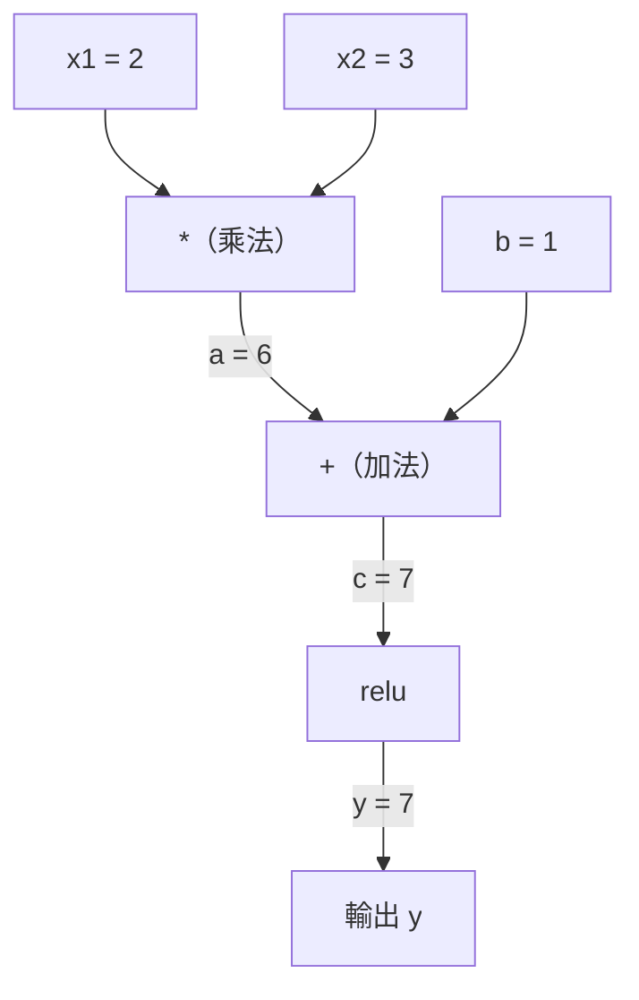
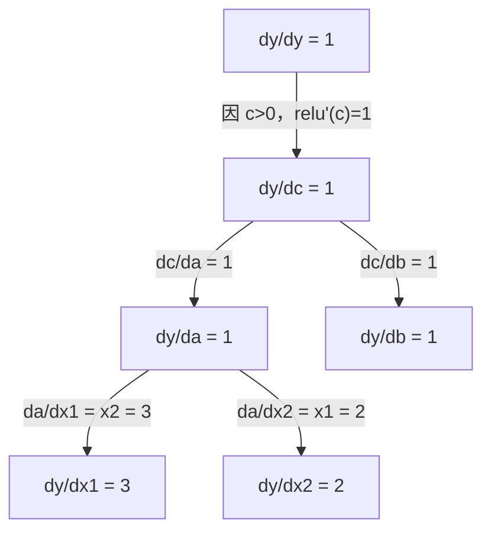

# 鏈鎖律與自動微分

> 鏈鎖律是每個會學習的神經網路背後的運作核心。

**Type:** Build
**Language:** Python
**Prerequisites:** Phase 1, Lesson 04 (Derivatives & Gradients)
**Time:** ~90 minutes

## 學習目標

- 建立精簡的自動微分引擎（Value 類別），記錄運算並透過反向模式自動微分計算梯度
- 使用拓樸排序，在計算圖中實作前向與反向傳播
- 只使用從零實作的自動微分引擎，建立並訓練多層感知器來處理 XOR
- 使用梯度檢查，將自動微分結果與數值有限差分比較，驗證正確性

## The Problem｜問題

你會計算簡單函式的導數，但神經網路不是簡單函式。它由數百個函式組合而成：矩陣乘法、加上偏差項、套用活化函式、再次做矩陣乘法、softmax，最後計算交叉熵損失。輸出其實是層層函式組合的結果。

訓練網路時，你需要計算損失對每個權重的梯度。參數有數百萬個時，手算根本不可行；用數值方法（有限差分）計算又太慢。

鏈鎖律提供數學基礎，自動微分則提供演算法。兩者結合後，你就能在與一次前向傳播相近的時間內，計算任意函式組合的精確梯度。

PyTorch、TensorFlow 和 JAX 都是以這種方式運作。你將從零打造一個迷你版本。

## The Concept｜核心概念

### 鏈鎖律

若 `y = f(g(x))`，`y` 對 `x` 的導數為：

```text
dy/dx = dy/dg * dg/dx = f'(g(x)) * g'(x)
```

將鏈上的導數相乘。每個環節都會提供自己的局部導數。

例子：`y = sin(x^2)`

```text
g(x) = x^2       g'(x) = 2x
f(g) = sin(g)     f'(g) = cos(g)

dy/dx = cos(x^2) * 2x
```

函式組合層數更多時，鏈也會延伸：

```text
y = f(g(h(x)))

dy/dx = f'(g(h(x))) * g'(h(x)) * h'(x)
```

神經網路中的每一層，都是這條鏈上的一個環節。

### 計算圖

計算圖能將鏈鎖律視覺化。每個運算都會成為一個節點，資料沿著圖向前流動，梯度則向後流動。

**前向傳播（計算數值）：**



**反向傳播（計算梯度）：**



反向傳播會在每個節點套用鏈鎖律，將梯度從輸出一路傳回輸入。

### 前向模式與反向模式

在計算圖中套用鏈鎖律有兩種方式。

**前向模式**從輸入開始，將導數向前傳遞。它先計算 `dx/dx = 1`，再將導數傳過每個運算。輸入少、輸出多時適合使用。

```text
前向模式：將 dx/dx = 1 設為起始值，向前傳遞

  x = 2       （dx/dx = 1）
  a = x^2     （da/dx = 2x = 4）
  y = sin(a)  （dy/dx = cos(a) * da/dx = cos(4) * 4 = -2.615）
```

**反向模式**從輸出開始，將梯度向後傳遞。它先計算 `dy/dy = 1`，再反向傳過每個運算。輸入多、輸出少時適合使用。

```text
反向模式：將 dy/dy = 1 設為起始值，向後傳遞

  y = sin(a)  （dy/dy = 1）
  a = x^2     （dy/da = cos(a) = cos(4) = -0.654）
  x = 2       （dy/dx = dy/da * da/dx = -0.654 * 4 = -2.615）
```

神經網路有數百萬個輸入（權重）和一個輸出（損失）。反向模式只要一次反向傳播，就能算出所有梯度，所以反向傳播採用反向模式。

| 模式 | 起始導數 | 傳遞方向 | 適用情境 |
|------|------|-----------|-----------|
| 前向 | `dx_i/dx_i = 1` | 從輸入到輸出 | 輸入少、輸出多 |
| 反向 | `dy/dy = 1` | 從輸出到輸入 | 輸入多、輸出少（神經網路） |

### 用雙數實作前向模式

前向模式可以透過雙數優雅地實作。雙數的形式為 `a + b*epsilon`，其中 `epsilon^2 = 0`。

```text
雙數：(數值，導數)

(2, 1) 表示：數值為 2，對 x 的導數為 1

運算規則：
  (a, a') + (b, b') = (a+b, a'+b')
  (a, a') * (b, b') = (a*b, a'*b + a*b')
  sin(a, a')         = (sin(a), cos(a)*a')
```

將輸入變數的導數設為 1，導數就會自動傳過每個運算。

### 打造自動微分引擎

自動微分引擎需要三個部分：

1. **封裝數值。** 將每個數字包裝成物件，並在其中儲存數值和梯度。
2. **記錄計算圖。** 每個運算都要記錄輸入，以及計算局部梯度的函式。
3. **反向傳播。** 對計算圖進行拓樸排序，再反向走訪各節點並套用鏈鎖律。

這正是 PyTorch `autograd` 的工作方式。`torch.Tensor` 類別會封裝數值，在 `requires_grad=True` 時記錄運算，並在呼叫 `.backward()` 時計算梯度。

### PyTorch 自動微分的內部運作方式

當你撰寫 PyTorch 程式碼時：

```python
x = torch.tensor(2.0, requires_grad=True)
y = x ** 2 + 3 * x + 1
y.backward()
print(x.grad)  # 7.0 = 2*x + 3 = 2*2 + 3
```

PyTorch 內部會：

1. 為 `x` 建立一個 `requires_grad=True` 的 `Tensor` 節點
2. 每個運算（`**`、`*`、`+`）都會建立新節點並記錄反向傳播函式
3. `y.backward()` 會沿著記錄好的計算圖啟動反向模式自動微分
4. 每個節點的 `grad_fn` 會計算局部梯度，並將梯度傳給上游節點
5. 梯度會透過加法累積在 `.grad` 屬性中，不會直接覆寫

這種計算圖是動態的（執行時定義）。每次前向傳播都會建立一張新圖，因此 PyTorch 能支援模型中的控制流程（if/else、迴圈）。

```figure
chain-rule
```

## Build It｜動手打造

### 步驟 1：Value 類別

```python
class Value:
    def __init__(self, data, children=(), op=''):
        self.data = data
        self.grad = 0.0
        self._backward = lambda: None
        self._prev = set(children)
        self._op = op

    def __repr__(self):
        return f"Value(data={self.data:.4f}, grad={self.grad:.4f})"
```

每個 `Value` 都會儲存數值、梯度（初始值為零）、反向傳播函式，以及指向產生它的子節點的參照。

### 步驟 2：實作可追蹤梯度的算術運算

```python
    def __add__(self, other):
        other = other if isinstance(other, Value) else Value(other)
        out = Value(self.data + other.data, (self, other), '+')
        def _backward():
            self.grad += out.grad
            other.grad += out.grad
        out._backward = _backward
        return out

    def __mul__(self, other):
        other = other if isinstance(other, Value) else Value(other)
        out = Value(self.data * other.data, (self, other), '*')
        def _backward():
            self.grad += other.data * out.grad
            other.grad += self.data * out.grad
        out._backward = _backward
        return out

    def relu(self):
        out = Value(max(0, self.data), (self,), 'relu')
        def _backward():
            self.grad += (1.0 if out.data > 0 else 0.0) * out.grad
        out._backward = _backward
        return out
```

每個運算都會建立一個閉包，用來計算局部梯度，再乘上來自上游的梯度（`out.grad`）。使用 `+=` 是為了處理同一個值被多個運算使用的情況。

### 步驟 3：反向傳播

```python
    def backward(self):
        topo = []
        visited = set()
        def build_topo(v):
            if v not in visited:
                visited.add(v)
                for child in v._prev:
                    build_topo(child)
                topo.append(v)
        build_topo(self)

        self.grad = 1.0
        for v in reversed(topo):
            v._backward()
```

拓樸排序能確保每個節點的梯度都計算完成後，才會繼續傳給它的子節點。起始梯度為 1.0（dy/dy = 1）。

### 步驟 4：補上完整引擎所需的其他運算

基本的 Value 類別支援加法、乘法和 relu。實際的自動微分引擎還需要更多運算。以下是建立神經網路所需的操作：

```python
    def __neg__(self):
        return self * -1

    def __sub__(self, other):
        return self + (-other)

    def __radd__(self, other):
        return self + other

    def __rmul__(self, other):
        return self * other

    def __rsub__(self, other):
        return other + (-self)

    def __pow__(self, n):
        out = Value(self.data ** n, (self,), f'**{n}')
        def _backward():
            self.grad += n * (self.data ** (n - 1)) * out.grad
        out._backward = _backward
        return out

    def __truediv__(self, other):
        return self * (other ** -1) if isinstance(other, Value) else self * (Value(other) ** -1)

    def exp(self):
        import math
        e = math.exp(self.data)
        out = Value(e, (self,), 'exp')
        def _backward():
            self.grad += e * out.grad
        out._backward = _backward
        return out

    def log(self):
        import math
        out = Value(math.log(self.data), (self,), 'log')
        def _backward():
            self.grad += (1.0 / self.data) * out.grad
        out._backward = _backward
        return out

    def tanh(self):
        import math
        t = math.tanh(self.data)
        out = Value(t, (self,), 'tanh')
        def _backward():
            self.grad += (1 - t ** 2) * out.grad
        out._backward = _backward
        return out
```

**各種運算的重要性：**

| 運算 | 反向傳播規則 | 用途 |
|-----------|--------------|---------|
| `__sub__` | 重用加法與負號 | 計算損失（預測值 - 目標值） |
| `__pow__` | n * x^(n-1) | 多項式活化函式、MSE（error^2） |
| `__truediv__` | 重用乘法與 pow(-1) | 正規化、縮放學習率 |
| `exp` | exp(x) * 上游梯度 | Softmax、對數概似 |
| `log` | (1/x) * 上游梯度 | 交叉熵損失、對數機率 |
| `tanh` | (1 - tanh^2) * 上游梯度 | 傳統的活化函式 |

巧妙之處在於：`__sub__` 和 `__truediv__` 是以既有運算來定義的。由於鏈鎖律會透過底層的加法、乘法和次方運算一路組合，這些方法自然就能得到正確梯度。

### 步驟 5：從零實作迷你 MLP

有了完整的 Value 類別，就能建立神經網路。不需要 PyTorch，也不需要 NumPy，只要 Value 和鏈鎖律。

```python
import random

class Neuron:
    def __init__(self, n_inputs):
        self.w = [Value(random.uniform(-1, 1)) for _ in range(n_inputs)]
        self.b = Value(0.0)

    def __call__(self, x):
        act = sum((wi * xi for wi, xi in zip(self.w, x)), self.b)
        return act.tanh()

    def parameters(self):
        return self.w + [self.b]

class Layer:
    def __init__(self, n_inputs, n_outputs):
        self.neurons = [Neuron(n_inputs) for _ in range(n_outputs)]

    def __call__(self, x):
        return [n(x) for n in self.neurons]

    def parameters(self):
        return [p for n in self.neurons for p in n.parameters()]

class MLP:
    def __init__(self, sizes):
        self.layers = [Layer(sizes[i], sizes[i+1]) for i in range(len(sizes)-1)]

    def __call__(self, x):
        for layer in self.layers:
            x = layer(x)
        return x[0] if len(x) == 1 else x

    def parameters(self):
        return [p for layer in self.layers for p in layer.parameters()]
```

`Neuron` 會計算 `tanh(w1*x1 + w2*x2 + ... + b)`；`Layer` 是由神經元組成的清單；`MLP` 則會堆疊多個層。每個權重都是 `Value`，因此呼叫 `loss.backward()` 就能將梯度傳到每個參數。

**使用 XOR 資料訓練：**

```python
random.seed(42)
model = MLP([2, 4, 1])  # 2 inputs, 4 hidden neurons, 1 output

xs = [[0, 0], [0, 1], [1, 0], [1, 1]]
ys = [-1, 1, 1, -1]  # XOR pattern (using -1/1 for tanh)

for step in range(100):
    preds = [model(x) for x in xs]
    loss = sum((p - y) ** 2 for p, y in zip(preds, ys))

    for p in model.parameters():
        p.grad = 0.0
    loss.backward()

    lr = 0.05
    for p in model.parameters():
        p.data -= lr * p.grad

    if step % 20 == 0:
        print(f"step {step:3d}  loss = {loss.data:.4f}")

print("\nPredictions after training:")
for x, y in zip(xs, ys):
    print(f"  input={x}  target={y:2d}  pred={model(x).data:6.3f}")
```

這就是 micrograd：使用純 Python 和自動微分完成的神經網路訓練迴圈。所有商用深度學習框架都在大規模執行相同的概念。

### 步驟 6：梯度檢查

如何確認自動微分結果正確？將它與數值導數比較，這就是梯度檢查。

```python
def gradient_check(build_expr, x_val, h=1e-7):
    x = Value(x_val)
    y = build_expr(x)
    y.backward()
    autodiff_grad = x.grad

    y_plus = build_expr(Value(x_val + h)).data
    y_minus = build_expr(Value(x_val - h)).data
    numerical_grad = (y_plus - y_minus) / (2 * h)

    diff = abs(autodiff_grad - numerical_grad)
    return autodiff_grad, numerical_grad, diff
```

用較複雜的算式測試：

```python
def expr(x):
    return (x ** 3 + x * 2 + 1).tanh()

ad, num, diff = gradient_check(expr, 0.5)
print(f"Autodiff:  {ad:.8f}")
print(f"Numerical: {num:.8f}")
print(f"Difference: {diff:.2e}")
# Difference should be < 1e-5
```

實作新運算時，梯度檢查不可或缺。反向傳播若有錯誤，數值檢查就能抓出來。所有認真的深度學習實作都會在開發期間執行梯度檢查。

**何時需要執行梯度檢查：**

| 情況 | 是否執行梯度檢查？ |
|-----------|-------------------|
| 在自動微分引擎中新增運算 | 要，務必執行 |
| 除錯無法收斂的訓練迴圈 | 要，先檢查梯度 |
| 正式環境訓練 | 不用，速度太慢（每個參數都要執行兩次前向傳播） |
| 自動微分程式碼的單元測試 | 要，並將檢查自動化 |

### 步驟 7：與手動計算結果比對

```python
x1 = Value(2.0)
x2 = Value(3.0)
a = x1 * x2          # a = 6.0
b = a + Value(1.0)    # b = 7.0
y = b.relu()          # y = 7.0

y.backward()

print(f"y = {y.data}")          # 7.0
print(f"dy/dx1 = {x1.grad}")   # 3.0 (= x2)
print(f"dy/dx2 = {x2.grad}")   # 2.0 (= x1)
```

手動驗算：`y = relu(x1*x2 + 1)`。因為 `x1*x2 + 1 = 7 > 0`，所以 relu 在此處等同於恆等函式。
`dy/dx1 = x2 = 3`，`dy/dx2 = x1 = 2`。引擎算出的結果相符。

## Use It｜開始使用

### 與 PyTorch 結果比對

```python
import torch

x1 = torch.tensor(2.0, requires_grad=True)
x2 = torch.tensor(3.0, requires_grad=True)
a = x1 * x2
b = a + 1.0
y = torch.relu(b)
y.backward()

print(f"PyTorch dy/dx1 = {x1.grad.item()}")  # 3.0
print(f"PyTorch dy/dx2 = {x2.grad.item()}")  # 2.0
```

梯度結果相同。你的引擎和 PyTorch 算出相同結果，因為兩者使用相同的數學方法：透過鏈鎖律執行反向模式自動微分。

### 更複雜的算式

```python
a = Value(2.0)
b = Value(-3.0)
c = Value(10.0)
f = (a * b + c).relu()  # relu(2*(-3) + 10) = relu(4) = 4

f.backward()
print(f"df/da = {a.grad}")  # -3.0 (= b)
print(f"df/db = {b.grad}")  #  2.0 (= a)
print(f"df/dc = {c.grad}")  #  1.0
```

## Ship It｜交付成果

本課程會產出：
- `outputs/skill-autodiff.md` — 用於打造和除錯自動微分系統的 skill
- `code/autodiff.py` — 可供擴充的精簡自動微分引擎

本課程打造的 Value 類別，是 Phase 3 神經網路訓練迴圈的基礎。

## Exercises｜練習

1. 在 Value 類別中加入 `__pow__`，讓它能計算 `x ** n`。確認 `x=2` 時 `d/dx(x^3)` 的結果為 `12.0`。

2. 加入 `tanh` 活化函式。確認 `tanh'(0) = 1`，且 `tanh'(2) = 0.0707`（約）。

3. 為單一神經元建立計算圖：`y = relu(w1*x1 + w2*x2 + b)`。計算全部五個梯度，並與 PyTorch 比對。

4. 使用雙數實作前向模式自動微分。建立 `Dual` 類別，並確認它算出的導數與反向模式引擎相同。

## Key Terms｜重要詞彙

| 詞彙 | 一般說法 | 實際意義 |
|------|----------------|----------------------|
| 鏈鎖律 |「把導數相乘」| 複合函式的導數等於各函式在正確位置上的局部導數相乘。 |
| 計算圖 |「網路流程圖」| 有向無環圖；節點代表運算，邊則承載數值（前向）或梯度（反向）。 |
| 前向模式 |「向前傳遞導數」| 將導數從輸入傳到輸出的自動微分方式。每個輸入變數都需要執行一次。 |
| 反向模式 |「反向傳播」| 將梯度從輸出傳到輸入的自動微分方式。每個輸出變數都需要執行一次。 |
| Autograd |「自動計算梯度」| 記錄數值運算、建立計算圖，並透過鏈鎖律計算精確梯度的系統。 |
| 雙數 |「數值加上導數」| 形式為 a + b*epsilon（epsilon^2 = 0）的數字，能在算術運算中攜帶導數資訊。 |
| 拓樸排序 |「依相依關係排列」| 將計算圖節點排序，確保每個節點都排在其所有相依節點之後，才能正確傳遞梯度。 |
| 梯度累積 |「相加，不覆寫」| 同一數值供多個運算使用時，其梯度等於所有流入梯度貢獻的總和。 |
| 動態計算圖 |「執行時定義」| 每次前向傳播都會重建的計算圖，因此模型中可以使用 Python 控制流程（PyTorch 的做法）。 |
| 梯度檢查 |「數值驗證」| 將自動微分梯度與有限差分的數值梯度比較，以確認正確性，是除錯的重要方法。 |
| MLP |「多層感知器」| 含有一個或多個神經元隱藏層的神經網路。每個神經元會計算加權總和與偏差項，再套用活化函式。 |
| 神經元 |「加權總和加上活化函式」| 基本運算單位：output = activation(w1*x1 + w2*x2 + ... + b)。權重和偏差項都是可學習的參數。 |

## 延伸閱讀

- [3Blue1Brown：反向傳播中的微積分](https://www.youtube.com/watch?v=tIeHLnjs5U8) — 以視覺方式說明神經網路中的鏈鎖律
- [PyTorch 自動微分機制](https://pytorch.org/docs/stable/notes/autograd.html) — 說明實際系統的運作方式
- [Baydin 等人：機器學習中的自動微分綜述](https://arxiv.org/abs/1502.05767) — 完整的參考資料
