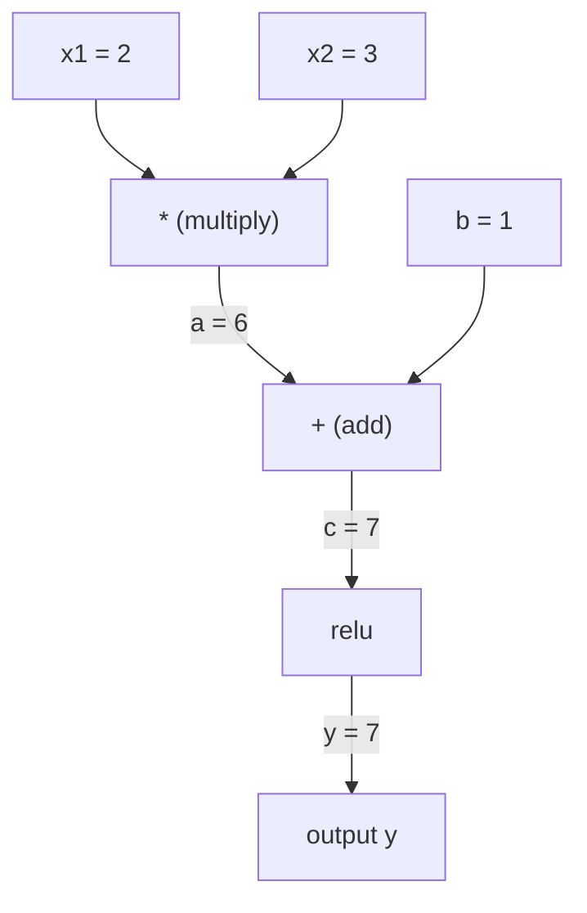
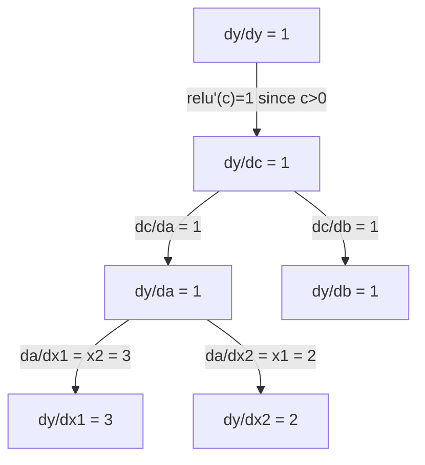

# 連鎖律與自動微分（automatic differentiation）

> 連鎖律（chain rule）是每個會學習的神經網路（neural network）背後的引擎。

**Type:** Build
**Language:** Python
**Prerequisites:** Phase 1, Lesson 04 (Derivatives & Gradients)
**Time:** ~90 minutes

## Learning Objectives｜學習目標

- 建立一個最小的 autograd 引擎（Value 類別）：記錄運算並以反向模式自動微分（reverse-mode autodiff）計算梯度
- 用拓撲排序（topological sort）在計算圖中實作前向傳遞（forward pass）與反向傳遞（backward pass）
- 只用從零寫的自動微分引擎，建構並訓練一個學習 XOR 的多層感知器（multi-layer perceptron）
- 用數值有限差分（numerical finite difference）做梯度檢查（gradient checking），驗證自動微分的正確性

## The Problem｜問題

你已經會對簡單函數算導數。但神經網路（neural network）不是簡單函數，它是由數百個函數組合而成：矩陣乘法（matrix multiply）、加偏置、套用活化函數、再做矩陣乘法（matrix multiply）、softmax、交叉熵損失。輸出是層層函數組合的結果。

要訓練網路，你得拿到損失對每一個權重的梯度。對數百萬個參數來說，手算不可能，用數值方法（有限差分）又太慢。

連鎖律給你數學，自動微分給你演算法。兩者結合，讓你在耗時與一次前向傳遞成正比內，對任意函數組合算出精確梯度。

PyTorch、TensorFlow 和 JAX 就是這樣運作的。你將從零打造一個迷你版。

## The Concept｜核心概念

### 連鎖律

如果 `y = f(g(x))`，`y` 對 `x` 的導數是：

```
dy/dx = dy/dg * dg/dx = f'(g(x)) * g'(x)
```

把導數沿著鏈條相乘。每一環貢獻自己的局部導數。

範例：`y = sin(x^2)`

```
g(x) = x^2       g'(x) = 2x
f(g) = sin(g)     f'(g) = cos(g)

dy/dx = cos(x^2) * 2x
```

組合得更深，鏈條就更長：

```
y = f(g(h(x)))

dy/dx = f'(g(h(x))) * g'(h(x)) * h'(x)
```

神經網路（neural network）的每一層都是這條鏈上的一環。

### 計算圖

計算圖（computational graph）讓連鎖律的運作一目了然。每個運算是一個節點，資料沿著圖向前流動，梯度則向後流動。

**前向傳遞（計算數值）：**



**反向傳遞（計算梯度）：**



反向傳遞在每個節點套用連鎖律，把梯度從輸出傳回輸入。

### 正向模式 vs 反向模式

在圖中套用連鎖律有兩種方式。

**正向模式（forward mode）**從輸入開始，把導數向前推。它先算 `dx/dx = 1`，再透過每個運算傳播。適合輸入少、輸出多的情況。

```
Forward mode: seed dx/dx = 1, propagate forward

  x = 2       (dx/dx = 1)
  a = x^2     (da/dx = 2x = 4)
  y = sin(a)  (dy/dx = cos(a) * da/dx = cos(4) * 4 = -2.615)
```

**反向模式（reverse mode）**從輸出開始，把梯度向後拉。它先算 `dy/dy = 1`，再反向穿過每個運算。適合輸入多、輸出少的情況。

```
Reverse mode: seed dy/dy = 1, propagate backward

  y = sin(a)  (dy/dy = 1)
  a = x^2     (dy/da = cos(a) = cos(4) = -0.654)
  x = 2       (dy/dx = dy/da * da/dx = -0.654 * 4 = -2.615)
```

神經網路（neural network）有數百萬個輸入（權重）和一個輸出（損失）。反向模式用一次反向傳遞就算出所有梯度——這就是反向傳播（backpropagation）採用反向模式的原因。

| 模式 | 種子 | 方向 | 最適合 |
|------|------|-----------|-----------|
| 正向 | `dx_i/dx_i = 1` | 輸入到輸出 | 輸入少、輸出多 |
| 反向 | `dy/dy = 1` | 輸出到輸入 | 輸入多、輸出少（神經網路（neural network）） |

### 用對偶數做正向模式

正向模式可以用對偶數（dual number）優雅地實作。對偶數形如 `a + b*epsilon`，其中 `epsilon^2 = 0`。

```
Dual number: (value, derivative)

(2, 1) means: value is 2, derivative w.r.t. x is 1

Arithmetic rules:
  (a, a') + (b, b') = (a+b, a'+b')
  (a, a') * (b, b') = (a*b, a'*b + a*b')
  sin(a, a')         = (sin(a), cos(a)*a')
```

把輸入變數的導數種子設為 1，導數就會自動穿過每個運算傳播。

### 打造 autograd 引擎

autograd 引擎需要三樣東西：

1. **數值包裝（value wrapping）。** 把每個數字包進一個物件，儲存它的值和梯度。
2. **記錄計算圖（graph recording）。** 每個運算記下它的輸入和局部梯度函式。
3. **反向傳遞（backward pass）。** 先對圖做拓撲排序，再反過來走一遍，在每個節點套用連鎖律。

PyTorch 的 `autograd` 做的就是這件事。`torch.Tensor` 類別包裝數值、在 `requires_grad=True` 時記錄運算，並在你呼叫 `.backward()` 時計算梯度。

### PyTorch Autograd 底層怎麼運作

當你寫 PyTorch 程式：

```python
x = torch.tensor(2.0, requires_grad=True)
y = x ** 2 + 3 * x + 1
y.backward()
print(x.grad)  # 7.0 = 2*x + 3 = 2*2 + 3
```

PyTorch 內部會：

1. 為 `x` 建立一個 `Tensor` 節點，`requires_grad=True`
2. 每個運算（`**`、`*`、`+`）都建立新節點並記錄反向函式
3. `y.backward()` 觸發對記錄下來的圖做反向模式自動微分
4. 每個節點的 `grad_fn` 計算局部梯度並傳給父節點
5. 梯度以加法累積（不是覆蓋）到 `.grad` 屬性上

這個圖是動態的（define-by-run），每次前向傳遞都重建一張新圖——這就是 PyTorch 支援在模型裡寫控制流（if/else、迴圈）的原因。

```figure
chain-rule
```

## Build It｜動手實作

### 步驟 1：Value 類別

```python
class Value:
    def __init__(self, data, children=(), op=''):
        self.data = data
        self.grad = 0.0
        self._backward = lambda: None
        self._prev = set(children)
        self._op = op

    def __repr__(self):
        return f"Value(data={self.data:.4f}, grad={self.grad:.4f})"
```

每個 `Value` 儲存它的數值、梯度（初始為零）、一個反向函式，以及指向產生它的子節點的指標。

### 步驟 2：帶梯度追蹤的算術運算

```python
    def __add__(self, other):
        other = other if isinstance(other, Value) else Value(other)
        out = Value(self.data + other.data, (self, other), '+')
        def _backward():
            self.grad += out.grad
            other.grad += out.grad
        out._backward = _backward
        return out

    def __mul__(self, other):
        other = other if isinstance(other, Value) else Value(other)
        out = Value(self.data * other.data, (self, other), '*')
        def _backward():
            self.grad += other.data * out.grad
            other.grad += self.data * out.grad
        out._backward = _backward
        return out

    def relu(self):
        out = Value(max(0, self.data), (self,), 'relu')
        def _backward():
            self.grad += (1.0 if out.data > 0 else 0.0) * out.grad
        out._backward = _backward
        return out
```

每個運算都建立一個閉包（closure），知道怎麼算局部梯度並乘以上游梯度（`out.grad`）。`+=` 處理同一個值被多個運算使用的情況。

### 步驟 3：反向傳遞

```python
    def backward(self):
        topo = []
        visited = set()
        def build_topo(v):
            if v not in visited:
                visited.add(v)
                for child in v._prev:
                    build_topo(child)
                topo.append(v)
        build_topo(self)

        self.grad = 1.0
        for v in reversed(topo):
            v._backward()
```

拓撲排序保證每個節點的梯度都被完整算出後，才會傳播給它的子節點。種子梯度是 1.0（dy/dy = 1）。

### 步驟 4：補齊完整引擎的運算

基本的 Value 類別只能處理加法、乘法和 relu。真正的 autograd 引擎需要更多運算，以下是建神經網路（neural network）需要的：

```python
    def __neg__(self):
        return self * -1

    def __sub__(self, other):
        return self + (-other)

    def __radd__(self, other):
        return self + other

    def __rmul__(self, other):
        return self * other

    def __rsub__(self, other):
        return other + (-self)

    def __pow__(self, n):
        out = Value(self.data ** n, (self,), f'**{n}')
        def _backward():
            self.grad += n * (self.data ** (n - 1)) * out.grad
        out._backward = _backward
        return out

    def __truediv__(self, other):
        return self * (other ** -1) if isinstance(other, Value) else self * (Value(other) ** -1)

    def exp(self):
        import math
        e = math.exp(self.data)
        out = Value(e, (self,), 'exp')
        def _backward():
            self.grad += e * out.grad
        out._backward = _backward
        return out

    def log(self):
        import math
        out = Value(math.log(self.data), (self,), 'log')
        def _backward():
            self.grad += (1.0 / self.data) * out.grad
        out._backward = _backward
        return out

    def tanh(self):
        import math
        t = math.tanh(self.data)
        out = Value(t, (self,), 'tanh')
        def _backward():
            self.grad += (1 - t ** 2) * out.grad
        out._backward = _backward
        return out
```

**每個運算存在的理由：**

| 運算 | 反向規則 | 用在哪裡 |
|-----------|--------------|---------|
| `__sub__` | 重用 add + neg | 損失計算（pred - target） |
| `__pow__` | n * x^(n-1) | 多項式活化函數、MSE（error^2） |
| `__truediv__` | 重用 mul + pow(-1) | 正規化、學習率縮放 |
| `exp` | exp(x) * upstream | softmax、log-likelihood |
| `log` | (1/x) * upstream | 交叉熵損失、對數機率 |
| `tanh` | (1 - tanh^2) * upstream | 經典活化函數 |

巧妙之處：`__sub__` 和 `__truediv__` 是用既有運算定義出來的。因為連鎖律會透過底層的 add/mul/pow 運算自動組合，它們免費拿到正確的梯度。

### 步驟 5：從零建迷你 MLP

有了完整的 Value 類別，你就可以建神經網路（neural network）了。不用 PyTorch、不用 NumPy，只有 Value 和連鎖律。

```python
import random

class Neuron:
    def __init__(self, n_inputs):
        self.w = [Value(random.uniform(-1, 1)) for _ in range(n_inputs)]
        self.b = Value(0.0)

    def __call__(self, x):
        act = sum((wi * xi for wi, xi in zip(self.w, x)), self.b)
        return act.tanh()

    def parameters(self):
        return self.w + [self.b]

class Layer:
    def __init__(self, n_inputs, n_outputs):
        self.neurons = [Neuron(n_inputs) for _ in range(n_outputs)]

    def __call__(self, x):
        return [n(x) for n in self.neurons]

    def parameters(self):
        return [p for n in self.neurons for p in n.parameters()]

class MLP:
    def __init__(self, sizes):
        self.layers = [Layer(sizes[i], sizes[i+1]) for i in range(len(sizes)-1)]

    def __call__(self, x):
        for layer in self.layers:
            x = layer(x)
        return x[0] if len(x) == 1 else x

    def parameters(self):
        return [p for layer in self.layers for p in layer.parameters()]
```

`Neuron` 計算 `tanh(w1*x1 + w2*x2 + ... + b)`；`Layer` 是一串神經元；`MLP` 把層疊起來。每個權重都是一個 `Value`，所以呼叫 `loss.backward()` 會把梯度傳播到每一個參數。

**用 XOR 訓練：**

```python
random.seed(42)
model = MLP([2, 4, 1])  # 2 inputs, 4 hidden neurons, 1 output

xs = [[0, 0], [0, 1], [1, 0], [1, 1]]
ys = [-1, 1, 1, -1]  # XOR pattern (using -1/1 for tanh)

for step in range(100):
    preds = [model(x) for x in xs]
    loss = sum((p - y) ** 2 for p, y in zip(preds, ys))

    for p in model.parameters():
        p.grad = 0.0
    loss.backward()

    lr = 0.05
    for p in model.parameters():
        p.data -= lr * p.grad

    if step % 20 == 0:
        print(f"step {step:3d}  loss = {loss.data:.4f}")

print("\nPredictions after training:")
for x, y in zip(xs, ys):
    print(f"  input={x}  target={y:2d}  pred={model(x).data:6.3f}")
```

這就是 micrograd：一個用純 Python 加自動微分寫成的完整神經網路（neural network）訓練迴圈（training loop）。所有商業深度學習（deep learning）框架做的都是同一件事，只是規模巨大。

### 步驟 6：梯度檢查

你怎麼知道你的自動微分是對的？拿它跟數值微分比——這就是梯度檢查（gradient checking）。

```python
def gradient_check(build_expr, x_val, h=1e-7):
    x = Value(x_val)
    y = build_expr(x)
    y.backward()
    autodiff_grad = x.grad

    y_plus = build_expr(Value(x_val + h)).data
    y_minus = build_expr(Value(x_val - h)).data
    numerical_grad = (y_plus - y_minus) / (2 * h)

    diff = abs(autodiff_grad - numerical_grad)
    return autodiff_grad, numerical_grad, diff
```

用一個複雜運算式測試：

```python
def expr(x):
    return (x ** 3 + x * 2 + 1).tanh()

ad, num, diff = gradient_check(expr, 0.5)
print(f"Autodiff:  {ad:.8f}")
print(f"Numerical: {num:.8f}")
print(f"Difference: {diff:.2e}")
# Difference should be < 1e-5
```

實作新運算時，梯度檢查是必要的。如果反向傳遞有 bug，數值檢查會逮到它。每個嚴謹的深度學習實作在開發期間都會跑梯度檢查。

**什麼時候要做梯度檢查：**

| 情況 | 要做梯度檢查嗎？ |
|-----------|-------------------|
| 為 autograd 新增一個運算 | 要，永遠要 |
| 除錯不收斂的訓練迴圈 | 要，先檢查梯度 |
| 正式訓練 | 不要，太慢（每個參數要 2 次前向傳遞） |
| autograd 程式的單元測試 | 要，把它自動化 |

### 步驟 7：和手算對照驗證

```python
x1 = Value(2.0)
x2 = Value(3.0)
a = x1 * x2          # a = 6.0
b = a + Value(1.0)    # b = 7.0
y = b.relu()          # y = 7.0

y.backward()

print(f"y = {y.data}")          # 7.0
print(f"dy/dx1 = {x1.grad}")   # 3.0 (= x2)
print(f"dy/dx2 = {x2.grad}")   # 2.0 (= x1)
```

手算驗證：`y = relu(x1*x2 + 1)`。因為 `x1*x2 + 1 = 7 > 0`，relu 就是恆等函數（identity）。
`dy/dx1 = x2 = 3`；`dy/dx2 = x1 = 2`。引擎的結果相符。

## Use It｜實際應用

### 與 PyTorch 對照驗證

```python
import torch

x1 = torch.tensor(2.0, requires_grad=True)
x2 = torch.tensor(3.0, requires_grad=True)
a = x1 * x2
b = a + 1.0
y = torch.relu(b)
y.backward()

print(f"PyTorch dy/dx1 = {x1.grad.item()}")  # 3.0
print(f"PyTorch dy/dx2 = {x2.grad.item()}")  # 2.0
```

梯度相同。你的引擎和 PyTorch 算出相同結果，因為數學是一樣的：透過連鎖律做反向模式自動微分。

### 更複雜的運算式

```python
a = Value(2.0)
b = Value(-3.0)
c = Value(10.0)
f = (a * b + c).relu()  # relu(2*(-3) + 10) = relu(4) = 4

f.backward()
print(f"df/da = {a.grad}")  # -3.0 (= b)
print(f"df/db = {b.grad}")  #  2.0 (= a)
print(f"df/dc = {c.grad}")  #  1.0
```

## Ship It｜交付成果

本課產出：
- `outputs/skill-autodiff.md` — 一份建構與除錯自動微分系統的技能
- `code/autodiff.py` — 一個可延伸的最小 autograd 引擎

這裡打造的 Value 類別，是第 3 階段神經網路（neural network）訓練迴圈的基礎。

## Exercises｜練習

1. 為 Value 類別加上 `__pow__`，讓你能算 `x ** n`。驗證 `x=2` 處 `d/dx(x^3)` 等於 `12.0`。

2. 加上 `tanh` 作為活化函數。驗證 `tanh'(0) = 1`、`tanh'(2) = 0.0707`（近似值）。

3. 為單一神經元建一張計算圖：`y = relu(w1*x1 + w2*x2 + b)`。算出全部五個梯度，並用 PyTorch 驗證。

4. 用對偶數實作正向模式自動微分。建立一個 `Dual` 類別，驗證它算出的導數和你的反向模式引擎算出的結果一致。

## Key Terms｜關鍵術語

| 術語 | 常見說法 | 實際意義 |
|------|----------------|----------------------|
| 連鎖律（chain rule） | 「把導數乘起來」 | 組合函數的導數，等於每個函數在正確位置求值的局部導數的乘積 |
| 計算圖（computational graph） | 「網路圖」 | 一張有向無環圖：節點是運算，邊攜帶數值（向前）或梯度（向後） |
| 正向模式（forward mode） | 「把導數往前推」 | 從輸入向輸出傳播導數的自動微分。每個輸入變數需要一次傳遞。 |
| 反向模式（reverse mode） | 「反向傳播」 | 從輸出向輸入傳播梯度的自動微分。每個輸出變數需要一次傳遞。 |
| Autograd | 「自動梯度」 | 記錄數值上的運算、建構計算圖，並透過連鎖律算出精確梯度的系統 |
| 對偶數（dual number） | 「值加導數」 | 形如 a + b*epsilon（epsilon^2 = 0）的數，讓導數資訊隨算術自動傳播 |
| 拓撲排序（topological sort） | 「依賴順序」 | 將圖中節點排序，使每個節點都排在它所有依賴之後。梯度正確傳播的必要條件。 |
| 梯度累積（gradient accumulation） | 「加，不要覆蓋」 | 當一個值餵給多個運算時，它的梯度是所有傳入梯度貢獻的總和 |
| 動態圖（dynamic graph） | 「define-by-run」 | 每次前向傳遞都重建的計算圖，讓模型內可以使用 Python 控制流（PyTorch 風格） |
| 梯度檢查（gradient checking） | 「數值驗證」 | 拿自動微分梯度與數值有限差分梯度互相比較以驗證正確性。除錯時不可或缺。 |
| MLP | 「多層感知器」 | 有一或多個隱藏層神經元的神經網路（neural network）。每個神經元計算加權總和加偏置，再套用活化函數。 |
| 神經元（neuron） | 「加權總和 + 活化函數」 | 基本單元：output = activation(w1*x1 + w2*x2 + ... + b)。權重和偏置是可學習的參數。 |

## Further Reading｜延伸閱讀

- [3Blue1Brown: Backpropagation calculus](https://www.youtube.com/watch?v=tIeHLnjs5U8) — 神經網路（neural network）中連鎖律的視覺化解說
- [PyTorch Autograd mechanics](https://pytorch.org/docs/stable/notes/autograd.html) — 真實系統的運作方式
- [Baydin et al., Automatic Differentiation in Machine Learning: a Survey](https://arxiv.org/abs/1502.05767) — 全面的參考文獻
