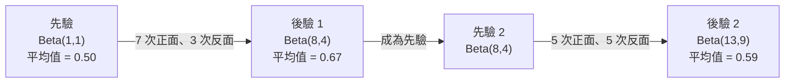

# 貝氏定理

> 機率描述你的預期；貝氏定理則描述你如何從新資訊中學習。

**Type:** Build
**Language:** Python
**Prerequisites:** Phase 1, Lesson 06 (Probability Fundamentals)
**Time:** ~75 minutes

## 學習目標

- 使用貝氏定理，從先驗機率、概似度和證據計算後驗機率
- 從零打造樸素貝氏文字分類器，並實作拉普拉斯平滑和對數空間計算
- 比較最大概似估計（MLE）和最大後驗估計（MAP），並說明 MAP 如何對應 L2 正則化
- 使用 Beta-Binomial 共軛先驗，實作 A/B 測試的序列式貝氏更新

## The Problem｜問題

某項醫療檢測的準確率是 99%。你的檢測結果呈陽性，實際罹病的機率有多高？

多數人會回答 99%，但真正的答案取決於疾病有多罕見。如果每 10,000 人只有 1 人罹病，陽性結果只代表你約有 1% 的機率生病；其他 99% 的陽性結果，都是健康者收到的偽警報。

這不是陷阱題，而是貝氏定理。每個垃圾郵件過濾器、醫療診斷系統，以及量化不確定性的機器學習模型，都會使用這套推理方式：先有一個預期，再觀察證據，然後更新判斷。

如果不了解這個概念就打造機器學習系統，你可能會誤讀模型輸出、設定不恰當的閾值，並交付過度自信的預測。

## The Concept｜核心概念

### 從聯合機率推導貝氏定理

你已在第 6 課學過，條件機率的定義為：

```text
P(A|B) = P(A 且 B) / P(B)
```

對稱地也有：

```text
P(B|A) = P(A 且 B) / P(A)
```

兩個式子的分子都是 P(A and B)。令兩式相等，再重新整理：

```text
P(A 且 B) = P(A|B) * P(B) = P(B|A) * P(A)

Therefore:

P(A|B) = P(B|A) * P(A) / P(B)
```

這就是貝氏定理：四個量，一條公式。

### 四個組成部分

| 符號 | 名稱 | 意義 |
|------|------|---------------|
| P(A\|B) | 後驗機率 | 看到證據 B 後，更新對 A 的判斷 |
| P(B\|A) | 概似度 | A 為真時，證據 B 出現的可能性 |
| P(A) | 先驗機率 | 尚未看到證據前，對 A 的原有判斷 |
| P(B) | 證據 | 考慮所有可能情況後，觀察到 B 的總機率 |

證據 P(B) 是正規化項，可以用全機率定理展開：

```text
P(B) = P(B|A) * P(A) + P(B|非 A) * P(非 A)
```

### 醫療檢測範例

某種疾病每 10,000 人只有 1 人罹患。檢測準確率為 99%（能檢出 99% 的患者，並有 1% 的偽陽性率）。

```text
P(sick)          = 0.0001     （先驗機率：疾病罕見）
P(positive|sick) = 0.99       （概似度：檢測能測出疾病）
P(positive|healthy) = 0.01    （偽陽性率）

P(positive) = P(positive|sick) * P(sick) + P(positive|healthy) * P(healthy)
            = 0.99 * 0.0001 + 0.01 * 0.9999
            = 0.000099 + 0.009999
            = 0.010098

P(sick|positive) = P(positive|sick) * P(sick) / P(positive)
                 = 0.99 * 0.0001 / 0.010098
                 = 0.0098
                 = 0.98%
```

不到 1%。先驗機率在此影響很大。疾病罕見時，即使檢測準確，陽性結果仍多半是偽陽性。這就是醫師會安排確認檢測的原因。

### 垃圾郵件過濾範例

你收到一封含有「lottery」一詞的電子郵件。它是垃圾郵件嗎？

```text
P(spam)                = 0.3      （30% 的電子郵件是垃圾郵件）
P("lottery"|spam)      = 0.05     （5% 的垃圾郵件含有 "lottery"）
P("lottery"|not spam)  = 0.001    （0.1% 的正常郵件含有 "lottery"）

P("lottery") = 0.05 * 0.3 + 0.001 * 0.7
             = 0.015 + 0.0007
             = 0.0157

P(spam|"lottery") = 0.05 * 0.3 / 0.0157
                  = 0.955
                  = 95.5%
```

只看一個詞，就能讓機率從 30% 升到 95.5%。實際的垃圾郵件過濾器會同時對數百個詞套用貝氏推理。

### 樸素貝氏：獨立性假設

樸素貝氏會將這個方法延伸到多個特徵，並假設在給定類別後，所有特徵彼此條件獨立：

```text
P(class | feature_1, feature_2, ..., feature_n)
  = P(class) * P(feature_1|class) * P(feature_2|class) * ... * P(feature_n|class)
    / P(feature_1, feature_2, ..., feature_n)
```

「樸素」指的就是獨立性假設。在文字中，詞語並非互相獨立（例如 "New" 和 "York" 彼此相關）。不過實務上這個假設意外地有效，因為分類器只需要排列類別，不必產生校準過的機率。

由於所有類別的分母都相同，可以省略分母，直接比較分子：

```text
score(class) = P(class) * P(feature_i | class) 的乘積
```

選擇分數最高的類別。

### 最大概似估計（MLE）

如何從訓練資料取得 P(feature|class)？直接計數。

```text
P("free"|spam) =（含有 "free" 的垃圾郵件數）/（垃圾郵件總數）
```

這就是最大概似估計（MLE）：選擇能讓觀測資料最可能出現的參數值。也就是將概似函式最大化；對離散計數而言，這等同於計算相對頻率。

問題是，若訓練時某個詞從未出現在垃圾郵件中，MLE 就會將它的機率設為零。一個未見過的詞就會讓整個乘積變成零。可以用拉普拉斯平滑解決：

```text
P(word|class) = (count(word, class) + 1) / (total_words_in_class + vocabulary_size)
```

每個計數都加 1，就能避免機率為零。

### 最大後驗估計（MAP）

MLE 問的是：哪些參數能讓 P(data|parameters) 最大？

MAP 問的是：哪些參數能讓 P(parameters|data) 最大？

根據貝氏定理：

```text
P(parameters|data) ∝ P(data|parameters) * P(parameters)
```

MAP 會為參數本身加入先驗分布。如果你認為參數應該偏小，就可以設定會懲罰大數值的先驗。這和機器學習中的 L2 正則化完全相同；嶺迴歸的「ridge」懲罰項，實際上就是對權重設定高斯先驗。

| 估計方法 | 最佳化目標 | 機器學習中的對應概念 |
|------------|-----------|---------------|
| MLE | P(data\|params) | 未經正則化的訓練 |
| MAP | P(data\|params) * P(params) | L2／L1 正則化 |

### 貝氏學派與頻率學派：實務上的差異

頻率學派將參數視為固定但未知的值。他們會問：「如果重複進行這個實驗很多次，會發生什麼事？」

貝氏學派將參數視為機率分布。他們會問：「根據目前觀察到的資料，我對這些參數有什麼看法？」

打造機器學習系統時，兩者的實務差異如下：

| 面向 | 頻率學派 | 貝氏學派 |
|--------|-------------|----------|
| 輸出 | 點估計 | 數值的機率分布 |
| 不確定性 | 信賴區間（描述程序） | 可信區間（描述參數） |
| 少量資料 | 可能過度擬合 | 先驗分布具有正則化作用 |
| 計算 | 通常較快 | 通常需要取樣（MCMC） |

大多數正式環境的機器學習採用頻率學派方法（SGD、點估計）。需要校準不確定性（醫療決策、安全關鍵系統）或資料稀少（少樣本學習、冷啟動）時，貝氏方法特別有用。

### 貝氏思維為什麼對機器學習重要

兩者的關聯不只是類比：

**先驗分布就是正則化。** 權重的高斯先驗對應 L2 正則化，拉普拉斯先驗則對應 L1。每次加入正則化項，都是在表達你預期參數值應該如何分布。

**後驗分布描述不確定性。** 單一預測機率無法告訴你模型對該估計有多確定。貝氏方法會提供分布，例如：「我認為 P(spam) 落在 0.8 到 0.95 之間。」

**貝氏更新就是線上學習。** 今天的後驗分布會成為明天的先驗分布。模型看到新資料時，就能逐步更新判斷，而不必從頭訓練。

**模型比較也會用到貝氏方法。** 貝氏資訊準則（BIC）、邊際概似和貝氏因子，都會運用貝氏推理來選擇模型並避免過度擬合。

```figure
bayes-update
```

## Build It｜動手打造

### 步驟 1：實作貝氏定理函式

```python
def bayes(prior, likelihood, false_positive_rate):
    evidence = likelihood * prior + false_positive_rate * (1 - prior)
    posterior = likelihood * prior / evidence
    return posterior

result = bayes(prior=0.0001, likelihood=0.99, false_positive_rate=0.01)
print(f"P(sick|positive) = {result:.4f}")
```

### 步驟 2：樸素貝氏分類器

```python
import math
from collections import defaultdict

class NaiveBayes:
    def __init__(self, smoothing=1.0):
        self.smoothing = smoothing
        self.class_counts = defaultdict(int)
        self.word_counts = defaultdict(lambda: defaultdict(int))
        self.class_word_totals = defaultdict(int)
        self.vocab = set()

    def train(self, documents, labels):
        for doc, label in zip(documents, labels):
            self.class_counts[label] += 1
            words = doc.lower().split()
            for word in words:
                self.word_counts[label][word] += 1
                self.class_word_totals[label] += 1
                self.vocab.add(word)

    def predict(self, document):
        words = document.lower().split()
        total_docs = sum(self.class_counts.values())
        vocab_size = len(self.vocab)
        best_class = None
        best_score = float("-inf")
        for cls in self.class_counts:
            score = math.log(self.class_counts[cls] / total_docs)
            for word in words:
                count = self.word_counts[cls].get(word, 0)
                total = self.class_word_totals[cls]
                score += math.log((count + self.smoothing) / (total + self.smoothing * vocab_size))
            if score > best_score:
                best_score = score
                best_class = cls
        return best_class
```

對數機率能避免下溢。許多微小機率相乘，會得到小到超出浮點數表示範圍的數值；將對數機率相加在數值上較穩定，數學上也完全等價。

### 步驟 3：使用垃圾郵件資料訓練

```python
train_docs = [
    "win free money now",
    "free lottery ticket winner",
    "claim your prize today free",
    "urgent offer free cash",
    "congratulations you won free",
    "meeting tomorrow at noon",
    "project update attached",
    "can we schedule a call",
    "quarterly report review",
    "lunch on thursday sounds good",
    "team standup notes attached",
    "please review the pull request",
]

train_labels = [
    "spam", "spam", "spam", "spam", "spam",
    "ham", "ham", "ham", "ham", "ham", "ham", "ham",
]

classifier = NaiveBayes()
classifier.train(train_docs, train_labels)

test_messages = [
    "free money waiting for you",
    "meeting rescheduled to friday",
    "you won a free prize",
    "please review the attached report",
]

for msg in test_messages:
    print(f"  '{msg}' -> {classifier.predict(msg)}")
```

### 步驟 4：檢視學得的機率

```python
def show_top_words(classifier, cls, n=5):
    vocab_size = len(classifier.vocab)
    total = classifier.class_word_totals[cls]
    probs = {}
    for word in classifier.vocab:
        count = classifier.word_counts[cls].get(word, 0)
        probs[word] = (count + classifier.smoothing) / (total + classifier.smoothing * vocab_size)
    sorted_words = sorted(probs.items(), key=lambda x: x[1], reverse=True)
    for word, prob in sorted_words[:n]:
        print(f"    {word}: {prob:.4f}")

print("\nTop spam words:")
show_top_words(classifier, "spam")
print("\nTop ham words:")
show_top_words(classifier, "ham")
```

## Use It｜開始使用

Scikit-learn 提供可用於正式環境的樸素貝氏實作：

```python
from sklearn.feature_extraction.text import CountVectorizer
from sklearn.naive_bayes import MultinomialNB
from sklearn.metrics import classification_report

vectorizer = CountVectorizer()
X_train = vectorizer.fit_transform(train_docs)
clf = MultinomialNB()
clf.fit(X_train, train_labels)

X_test = vectorizer.transform(test_messages)
predictions = clf.predict(X_test)
for msg, pred in zip(test_messages, predictions):
    print(f"  '{msg}' -> {pred}")
```

演算法相同。CountVectorizer 負責斷詞和建立詞彙表；MultinomialNB 則會在內部處理平滑和對數機率。你從零打造的版本只用 40 行就完成相同工作。

## Ship It｜交付成果

本課程打造的 NaiveBayes 類別示範了完整流程：斷詞、使用拉普拉斯平滑估計機率，以及在對數空間進行預測。`code/bayes.py` 只依賴 Python 標準函式庫，就能端對端執行。

### 共軛先驗

先驗分布和後驗分布屬於同一個分布族時，這個先驗就稱為「共軛先驗」。如此一來，貝氏更新的代數運算會很簡潔，不必數值積分就能得到後驗分布的封閉解。

| 概似函式 | 共軛先驗 | 後驗分布 | 範例 |
|-----------|----------------|-----------|---------|
| Bernoulli | Beta(a, b) | Beta(a + 成功次數, b + 失敗次數) | 估計硬幣正面機率 |
| 常態分布（變異數已知） | Normal(mu_0, sigma_0) | 常態分布（加權平均數、較小變異數） | 感測器校正 |
| Poisson | Gamma(a, b) | Gamma(a + 計數總和, b + n) | 建模事件發生率 |
| 多項分布 | Dirichlet(alpha) | Dirichlet(alpha + 計數值) | 主題模型、語言模型 |

這很重要：沒有共軛先驗時，你需要用 Monte Carlo 取樣或變分推論近似後驗分布；使用共軛先驗時，只要更新兩個數值即可。

Beta 分布是實務上最常見的共軛先驗。Beta(a, b) 用來表示你對某個機率參數的判斷，平均值為 a/(a+b)。a+b 越大，分布越集中，表示判斷越有把握。

Beta 先驗的幾個特例：
- Beta(1, 1) = 均勻分布。你對這個參數沒有預設看法。
- Beta(10, 10) = 峰值位於 0.5。你很確定這個參數接近 0.5。
- Beta(1, 10) = 偏向 0。你認為這個參數很小。

更新規則非常簡單：

```text
先驗：     Beta(a, b)
資料：     s 次成功、f 次失敗
後驗：     Beta(a + s, b + f)
```

不需要積分，也不需要取樣，只要相加。

### 序列式貝氏更新

貝氏推論天生適合序列式更新：今天的後驗分布會成為明天的先驗分布。真實系統可藉此逐步學習，不必重新處理所有歷史資料。

具體例子：估計一枚硬幣是否公平。

**第 1 天：尚無資料。**
從 Beta(1, 1) 開始，也就是均勻先驗；目前沒有預設看法。
- 先驗平均值：0.5
- 先驗在 [0, 1] 區間內呈均勻分布

**第 2 天：觀察到 7 次正面、3 次反面。**
後驗分布 = Beta(1 + 7, 1 + 3) = Beta(8, 4)
- 後驗平均值：8/12 = 0.667
- 證據顯示硬幣可能偏向正面

**第 3 天：再觀察到 5 次正面、5 次反面。**
將昨天的後驗分布作為今天的先驗分布。
後驗分布 = Beta(8 + 5, 4 + 5) = Beta(13, 9)
- 後驗平均值：13/22 = 0.591
- 新資料中正反面次數相同，讓估計值回到接近 0.5



觀察順序不影響結果。一次將 Beta(1,1) 更新為 12 次正面、8 次反面，會得到 Beta(13, 9)，結果相同。序列更新和批次更新在數學上等價；但序列更新讓你每個階段都能做決策，不必儲存原始資料。

這是正式環境機器學習系統中線上學習的基礎。Bandit 的 Thompson sampling、增量式推薦系統和串流異常偵測器都會使用這種模式。

### 與 A/B 測試的關聯

A/B 測試其實就是另一種形式的貝氏推論。

情境：你正在測試兩種按鈕顏色，版本 A 是藍色，版本 B 是綠色。你想知道哪個版本獲得較多點擊。

貝氏 A/B 測試流程：

1. **先驗。** 兩個版本都從 Beta(1, 1) 開始，沒有預設偏好。
2. **資料。** 版本 A：1,000 次瀏覽中有 50 次點擊；版本 B：1,000 次瀏覽中有 65 次點擊。
3. **後驗分布。**
   - A：Beta(1 + 50, 1 + 950) = Beta(51, 951)。平均值 = 0.051
   - B：Beta(1 + 65, 1 + 935) = Beta(66, 936)。平均值 = 0.066
4. **決策。** 計算 P(B > A)，也就是 B 的真實轉換率高於 A 的機率。

直接解析計算 P(B > A) 很困難，但使用 Monte Carlo 取樣就很簡單：

```text
1. Draw 100,000 samples from Beta(51, 951)  -> samples_A
2. Draw 100,000 samples from Beta(66, 936)  -> samples_B
3. P(B > A) = fraction of samples where B > A
```

若 P(B > A) > 0.95，就推出版本 B；若介於 0.05 和 0.95 之間，就繼續收集資料；若 P(B > A) < 0.05，就推出版本 A。

相較於頻率學派的 A/B 測試，貝氏方法的優點：
- 可以直接用機率表達結果：「B 比較好的機率是 97%」
- 不必困惑於 p 值，也不必含糊地說「無法拒絕虛無假設」。
- 隨時檢視結果都不會提高偽陽性率（沒有「偷看問題」）。
- 可以納入先驗知識（例如，過去測試顯示轉換率通常介於 3% 到 8%）。

| 面向 | 頻率學派 A/B 測試 | 貝氏 A/B 測試 |
|--------|----------------|--------------|
| 輸出 | p 值 | P(B > A) |
| 解讀 |「若 A=B，這些資料有多令人意外？」|「B 比 A 好的可能性有多高？」|
| 提前停止 | 會提高偽陽性率 | 隨時停止都安全（前提是先驗選擇適當、模型設定正確） |
| 先驗知識 | 不使用 | 編碼為 Beta 先驗 |
| 決策規則 | p < 0.05 | P(B > A) > 閾值 |

## Exercises｜練習

1. **多次檢測。** 某患者在兩項彼此獨立、準確率皆為 99% 的檢測中都呈陽性，而疾病盛行率為每 10,000 人 1 人。兩次檢測後的 P(sick) 是多少？將第一次檢測的後驗機率作為第二次檢測的先驗機率。

2. **平滑的影響。** 使用 0.01、0.1、1.0 和 10.0 作為平滑值執行垃圾郵件分類器。排名最高的詞語機率如何變化？若 smoothing=0，且某個詞只出現在正常郵件中，會發生什麼事？

3. **加入特徵。** 擴充 NaiveBayes 類別，除了詞頻，也將訊息長度（短／長）納入特徵。從訓練資料估計 P(short|spam) 和 P(short|ham)，並將其納入預測分數。

4. **手算 MAP。** 已知觀察資料為擲硬幣 10 次、出現 7 次正面，請使用 Beta(2,2) 先驗計算偏向正面的 MAP 估計值，再與 MLE 估計值（7/10）比較。

## Key Terms｜重要詞彙

| 詞彙 | 一般說法 | 實際意義 |
|------|----------------|----------------------|
| 先驗機率 |「一開始的猜測」| 觀察證據前的 P(hypothesis)。在機器學習中對應正則化項。 |
| 概似度 |「資料符合得多好」| P(evidence\|hypothesis)，表示在特定假設下觀察資料出現的可能性。 |
| 後驗機率 |「更新後的判斷」| P(hypothesis\|evidence)，即先驗機率乘上概似度後再正規化。 |
| 證據 |「正規化常數」| 所有假設下 P(data) 的總和，確保後驗機率加總為 1。 |
| 樸素貝氏 |「簡單的文字分類器」| 假設給定類別後，各特徵彼此獨立的分類器。即使假設不完全成立，實務效果仍然很好。 |
| 拉普拉斯平滑 |「加一平滑」| 為每個特徵加上少量計數，避免未見資料造成機率為零。 |
| MLE |「直接用頻率」| 選擇能讓 P(data\|parameters) 最大的參數。不加入先驗，資料少時可能過度擬合。 |
| MAP |「加入先驗的 MLE」| 選擇能讓 P(data\|parameters) * P(parameters) 最大的參數，等同於經過正則化的 MLE。 |
| 對數機率 |「在對數空間運算」| 使用 log(P) 取代 P，避免許多小數相乘時發生浮點數下溢。 |
| 偽陽性 |「錯誤警報」| 檢測結果呈陽性，但真實狀態為陰性；這是基率謬誤的成因之一。 |

## 延伸閱讀

- [3Blue1Brown：貝氏定理](https://www.youtube.com/watch?v=HZGCoVF3YvM) — 以醫療檢測範例進行視覺化說明
- [Stanford CS229：生成式學習演算法](https://cs229.stanford.edu/main_notes.pdf) — 樸素貝氏及其與判別式模型的關聯
- [Think Bayes](https://greenteapress.com/wp/think-bayes/) — 免費書籍，以 Python 程式介紹貝氏統計
- [scikit-learn 樸素貝氏](https://scikit-learn.org/stable/modules/naive_bayes.html) — 正式環境實作及各變體的適用情境
