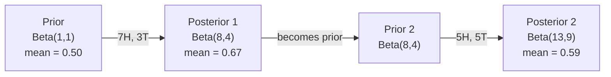

# 貝氏定理

> 機率談的是你預期什麼；貝氏定理（Bayes' theorem）談的是你學到什麼。

**Type:** Build
**Language:** Python
**Prerequisites:** Phase 1, Lesson 06 (Probability Fundamentals)
**Time:** ~75 minutes

## Learning Objectives｜學習目標

- 套用貝氏定理，從先驗（prior）、概似（likelihood）與證據（evidence）計算後驗機率
- 從零打造一個帶拉普拉斯平滑（Laplace smoothing）與對數空間計算的單純貝氏（Naive Bayes）文字分類器
- 比較 MLE 與 MAP 估計，並說明 MAP 如何對應到 L2 正則化（regularization）
- 用 Beta-Binomial 共軛先驗為 A/B 測試實作循序貝氏更新

## The Problem｜問題

某個醫學檢驗有 99% 的準確率。你的檢驗結果是陽性。你真的得病的機率是多少？

多數人會說 99%。真正的答案取決於疾病有多罕見。如果每 10,000 人只有 1 人得病，陽性結果代表你得病的機率只有約 1%——另外 99% 的陽性結果是健康者的誤報。

這不是陷阱題，這就是貝氏定理。每個垃圾郵件篩選器（spam filter）、每個醫學診斷、每個量化不確定性的機器學習（machine learning）模型，用的都是這套推理。你從一個信念出發，看到證據，然後更新。

如果你不懂這個就建 ML 系統，你會誤讀模型輸出、設定糟糕的閾值，並推出過度自信的預測。

## The Concept｜核心概念

### 從聯合機率到貝氏定理

第 06 課已經講過條件機率：

```
P(A|B) = P(A and B) / P(B)
```

對稱地：

```
P(B|A) = P(A and B) / P(A)
```

兩個式子共享同一個分子 P(A and B)。令它們相等再移項：

```
P(A and B) = P(A|B) * P(B) = P(B|A) * P(A)

Therefore:

P(A|B) = P(B|A) * P(A) / P(B)
```

這就是貝氏定理：四個量、一個方程式。

### 四個組成部分

| 部分 | 名稱 | 意義 |
|------|------|---------------|
| P(A\|B) | 後驗（posterior） | 看到證據 B 之後，你對 A 的更新信念 |
| P(B\|A) | 概似（likelihood） | 如果 A 為真，證據 B 出現的機率 |
| P(A) | 先驗（prior） | 看到任何證據之前，你對 A 的信念 |
| P(B) | 證據（evidence） | 在所有可能性之下看到 B 的總機率 |

證據項 P(B) 是正規化因子。你可以用全機率法則（law of total probability）展開它：

```
P(B) = P(B|A) * P(A) + P(B|not A) * P(not A)
```

### 醫學檢驗範例

某疾病每 10,000 人中有 1 人得病。檢驗準確率 99%（能檢出 99% 的患者，有 1% 的機率對健康者誤報）。

```
P(sick)          = 0.0001     (prior: disease is rare)
P(positive|sick) = 0.99       (likelihood: test catches it)
P(positive|healthy) = 0.01    (false positive rate)

P(positive) = P(positive|sick) * P(sick) + P(positive|healthy) * P(healthy)
            = 0.99 * 0.0001 + 0.01 * 0.9999
            = 0.000099 + 0.009999
            = 0.010098

P(sick|positive) = P(positive|sick) * P(sick) / P(positive)
                 = 0.99 * 0.0001 / 0.010098
                 = 0.0098
                 = 0.98%
```

不到 1%。先驗主導了結果。當一個狀況很罕見時，再準確的檢驗產生的也大多是偽陽性（false positive）——這就是醫師要求複檢的原因。

### 垃圾郵件範例

你收到一封含有「lottery」這個詞的電子郵件。它是垃圾郵件嗎？

```
P(spam)                = 0.3      (30% of email is spam)
P("lottery"|spam)      = 0.05     (5% of spam emails contain "lottery")
P("lottery"|not spam)  = 0.001    (0.1% of legitimate emails contain "lottery")

P("lottery") = 0.05 * 0.3 + 0.001 * 0.7
             = 0.015 + 0.0007
             = 0.0157

P(spam|"lottery") = 0.05 * 0.3 / 0.0157
                  = 0.955
                  = 95.5%
```

一個詞就把機率從 30% 推到 95.5%。真正的垃圾郵件篩選器同時對數百個詞套用貝氏定理。

### 單純貝氏：獨立性假設

單純貝氏把這個做法延伸到多個特徵（feature），假設在給定類別下所有特徵（feature）條件獨立：

```
P(class | feature_1, feature_2, ..., feature_n)
  = P(class) * P(feature_1|class) * P(feature_2|class) * ... * P(feature_n|class)
    / P(feature_1, feature_2, ..., feature_n)
```

「單純」的部分是那個獨立性假設。在文字中，詞的出現並不獨立（「New」和「York」是相關的），但這個假設在實務上好得出奇，因為分類器只需要排出類別的高低順序，不需要產生校準過的機率。

分母對所有類別都相同，所以可以跳過，只比較分子：

```
score(class) = P(class) * product of P(feature_i | class)
```

選分數最高的類別。

### 最大概似估計（MLE）

怎麼從訓練資料得到 P(feature|class)？數一數。

```
P("free"|spam) = (number of spam emails containing "free") / (total spam emails)
```

這就是 MLE：選讓觀測資料最可能出現的參數值。你在最大化概似函數；對離散計數來說，它就是相對頻率。

問題：如果一個詞在訓練時從未出現在垃圾郵件中，MLE 給它機率零——一個沒見過的詞就殺掉整個乘積。用拉普拉斯平滑修復：

```
P(word|class) = (count(word, class) + 1) / (total_words_in_class + vocabulary_size)
```

每個計數都加 1，保證沒有任何機率是零。

### 最大後驗估計（MAP）

MLE 問：什麼參數最大化 P(data|parameters)？

MAP 問：什麼參數最大化 P(parameters|data)？

由貝氏定理：

```
P(parameters|data) proportional to P(data|parameters) * P(parameters)
```

MAP 在參數本身加上一個先驗。如果你相信參數應該小，就把這個信念編碼成一個懲罰（penalty）大參數值的先驗——這和 ML 中的 L2 正則化完全等價。嶺迴歸（ridge regression）中的「ridge」懲罰，字面上就是對權重加高斯先驗。

| 估計 | 最佳化 | ML 對應物 |
|------------|-----------|---------------|
| MLE | P(data\|params) | 未正則化的訓練 |
| MAP | P(data\|params) * P(params) | L2 / L1 正則化 |

### 貝氏 vs 頻率學派：實務差異

頻率學派（frequentist）把參數當成固定的未知量。他們問：「如果我重複這個實驗很多次，會發生什麼？」

貝氏學派（Bayesian）把參數當成分布。他們問：「給定我觀察到的東西，我該相信參數是什麼？」

對建 ML 系統來說，實務上的差異是：

| 面向 | 頻率學派 | 貝氏 |
|--------|-------------|----------|
| 輸出 | 點估計 | 值的分布 |
| 不確定性 | 信賴區間（confidence intervals，關於程序） | 可信度區間（credible intervals，關於參數） |
| 小資料 | 可能過度擬合 | 先驗相當於正則化 |
| 計算 | 通常較快 | 常需要取樣（MCMC） |

多數正式環境的 ML 是頻率學派的（SGD、點估計）。貝氏方法在需要校準過的不確定性（醫療決策、安全關鍵系統）或資料稀少（few-shot 學習、冷啟動）時大放異彩。

### 為什麼貝氏思考對 ML 重要

這層連結不只是類比：

**先驗就是正則化。** 權重上的高斯先驗是 L2 正則化，拉普拉斯先驗是 L1。每次你加正則化項，就是在對你預期的參數值做貝氏陳述。

**後驗就是不確定性。** 單一的預測機率完全不能告訴你模型對這個估計有多自信。貝氏方法給你一個分布：「我認為 P(spam) 介於 0.8 和 0.95 之間。」

**貝氏更新就是線上學習。** 今天的後驗是明天的先驗。當模型看到新資料，它逐步更新信念，而不是從頭重訓。

**模型比較是貝氏的。** 貝氏資訊準則（BIC）、邊際概似和貝氏因子都用貝氏推理在模型間做選擇，而不過度擬合。

```figure
bayes-update
```

## Build It｜動手實作

### 步驟 1：貝氏定理函式

```python
def bayes(prior, likelihood, false_positive_rate):
    evidence = likelihood * prior + false_positive_rate * (1 - prior)
    posterior = likelihood * prior / evidence
    return posterior

result = bayes(prior=0.0001, likelihood=0.99, false_positive_rate=0.01)
print(f"P(sick|positive) = {result:.4f}")
```

### 步驟 2：單純貝氏分類器

```python
import math
from collections import defaultdict

class NaiveBayes:
    def __init__(self, smoothing=1.0):
        self.smoothing = smoothing
        self.class_counts = defaultdict(int)
        self.word_counts = defaultdict(lambda: defaultdict(int))
        self.class_word_totals = defaultdict(int)
        self.vocab = set()

    def train(self, documents, labels):
        for doc, label in zip(documents, labels):
            self.class_counts[label] += 1
            words = doc.lower().split()
            for word in words:
                self.word_counts[label][word] += 1
                self.class_word_totals[label] += 1
                self.vocab.add(word)

    def predict(self, document):
        words = document.lower().split()
        total_docs = sum(self.class_counts.values())
        vocab_size = len(self.vocab)
        best_class = None
        best_score = float("-inf")
        for cls in self.class_counts:
            score = math.log(self.class_counts[cls] / total_docs)
            for word in words:
                count = self.word_counts[cls].get(word, 0)
                total = self.class_word_totals[cls]
                score += math.log((count + self.smoothing) / (total + self.smoothing * vocab_size))
            if score > best_score:
                best_score = score
                best_class = cls
        return best_class
```

對數機率防止下溢位。把很多小機率相乘會產生小到浮點數（floating point）表示不了的數字；把對數機率相加既數值穩定、數學上也等價。

### 步驟 3：用垃圾郵件資料訓練

```python
train_docs = [
    "win free money now",
    "free lottery ticket winner",
    "claim your prize today free",
    "urgent offer free cash",
    "congratulations you won free",
    "meeting tomorrow at noon",
    "project update attached",
    "can we schedule a call",
    "quarterly report review",
    "lunch on thursday sounds good",
    "team standup notes attached",
    "please review the pull request",
]

train_labels = [
    "spam", "spam", "spam", "spam", "spam",
    "ham", "ham", "ham", "ham", "ham", "ham", "ham",
]

classifier = NaiveBayes()
classifier.train(train_docs, train_labels)

test_messages = [
    "free money waiting for you",
    "meeting rescheduled to friday",
    "you won a free prize",
    "please review the attached report",
]

for msg in test_messages:
    print(f"  '{msg}' -> {classifier.predict(msg)}")
```

### 步驟 4：檢視學到的機率

```python
def show_top_words(classifier, cls, n=5):
    vocab_size = len(classifier.vocab)
    total = classifier.class_word_totals[cls]
    probs = {}
    for word in classifier.vocab:
        count = classifier.word_counts[cls].get(word, 0)
        probs[word] = (count + classifier.smoothing) / (total + classifier.smoothing * vocab_size)
    sorted_words = sorted(probs.items(), key=lambda x: x[1], reverse=True)
    for word, prob in sorted_words[:n]:
        print(f"    {word}: {prob:.4f}")

print("\nTop spam words:")
show_top_words(classifier, "spam")
print("\nTop ham words:")
show_top_words(classifier, "ham")
```

## Use It｜實際應用

Scikit-learn 內建生產級的單純貝氏實作：

```python
from sklearn.feature_extraction.text import CountVectorizer
from sklearn.naive_bayes import MultinomialNB
from sklearn.metrics import classification_report

vectorizer = CountVectorizer()
X_train = vectorizer.fit_transform(train_docs)
clf = MultinomialNB()
clf.fit(X_train, train_labels)

X_test = vectorizer.transform(test_messages)
predictions = clf.predict(X_test)
for msg, pred in zip(test_messages, predictions):
    print(f"  '{msg}' -> {pred}")
```

同一個演算法。CountVectorizer 處理 tokenization 和詞彙表建立；MultinomialNB 內部處理平滑和對數機率。你的從零版本用 40 行做了同樣的事。

## Ship It｜交付成果

這裡打造的 NaiveBayes 類別展示了完整管線（pipeline）：tokenization、拉普拉斯平滑的機率估計、對數空間預測。`code/bayes.py` 的程式碼只靠 Python 標準函式庫就能端到端執行。

### 共軛先驗

當先驗和後驗屬於同一族分布時，這個先驗稱為「共軛」（conjugate）。這讓貝氏更新在代數上很乾淨——你不用做數值積分就能拿到封閉式（closed-form）後驗。

| 概似 | 共軛先驗 | 後驗 | 範例 |
|-----------|----------------|-----------|---------|
| 伯努利 | Beta(a, b) | Beta(a + successes, b + failures) | 硬幣正面機率估計 |
| 常態（已知變異數） | Normal(mu_0, sigma_0) | Normal(weighted mean, smaller variance) | 感測器校準 |
| 卜瓦松 | Gamma(a, b) | Gamma(a + sum of counts, b + n) | 為到達率建模 |
| 多項 | Dirichlet(alpha) | Dirichlet(alpha + counts) | 主題建模、語言模型 |

為什麼這重要：沒有共軛先驗，你得用蒙地卡羅取樣或變分推論（variational inference）來逼近後驗；有了共軛先驗，你只要更新兩個數字。

Beta 分布是實務上最常見的共軛先驗。Beta(a, b) 代表你對一個機率參數的信念。平均數是 a/(a+b)；a+b 越大，分布越集中（越自信）。

Beta 先驗的特殊情況：
- Beta(1, 1) = 均勻分布。你對這個參數沒有任何意見。
- Beta(10, 10) = 峰值在 0.5。你強烈相信參數在 0.5 附近。
- Beta(1, 10) = 偏向 0。你相信參數很小。

更新規則簡單到不行：

```
Prior:     Beta(a, b)
Data:      s successes, f failures
Posterior: Beta(a + s, b + f)
```

不用積分、不用取樣，只要加法。

### 循序貝氏更新

貝氏推論天生是循序的：今天的後驗就是明天的先驗。真實系統就靠這個逐步學習，不必重新處理全部歷史資料。

具體範例：估計一枚硬幣是否公平。

**第 1 天：還沒有資料。**
從 Beta(1, 1) 開始——均勻先驗，你沒有任何意見。
- 先驗平均：0.5
- 先驗在 [0, 1] 上是平坦的

**第 2 天：觀察到 7 正面、3 反面。**
後驗 = Beta(1 + 7, 1 + 3) = Beta(8, 4)
- 後驗平均：8/12 = 0.667
- 證據顯示硬幣偏向正面

**第 3 天：再觀察到 5 正面、5 反面。**
用昨天的後驗當今天的先驗。
後驗 = Beta(8 + 5, 4 + 5) = Beta(13, 9)
- 後驗平均：13/22 = 0.591
- 平衡的新資料把估計拉回 0.5



觀察順序無所謂：Beta(1,1) 一次更新全部 12 正面、8 反面得到 Beta(13, 9)——結果相同。循序更新和批次更新在數學上等價，但循序更新讓你每一步都能做決策，不必儲存原始資料。

這是正式環境 ML 系統線上學習的基礎。bandit 的湯普森取樣（Thompson sampling）、增量推薦系統和串流（streaming）異常偵測用的都是這個模式。

### 與 A/B 測試的連結

A/B 測試就是喬裝的貝氏推論。

設定：你在測試兩種按鈕顏色——變體 A（藍色）和變體 B（綠色）。你想知道哪個拿到更多點選。

貝氏 A/B 測試：

1. **先驗。** 兩個變體都從 Beta(1, 1) 開始，沒有先驗偏好。
2. **資料。** 變體 A：1,000 次曝光 50 次點選；變體 B：1,000 次曝光 65 次點選。
3. **後驗。**
   - A：Beta(1 + 50, 1 + 950) = Beta(51, 951)。平均 = 0.051
   - B：Beta(1 + 65, 1 + 935) = Beta(66, 936)。平均 = 0.066
4. **決策。** 計算 P(B > A)——B 的真實轉換率高於 A 的機率。

用解析方式計算 P(B > A) 很難，但蒙地卡羅讓它變得微不足道：

```
1. Draw 100,000 samples from Beta(51, 951)  -> samples_A
2. Draw 100,000 samples from Beta(66, 936)  -> samples_B
3. P(B > A) = fraction of samples where B > A
```

若 P(B > A) > 0.95，推出變體 B；介於 0.05 和 0.95 之間就繼續收資料；若 P(B > A) < 0.05 就推出變體 A。

相對頻率學派 A/B 測試的優勢：
- 你拿到一個直接的機率陳述：「B 比較好的機率是 97%」
- 沒有 p 值的困惑，沒有「無法拒絕虛無假設」的閃爍其詞
- 任何時間點都能檢查結果，不會膨脹偽陽性率（沒有「偷看問題」）
- 可以納入先驗知識（例如過去的測試顯示轉換率通常在 3-8%）

| 面向 | 頻率學派 A/B | 貝氏 A/B |
|--------|----------------|--------------|
| 輸出 | p 值 | P(B > A) |
| 詮釋 | 「如果 A=B，這資料有多意外？」 | 「B 比 A 好的機率是多少？」 |
| 提前停止 | 膨脹偽陽性 | 任何時間點都安全（在先驗選得好、模型指定正確的前提下） |
| 先驗知識 | 不使用 | 以 Beta 先驗編碼 |
| 決策規則 | p < 0.05 | P(B > A) > 閾值 |

## Exercises｜練習

1. **多次檢驗。** 一位病人在兩次獨立檢驗中都呈陽性（各 99% 準確、疾病盛行率每 10,000 人 1 人）。兩次檢驗後 P(sick) 是多少？把第一次檢驗的後驗當作第二次的先驗。

2. **平滑的影響。** 用平滑值 0.01、0.1、1.0、10.0 跑垃圾郵件分類器。排名最高的詞機率如何變化？當 smoothing=0 且某個詞只出現在 ham 時會發生什麼？

3. **加特徵（feature）。** 擴充 NaiveBayes 類別，在詞計數之外也使用訊息長度（短／長）作為特徵（feature）。從訓練資料估計 P(short|spam) 和 P(short|ham)，把它併進預測分數。

4. **手算 MAP。** 給定觀測資料（10 次丟硬幣出現 7 正面），用 Beta(2,2) 先驗計算硬幣正面機率的 MAP 估計，並與 MLE 估計（7/10）比較。

## Key Terms｜關鍵術語

| 術語 | 常見說法 | 實際意義 |
|------|----------------|----------------------|
| 先驗（prior） | 「我的初始猜測」 | 看到證據之前的 P(hypothesis)。在 ML 中：正則化項。 |
| 概似（likelihood） | 「資料配得多好」 | P(evidence\|hypothesis)。在特定假設下觀測資料有多可能。 |
| 後驗（posterior） | 「我更新後的信念」 | P(hypothesis\|evidence)。先驗乘以概似，再正規化。 |
| 證據（evidence） | 「正規化常數」 | 跨所有假設的 P(data)。確保後驗加總為 1。 |
| 單純貝氏（Naive Bayes） | 「那個簡單的文字分類器」 | 假設給定類別下各特徵（feature）獨立的分類器。儘管假設是錯的，效果依然很好。 |
| 拉普拉斯平滑（Laplace smoothing） | 「加一平滑」 | 給每個特徵（feature）加上一個小計數，防止未見資料產生零機率。 |
| MLE | 「直接用頻率」 | 選擇最大化 P(data\|parameters) 的參數。沒有先驗，小資料時可能過度擬合。 |
| MAP | 「帶先驗的 MLE」 | 選擇最大化 P(data\|parameters) * P(parameters) 的參數。等價於正則化的 MLE。 |
| 對數機率（log-probability） | 「在對數空間做」 | 用 log(P) 取代 P，避免許多小數相乘時的浮點下溢位。 |
| 偽陽性（false positive） | 「誤報」 | 檢驗說是陽性，但真實狀態是陰性。基礎率謬誤的推手。 |

## Further Reading｜延伸閱讀

- [3Blue1Brown: Bayes' theorem](https://www.youtube.com/watch?v=HZGCoVF3YvM) - 用醫學檢驗範例的視覺化解說
- [Stanford CS229: Generative Learning Algorithms](https://cs229.stanford.edu/main_notes.pdf) - 單純貝氏及其與判別式模型的連結
- [Think Bayes](https://greenteapress.com/wp/think-bayes/) - 免費書籍，用 Python 程式碼講貝氏統計
- [scikit-learn Naive Bayes](https://scikit-learn.org/stable/modules/naive_bayes.html) - 生產級實作與何時用哪個變體
