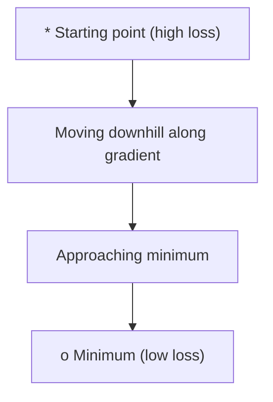
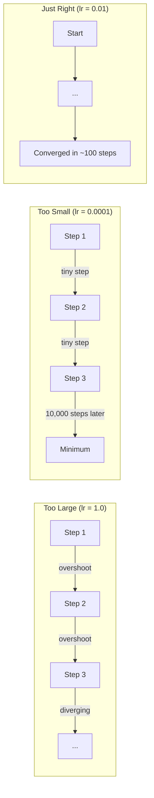
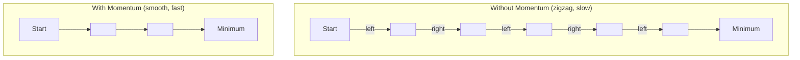
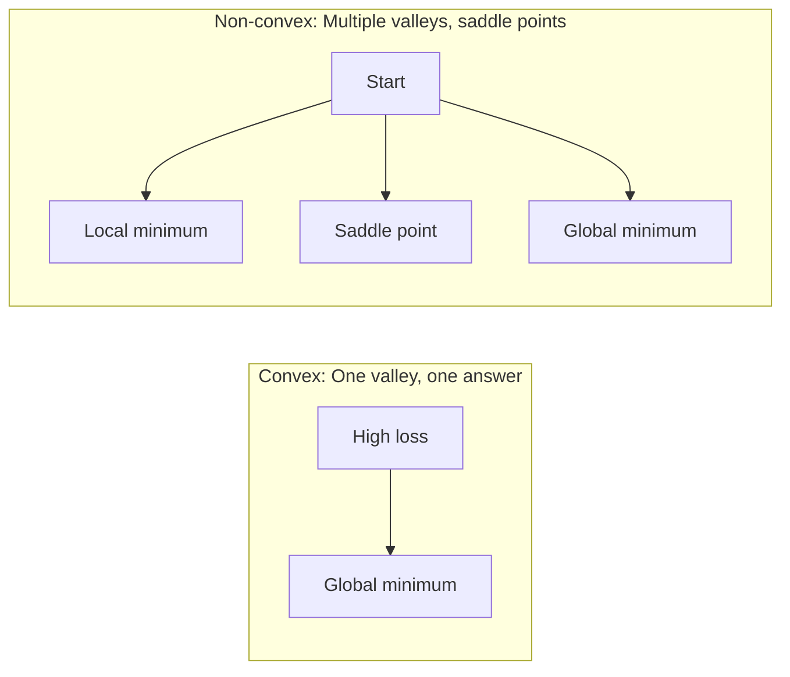
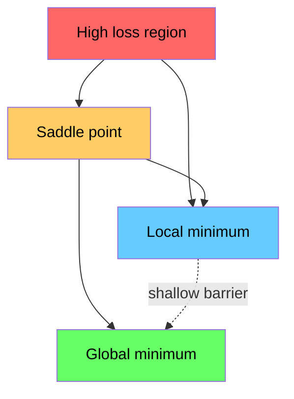

# 最佳化

> 訓練神經網路，不過就是找到山谷的谷底。

**Type:** Build
**Language:** Python
**Prerequisites:** Phase 1, Lessons 04-05 (Derivatives, Gradients)
**Time:** ~75 minutes

## Learning Objectives｜學習目標

- 從零實作標準梯度下降法（vanilla gradient descent）、帶動量的 SGD，以及 Adam
- 在 Rosenbrock 函數上比較各最佳化器的收斂情形，並說明 Adam 為何能為每個權重自適應調整學習率
- 分辨凸與非凸損失地景（loss landscape），並解釋鞍點在高維空間中的角色
- 設定學習率排程（learning rate schedule，步進衰減、餘弦退火、預熱）讓訓練保持穩定

## The Problem｜問題

你有一個損失函數（loss function），它告訴你模型錯得有多離譜；你有梯度，它告訴你往哪個方向損失會變得更糟。現在你需要一套往山下走的策略。

最天真的做法很簡單：朝梯度的反方向移動，用一個叫學習率的數字縮放步長，然後重複。這就是梯度下降法，而且真的有效——但「有效」是有但書的。學習率太大，你會整個越過山谷、在兩壁之間來回彈跳；太小，你會用數千個多餘的步驟慢慢爬向答案。踩到鞍點，你甚至會停下來——儘管根本還沒找到最小值。

深度學習中每個最佳化器（optimizer），都是同一個問題的不同答案：怎麼更快、更可靠地走到谷底？

## The Concept｜核心概念

### 最佳化是什麼意思

最佳化（optimization）是找到讓函數最小化（或最大化）的輸入值。在機器學習中，函數是損失，輸入是模型的權重。訓練就是最佳化。

```
minimize L(w) where:
  L = loss function
  w = model weights (could be millions of parameters)
```

### 梯度下降法（vanilla）

最簡單的最佳化器。計算損失對每個權重的梯度，把每個權重往它梯度的反方向移動，步長用學習率縮放。

```
w = w - lr * gradient
```

整個演算法就這一行。



### 學習率：最重要的超參數

學習率控制步長，決定了收斂的一切。



沒有公式可以算出正確的學習率，只能靠實驗找。常見的起點：Adam 用 0.001，帶動量的 SGD 用 0.01。

### SGD vs batch vs mini-batch

標準梯度下降法走一步之前，會用整個資料集計算梯度。這叫 批次梯度下降法——穩定，但慢。

隨機梯度下降法（stochastic gradient descent，SGD）用單一隨機樣本算梯度，立刻走一步——雜訊較大，但快。

小批次（mini-batch）梯度下降法取折衷：用一小批（32、64、128、256 個樣本）算梯度再走一步。大家實際上用的都是它。

| 變體 | 批次大小 | 梯度品質 | 每步速度 | 雜訊 |
|---------|-----------|-----------------|---------------|-------|
| Batch GD | 整個資料集 | 精確 | 慢 | 無 |
| SGD | 1 個樣本 | 非常雜訊較大 | 快 | 高 |
| Mini-batch | 32-256 | 良好的估計 | 平衡 | 中等 |

SGD 和小批次中的雜訊不是 bug——它有助於逃出淺的局部最小值和鞍點。

### 動量：滾下坡的球

標準梯度下降法只看當前的梯度。如果梯度左右擺動（在狹窄山谷中很常見），前進就很慢。動量把過去的梯度累積成一個速度向量來解決這個問題。

```
v = beta * v + gradient
w = w - lr * v
```

比喻：一顆滾下坡的球，不會在每個小凸起上停下來重來。它在一致的方向上累積速度，同時阻尼來回震盪。



`beta`（通常 0.9）控制保留多少歷史。beta 越高動量越強、路徑越平滑，但對方向變化的反應越慢。

### Adam：自適應學習率

不同的權重需要不同的學習率。一個很少拿到大梯度的權重，在終於拿到時應該走大步一點；一個動輒拿到巨大梯度的權重，應該走小步一點。

Adam（Adaptive Moment Estimation）對每個權重追蹤兩件事：

1. 一階矩（first moment，m）：梯度的移動平均數（類似動量）
2. 二階矩（second moment，v）：梯度平方的移動平均數（梯度大小）

```
m = beta1 * m + (1 - beta1) * gradient
v = beta2 * v + (1 - beta2) * gradient^2

m_hat = m / (1 - beta1^t)    bias correction
v_hat = v / (1 - beta2^t)    bias correction

w = w - lr * m_hat / (sqrt(v_hat) + epsilon)
```

除以 `sqrt(v_hat)` 是關鍵洞見。梯度大的權重被除以一個大數（有效步長變小）；梯度小的權重被除以一個小數（有效步長變大）。每個權重都有自己的自適應學習率。

預設超參數：`lr=0.001, beta1=0.9, beta2=0.999, epsilon=1e-8`。這些預設值對多數問題都好用。

### 學習率排程

固定的學習率是一種妥協。訓練初期你要大步、快速推進；訓練末期你要小步，在最小值附近細細調整。

常見排程：

| 排程 | 公式 | 使用情境 |
|----------|---------|----------|
| 步進衰減 | 每 N 個 epoch lr = lr * factor | 簡單、手動控制 |
| 指數衰減 | lr = lr_0 * decay^t | 平滑遞減 |
| 餘弦退火 | lr = lr_min + 0.5 * (lr_max - lr_min) * (1 + cos(pi * t / T)) | Transformer、現代訓練 |
| 預熱 + 衰減 | 先線性升溫，再衰減 | 大型模型，防止早期不穩定 |

### 凸 vs 非凸

凸函數（convex function）只有一個最小值，梯度下降法保證找得到。像 `f(x) = x^2` 這樣的二次式就是凸的。

神經網路的損失函數（loss function）是非凸的：有很多局部最小值、鞍點和平坦區域。



實務上，高維神經網路中的局部最小值很少是問題——多數局部最小值的損失都很接近全域最小值。鞍點（在某些方向平坦、在另一些方向彎曲）才是真正的障礙。動量加上小批次的雜訊有助於逃離它們。

### 損失地景視覺化

損失是所有權重的函數。一百萬個權重的模型，其損失地景存在 1,000,001 維空間中。我們視覺化它的方法是：在權重空間中選兩個隨機方向，沿著這兩個方向畫出損失，得到一個 2D 曲面。



尖銳的最小值泛化不佳；平坦的最小值泛化較好。這就是為什麼帶動量的 SGD 在最終測試準確率上常勝過 Adam 的原因之一：它的雜訊阻止模型定居在尖銳最小值裡。

```figure
gradient-descent
```

## Build It｜動手實作

### 步驟 1：定義測試函數

Rosenbrock 函數是經典的最佳化基準。它的最小值在 (1, 1)，藏在一條容易找到但很難跟隨的狹窄彎曲山谷裡。

```
f(x, y) = (1 - x)^2 + 100 * (y - x^2)^2
```

```python
def rosenbrock(params):
    x, y = params
    return (1 - x) ** 2 + 100 * (y - x ** 2) ** 2

def rosenbrock_gradient(params):
    x, y = params
    df_dx = -2 * (1 - x) + 200 * (y - x ** 2) * (-2 * x)
    df_dy = 200 * (y - x ** 2)
    return [df_dx, df_dy]
```

### 步驟 2：標準梯度下降法

```python
class GradientDescent:
    def __init__(self, lr=0.001):
        self.lr = lr

    def step(self, params, grads):
        return [p - self.lr * g for p, g in zip(params, grads)]
```

### 步驟 3：帶動量的 SGD

```python
class SGDMomentum:
    def __init__(self, lr=0.001, momentum=0.9):
        self.lr = lr
        self.momentum = momentum
        self.velocity = None

    def step(self, params, grads):
        if self.velocity is None:
            self.velocity = [0.0] * len(params)
        self.velocity = [
            self.momentum * v + g
            for v, g in zip(self.velocity, grads)
        ]
        return [p - self.lr * v for p, v in zip(params, self.velocity)]
```

### 步驟 4：Adam

```python
class Adam:
    def __init__(self, lr=0.001, beta1=0.9, beta2=0.999, epsilon=1e-8):
        self.lr = lr
        self.beta1 = beta1
        self.beta2 = beta2
        self.epsilon = epsilon
        self.m = None
        self.v = None
        self.t = 0

    def step(self, params, grads):
        if self.m is None:
            self.m = [0.0] * len(params)
            self.v = [0.0] * len(params)

        self.t += 1

        self.m = [
            self.beta1 * m + (1 - self.beta1) * g
            for m, g in zip(self.m, grads)
        ]
        self.v = [
            self.beta2 * v + (1 - self.beta2) * g ** 2
            for v, g in zip(self.v, grads)
        ]

        m_hat = [m / (1 - self.beta1 ** self.t) for m in self.m]
        v_hat = [v / (1 - self.beta2 ** self.t) for v in self.v]

        return [
            p - self.lr * mh / (vh ** 0.5 + self.epsilon)
            for p, mh, vh in zip(params, m_hat, v_hat)
        ]
```

### 步驟 5：執行並比較

```python
def optimize(optimizer, func, grad_func, start, steps=5000):
    params = list(start)
    history = [params[:]]
    for _ in range(steps):
        grads = grad_func(params)
        params = optimizer.step(params, grads)
        history.append(params[:])
    return history

start = [-1.0, 1.0]

gd_history = optimize(GradientDescent(lr=0.0005), rosenbrock, rosenbrock_gradient, start)
sgd_history = optimize(SGDMomentum(lr=0.0001, momentum=0.9), rosenbrock, rosenbrock_gradient, start)
adam_history = optimize(Adam(lr=0.01), rosenbrock, rosenbrock_gradient, start)

for name, history in [("GD", gd_history), ("SGD+M", sgd_history), ("Adam", adam_history)]:
    final = history[-1]
    loss = rosenbrock(final)
    print(f"{name:6s} -> x={final[0]:.6f}, y={final[1]:.6f}, loss={loss:.8f}")
```

預期輸出：Adam 收斂最快；帶動量的 SGD 走較平滑的路徑；vanilla GD 沿著狹窄山谷緩慢前進。

## Use It｜實際應用

實務上用 PyTorch 或 JAX 的最佳化器——它們處理參數群組、權重衰減、梯度裁剪和 GPU 加速。

```python
import torch

model = torch.nn.Linear(784, 10)

sgd = torch.optim.SGD(model.parameters(), lr=0.01, momentum=0.9)
adam = torch.optim.Adam(model.parameters(), lr=0.001)
adamw = torch.optim.AdamW(model.parameters(), lr=0.001, weight_decay=0.01)

scheduler = torch.optim.lr_scheduler.CosineAnnealingLR(adam, T_max=100)
```

經驗法則：

- 從 Adam（lr=0.001）開始。它對多數問題不用調就有效。
- 需要最好的最終準確率、而且付得起更多調參成本時，改用帶動量的 SGD（lr=0.01、momentum=0.9）。
- Transformer 用 AdamW（Adam 加上解耦的權重衰減）。
- 訓練超過幾個 epoch 時，一律使用學習率排程。
- 訓練不穩定就降低學習率；訓練太慢就提高它。

## Ship It｜交付成果

本課產出一份挑選正確最佳化器的 prompt。見 `outputs/prompt-optimizer-guide.md`。

這裡打造的最佳化器類別，會在第 3 階段從零訓練神經網路時再次出現。

## Exercises｜練習

1. **學習率掃描。** 在 Rosenbrock 函數上跑 標準梯度下降法，學習率取 [0.0001, 0.0005, 0.001, 0.005, 0.01]。印出或畫出每個學習率在 5,000 步後的最終損失，找出還能收斂的最大學習率。

2. **動量比較。** 在 Rosenbrock 函數上跑 SGD，動量值取 [0.0, 0.5, 0.9, 0.99]。記錄每一步的損失。哪個動量值收斂最快？哪個會過衝？

3. **逃離鞍點。** 定義函數 `f(x, y) = x^2 - y^2`（原點處是鞍點）。從 (0.01, 0.01) 開始，比較 vanilla GD、帶動量的 SGD 和 Adam 的行為。哪個能逃離鞍點？

4. **實作學習率衰減。** 為 GradientDescent 類別加上指數衰減排程：`lr = lr_0 * 0.999^step`。在 Rosenbrock 函數上比較有無衰減的收斂情形。

## Key Terms｜關鍵術語

| 術語 | 常見說法 | 實際意義 |
|------|----------------|----------------------|
| 梯度下降法（gradient descent） | 「往山下走」 | 以梯度乘上學習率從權重中減去來更新權重。最基本的最佳化器。 |
| 學習率（learning rate） | 「步長」 | 控制每次更新把權重移多遠的純量。太大會發散，太小浪費算力。 |
| 動量（momentum） | 「繼續滾」 | 把過去的梯度累積成速度向量。阻尼震盪、在一致方向上加速。 |
| SGD | 「隨機取樣」 | 隨機梯度下降法。用隨機子集而非整個資料集算梯度。實務上幾乎都指小批次 SGD。 |
| 小批次（mini-batch） | 「一塊資料」 | 用來估計梯度的一小批訓練資料（32-256 個樣本）。平衡速度與梯度準確度。 |
| Adam | 「預設的最佳化器」 | Adaptive Moment Estimation。追蹤每個權重的梯度與梯度平方移動平均，給每個權重自己的學習率。 |
| 偏差校正（bias correction） | 「修掉冷啟動」 | Adam 的一階與二階矩初始化為零。偏差校正除以 (1 - beta^t)，補償早期步驟。 |
| 學習率排程（learning rate schedule） | 「隨時間改 lr」 | 在訓練中調整學習率的函數。早期大步，後期小步。 |
| 凸函數（convex function） | 「一個山谷」 | 任何局部最小值都是全域最小值的函數。梯度下降法保證找到。神經網路損失不是凸的。 |
| 鞍點（saddle point） | 「平但不是最小值」 | 梯度為零、但在某些方向是最小值、另一些方向是最大值的點。高維中很常見。 |
| 損失地景（loss landscape） | 「地形」 | 畫在權重空間上的損失函數（loss function）。沿兩個隨機方向切片做視覺化。 |
| 收斂（convergence） | 「快到了」 | 最佳化器已經到達再走下去也不會有意義地降低損失的位置。 |

## Further Reading｜延伸閱讀

- [Sebastian Ruder: An overview of gradient descent optimization algorithms](https://ruder.io/optimizing-gradient-descent/) - 主要最佳化器的全面綜述
- [Why Momentum Really Works (Distill)](https://distill.pub/2017/momentum/) - 動量動態的互動視覺化
- [Adam: A Method for Stochastic Optimization (Kingma & Ba, 2014)](https://arxiv.org/abs/1412.6980) - Adam 原始論文，短而易讀
- [Visualizing the Loss Landscape of Neural Nets (Li et al., 2018)](https://arxiv.org/abs/1712.09913) - 展示尖銳 vs 平坦最小值的論文
