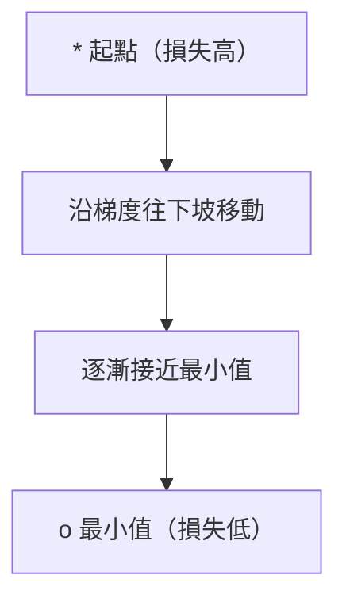
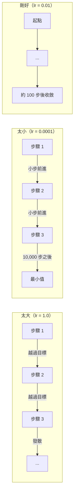
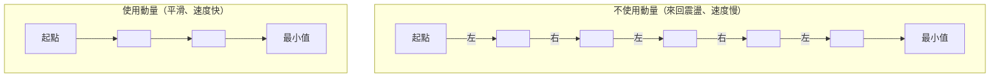
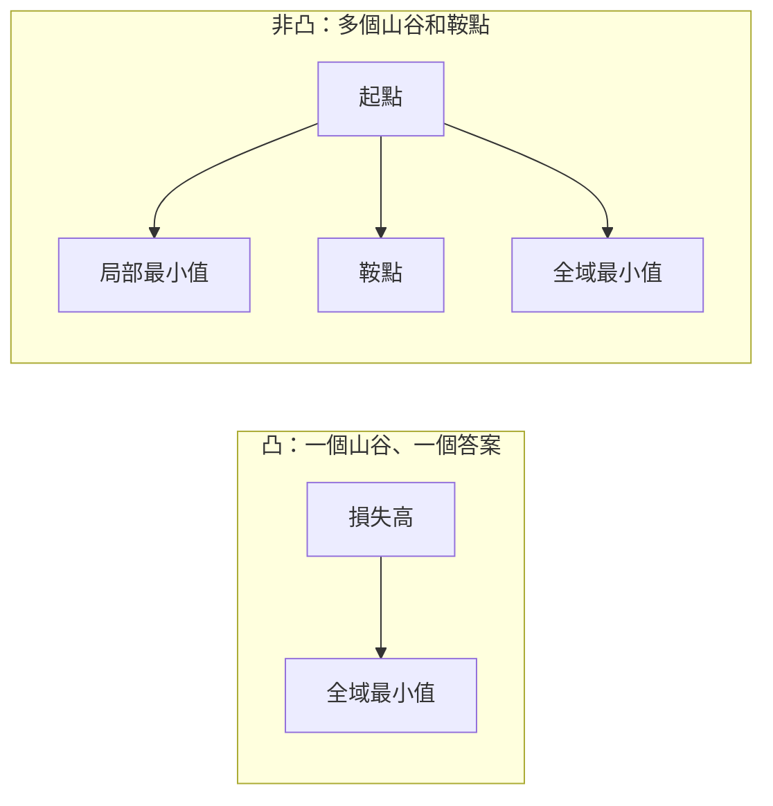
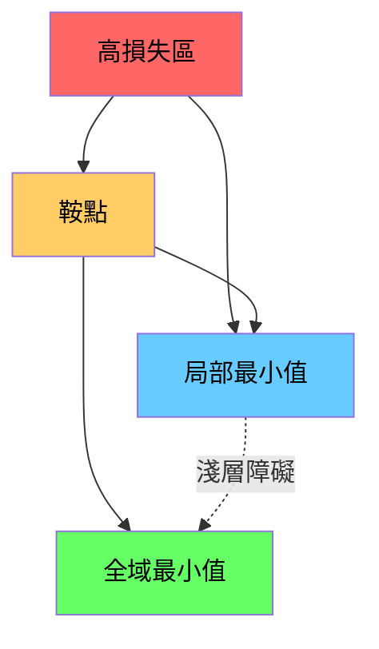

# 最佳化

> 訓練神經網路，說穿了就是找到山谷的谷底。

**Type:** Build
**Language:** Python
**Prerequisites:** Phase 1, Lessons 04-05 (Derivatives, Gradients)
**Time:** ~75 minutes

## 學習目標

- 從零實作基本梯度下降、含動量的 SGD，以及 Adam
- 比較各種最佳化器在 Rosenbrock 函式上的收斂情形，並說明 Adam 為何能依權重調整學習率
- 分辨凸與非凸損失地形，並說明鞍點在高維空間中的影響
- 設定學習率排程（階梯衰減、餘弦退火、預熱），提升訓練穩定性

## The Problem｜問題

你有一個損失函式，能告訴你模型錯得多嚴重；你也有梯度，能告訴你哪個方向會讓損失變大。接下來，你需要一套沿著下坡前進的策略。

最直覺的做法很簡單：朝梯度的反方向移動，再用一個稱為學習率的數值縮放步伐，然後重複執行。這就是梯度下降，而且確實有效。不過「有效」有其限制：學習率太大，就會越過整個山谷，在兩側來回震盪；太小，則得多走數千步才能慢慢接近答案；若遇到鞍點，即使還沒找到最小值，移動也可能停下來。

深度學習中的每種最佳化器，都在回答同一個問題：如何更快、更可靠地抵達山谷底部？

## The Concept｜核心概念

### 什麼是最佳化

最佳化是找出能讓函式最小化（或最大化）的輸入值。在機器學習中，函式就是損失，輸入值就是模型權重，而訓練就是最佳化。

```text
最小化 L(w)，其中：
  L = 損失函式
  w = 模型權重（可能有數百萬個參數）
```

### 基本梯度下降

這是最簡單的最佳化器。先計算損失對每個權重的梯度，再將每個權重朝梯度的反方向移動，並以學習率縮放步伐。

```text
w = w - lr * gradient
```

整個演算法就這麼簡單，只有一行。



### 學習率：最重要的超參數

學習率控制步伐大小，會左右整個收斂過程。



沒有公式能直接算出正確的學習率，只能透過實驗找出合適值。常見的起始值是 Adam 使用 0.001，含動量的 SGD 使用 0.01。

### SGD、批次與迷你批次

基本梯度下降會先用整個資料集計算梯度，再更新一次，這稱為批次梯度下降。它很穩定，但速度較慢。

隨機梯度下降（SGD）會用單一隨機樣本計算梯度，並立即更新。它的雜訊較多，但速度很快。

迷你批次梯度下降則取兩者之間：用小批次資料（32、64、128 或 256 個樣本）計算梯度，再更新。實務上幾乎都採用這種方式。

| 變體 | 批次大小 | 梯度品質 | 每步速度 | 雜訊 |
|---------|-----------|-----------------|---------------|-------|
| 批次 GD | 整個資料集 | 精確 | 慢 | 無 |
| SGD | 1 個樣本 | 雜訊很高 | 快 | 高 |
| 迷你批次 | 32–256 | 良好估計 | 平衡 | 中等 |

SGD 和迷你批次中的雜訊不是錯誤，反而有助於跳脫淺層的局部最小值和鞍點。

### 動量：讓球順著斜坡滾下去

基本梯度下降只看當前梯度。如果梯度方向來回擺盪（狹窄山谷中很常見），進展就會很慢。動量會把過去的梯度累積成速度項，改善這種情況。

```text
v = beta * v + gradient
w = w - lr * v
```

這就像球順著斜坡滾下去：不會每遇到一個小凸起就停下來重新開始，而是沿著一致方向加速，同時減弱震盪。



`beta`（通常是 0.9）控制保留多少歷史資訊。beta 越高，動量越大、路徑越平滑，但對方向變化的反應也越慢。

### Adam：自適應學習率

不同權重需要不同的學習率。很少收到大梯度的權重，偶爾收到大梯度時應該跨大步；持續收到巨大梯度的權重，則應該縮小步伐。

Adam（Adaptive Moment Estimation，自適應矩估計）會為每個權重追蹤兩項資訊：

1. 一階動量（m）：梯度的移動平均（類似動量）
2. 二階動量（v）：梯度平方的移動平均（梯度大小）

```text
m = beta1 * m + (1 - beta1) * gradient
v = beta2 * v + (1 - beta2) * gradient^2

m_hat = m / (1 - beta1^t)    偏差修正
v_hat = v / (1 - beta2^t)    偏差修正

w = w - lr * m_hat / (sqrt(v_hat) + epsilon)
```

關鍵在於除以 `sqrt(v_hat)`：梯度大的權重會除以較大的數值，因此有效步伐較小；梯度小的權重則會除以較小的數值，因此有效步伐較大。每個權重都有自己的自適應學習率。

預設超參數為 `lr=0.001, beta1=0.9, beta2=0.999, epsilon=1e-8`。這些設定適用於多數問題。

### 學習率排程

固定學習率是一種折衷。訓練初期需要大步快速前進，後期則需要縮小步伐，在最小值附近微調。

常見的排程：

| 排程 | 公式 | 適用情境 |
|----------|---------|----------|
| 階梯衰減 | 每 N 個 epoch 將 lr 乘上 factor | 簡單、方便手動控制 |
| 指數衰減 | lr = lr_0 * decay^t | 平滑降低 |
| 餘弦退火 | lr = lr_min + 0.5 * (lr_max - lr_min) * (1 + cos(pi * t / T)) | Transformer、現代訓練流程 |
| 預熱 + 衰減 | 先線性增加，再逐步衰減 | 大型模型，可避免訓練初期不穩定 |

### 凸函式與非凸函式

凸函式只有一個最小值，梯度下降一定能找到它。`f(x) = x^2` 這類二次函式就是凸函式。

神經網路的損失函式是非凸函式，包含許多局部最小值、鞍點和平坦區域。



實務上，高維神經網路的局部最小值很少構成問題，因為多數局部最小值的損失都接近全域最小值。真正的阻礙是鞍點（某些方向平坦，其他方向則有曲率）。動量和迷你批次的雜訊有助於跳脫鞍點。

### 損失地形視覺化

損失是所有權重的函式。若模型有 100 萬個權重，損失地形就存在於 1,000,001 維空間。我們會在權重空間中選兩個隨機方向，繪出沿這兩個方向的損失，形成二維曲面，以此視覺化地形。



尖銳的最小值泛化能力較差，平坦的最小值則較好。這也是含動量的 SGD 最終測試準確率常勝過 Adam 的原因之一：雜訊會避免模型停在尖銳的最小值。

```figure
gradient-descent
```

## Build It｜動手打造

### 步驟 1：定義測試函式

Rosenbrock 函式是經典的最佳化基準函式。它的最小值位於 (1, 1)，處於狹窄彎曲的山谷中。這個位置不難找到，但很難沿著山谷走到那裡。

```text
f(x, y) = (1 - x)^2 + 100 * (y - x^2)^2
```

```python
def rosenbrock(params):
    x, y = params
    return (1 - x) ** 2 + 100 * (y - x ** 2) ** 2

def rosenbrock_gradient(params):
    x, y = params
    df_dx = -2 * (1 - x) + 200 * (y - x ** 2) * (-2 * x)
    df_dy = 200 * (y - x ** 2)
    return [df_dx, df_dy]
```

### 步驟 2：基本梯度下降

```python
class GradientDescent:
    def __init__(self, lr=0.001):
        self.lr = lr

    def step(self, params, grads):
        return [p - self.lr * g for p, g in zip(params, grads)]
```

### 步驟 3：含動量的 SGD

```python
class SGDMomentum:
    def __init__(self, lr=0.001, momentum=0.9):
        self.lr = lr
        self.momentum = momentum
        self.velocity = None

    def step(self, params, grads):
        if self.velocity is None:
            self.velocity = [0.0] * len(params)
        self.velocity = [
            self.momentum * v + g
            for v, g in zip(self.velocity, grads)
        ]
        return [p - self.lr * v for p, v in zip(params, self.velocity)]
```

### 步驟 4：Adam

```python
class Adam:
    def __init__(self, lr=0.001, beta1=0.9, beta2=0.999, epsilon=1e-8):
        self.lr = lr
        self.beta1 = beta1
        self.beta2 = beta2
        self.epsilon = epsilon
        self.m = None
        self.v = None
        self.t = 0

    def step(self, params, grads):
        if self.m is None:
            self.m = [0.0] * len(params)
            self.v = [0.0] * len(params)

        self.t += 1

        self.m = [
            self.beta1 * m + (1 - self.beta1) * g
            for m, g in zip(self.m, grads)
        ]
        self.v = [
            self.beta2 * v + (1 - self.beta2) * g ** 2
            for v, g in zip(self.v, grads)
        ]

        m_hat = [m / (1 - self.beta1 ** self.t) for m in self.m]
        v_hat = [v / (1 - self.beta2 ** self.t) for v in self.v]

        return [
            p - self.lr * mh / (vh ** 0.5 + self.epsilon)
            for p, mh, vh in zip(params, m_hat, v_hat)
        ]
```

### 步驟 5：執行並比較

```python
def optimize(optimizer, func, grad_func, start, steps=5000):
    params = list(start)
    history = [params[:]]
    for _ in range(steps):
        grads = grad_func(params)
        params = optimizer.step(params, grads)
        history.append(params[:])
    return history

start = [-1.0, 1.0]

gd_history = optimize(GradientDescent(lr=0.0005), rosenbrock, rosenbrock_gradient, start)
sgd_history = optimize(SGDMomentum(lr=0.0001, momentum=0.9), rosenbrock, rosenbrock_gradient, start)
adam_history = optimize(Adam(lr=0.01), rosenbrock, rosenbrock_gradient, start)

for name, history in [("GD", gd_history), ("SGD+M", sgd_history), ("Adam", adam_history)]:
    final = history[-1]
    loss = rosenbrock(final)
    print(f"{name:6s} -> x={final[0]:.6f}, y={final[1]:.6f}, loss={loss:.8f}")
```

預期結果：Adam 收斂最快；含動量的 SGD 路徑較平滑；基本 GD 沿著狹窄山谷緩慢前進。

## Use It｜開始使用

實務上可使用 PyTorch 或 JAX 的最佳化器，它們會處理參數群組、權重衰減、梯度裁剪和 GPU 加速。

```python
import torch

model = torch.nn.Linear(784, 10)

sgd = torch.optim.SGD(model.parameters(), lr=0.01, momentum=0.9)
adam = torch.optim.Adam(model.parameters(), lr=0.001)
adamw = torch.optim.AdamW(model.parameters(), lr=0.001, weight_decay=0.01)

scheduler = torch.optim.lr_scheduler.CosineAnnealingLR(adam, T_max=100)
```

經驗法則：

- 先從 Adam（lr=0.001）開始。多數問題不用調整就能使用。
- 若需要最佳的最終準確率，也有時間調參，可改用含動量的 SGD（lr=0.01，momentum=0.9）。
- Transformer 可使用 AdamW（採用解耦權重衰減的 Adam）。
- 訓練超過幾個 epoch 時，一律使用學習率排程。
- 訓練不穩定時，降低學習率；進展太慢時，則提高學習率。

## Ship It｜交付成果

本課程會產出一份挑選合適最佳化器的提示詞，請參閱 `outputs/prompt-optimizer-guide.md`。

本課程打造的最佳化器類別，會在 Phase 3 從零訓練神經網路時再次使用。

## Exercises｜練習

1. **掃描學習率。** 使用 [0.0001, 0.0005, 0.001, 0.005, 0.01] 作為學習率，在 Rosenbrock 函式上執行基本梯度下降。畫出或列印各自走 5000 步後的最終損失，找出仍能收斂的最大學習率。

2. **比較動量。** 使用 [0.0, 0.5, 0.9, 0.99] 作為動量，在 Rosenbrock 函式上執行 SGD，追蹤每一步的損失。哪個動量值收斂最快？哪個會越過目標？

3. **跳脫鞍點。** 定義函式 `f(x, y) = x^2 - y^2`（原點是鞍點），並從 (0.01, 0.01) 開始。比較基本 GD、含動量的 SGD 和 Adam 的行為，看看哪個方法能跳脫鞍點。

4. **實作學習率衰減。** 在 GradientDescent 類別中加入指數衰減排程：`lr = lr_0 * 0.999^step`。比較在 Rosenbrock 函式上使用與不使用衰減時的收斂情形。

## Key Terms｜重要詞彙

| 詞彙 | 一般說法 | 實際意義 |
|------|----------------|----------------------|
| 梯度下降 |「往下坡走」| 從權重中減去經學習率縮放的梯度來更新權重，是最基本的最佳化器。 |
| 學習率 |「步伐大小」| 控制每次更新移動權重幅度的純量。太大會發散，太小會浪費運算資源。 |
| 動量 |「持續滾動」| 將過去的梯度累積成速度向量，以減少震盪，並加快沿一致方向前進的速度。 |
| SGD |「隨機取樣」| 隨機梯度下降。使用隨機子集而非整個資料集計算梯度；實務上幾乎都指迷你批次 SGD。 |
| 迷你批次 |「一小批資料」| 用來估計梯度的訓練資料子集（32–256 個樣本），兼顧速度和梯度準確度。 |
| Adam |「預設最佳化器」| 自適應矩估計。追蹤每個權重的梯度與梯度平方移動平均，讓各權重使用自己的學習率。 |
| 偏差修正 |「修正初始偏差」| Adam 的一階和二階動量初始值為零。偏差修正會除以 (1 - beta^t)，補償訓練初期的偏差。 |
| 學習率排程 |「隨時間調整 lr」| 在訓練期間調整學習率的函式。初期步伐大，後期步伐小。 |
| 凸函式 |「只有一個山谷」| 任一局部最小值都是全域最小值的函式，梯度下降一定能找到它。神經網路的損失函式並非凸函式。 |
| 鞍點 |「平坦，但不是最小值」| 梯度為零，但某些方向是最小值、其他方向是最大值的點，在高維空間中很常見。 |
| 損失地形 |「地勢」| 將損失函式繪在權重空間中，再沿兩個隨機方向切出切面來視覺化。 |
| 收斂 |「到達目標附近」| 最佳化器已抵達某個位置，再往前走也無法明顯降低損失。 |

## 延伸閱讀

- [Sebastian Ruder：梯度下降最佳化演算法概覽](https://ruder.io/optimizing-gradient-descent/) — 各種主要最佳化器的完整整理
- [動量為何真的有效（Distill）](https://distill.pub/2017/momentum/) — 動量動態的互動式視覺化
- [Adam：隨機最佳化方法（Kingma 與 Ba，2014）](https://arxiv.org/abs/1412.6980) — Adam 原始論文，簡短易讀
- [神經網路損失地形視覺化（Li 等人，2018）](https://arxiv.org/abs/1712.09913) — 說明尖銳與平坦最小值的論文
