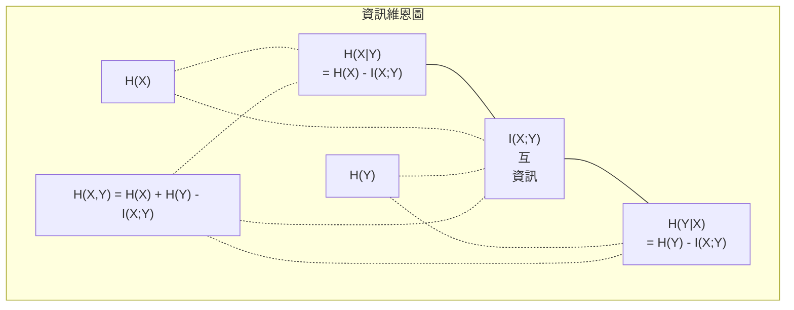

# 資訊理論

> 資訊理論用來衡量意外程度，而損失函式就建立在這套理論之上。

**Type:** Learn
**Language:** Python
**Prerequisites:** Phase 1, Lesson 06 (Probability)
**Time:** ~60 minutes

## 學習目標

- 從零計算熵、交叉熵和 KL 散度，並說明彼此的關係
- 推導為何最小化交叉熵損失等同於最大化對數概似
- 計算特徵與目標之間的互資訊，並據此排序特徵的重要性
- 說明困惑度代表語言模型實際上要從多少個詞彙中選擇

## The Problem｜問題

你訓練每個分類模型時都會呼叫 `CrossEntropyLoss()`，讀語言模型論文時總會看到「困惑度」，在 VAE、蒸餾和 RLHF 的資料中也會讀到 KL 散度。這些概念並非彼此無關，而是同一個想法的不同面貌。

資訊理論提供一套語言，讓你能推理不確定性、壓縮和預測。Claude Shannon 在 1948 年為了解決通訊問題而提出這套理論。原來訓練神經網路也是通訊問題：模型試圖透過由學得權重構成的雜訊通道，傳遞正確標籤。

本課程會從零推導每個公式，讓你了解它們從何而來、為何有效。

## The Concept｜核心概念

### 資訊量（意外程度）

越不可能發生的事件，包含的資訊量越大。硬幣正面朝上？不意外。中了彩券？非常意外。

機率為 p 的事件，其資訊量為：

```text
I(x) = -log(p(x))
```

使用以 2 為底的對數，單位是 bits；使用自然對數，單位是 nats。概念相同，只是單位不同。

```text
Event              Probability    Surprise (bits)
Fair coin heads    0.5            1.0
Rolling a 6        0.167          2.58
1-in-1000 event    0.001          9.97
Certain event      1.0            0.0
```

必然事件的資訊量為零，因為你早已知道它會發生。

### 熵（平均意外程度）

熵是某個分布中所有可能結果之意外程度的期望值。

```text
H(P) = -sum( p(x) * log(p(x)) )，對所有 x 加總
```

對二元變數而言，公平硬幣的熵最大，為 1 bit。偏向正面的硬幣（正面機率 99%）熵很低，只有 0.08 bits。你大致能預測結果，所以每次投擲幾乎沒有提供新資訊。

```text
Fair coin:    H = -(0.5 * log2(0.5) + 0.5 * log2(0.5)) = 1.0 bit
Biased coin:  H = -(0.99 * log2(0.99) + 0.01 * log2(0.01)) = 0.08 bits
```

熵衡量分布中不可消除的不確定性，也決定資料壓縮的理論下限。

### 交叉熵（你每天都在用的損失函式）

交叉熵衡量使用分布 Q 編碼實際來自分布 P 的事件時，平均會有多意外。

```text
H(P, Q) = -sum( p(x) * log(q(x)) )，對所有 x 加總
```

P 是真實分布（標籤），Q 是模型的預測。若 Q 完全符合 P，交叉熵就等於熵；只要兩者有差異，交叉熵就會增加。

在分類問題中，P 是 one-hot 向量（正確類別的機率為 1，其餘皆為 0），因此交叉熵可簡化為：

```text
H(P, Q) = -log(q(true_class))
```

這就是分類問題中交叉熵損失的完整公式：讓正確類別的預測機率最大化。

### KL 散度（分布之間的差異）

KL 散度衡量改用 Q 而非 P 時，會多出多少意外程度。

```text
D_KL(P || Q) = sum( p(x) * log(p(x) / q(x)) )，對所有 x 加總
             = H(P, Q) - H(P)
```

交叉熵等於熵加上 KL 散度。由於訓練期間真實分布的熵是常數，最小化交叉熵等同於最小化 KL 散度，也就是讓模型分布逐漸接近真實分布。

KL 散度不具對稱性：D_KL(P || Q) != D_KL(Q || P)，因此不是嚴格的距離度量。

### 互資訊

互資訊衡量知道一個變數後，能得知多少關於另一個變數的資訊。

```text
I(X; Y) = H(X) - H(X|Y)
        = H(X) + H(Y) - H(X, Y)
```

若 X 和 Y 獨立，互資訊為零；知道其中一個，對另一個毫無幫助。若兩者完全相關，互資訊就等於任一變數的熵。

在特徵選取中，特徵與目標之間的互資訊越高，代表該特徵越有用；互資訊低則代表它可能只是雜訊。

### 條件熵

H(Y|X) 衡量觀察到 X 後，關於 Y 還剩下多少不確定性。

```text
H(Y|X) = H(X,Y) - H(X)
```

兩種極端情況：
- 若 X 完全決定 Y，則 H(Y|X) = 0。知道 X 後，關於 Y 的不確定性完全消失。例如，X 是攝氏溫度，Y 是華氏溫度。
- 若 X 對 Y 毫無資訊，則 H(Y|X) = H(Y)。知道 X 完全不會降低不確定性。例如，X 是硬幣結果，Y 是明天的天氣。

條件熵一定非負，也不會大於 H(Y)：

```text
0 <= H(Y|X) <= H(Y)
```

在機器學習中，決策樹會用到條件熵。每次分割時，演算法都會選擇能讓 H(Y|X) 最小的特徵 X，也就是最能消除標籤 Y 不確定性的特徵。

### 聯合熵

H(X,Y) 是 X 和 Y 聯合分布的熵。

```text
H(X,Y) = -sum sum p(x,y) * log(p(x,y))，對所有 x、y 加總
```

重要性質：

```text
H(X,Y) <= H(X) + H(Y)
```

當 X 和 Y 獨立時等號成立。若兩者共享資訊，聯合熵就會小於各自熵的總和；少掉的部分正是互資訊。



各項關係如下：
- H(X,Y) = H(X) + H(Y|X) = H(Y) + H(X|Y)
- I(X;Y) = H(X) - H(X|Y) = H(Y) - H(Y|X)
- H(X,Y) = H(X) + H(Y) - I(X;Y)

### 深入認識互資訊

互資訊 I(X;Y) 量化知道一個變數能減少多少關於另一個變數的不確定性。

```text
I(X;Y) = H(X) - H(X|Y)
       = H(Y) - H(Y|X)
       = H(X) + H(Y) - H(X,Y)
       = sum sum p(x,y) * log(p(x,y) / (p(x) * p(y)))
```

性質：
- I(X;Y) 永遠 >= 0。觀察到新資訊不會讓你失去資訊。
- 若且唯若 X 和 Y 獨立，I(X;Y) = 0。
- I(X;Y) = I(Y;X)。它具有對稱性，和 KL 散度不同。
- I(X;X) = H(X)。變數與自身共享全部資訊。

**以互資訊選取特徵。** 在機器學習中，我們希望特徵能提供目標的相關資訊。互資訊提供有理論根據的特徵排序方法：

1. 對每個特徵 X_i 計算 I(X_i; Y)，其中 Y 是目標變數。
2. 依互資訊分數排列特徵。
3. 保留排名前 k 個特徵。

無論特徵與目標之間是線性、非線性、單調或非單調關係，這種方法都適用。相關係數只能捕捉線性關係，互資訊則能捕捉各種統計依賴。

| 方法 | 可偵測的關係 | 計算成本 | 可處理類別資料？ |
|--------|---------|-------------------|---------------------|
| Pearson 相關係數 | 線性關係 | O(n) | 否 |
| Spearman 相關係數 | 單調關係 | O(n log n) | 否 |
| 互資訊 | 任意統計依賴 | 分箱時為 O(n log n) | 是 |

### 標籤平滑與交叉熵

一般分類使用硬標籤：[0, 0, 1, 0]。正確類別的機率為 1，其餘皆為 0。標籤平滑會將它們替換成軟標籤：

```text
soft_target = (1 - epsilon) * hard_target + epsilon / num_classes
```

epsilon = 0.1，且有 4 個類別時：
- 硬標籤：[0, 0, 1, 0]
- 軟標籤：[0.025, 0.025, 0.925, 0.025]

從資訊理論角度來看，標籤平滑會增加目標分布的熵。硬式 one-hot 標籤的熵為 0，完全沒有不確定性；軟標籤的熵則大於 0。

這樣做的好處：
- 避免模型將 logits 推向極端值（在交叉熵下，必須使用無限大的 logits 才能完全符合 one-hot 目標）
- 具有正則化效果：模型無法達到 100% 確信
- 改善校準：預測機率更能反映真實不確定性
- 縮小訓練和推論行為之間的落差

使用標籤平滑後，交叉熵損失變為：

```text
L = (1 - epsilon) * CE(hard_target, prediction) + epsilon * H_uniform(prediction)
```

第二項會懲罰與均勻分布差異過大的預測，直接對模型信心進行正則化。

### 為什麼交叉熵是分類問題的核心損失函式

從三個角度看，都會得到相同結論。

**資訊理論觀點。** 交叉熵衡量使用模型分布而非真實分布時，會浪費多少 bits。將它最小化，就能讓模型成為最有效率的現實編碼器。

**最大概似觀點。** 對 N 個訓練樣本及其真實類別 y_i 而言：

```text
概似函式       = product( q(y_i) )
對數概似       = sum( log(q(y_i)) )
負對數概似     = -sum( log(q(y_i)) )
```

最後一行就是交叉熵損失。最小化交叉熵，就等同於最大化模型對訓練資料的概似。

**梯度觀點。** 交叉熵對 logits 的梯度就是（預測值 - 真實值）。形式簡潔、穩定且容易快速計算，因此和 softmax 特別搭配。

### Bits 與 Nats

兩者唯一的差異是對數的底數。

```text
以 2 為底的對數 -> bits（資訊理論慣例）
以 e 為底的對數 -> nats（機器學習慣例）
以 10 為底的對數 -> hartleys（很少使用）
```

1 nat = 1/ln(2) bits = 1.4427 bits。PyTorch 和 TensorFlow 預設使用自然對數（nats）。

### 困惑度

困惑度是交叉熵的指數值，表示模型面對的不確定性，相當於在多少個機率相同的選項中進行選擇。

```text
Perplexity = 2^H(P,Q)（使用 bits 時）
Perplexity = e^H(P,Q)（使用 nats 時）
```

困惑度為 50 的語言模型，平均而言就像必須從 50 個可能的下一個詞元中等機率地選擇。困惑度越低越好。

GPT-2 在常見基準測試上的困惑度約為 30。對資料充足的領域而言，現代模型的困惑度已降至個位數。

```figure
entropy-kl
```

## Build It｜動手打造

### 步驟 1：資訊量與熵

```python
import math

def information_content(p, base=2):
    if p <= 0 or p > 1:
        return float('inf') if p <= 0 else 0.0
    return -math.log(p) / math.log(base)

def entropy(probs, base=2):
    return sum(
        p * information_content(p, base)
        for p in probs if p > 0
    )

fair_coin = [0.5, 0.5]
biased_coin = [0.99, 0.01]
fair_die = [1/6] * 6

print(f"Fair coin entropy:   {entropy(fair_coin):.4f} bits")
print(f"Biased coin entropy: {entropy(biased_coin):.4f} bits")
print(f"Fair die entropy:    {entropy(fair_die):.4f} bits")
```

### 步驟 2：交叉熵與 KL 散度

```python
def cross_entropy(p, q, base=2):
    total = 0.0
    for pi, qi in zip(p, q):
        if pi > 0:
            if qi <= 0:
                return float('inf')
            total += pi * (-math.log(qi) / math.log(base))
    return total

def kl_divergence(p, q, base=2):
    return cross_entropy(p, q, base) - entropy(p, base)

true_dist = [0.7, 0.2, 0.1]
good_model = [0.6, 0.25, 0.15]
bad_model = [0.1, 0.1, 0.8]

print(f"Entropy of true dist:     {entropy(true_dist):.4f} bits")
print(f"CE (good model):          {cross_entropy(true_dist, good_model):.4f} bits")
print(f"CE (bad model):           {cross_entropy(true_dist, bad_model):.4f} bits")
print(f"KL divergence (good):     {kl_divergence(true_dist, good_model):.4f} bits")
print(f"KL divergence (bad):      {kl_divergence(true_dist, bad_model):.4f} bits")
```

### 步驟 3：將交叉熵作為分類損失

```python
def softmax(logits):
    max_logit = max(logits)
    exps = [math.exp(z - max_logit) for z in logits]
    total = sum(exps)
    return [e / total for e in exps]

def cross_entropy_loss(true_class, logits):
    probs = softmax(logits)
    return -math.log(probs[true_class])

logits = [2.0, 1.0, 0.1]
true_class = 0

probs = softmax(logits)
loss = cross_entropy_loss(true_class, logits)

print(f"Logits:      {logits}")
print(f"Softmax:     {[f'{p:.4f}' for p in probs]}")
print(f"True class:  {true_class}")
print(f"Loss:        {loss:.4f} nats")
print(f"Perplexity:  {math.exp(loss):.2f}")
```

### 步驟 4：交叉熵等於負對數概似

```python
import random

random.seed(42)

n_samples = 1000
n_classes = 3
true_labels = [random.randint(0, n_classes - 1) for _ in range(n_samples)]
model_logits = [[random.gauss(0, 1) for _ in range(n_classes)] for _ in range(n_samples)]

ce_loss = sum(
    cross_entropy_loss(label, logits)
    for label, logits in zip(true_labels, model_logits)
) / n_samples

nll = -sum(
    math.log(softmax(logits)[label])
    for label, logits in zip(true_labels, model_logits)
) / n_samples

print(f"Cross-entropy loss:      {ce_loss:.6f}")
print(f"Negative log-likelihood: {nll:.6f}")
print(f"Difference:              {abs(ce_loss - nll):.2e}")
```

### 步驟 5：互資訊

```python
def mutual_information(joint_probs, base=2):
    rows = len(joint_probs)
    cols = len(joint_probs[0])

    margin_x = [sum(joint_probs[i][j] for j in range(cols)) for i in range(rows)]
    margin_y = [sum(joint_probs[i][j] for i in range(rows)) for j in range(cols)]

    mi = 0.0
    for i in range(rows):
        for j in range(cols):
            pxy = joint_probs[i][j]
            if pxy > 0:
                mi += pxy * math.log(pxy / (margin_x[i] * margin_y[j])) / math.log(base)
    return mi

independent = [[0.25, 0.25], [0.25, 0.25]]
dependent = [[0.45, 0.05], [0.05, 0.45]]

print(f"MI (independent): {mutual_information(independent):.4f} bits")
print(f"MI (dependent):   {mutual_information(dependent):.4f} bits")
```

## Use It｜開始使用

使用 NumPy 實作相同概念，這就是實務上的寫法：

```python
import numpy as np

def np_entropy(p):
    p = np.asarray(p, dtype=float)
    mask = p > 0
    result = np.zeros_like(p)
    result[mask] = p[mask] * np.log(p[mask])
    return -result.sum()

def np_cross_entropy(p, q):
    p, q = np.asarray(p, dtype=float), np.asarray(q, dtype=float)
    mask = p > 0
    return -(p[mask] * np.log(q[mask])).sum()

def np_kl_divergence(p, q):
    return np_cross_entropy(p, q) - np_entropy(p)

true = np.array([0.7, 0.2, 0.1])
pred = np.array([0.6, 0.25, 0.15])
print(f"Entropy:    {np_entropy(true):.4f} nats")
print(f"Cross-ent:  {np_cross_entropy(true, pred):.4f} nats")
print(f"KL div:     {np_kl_divergence(true, pred):.4f} nats")
```

你已從零實作 `torch.nn.CrossEntropyLoss()` 的內部運作。現在你知道訓練時損失為何會下降：模型的預測分布逐漸接近真實分布，而差異以浪費的 nats 資訊量衡量。

## Exercises｜練習

1. 假設英文字母（26 個字母）服從均勻分布，計算其熵。再使用實際字母頻率估算熵。哪一個比較高？為什麼？

2. 某個樣本的正確類別是 1，模型輸出的 logits 為 [5.0, 2.0, 0.5]。請手算交叉熵損失，再用 `cross_entropy_loss` 函式驗證。什麼樣的 logits 會讓損失為零？

3. 證明 KL 散度不具對稱性。選擇兩個分布 P 和 Q，計算 D_KL(P || Q) 與 D_KL(Q || P)，並說明兩者為何不同。

4. 建立計算詞元預測序列困惑度的函式。輸入一份由 (true_token_index, predicted_logits) 組成的清單，回傳該序列的困惑度。

## Key Terms｜重要詞彙

| 詞彙 | 一般說法 | 實際意義 |
|------|----------------|----------------------|
| 資訊量 |「意外程度」| 編碼一個事件所需的 bits（或 nats）數量：-log(p)。 |
| 熵 |「隨機程度」| 分布中所有結果的平均意外程度，用來衡量不可消除的不確定性。 |
| 交叉熵 |「損失函式」| 使用模型分布 Q 編碼真實分布 P 中的事件時，平均會有多意外。 |
| KL 散度 |「分布之間的距離」| 改用 Q 而非 P 時多浪費的 bits，等於交叉熵減去熵，且不具對稱性。 |
| 互資訊 |「X 和 Y 有多相關」| 知道 Y 後，關於 X 的不確定性減少多少。互資訊為零表示兩者獨立。 |
| Softmax |「將 logits 轉成機率」| 取指數並正規化，將任意實數向量映射為有效的機率分布。 |
| 困惑度 |「模型有多困惑」| 交叉熵的指數值，代表模型每一步實際上要從多少個詞彙中選擇。 |
| Bits |「Shannon 的單位」| 使用以 2 為底的對數衡量資訊；1 bit 足以判定一次公平硬幣的結果。 |
| Nats |「機器學習常用單位」| 使用自然對數衡量資訊，PyTorch 和 TensorFlow 預設採用。 |
| 負對數概似 |「NLL 損失」| 對 one-hot 標籤而言，等同於交叉熵損失。最小化它能最大化正確預測的機率。 |

## 延伸閱讀

- [Shannon，1948：通訊的數學理論](https://people.math.harvard.edu/~ctm/home/text/others/shannon/entropy/entropy.pdf) — 至今仍易讀的原始論文
- [視覺化資訊理論（Chris Olah）](https://colah.github.io/posts/2015-09-Visual-Information/) — 以視覺方式說明熵與 KL 散度
- [PyTorch CrossEntropyLoss 文件](https://pytorch.org/docs/stable/generated/torch.nn.CrossEntropyLoss.html) — 說明框架如何實作你剛才打造的功能
