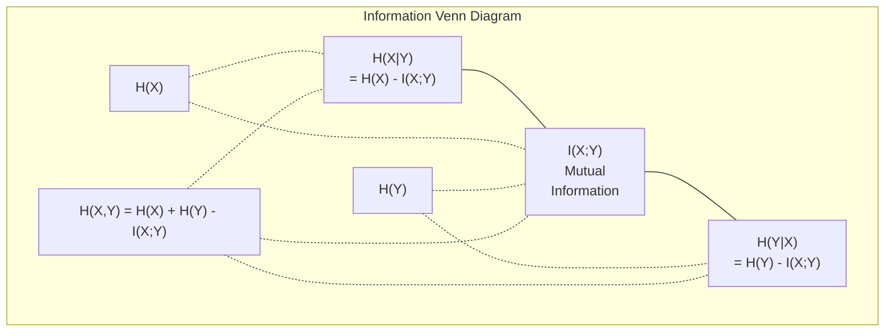

# 資訊理論

> 資訊理論衡量驚訝程度，損失函數就是建立在它之上。

**Type:** Learn
**Language:** Python
**Prerequisites:** Phase 1, Lesson 06 (Probability)
**Time:** ~60 minutes

## Learning Objectives｜學習目標

- 從零計算熵（entropy）、交叉熵（cross-entropy）與 KL 散度（KL divergence），並說明它們之間的關係
- 推導為什麼最小化交叉熵損失等同於最大化對數概似（log-likelihood）
- 計算特徵與目標之間的互資訊（mutual information），用來排序特徵重要性
- 把困惑度（perplexity）解釋為語言模型從中選擇的有效詞彙量

## The Problem｜問題

你訓練的每個分類模型都會呼叫 `CrossEntropyLoss()`；每篇語言模型論文都會出現「perplexity」；VAE、蒸餾和 RLHF 裡都讀得到 KL 散度。這些不是互不相干的概念，它們其實都源自同一個概念，只是應用情境不同。

資訊理論給你一套語言，用來推理不確定性、壓縮與預測。Claude Shannon 在 1948 年為了解決通訊問題而發明它。結果發現，訓練神經網路也是一個通訊問題：模型試著把正確的標籤，透過一個由學到的權重構成的雜訊通道傳送出去。

本課從零推導每個公式，讓你看見它們從哪裡來、為什麼有效。

## The Concept｜核心概念

### 資訊量（驚訝程度）

當不太可能的事情發生時，它帶來的資訊更多。硬幣擲出正面？不意外。中樂透？非常意外。

機率為 p 的事件，其資訊量（information content）是：

```
I(x) = -log(p(x))
```

用以 2 為底的對數得到位元（bit），用自然對數得到奈特（nat）。想法相同，只是單位不同。

```
Event              Probability    Surprise (bits)
Fair coin heads    0.5            1.0
Rolling a 6        0.167          2.58
1-in-1000 event    0.001          9.97
Certain event      1.0            0.0
```

必然發生的事件資訊量為零——你早就知道它會發生。

### 熵（平均驚訝程度）

熵是分布中所有可能結果的平均驚訝程度。

```
H(P) = -sum( p(x) * log(p(x)) )  for all x
```

公平硬幣在二元變數中熵最大：1 位元。偏頗硬幣（99% 正面）熵很低：0.08 位元。你已經知道會發生什麼，所以每次擲硬幣幾乎沒有告訴你任何新東西。

```
Fair coin:    H = -(0.5 * log2(0.5) + 0.5 * log2(0.5)) = 1.0 bit
Biased coin:  H = -(0.99 * log2(0.99) + 0.01 * log2(0.01)) = 0.08 bits
```

熵衡量分布中無法消除的不確定性，你無法壓縮到比它更小。

### 交叉熵（你每天都在用的損失函數）

交叉熵衡量的是：當你用分布 Q 來編碼實際上來自分布 P 的事件時，平均的驚訝程度。

```
H(P, Q) = -sum( p(x) * log(q(x)) )  for all x
```

P 是真實分布（標籤），Q 是你模型的預測。如果 Q 完全符合 P，交叉熵就等於熵；任何不吻合都會讓它變大。

在分類中，P 是 one-hot 向量（真實類別機率為 1，其餘為 0）。這讓交叉熵簡化為：

```
H(P, Q) = -log(q(true_class))
```

這就是分類用的交叉熵損失公式的全部：最大化正確類別的預測機率。

### KL 散度（分布之間的距離）

KL 散度衡量用 Q 而不是 P 時，多出了多少驚訝程度。

```
D_KL(P || Q) = sum( p(x) * log(p(x) / q(x)) )  for all x
             = H(P, Q) - H(P)
```

交叉熵等於熵加上 KL 散度。由於真實分布的熵在訓練期間是常數，最小化交叉熵就等於最小化 KL 散度——你是在把模型的分布推向真實分布。

KL 散度不是對稱的：D_KL(P || Q) != D_KL(Q || P)。它不是真正的距離度量（distance metric）。

### 互資訊

互資訊衡量知道一個變數，能告訴你多少關於另一個變數的資訊。

```
I(X; Y) = H(X) - H(X|Y)
        = H(X) + H(Y) - H(X, Y)
```

如果 X 和 Y 獨立，互資訊為零：知道其中一個，對另一個毫無幫助。如果它們完全相關，互資訊等於任一變數的熵。

在特徵選擇（feature selection）中，特徵與目標之間的互資訊高，代表這個特徵有用；互資訊低，代表它是雜訊。

### 條件熵（conditional entropy）

H(Y|X) 衡量在你觀察到 X 之後，Y 還剩下多少不確定性。

```
H(Y|X) = H(X,Y) - H(X)
```

兩個極端：
- 如果 X 完全決定 Y，那麼 H(Y|X) = 0。知道 X 消除了關於 Y 的所有不確定性。例子：X = 攝氏溫度，Y = 華氏溫度。
- 如果 X 對 Y 毫無資訊，那麼 H(Y|X) = H(Y)。知道 X 完全沒有降低你的不確定性。例子：X = 擲硬幣，Y = 明天的天氣。

條件熵永遠非負，且絕不超過 H(Y)：

```
0 <= H(Y|X) <= H(Y)
```

在機器學習中，條件熵出現在決策樹裡。每次分裂時，演算法挑選使 H(Y|X) 最小的特徵 X——也就是能消除最多標籤 Y 不確定性的特徵。

### 聯合熵（joint entropy）

H(X,Y) 是 X 和 Y 聯合分布的熵。

```
H(X,Y) = -sum sum p(x,y) * log(p(x,y))   for all x, y
```

關鍵性質：

```
H(X,Y) <= H(X) + H(Y)
```

當 X 和 Y 獨立時等號成立。如果它們共享資訊，聯合熵就小於各自熵的總和；「消失」的那部分熵，恰好就是互資訊。



這些關係：
- H(X,Y) = H(X) + H(Y|X) = H(Y) + H(X|Y)
- I(X;Y) = H(X) - H(X|Y) = H(Y) - H(Y|X)
- H(X,Y) = H(X) + H(Y) - I(X;Y)

### 互資訊（深入探討）

互資訊 I(X;Y) 量化「知道一個變數，能降低多少另一個變數的不確定性」。

```
I(X;Y) = H(X) - H(X|Y)
       = H(Y) - H(Y|X)
       = H(X) + H(Y) - H(X,Y)
       = sum sum p(x,y) * log(p(x,y) / (p(x) * p(y)))
```

性質：
- I(X;Y) >= 0 恆成立。觀察某件事絕不會讓你失去資訊。
- I(X;Y) = 0 若且唯若 X 和 Y 獨立。
- I(X;Y) = I(Y;X)。它是對稱的，這點和 KL 散度不同。
- I(X;X) = H(X)。一個變數和自己共享全部的資訊。

**用互資訊做特徵選擇（feature selection）。** 在 ML 中，你想要對目標有資訊量的特徵。互資訊給你一個有原則的特徵排序方式：

1. 對每個特徵 X_i，計算 I(X_i; Y)，其中 Y 是目標變數。
2. 依 MI 分數排序特徵。
3. 保留前 k 個特徵。

這對特徵與目標之間的任何關係都有效——線性、非線性、單調或非單調。相關性只能抓到線性關係，MI 則全部抓得到。

| 方法 | 偵測什麼 | 計算成本 | 能處理類別型資料嗎？ |
|--------|---------|-------------------|---------------------|
| 皮爾森相關係數 | 線性關係 | O(n) | 不能 |
| 斯皮爾曼相關係數 | 單調關係 | O(n log n) | 不能 |
| 互資訊 | 任何統計相依性 | 分箱後 O(n log n) | 能 |

### 標籤平滑與交叉熵

標準分類使用硬目標：[0, 0, 1, 0]。真實類別得到機率 1，其餘都是 0。標籤平滑（label smoothing）用軟目標取代它們：

```
soft_target = (1 - epsilon) * hard_target + epsilon / num_classes
```

當 epsilon = 0.1、4 個類別時：
- 硬目標：[0, 0, 1, 0]
- 軟目標：[0.025, 0.025, 0.925, 0.025]

從資訊理論的角度看，標籤平滑提高了目標分布的熵。硬的 one-hot 目標熵為 0——沒有任何不確定性；軟目標的熵為正。

為什麼這有幫助：
- 防止模型把 logits 推到極端值（在交叉熵下，要完美吻合 one-hot 目標，需要無限大的 logits）
- 發揮正則化作用：模型不可能 100% 有把握
- 改善校準：預測機率更能反映真實的不確定性
- 縮小訓練與推論行為之間的落差

帶標籤平滑的交叉熵損失變成：

```
L = (1 - epsilon) * CE(hard_target, prediction) + epsilon * H_uniform(prediction)
```

第二項懲罰離均勻分布很遠的預測——直接對信心程度做正則化。

### 為什麼交叉熵是「那個」分類損失

三個觀點，同一個結論。

**資訊理論觀點。** 交叉熵衡量用模型分布取代真實分布時，你浪費了多少位元。最小化它，就讓你的模型成為現實最有效率的編碼器。

**最大概似觀點。** 對 N 個訓練樣本、真實類別 y_i：

```
Likelihood     = product( q(y_i) )
Log-likelihood = sum( log(q(y_i)) )
Negative log-likelihood = -sum( log(q(y_i)) )
```

最後一行就是交叉熵損失。最小化交叉熵 = 最大化訓練資料在你模型下的概似。

**梯度觀點。** 交叉熵對 logits 的梯度就是（預測 - 真實），乾淨、穩定、計算快。這就是它和 softmax 完美搭配的原因。

### 位元 vs 奈特

唯一的差別是對數的底。

```
log base 2   -> bits      (information theory tradition)
log base e   -> nats      (machine learning convention)
log base 10  -> hartleys  (rarely used)
```

1 奈特 = 1/ln(2) 位元 = 1.4427 位元。PyTorch 和 TensorFlow 預設使用自然對數（奈特）。

### 困惑度

困惑度是交叉熵的指數。它告訴你，模型在多少個等可能的選項之間猶豫不決。

```
Perplexity = 2^H(P,Q)   (if using bits)
Perplexity = e^H(P,Q)   (if using nats)
```

困惑度為 50 的語言模型，平均而言就像必須從 50 個可能的下一個 token 中均勻挑選一樣困惑。越低越好。

GPT-2 在常見基準上達到約 30 的困惑度。現代模型在資料充足的領域已進入個位數。

```figure
entropy-kl
```

## Build It｜動手實作

### 步驟 1：資訊量與熵

```python
import math

def information_content(p, base=2):
    if p <= 0 or p > 1:
        return float('inf') if p <= 0 else 0.0
    return -math.log(p) / math.log(base)

def entropy(probs, base=2):
    return sum(
        p * information_content(p, base)
        for p in probs if p > 0
    )

fair_coin = [0.5, 0.5]
biased_coin = [0.99, 0.01]
fair_die = [1/6] * 6

print(f"Fair coin entropy:   {entropy(fair_coin):.4f} bits")
print(f"Biased coin entropy: {entropy(biased_coin):.4f} bits")
print(f"Fair die entropy:    {entropy(fair_die):.4f} bits")
```

### 步驟 2：交叉熵與 KL 散度

```python
def cross_entropy(p, q, base=2):
    total = 0.0
    for pi, qi in zip(p, q):
        if pi > 0:
            if qi <= 0:
                return float('inf')
            total += pi * (-math.log(qi) / math.log(base))
    return total

def kl_divergence(p, q, base=2):
    return cross_entropy(p, q, base) - entropy(p, base)

true_dist = [0.7, 0.2, 0.1]
good_model = [0.6, 0.25, 0.15]
bad_model = [0.1, 0.1, 0.8]

print(f"Entropy of true dist:     {entropy(true_dist):.4f} bits")
print(f"CE (good model):          {cross_entropy(true_dist, good_model):.4f} bits")
print(f"CE (bad model):           {cross_entropy(true_dist, bad_model):.4f} bits")
print(f"KL divergence (good):     {kl_divergence(true_dist, good_model):.4f} bits")
print(f"KL divergence (bad):      {kl_divergence(true_dist, bad_model):.4f} bits")
```

### 步驟 3：把交叉熵當作分類損失

```python
def softmax(logits):
    max_logit = max(logits)
    exps = [math.exp(z - max_logit) for z in logits]
    total = sum(exps)
    return [e / total for e in exps]

def cross_entropy_loss(true_class, logits):
    probs = softmax(logits)
    return -math.log(probs[true_class])

logits = [2.0, 1.0, 0.1]
true_class = 0

probs = softmax(logits)
loss = cross_entropy_loss(true_class, logits)

print(f"Logits:      {logits}")
print(f"Softmax:     {[f'{p:.4f}' for p in probs]}")
print(f"True class:  {true_class}")
print(f"Loss:        {loss:.4f} nats")
print(f"Perplexity:  {math.exp(loss):.2f}")
```

### 步驟 4：交叉熵等於負對數概似（negative log-likelihood）

```python
import random

random.seed(42)

n_samples = 1000
n_classes = 3
true_labels = [random.randint(0, n_classes - 1) for _ in range(n_samples)]
model_logits = [[random.gauss(0, 1) for _ in range(n_classes)] for _ in range(n_samples)]

ce_loss = sum(
    cross_entropy_loss(label, logits)
    for label, logits in zip(true_labels, model_logits)
) / n_samples

nll = -sum(
    math.log(softmax(logits)[label])
    for label, logits in zip(true_labels, model_logits)
) / n_samples

print(f"Cross-entropy loss:      {ce_loss:.6f}")
print(f"Negative log-likelihood: {nll:.6f}")
print(f"Difference:              {abs(ce_loss - nll):.2e}")
```

### 步驟 5：互資訊

```python
def mutual_information(joint_probs, base=2):
    rows = len(joint_probs)
    cols = len(joint_probs[0])

    margin_x = [sum(joint_probs[i][j] for j in range(cols)) for i in range(rows)]
    margin_y = [sum(joint_probs[i][j] for i in range(rows)) for j in range(cols)]

    mi = 0.0
    for i in range(rows):
        for j in range(cols):
            pxy = joint_probs[i][j]
            if pxy > 0:
                mi += pxy * math.log(pxy / (margin_x[i] * margin_y[j])) / math.log(base)
    return mi

independent = [[0.25, 0.25], [0.25, 0.25]]
dependent = [[0.45, 0.05], [0.05, 0.45]]

print(f"MI (independent): {mutual_information(independent):.4f} bits")
print(f"MI (dependent):   {mutual_information(dependent):.4f} bits")
```

## Use It｜實際應用

同樣的概念改用 NumPy，也就是你實務上會用的方式：

```python
import numpy as np

def np_entropy(p):
    p = np.asarray(p, dtype=float)
    mask = p > 0
    result = np.zeros_like(p)
    result[mask] = p[mask] * np.log(p[mask])
    return -result.sum()

def np_cross_entropy(p, q):
    p, q = np.asarray(p, dtype=float), np.asarray(q, dtype=float)
    mask = p > 0
    return -(p[mask] * np.log(q[mask])).sum()

def np_kl_divergence(p, q):
    return np_cross_entropy(p, q) - np_entropy(p)

true = np.array([0.7, 0.2, 0.1])
pred = np.array([0.6, 0.25, 0.15])
print(f"Entropy:    {np_entropy(true):.4f} nats")
print(f"Cross-ent:  {np_cross_entropy(true, pred):.4f} nats")
print(f"KL div:     {np_kl_divergence(true, pred):.4f} nats")
```

你從零打造了 `torch.nn.CrossEntropyLoss()` 內部在做的事。現在你知道訓練時損失為什麼會下降：模型的預測分布越來越接近真實分布，以浪費的資訊奈特數來衡量。

## Exercises｜練習

1. 假設 26 個字母為均勻分布，計算英文字母表的熵。接著用實際的字母頻率估計它。哪個比較高？為什麼？

2. 一個模型對真實類別為 1 的樣本輸出 logits [5.0, 2.0, 0.5]。手算交叉熵損失，再用你的 `cross_entropy_loss` 函式驗證。什麼樣的 logits 會讓損失為零？

3. 證明 KL 散度不是對稱的。挑兩個分布 P 和 Q，計算 D_KL(P || Q) 和 D_KL(Q || P)，並解釋為什麼它們不同。

4. 寫一個函式，計算一個 token 預測序列的困惑度。給定一串 (true_token_index, predicted_logits) 配對，回傳該序列的困惑度。

## Key Terms｜關鍵術語

| 術語 | 常見說法 | 實際意義 |
|------|----------------|----------------------|
| 資訊量（information content） | 「驚訝程度」 | 編碼一個事件所需的位元（或奈特）數：-log(p) |
| 熵（entropy） | 「隨機性」 | 分布所有結果的平均驚訝程度。衡量無法消除的不確定性。 |
| 交叉熵（cross-entropy） | 「那個損失函數」 | 用模型分布 Q 編碼來自真實分布 P 的事件時的平均驚訝程度。 |
| KL 散度（KL divergence） | 「分布之間的距離」 | 用 Q 取代 P 所浪費的額外位元。等於交叉熵減去熵。不對稱。 |
| 互資訊（mutual information） | 「X 和 Y 有多相關」 | 知道 Y 之後，關於 X 的不確定性減少了多少。為零代表獨立。 |
| Softmax | 「把 logits 變成機率」 | 取指數再正規化。把任何實數向量映射成合法的機率分布。 |
| 困惑度（perplexity） | 「模型有多困惑」 | 交叉熵的指數。模型在每一步所選擇的有效詞彙量。 |
| 位元（bits） | 「Shannon 的單位」 | 以 2 為底的對數所衡量的資訊。一個位元可以解決一次公平的擲硬幣。 |
| 奈特（nats） | 「ML 的單位」 | 以自然對數衡量的資訊。PyTorch 和 TensorFlow 預設使用。 |
| 負對數概似（negative log-likelihood） | 「NLL 損失」 | 對 one-hot 標籤而言，與交叉熵損失相同。最小化它就是最大化正確預測的機率。 |

## Further Reading｜延伸閱讀

- [Shannon 1948: A Mathematical Theory of Communication](https://people.math.harvard.edu/~ctm/home/text/others/shannon/entropy/entropy.pdf) - 原始論文，至今仍可讀
- [Visual Information Theory (Chris Olah)](https://colah.github.io/posts/2015-09-Visual-Information/) - 對熵與 KL 散度最好的視覺化解說
- [PyTorch CrossEntropyLoss docs](https://pytorch.org/docs/stable/generated/torch.nn.CrossEntropyLoss.html) - 框架如何實作你剛打造的東西
