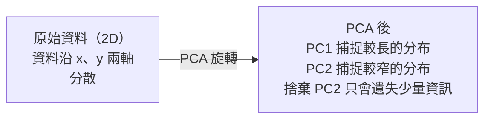

# 降維

> 高維資料也有結構，只要從正確的角度觀察，就能找到它。

**Type:** Build
**Language:** Python
**Prerequisites:** Phase 1, Lessons 01 (Linear Algebra Intuition), 02 (Vectors, Matrices & Operations), 03 (Eigenvalues & Eigenvectors), 06 (Probability & Distributions)
**Time:** ~90 minutes

## 學習目標

- 從零實作 PCA：將資料中心化、計算共變異數矩陣、進行特徵分解並投影
- 使用解釋變異比例和肘部法選擇主成分數量
- 比較 PCA、t-SNE 和 UMAP 將 MNIST 數字視覺化為二維時的效果，並說明各自的取捨
- 使用 RBF 核函式套用核 PCA，分離標準 PCA 無法處理的非線性資料結構

## The Problem｜問題

你的資料集每個樣本有 784 個特徵，可能是手寫數字的像素值、基因表現量，或使用者行為訊號。你無法將 784 個維度視覺化、繪圖，甚至難以直接理解。

但這 784 個特徵大多是冗餘的。真正的資訊其實集中在更小的空間裡。描述手寫的「7」不需要 784 個彼此獨立的數字，只需要幾個特徵：筆畫角度、橫線長度、傾斜程度等，其餘大多是雜訊。

降維能找出這個較小的空間。它會把 784 維資料壓縮成 2、10 或 50 維，同時保留重要結構。

## The Concept｜核心概念

### 維度災難

高維空間不符合直覺。維度增加時，會有三件事開始失效。

**距離失去意義。** 在高維空間中，任意兩個隨機點之間的距離都會趨近相同。如果每個點到其他點的距離都差不多，最近鄰搜尋就會失效。

```text
維度         平均距離比（隨機點之間的最大值／最小值）
2            ~5.0
10           ~1.8
100          ~1.2
1000         ~1.02
```

**體積集中在角落。** d 維單位超立方體有 2^d 個角落。在 100 維空間中，幾乎所有體積都集中在遠離中心的角落。資料點會散到邊緣，模型在內部則缺少資料可用。

**所需資料量呈指數成長。** 若要在空間中維持相同的樣本密度，從 2D 增加到 20D，就需要多 10^18 倍的資料。資料永遠不夠用。降維能讓資料密度回到可處理的範圍。

### PCA：找出重要方向

主成分分析（PCA）會找出資料變異最大的軸，並旋轉座標系統，讓第一個軸捕捉最多變異，第二個軸捕捉次多的變異，依此類推。

演算法步驟：

```text
1. 將資料中心化        （每個特徵減去平均值）
2. 計算共變異數        （特徵如何一起變動）
3. 特徵分解            （找出主方向）
4. 依特徵值排序        （變異量最大的優先）
5. 投影                （保留前 k 個特徵向量，捨棄其餘向量）
```

為什麼要做特徵分解？共變異數矩陣是對稱的半正定矩陣，其特徵向量是特徵空間中彼此正交的方向。特徵值表示各方向捕捉到的變異量；最大特徵值所對應的特徵向量，就是變異最大的方向。



- **PCA 前：** 資料點雲沿 x 軸和 y 軸斜向分布
- **PCA 後：** 座標系統經過旋轉，PC1 對齊變異最大的方向（較長的分布），PC2 對齊變異最小的方向（較窄的分布）
- **降維：** 捨棄 PC2，將資料投影到 PC1 上，只會遺失很少資訊

### 解釋變異比例

每個主成分都會捕捉總變異量的一部分。解釋變異比例會告訴你實際捕捉了多少。

```text
主成分       特徵值        解釋變異比例       累積比例
PC1          4.73          0.473              0.473
PC2          2.51          0.251              0.724
PC3          1.12          0.112              0.836
PC4          0.89          0.089              0.925
...
```

累積解釋變異比例達到 0.95 時，表示這些主成分已捕捉 95% 的資訊。之後的成分大多是雜訊。

### 選擇主成分數量

有三種策略：

1. **設定門檻。** 保留足以解釋 90–95% 變異量的主成分。
2. **肘部法。** 繪出每個主成分的解釋變異比例，找出曲線明顯下降的位置。
3. **下游效能。** 將 PCA 用作前處理，測試多個 k 值並衡量模型準確率。準確率開始持平時的 k 值通常最合適。

### t-SNE：保留鄰近關係

t 分布隨機鄰近嵌入（t-SNE）是為視覺化設計的方法。它會將高維資料映射到 2D（或 3D），同時保留哪些點彼此接近。

直覺上，先根據原始空間中點與點之間的距離，計算每對點的機率分布。距離近的點有較高機率，距離遠的點則較低。接著尋找一種二維排列，讓它符合相同的機率分布。因此，在 784 維空間中相鄰的點，在 2D 中仍會彼此接近。

t-SNE 的主要特性：
- 非線性：能展開 PCA 無法處理的複雜流形。
- 隨機性：每次執行都可能產生不同配置。
- Perplexity 參數會控制考慮的鄰居數量（常見範圍：5–50）。
- 輸出中群集彼此之間的距離沒有意義，只有群集本身的位置關係值得參考。
- 處理大型資料集時速度較慢，預設複雜度為 O(n^2)。

### UMAP：速度更快，整體結構更好

均勻流形近似與投影（UMAP）的運作方式類似 t-SNE，但有兩項優勢：
- 速度更快：使用近似最近鄰圖，而不必計算所有點對之間的距離。
- 整體結構較佳：輸出中群集的相對位置通常比 t-SNE 更有意義。

UMAP 會在高維空間中建立加權圖（「模糊拓樸表示法」），再尋找能盡量保留這個圖的低維配置。

主要參數：
- `n_neighbors`：用多少個鄰居定義局部結構（類似 perplexity）。數值越高，保留的整體結構越多。
- `min_dist`：控制輸出中各點聚集的緊密程度。數值越低，群集越密集。

### 各方法的適用情境

| 方法 | 用途 | 保留內容 | 速度 |
|--------|----------|-----------|-------|
| PCA | 訓練前的前處理 | 整體變異 | 快（精確），可處理數百萬個樣本 |
| PCA | 快速探索式視覺化 | 線性結構 | 快 |
| t-SNE | 適合發表的二維圖表 | 局部鄰近關係 | 慢（最好少於 10,000 個樣本） |
| UMAP | 大規模二維視覺化 | 局部及部分整體結構 | 中等（可處理數百萬個樣本） |
| PCA | 模型特徵降維 | 依變異排序的特徵 | 快 |
| t-SNE／UMAP | 理解群集結構 | 群集分離情形 | 中等至慢 |

經驗法則：前處理和資料壓縮使用 PCA；要將結構視覺化成 2D 時，使用 t-SNE 或 UMAP。

### 核 PCA

標準 PCA 會尋找線性子空間，透過旋轉座標系統並捨棄部分軸來降維。但如果資料位於非線性流形上呢？二維平面上的圓無法用任何直線分開，標準 PCA 幫不上忙。

核 PCA 會在核函式所誘導的高維特徵空間中執行 PCA，但不必明確計算該空間中的座標。這就是核技巧，也是 SVM 背後的相同概念。

演算法步驟：
1. 計算核矩陣 K，其中 K_ij = k(x_i, x_j)
2. 在特徵空間中將核矩陣中心化
3. 對中心化後的核矩陣進行特徵分解
4. 取前幾個特徵向量（乘上 1/sqrt(eigenvalue) 縮放）作為投影

常見的核函式：

| 核函式 | 公式 | 適用情境 |
|--------|---------|----------|
| RBF（高斯） | exp(-gamma * \|\|x - y\|\|^2) | 多數非線性資料、平滑流形 |
| 多項式 | (x . y + c)^d | 多項式關係 |
| Sigmoid | tanh(alpha * x . y + c) | 類似神經網路的映射 |

核 PCA 與標準 PCA 的選用原則：

| 評估面向 | 標準 PCA | 核 PCA |
|-----------|-------------|------------|
| 資料結構 | 線性子空間 | 非線性流形 |
| 速度 | O(min(n^2 d, d^2 n)) | O(n^2 d + n^3) |
| 可解釋性 | 主成分是特徵的線性組合 | 主成分難以直接對應特徵 |
| 擴充性 | 可處理數百萬個樣本 | 核矩陣為 n x n，受記憶體限制 |
| 重建 | 可直接反向轉換 | 需要近似前像 |

經典例子是二維同心圓：兩圈點，一圈在另一圈內。標準 PCA 會把兩圈都投影到同一條線上，無法用於分類。使用 RBF 核的核 PCA 則會將內外兩圈映射到不同區域，讓它們能以線性方式分開。

### 重建誤差

降維效果有多好？你把 784 維壓縮成 50 維，究竟遺失了什麼？

可以用重建誤差衡量：
1. 將資料投影到 k 維：X_reduced = X @ W_k
2. 重建資料：X_hat = X_reduced @ W_k^T
3. 計算 MSE：mean((X - X_hat)^2)

對 PCA 而言，重建誤差與解釋變異量之間有明確關係：

```text
重建誤差 = 未納入的特徵值總和
總變異量 = 所有特徵值總和
遺失比例 =（捨棄的特徵值總和）/（所有特徵值總和）
```

每個主成分的解釋變異比例為：

```text
explained_ratio_k = eigenvalue_k / sum(all eigenvalues)
```

繪製主成分數量對累積解釋變異比例的曲線，就會得到「肘部」曲線。主成分數量合適的位置通常符合以下條件：
- 曲線趨於平坦（效益遞減）
- 累積變異量超過設定門檻（通常為 0.90 或 0.95）
- 下游任務效能開始持平

重建誤差不只用於選擇 k，也能用於異常偵測：重建誤差高的樣本不符合學得的子空間，因此是離群值。正式環境中的 PCA 異常偵測就是以此為基礎。

```figure
pca-axes
```

## Build It｜動手打造

### 步驟 1：從零實作 PCA

```python
import numpy as np

class PCA:
    def __init__(self, n_components):
        self.n_components = n_components
        self.components = None
        self.mean = None
        self.eigenvalues = None
        self.explained_variance_ratio_ = None

    def fit(self, X):
        self.mean = np.mean(X, axis=0)
        X_centered = X - self.mean

        cov_matrix = np.cov(X_centered, rowvar=False)

        eigenvalues, eigenvectors = np.linalg.eigh(cov_matrix)

        sorted_idx = np.argsort(eigenvalues)[::-1]
        eigenvalues = eigenvalues[sorted_idx]
        eigenvectors = eigenvectors[:, sorted_idx]

        self.components = eigenvectors[:, :self.n_components].T
        self.eigenvalues = eigenvalues[:self.n_components]
        total_var = np.sum(eigenvalues)
        self.explained_variance_ratio_ = self.eigenvalues / total_var

        return self

    def transform(self, X):
        X_centered = X - self.mean
        return X_centered @ self.components.T

    def fit_transform(self, X):
        self.fit(X)
        return self.transform(X)
```

### 步驟 2：使用合成資料測試

```python
np.random.seed(42)
n_samples = 500

t = np.random.uniform(0, 2 * np.pi, n_samples)
x1 = 3 * np.cos(t) + np.random.normal(0, 0.2, n_samples)
x2 = 3 * np.sin(t) + np.random.normal(0, 0.2, n_samples)
x3 = 0.5 * x1 + 0.3 * x2 + np.random.normal(0, 0.1, n_samples)

X_synthetic = np.column_stack([x1, x2, x3])

pca = PCA(n_components=2)
X_reduced = pca.fit_transform(X_synthetic)

print(f"Original shape: {X_synthetic.shape}")
print(f"Reduced shape:  {X_reduced.shape}")
print(f"Explained variance ratios: {pca.explained_variance_ratio_}")
print(f"Total variance captured: {sum(pca.explained_variance_ratio_):.4f}")
```

### 步驟 3：將 MNIST 數字投影到二維

```python
from sklearn.datasets import fetch_openml

mnist = fetch_openml("mnist_784", version=1, as_frame=False, parser="auto")
X_mnist = mnist.data[:5000].astype(float)
y_mnist = mnist.target[:5000].astype(int)

pca_mnist = PCA(n_components=50)
X_pca50 = pca_mnist.fit_transform(X_mnist)
print(f"50 components capture {sum(pca_mnist.explained_variance_ratio_):.2%} of variance")

pca_2d = PCA(n_components=2)
X_pca2d = pca_2d.fit_transform(X_mnist)
print(f"2 components capture {sum(pca_2d.explained_variance_ratio_):.2%} of variance")
```

### 步驟 4：與 sklearn 比較

```python
from sklearn.decomposition import PCA as SklearnPCA
from sklearn.manifold import TSNE

sklearn_pca = SklearnPCA(n_components=2)
X_sklearn_pca = sklearn_pca.fit_transform(X_mnist)

print(f"\nOur PCA explained variance:     {pca_2d.explained_variance_ratio_}")
print(f"Sklearn PCA explained variance: {sklearn_pca.explained_variance_ratio_}")

diff = np.abs(np.abs(X_pca2d) - np.abs(X_sklearn_pca))
print(f"Max absolute difference: {diff.max():.10f}")

tsne = TSNE(n_components=2, perplexity=30, random_state=42)
X_tsne = tsne.fit_transform(X_mnist)
print(f"\nt-SNE output shape: {X_tsne.shape}")
```

### 步驟 5：比較 UMAP

```python
try:
    from umap import UMAP

    reducer = UMAP(n_components=2, n_neighbors=15, min_dist=0.1, random_state=42)
    X_umap = reducer.fit_transform(X_mnist)
    print(f"UMAP output shape: {X_umap.shape}")
except ImportError:
    print("Install umap-learn: pip install umap-learn")
```

## Use It｜開始使用

將 PCA 用作分類器的前處理：

```python
from sklearn.decomposition import PCA as SklearnPCA
from sklearn.linear_model import LogisticRegression
from sklearn.model_selection import train_test_split
from sklearn.metrics import accuracy_score

X_train, X_test, y_train, y_test = train_test_split(
    X_mnist, y_mnist, test_size=0.2, random_state=42
)

results = {}
for k in [10, 30, 50, 100, 200]:
    pca_k = SklearnPCA(n_components=k)
    X_tr = pca_k.fit_transform(X_train)
    X_te = pca_k.transform(X_test)

    clf = LogisticRegression(max_iter=1000, random_state=42)
    clf.fit(X_tr, y_train)
    acc = accuracy_score(y_test, clf.predict(X_te))
    var_captured = sum(pca_k.explained_variance_ratio_)
    results[k] = (acc, var_captured)
    print(f"k={k:>3d}  accuracy={acc:.4f}  variance={var_captured:.4f}")
```

效能遠在達到 784 維前就會持平，持平的位置就是合適的操作點。

## Ship It｜交付成果

本課程會產出：
- `outputs/skill-dimensionality-reduction.md` — 根據任務選擇合適降維技術的 skill

## Exercises｜練習

1. 修改 PCA 類別，加入 `inverse_transform`。分別使用 10、50 和 200 個主成分重建 MNIST 數字，並列印各自的重建誤差（與原始資料的均方差）。

2. 對相同的 MNIST 子集使用 perplexity 5、30 和 100 執行 t-SNE，描述輸出如何變化。為什麼 perplexity 會影響群集的緊密程度？

3. 取得一個有 50 個特徵、其中只有 5 個具資訊性的資料集（使用 `sklearn.datasets.make_classification` 產生）。套用 PCA，確認解釋變異曲線能否正確指出資料實際上只有 5 個有效維度。

## Key Terms｜重要詞彙

| 詞彙 | 一般說法 | 實際意義 |
|------|----------------|----------------------|
| 維度災難 |「特徵太多」| 維度增加時，距離、體積和資料密度的變化都違反直覺。模型需要指數成長的資料量才能彌補。 |
| PCA |「降低維度」| 旋轉座標系統，讓軸對齊變異最大的方向，再捨棄變異較小的軸。 |
| 主成分 |「重要方向」| 共變異數矩陣的特徵向量，也是資料在特徵空間中變異最大的方向。 |
| 解釋變異比例 |「這個主成分包含多少資訊」| 單一主成分捕捉的總變異比例。將前 k 個比例相加，就能知道 k 個主成分保留了多少資訊。 |
| 共變異數矩陣 |「特徵如何一起變動」| 對稱矩陣；第 (i,j) 個元素衡量特徵 i 和 j 如何共同變動，對角線元素則是各特徵的變異數。 |
| t-SNE |「那種群集圖」| 透過保留點對之間的鄰近機率，將高維資料映射到二維的非線性方法。適合視覺化，不適合前處理。 |
| UMAP |「速度更快的 t-SNE」| 以拓樸資料分析為基礎的非線性方法，可保留局部及部分整體結構，擴充性也優於 t-SNE。 |
| Perplexity |「t-SNE 的調整旋鈕」| 控制每個點實際考慮的鄰居數量。數值低時著重極局部結構；數值高時能捕捉較廣泛的模式。 |
| 流形 |「資料所在的曲面」| 嵌入高維空間中的低維曲面。在三維空間中揉皺的紙張，就是二維流形。 |

## 延伸閱讀

- [主成分分析教學](https://arxiv.org/abs/1404.1100)（Shlens）— 從基礎清楚推導 PCA
- [如何有效使用 t-SNE](https://distill.pub/2016/misread-tsne/)（Wattenberg 等人）— 互動式指南，介紹 t-SNE 的陷阱和參數選擇
- [UMAP 文件](https://umap-learn.readthedocs.io/) — UMAP 作者提供的理論與實務指南
