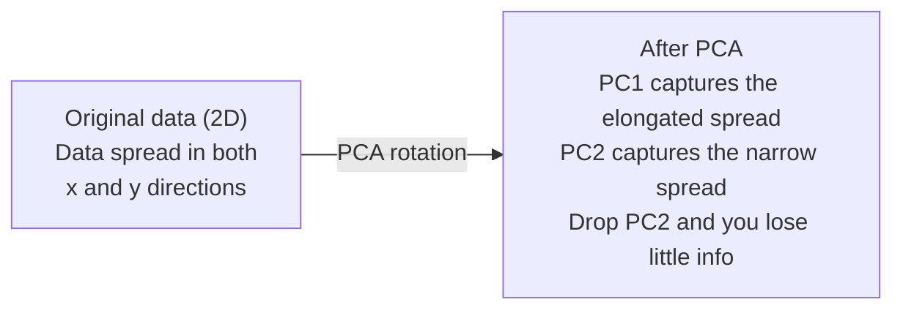

# 降維

> 高維資料有其結構，從適當的視角觀察才能看出來。

**Type:** Build
**Language:** Python
**Prerequisites:** Phase 1, Lessons 01 (Linear Algebra Intuition), 02 (Vectors, Matrices & Operations), 03 (Eigenvalues & Eigenvectors), 06 (Probability & Distributions)
**Time:** ~90 minutes

## Learning Objectives｜學習目標

- 從零實作 PCA：將資料置中、計算共變異數矩陣（covariance matrix）、做特徵分解（eigendecomposition），再投影到主成分（principal component）上
- 用解釋變異比例（explained variance ratio）和手肘法（elbow method）決定要保留幾個主成分
- 比較 PCA、t-SNE 和 UMAP 在 2D 視覺化 MNIST 數字上的表現，並說明各自的取捨
- 用 RBF 核做核主成分分析（kernel PCA），分離標準 PCA 處理不了的非線性資料結構

## The Problem｜問題

你有一個資料集，每個樣本有 784 個特徵。也許是手寫數字的像素（pixel）值，也許是基因表現量，也許是使用者行為訊號。你無法視覺化 784 個維度，無法把它們畫出來，甚至很難去想像它們。

但這 784 個特徵大多是冗餘的，真正的資訊存在於一個小得多的曲面上。描述一個手寫的「7」不需要 784 個獨立的數字，只需要少數幾個：筆畫的角度、橫槓的長度、傾斜的程度；其餘都是雜訊。

降維（dimensionality reduction）就是找出那個更小的曲面。它把你的 784 維資料壓縮成 2、10 或 50 維，同時保留重要的結構。

## The Concept｜核心概念

### 維度災難

高維空間違反直覺。隨著維度增加，有三件事會壞掉。

**距離變得沒有意義。** 在高維中，任意兩個隨機點之間的距離會收斂到同一個值。如果每個點離其他每個點的距離都大致相同，最近鄰搜尋就失效了。

```
Dimension    Avg distance ratio (max/min between random points)
2            ~5.0
10           ~1.8
100          ~1.2
1000         ~1.02
```

**體積集中在角落。** d 維的單位超立方體（hypercube）有 2^d 個角。在 100 維中，幾乎所有體積都在角落、遠離中心。資料點散到邊緣，你的模型在內部區域缺乏資料。

**你需要指數級更多的資料。** 要在空間中維持相同的樣本密度，從 2D 到 20D 需要多 10^18 倍的資料。你永遠不會有足夠的資料。降低維度能把資料密度拉回可以處理的程度。

### PCA：找出重要的方向

主成分分析（Principal Component Analysis，PCA）找出資料變化最大的軸。它旋轉你的座標系統，讓第一個軸捕捉最多的變異、第二個軸捕捉次多的變異，依此類推。

演算法：

```
1. Center the data        (subtract the mean from each feature)
2. Compute covariance     (how features move together)
3. Eigendecomposition     (find the principal directions)
4. Sort by eigenvalue     (biggest variance first)
5. Project               (keep top k eigenvectors, drop the rest)
```

為什麼用特徵分解？共變異數矩陣是對稱且半正定（positive semi-definite）的，它的特徵向量（eigenvector）是特徵空間中彼此正交的方向，特徵值（eigenvalue）告訴你每個方向捕捉多少變異。特徵值最大的特徵向量，指向最大變異的方向。



- **PCA 之前：** 資料雲沿對角線散布在 x 和 y 兩個軸上
- **PCA 之後：** 座標系統被旋轉，使 PC1 對齊最大變異的方向（拉長的散布），PC2 對齊最小變異的方向（狹窄的散布）
- **降維：** 丟掉 PC2 等於把資料投影到 PC1，只損失很少的資訊

### 解釋變異比例

每個主成分捕捉總變異的一部分。解釋變異比例告訴你是多少。

```
Component    Eigenvalue    Explained ratio    Cumulative
PC1          4.73          0.473              0.473
PC2          2.51          0.251              0.724
PC3          1.12          0.112              0.836
PC4          0.89          0.089              0.925
...
```

當累積解釋變異達到 0.95，你就知道這麼多個成分捕捉了 95% 的資訊，之後的大多是雜訊。

### 選擇成分數量

三種策略：

1. **閾值。** 保留足以解釋 90-95% 變異的成分數量。
2. **手肘法。** 畫出每個成分的解釋變異，找出陡降的地方。
3. **下游表現。** 把 PCA 當作前處理（preprocessing）。掃過不同的 k，量測模型準確率。最好的 k 是準確率持平的地方。

### t-SNE：保留鄰近關係

t-SNE（t-Distributed Stochastic Neighbor Embedding，t 分布隨機鄰域 embedding）是為視覺化設計的。它把高維資料映射到 2D（或 3D），同時保留哪些點彼此靠近。

直覺：在原始空間中，依點與點之間的距離，計算每一對點的機率分布（probability distribution）。近的點機率高，遠的點機率低。然後找出一個 2D 配置，使其點對的機率分布與原空間一致。在 784 維中是鄰居的點，在 2D 中仍然是鄰居。

t-SNE 的關鍵性質：
- 非線性。它能攤開 PCA 攤不開的複雜流形（manifold）。
- 隨機性。不同次的執行會產生不同的排列。
- 困惑度（perplexity）參數控制要考慮多少鄰居（常見範圍：5-50）。
- 輸出中群集之間的距離沒有意義，只有群集本身有意義。
- 在大型資料集上很慢，預設為 O(n^2)。

### UMAP：更快、全域結構更好

均勻流形近似與投影（Uniform Manifold Approximation and Projection，UMAP）的運作方式與 t-SNE 類似，但有兩個優勢：
- 更快。它使用近似最近鄰圖，而不是計算所有成對距離。
- 全域結構更好。輸出中各群集的相對位置，往往比 t-SNE 更有意義。

UMAP 在高維空間中建立一個加權圖（「模糊拓撲表示」），再找出一個盡可能保留這個圖的低維排列。

關鍵參數：
- `n_neighbors`：多少個鄰居定義局部結構（類似困惑度）。值越高，保留越多全域結構。
- `min_dist`：輸出中點之間靠得多緊。值越低，群集越密。

### 何時用哪個

| 方法 | 使用情境 | 保留什麼 | 速度 |
|--------|----------|-----------|-------|
| PCA | 訓練前的前處理（preprocessing） | 全域變異 | 快（精確），可處理數百萬樣本 |
| PCA | 快速的探索式視覺化 | 線性結構 | 快 |
| t-SNE | 適合發表的 2D 圖 | 局部鄰近關係 | 慢（理想上 < 10k 個樣本） |
| UMAP | 大規模的 2D 視覺化 | 局部 + 部分全域結構 | 中等（可處理數百萬） |
| PCA | 為模型做特徵縮減 | 依變異排序的特徵 | 快 |
| t-SNE / UMAP | 理解群集結構 | 群集分離 | 中等到慢 |

經驗法則：PCA 用於前處理（preprocessing）和資料壓縮；需要在 2D 中視覺化結構時，用 t-SNE 或 UMAP。

### 核主成分分析

標準 PCA 找的是線性子空間：它旋轉座標系統、丟掉軸。但如果資料位於非線性流形上呢？2D 中的一個圓，沒有任何一條線能把它分開，標準 PCA 幫不上忙。

核主成分分析（kernel PCA）在由核函數（kernel function）誘導出的高維特徵空間中套用 PCA，而不必明確計算該空間中的座標。這就是核技巧（kernel trick）——和 SVM 背後是同一個想法。

演算法：
1. 計算核矩陣 K，其中 K_ij = k(x_i, x_j)
2. 在特徵空間中將核矩陣置中
3. 對置中後的核矩陣做特徵分解
4. 特徵值最大的那些特徵向量（各自以 1/sqrt(eigenvalue) 縮放）就是投影

常見的核函數：

| 核 | 公式 | 適合 |
|--------|---------|----------|
| RBF（高斯） | exp(-gamma * \|\|x - y\|\|^2) | 大多數非線性資料、平滑流形 |
| 多項式 | (x . y + c)^d | 多項式關係 |
| Sigmoid | tanh(alpha * x . y + c) | 類神經網路式的映射 |

何時用核主成分分析、何時用標準 PCA：

| 準則 | 標準 PCA | 核主成分分析 |
|-----------|-------------|------------|
| 資料結構 | 線性子空間 | 非線性流形 |
| 速度 | O(min(n^2 d, d^2 n)) | O(n^2 d + n^3) |
| 可解釋性（interpretability） | 成分是特徵的線性組合 | 成分缺乏直接的特徵解釋 |
| 可擴展性 | 可處理數百萬樣本 | 核矩陣是 n x n，受記憶體限制 |
| 重建 | 直接逆轉換 | 需要原像（pre-image）近似 |

經典例子：2D 中的同心圓。兩圈點，一圈在另一圈裡面。標準 PCA 把兩者投影到同一條線上——對分類毫無用處。使用 RBF 核的核主成分分析，會把內圈和外圈映射到不同區域，使它們線性可分。

### 重建誤差

你的降維做得多好？你把 784 維壓縮到 50 維，損失了什麼？

量測重建誤差（reconstruction error）：
1. 把資料投影到 k 維：X_reduced = X @ W_k
2. 重建：X_hat = X_reduced @ W_k^T
3. 計算 MSE：mean((X - X_hat)^2)

對 PCA 來說，重建誤差與解釋變異之間有乾淨的關係：

```
Reconstruction error = sum of eigenvalues NOT included
Total variance = sum of ALL eigenvalues
Fraction lost = (sum of dropped eigenvalues) / (sum of all eigenvalues)
```

每個成分的解釋變異比例是：

```
explained_ratio_k = eigenvalue_k / sum(all eigenvalues)
```

把累積解釋變異對成分數量作圖，就得到「手肘」曲線。適當的成分數量可由以下條件判斷：
- 曲線變平（報酬遞減）
- 累積變異越過你的閾值（通常是 0.90 或 0.95）
- 下游任務表現持平

重建誤差的用途不只是選 k。你也可以用它做異常偵測：重建誤差高的樣本，是不符合所學子空間的離群值。這是正式環境中以 PCA 為基礎的異常偵測原理。

```figure
pca-axes
```

## Build It｜動手實作

### 步驟 1：從零寫 PCA

```python
import numpy as np

class PCA:
    def __init__(self, n_components):
        self.n_components = n_components
        self.components = None
        self.mean = None
        self.eigenvalues = None
        self.explained_variance_ratio_ = None

    def fit(self, X):
        self.mean = np.mean(X, axis=0)
        X_centered = X - self.mean

        cov_matrix = np.cov(X_centered, rowvar=False)

        eigenvalues, eigenvectors = np.linalg.eigh(cov_matrix)

        sorted_idx = np.argsort(eigenvalues)[::-1]
        eigenvalues = eigenvalues[sorted_idx]
        eigenvectors = eigenvectors[:, sorted_idx]

        self.components = eigenvectors[:, :self.n_components].T
        self.eigenvalues = eigenvalues[:self.n_components]
        total_var = np.sum(eigenvalues)
        self.explained_variance_ratio_ = self.eigenvalues / total_var

        return self

    def transform(self, X):
        X_centered = X - self.mean
        return X_centered @ self.components.T

    def fit_transform(self, X):
        self.fit(X)
        return self.transform(X)
```

### 步驟 2：在合成資料上測試

```python
np.random.seed(42)
n_samples = 500

t = np.random.uniform(0, 2 * np.pi, n_samples)
x1 = 3 * np.cos(t) + np.random.normal(0, 0.2, n_samples)
x2 = 3 * np.sin(t) + np.random.normal(0, 0.2, n_samples)
x3 = 0.5 * x1 + 0.3 * x2 + np.random.normal(0, 0.1, n_samples)

X_synthetic = np.column_stack([x1, x2, x3])

pca = PCA(n_components=2)
X_reduced = pca.fit_transform(X_synthetic)

print(f"Original shape: {X_synthetic.shape}")
print(f"Reduced shape:  {X_reduced.shape}")
print(f"Explained variance ratios: {pca.explained_variance_ratio_}")
print(f"Total variance captured: {sum(pca.explained_variance_ratio_):.4f}")
```

### 步驟 3：把 MNIST 數字降到 2D

```python
from sklearn.datasets import fetch_openml

mnist = fetch_openml("mnist_784", version=1, as_frame=False, parser="auto")
X_mnist = mnist.data[:5000].astype(float)
y_mnist = mnist.target[:5000].astype(int)

pca_mnist = PCA(n_components=50)
X_pca50 = pca_mnist.fit_transform(X_mnist)
print(f"50 components capture {sum(pca_mnist.explained_variance_ratio_):.2%} of variance")

pca_2d = PCA(n_components=2)
X_pca2d = pca_2d.fit_transform(X_mnist)
print(f"2 components capture {sum(pca_2d.explained_variance_ratio_):.2%} of variance")
```

### 步驟 4：與 sklearn 比較

```python
from sklearn.decomposition import PCA as SklearnPCA
from sklearn.manifold import TSNE

sklearn_pca = SklearnPCA(n_components=2)
X_sklearn_pca = sklearn_pca.fit_transform(X_mnist)

print(f"\nOur PCA explained variance:     {pca_2d.explained_variance_ratio_}")
print(f"Sklearn PCA explained variance: {sklearn_pca.explained_variance_ratio_}")

diff = np.abs(np.abs(X_pca2d) - np.abs(X_sklearn_pca))
print(f"Max absolute difference: {diff.max():.10f}")

tsne = TSNE(n_components=2, perplexity=30, random_state=42)
X_tsne = tsne.fit_transform(X_mnist)
print(f"\nt-SNE output shape: {X_tsne.shape}")
```

### 步驟 5：UMAP 比較

```python
try:
    from umap import UMAP

    reducer = UMAP(n_components=2, n_neighbors=15, min_dist=0.1, random_state=42)
    X_umap = reducer.fit_transform(X_mnist)
    print(f"UMAP output shape: {X_umap.shape}")
except ImportError:
    print("Install umap-learn: pip install umap-learn")
```

## Use It｜實際應用

以 PCA 作為分類器之前的前處理（preprocessing）：

```python
from sklearn.decomposition import PCA as SklearnPCA
from sklearn.linear_model import LogisticRegression
from sklearn.model_selection import train_test_split
from sklearn.metrics import accuracy_score

X_train, X_test, y_train, y_test = train_test_split(
    X_mnist, y_mnist, test_size=0.2, random_state=42
)

results = {}
for k in [10, 30, 50, 100, 200]:
    pca_k = SklearnPCA(n_components=k)
    X_tr = pca_k.fit_transform(X_train)
    X_te = pca_k.transform(X_test)

    clf = LogisticRegression(max_iter=1000, random_state=42)
    clf.fit(X_tr, y_train)
    acc = accuracy_score(y_test, clf.predict(X_te))
    var_captured = sum(pca_k.explained_variance_ratio_)
    results[k] = (acc, var_captured)
    print(f"k={k:>3d}  accuracy={acc:.4f}  variance={var_captured:.4f}")
```

表現在遠未到 784 維之前就持平了。那個持平點就是你的工作點。

## Ship It｜交付成果

本課產出：
- `outputs/skill-dimensionality-reduction.md` - 一份為特定任務挑選合適降維技術的技能

## Exercises｜練習

1. 修改 PCA 類別，讓它支援 `inverse_transform`。用 10、50 和 200 個成分重建 MNIST 數字，並印出每種情況的重建誤差（與原始資料之差的平方，取平均）。

2. 在相同的 MNIST 子集上，用困惑度 5、30 和 100 跑 t-SNE。描述輸出如何變化。為什麼困惑度會影響群集的緊密程度？

3. 取一個有 50 個特徵、其中只有 5 個有資訊量的資料集（用 `sklearn.datasets.make_classification` 產生）。套用 PCA，檢查解釋變異曲線是否正確辨識出資料實質上是 5 維。

## Key Terms｜關鍵術語

| 術語 | 常見說法 | 實際意義 |
|------|----------------|----------------------|
| 維度災難（curse of dimensionality） | 「特徵太多」 | 隨著維度增加，距離、體積和資料密度的行為都違反直覺。模型需要指數級更多的資料來補償。 |
| PCA | 「降維」 | 旋轉座標系統，讓軸對齊最大變異的方向，再丟掉低變異的軸。 |
| 主成分（principal component） | 「重要的方向」 | 共變異數矩陣的特徵向量。特徵空間中資料變化最大的方向。 |
| 解釋變異比例（explained variance ratio） | 「這個成分有多少資訊」 | 單一主成分捕捉的總變異比例。把前 k 個比例加總，就知道 k 個成分保留了多少。 |
| 共變異數矩陣（covariance matrix） | 「特徵如何相關」 | 一個對稱矩陣，其 (i,j) 項衡量特徵 i 和特徵 j 如何一起變動。對角線項是各自的變異數。 |
| t-SNE | 「那張群集圖」 | 一種非線性方法，透過保留成對鄰近機率，把高維資料映射到 2D。適合視覺化，不適合前處理（preprocessing）。 |
| UMAP | 「更快的 t-SNE」 | 一種基於拓撲資料分析的非線性方法。同時保留局部和部分全域結構，比 t-SNE 更能擴展。 |
| 困惑度（perplexity） | 「t-SNE 的旋鈕」 | 控制每個點考慮的有效鄰居數。低困惑度聚焦在非常局部的結構，高困惑度捕捉較廣的模式。 |
| 流形（manifold） | 「資料所在的曲面」 | 位於更高維空間之中的低維曲面。一張在 3D 中被揉皺的紙，就是一個 2D 流形。 |

## Further Reading｜延伸閱讀

- [A Tutorial on Principal Component Analysis](https://arxiv.org/abs/1404.1100) (Shlens) - 從基礎開始、清楚的 PCA 推導
- [How to Use t-SNE Effectively](https://distill.pub/2016/misread-tsne/) (Wattenberg et al.) - t-SNE 陷阱與參數選擇的互動指南
- [UMAP documentation](https://umap-learn.readthedocs.io/) - 來自 UMAP 作者的理論與實務指引
