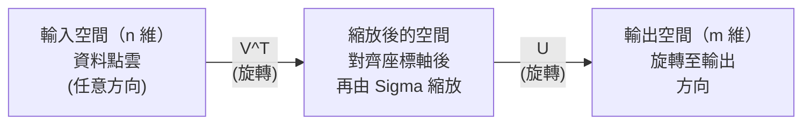
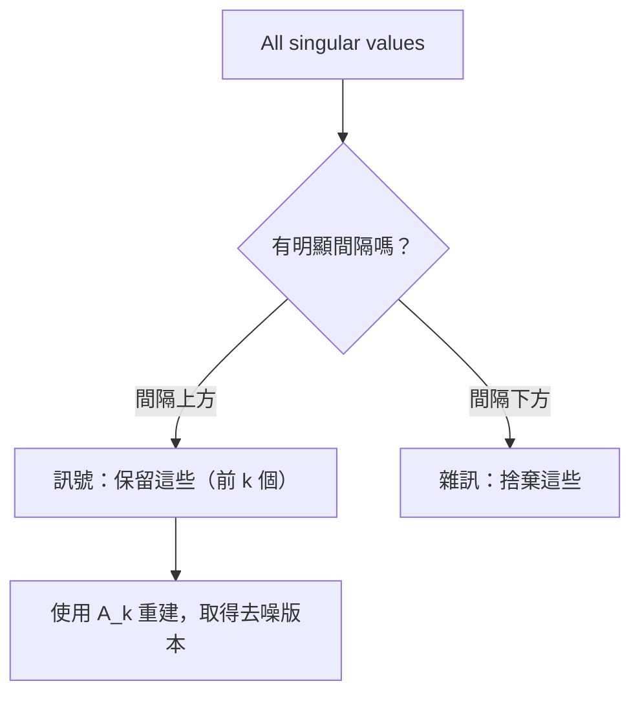

# 奇異值分解

> SVD 是線性代數中的瑞士刀。每個矩陣都有一組 SVD，每位資料科學家都需要懂它。

**Type:** Build
**Languages:** Python, Julia
**Prerequisites:** Phase 1, Lessons 01 (Linear Algebra Intuition), 02 (Vectors & Matrices Operations), 03 (Matrix Transformations)
**Time:** ~120 minutes

## 學習目標

- 使用冪次迭代實作 SVD，並說明 U、Sigma 和 V^T 的幾何意義
- 使用截斷 SVD 壓縮影像，並衡量壓縮率與重建誤差
- 透過 SVD 計算 Moore-Penrose 偽逆矩陣，以解超定最小平方法系統
- 說明 SVD 與 PCA、推薦系統（潛在因子）及 NLP 中潛在語意分析的關聯

## The Problem｜問題

你有一個 1000x2000 矩陣，可能是使用者對電影的評分、文件詞頻表，或影像的像素值。你可能想壓縮它、去除雜訊、找出隱藏結構，或用它求解最小平方法系統。特徵分解只適用於方陣，而且還要求矩陣有一組完整的線性獨立特徵向量。

SVD 適用於任何矩陣，不限形狀或秩，也沒有其他條件。它會將矩陣分解成三個因子，呈現矩陣如何在幾何上改變空間，是線性代數中最通用、最實用的分解方法。

## The Concept｜核心概念

### SVD 的幾何意義

每個矩陣不論形狀如何，都會依序執行三種操作：旋轉、縮放、再旋轉。SVD 將這種分解明確呈現出來。

```text
A = U * Sigma * V^T

      m x n     m x m    m x n    n x n
     （任意） （旋轉）  （縮放） （旋轉）
```

SVD 會將任意矩陣 A 分解成：
- V^T 旋轉輸入空間（n 維）中的向量
- Sigma 沿著各軸縮放（拉伸或壓縮）
- U 將結果旋轉至輸出空間（m 維）



可以這樣想：把一個矩陣交給 SVD，它會告訴你：「這個矩陣先用 V^T 旋轉輸入球體，再用 Sigma 將球體拉伸成橢球，最後用 U 旋轉橢球。」奇異值就是橢球各軸的長度。

### 完整分解

對形狀為 m x n 的矩陣 A 而言：

```text
A = U * Sigma * V^T

其中：
  U     為 m x m 正交矩陣（U^T U = I）
  Sigma 為 m x n 對角矩陣（對角線上是奇異值）
  V     為 n x n 正交矩陣（V^T V = I）

奇異值 sigma_1 >= sigma_2 >= ... >= sigma_r > 0
其中 r = rank(A)
```

U 的欄向量稱為左奇異向量，V 的欄向量稱為右奇異向量，Sigma 的對角線元素稱為奇異值。奇異值永遠非負，而且慣例上會依遞減順序排列。

### 左奇異向量、奇異值與右奇異向量

SVD 的每個部分都有不同的幾何意義。

**右奇異向量（V 的欄向量）：** 它們構成輸入空間（R^n）的正交單位基底，是矩陣會映射到輸出空間正交方向的輸入方向。可以把它們視為定義域的自然座標系統。

**奇異值（Sigma 的對角線元素）：** 這些數值代表縮放因子。第 i 個奇異值表示矩陣沿第 i 個右奇異向量拉伸向量的程度。奇異值為零，表示矩陣完全壓扁該方向。

**左奇異向量（U 的欄向量）：** 它們構成輸出空間（R^m）的正交單位基底。第 i 個左奇異向量是第 i 個右奇異向量經縮放後，在輸出空間所到達的方向。

它們之間的關係：

```text
A * v_i = sigma_i * u_i

矩陣 A 會取第 i 個右奇異向量 v_i，
將它乘上 sigma_i，再映射到第 i 個左奇異向量 u_i。
```

這讓你能逐個座標理解任意矩陣的作用。

### 外積形式

SVD 可以寫成多個秩 1 矩陣的總和：

```text
A = sigma_1 * u_1 * v_1^T + sigma_2 * u_2 * v_2^T + ... + sigma_r * u_r * v_r^T

每一項 sigma_i * u_i * v_i^T 都是秩 1 矩陣（外積）。
整個矩陣是 r 個這類矩陣的總和，其中 r 是矩陣的秩。
```

這種形式是低秩近似的基礎。每一項都會加入一層結構：第一項捕捉最重要的模式，第二項捕捉次重要的模式，依此類推。截斷這個總和，就能在指定秩下取得最佳近似。

```text
秩 1 近似：       A_1 = sigma_1 * u_1 * v_1^T
                  （捕捉主要模式）

秩 2 近似：       A_2 = sigma_1 * u_1 * v_1^T + sigma_2 * u_2 * v_2^T
                  （捕捉最重要的兩種模式）

秩 k 近似：       A_k = 前 k 項的總和
                  （依 Eckart-Young 定理為最佳近似）
```

### 與特徵分解的關係

SVD 和特徵分解有密切關聯。A 的奇異值和奇異向量，可以直接從 A^T A 與 A A^T 的特徵值和特徵向量取得。

```text
A^T A = V * Sigma^T * U^T * U * Sigma * V^T
      = V * Sigma^T * Sigma * V^T
      = V * D * V^T

其中 D = Sigma^T * Sigma 是對角矩陣，對角線元素為 sigma_i^2。

So:
- 右奇異向量（V）是 A^T A 的特徵向量
- 奇異值的平方（sigma_i^2）是 A^T A 的特徵值

Similarly:
A A^T = U * Sigma * V^T * V * Sigma^T * U^T
      = U * Sigma * Sigma^T * U^T

So:
- 左奇異向量（U）是 A A^T 的特徵向量
- A A^T 的特徵值也等於 sigma_i^2
```

這項關聯能帶出三個結論：
1. 奇異值永遠是實數且非負（它們是半正定矩陣特徵值的平方根）。
2. 你可以對 A^T A 做特徵分解來計算 SVD，但這會平方條件數並損失數值精度。專門的 SVD 演算法會避免這個問題。
3. 當 A 是對稱半正定方陣時，SVD 和特徵分解完全相同。

### 截斷 SVD：低秩近似

Eckart-Young-Mirsky 定理指出，若只保留前 k 個奇異值及其對應向量，就能得到 A 的最佳秩 k 近似（無論使用 Frobenius 範數或譜範數）：

```text
A_k = U_k * Sigma_k * V_k^T

其中：
  U_k     為 m x k（U 的前 k 個欄向量）
  Sigma_k 為 k x k（Sigma 左上角的 k x k 區塊）
  V_k     為 n x k（V 的前 k 個欄向量）

近似誤差 = sigma_{k+1}（使用譜範數時）
                    = sqrt(sigma_{k+1}^2 + ... + sigma_r^2)（使用 Frobenius 範數時）
```

這不只是「不錯的」近似，而是已證明的最佳秩 k 近似；沒有其他秩 k 矩陣比它更接近 A。

| 成分 | 相對大小 | 是否保留在秩 3 近似中？ |
|-----------|-------------------|------------------------|
| sigma_1 | 最大 | 是 |
| sigma_2 | 大 | 是 |
| sigma_3 | 中偏大 | 是 |
| sigma_4 | 中 | 否（構成誤差） |
| sigma_5 | 中偏小 | 否（構成誤差） |
| sigma_6 | 小 | 否（構成誤差） |
| sigma_7 | 很小 | 否（構成誤差） |
| sigma_8 | 極小 | 否（構成誤差） |

保留前三個：A_3 捕捉最大的三個奇異值。誤差來自其餘奇異值（sigma_4 到 sigma_8）。

奇異值快速衰減時，較小的 k 就能捕捉矩陣的大部分資訊；若衰減緩慢，矩陣就沒有低秩結構。

### 使用 SVD 壓縮影像

灰階影像是由像素強度組成的矩陣。800x600 影像有 480,000 個數值，SVD 能用少得多的數值近似它。

```text
原始影像：800 x 600 = 480,000 個數值

使用秩 k 的 SVD：
  U_k：     800 x k 個數值
  Sigma_k： k 個數值
  V_k：     600 x k 個數值
  總計：    k * (800 + 600 + 1) = k * 1401 個數值

  k=10：  14,010 個數值（原始大小的 2.9%）
  k=50：  70,050 個數值（原始大小的 14.6%）
  k=100：140,100 個數值（原始大小的 29.2%）

  k 越小，壓縮率越高，
  但影像品質會下降。
```

關鍵在於自然影像的奇異值會快速衰減。前幾個奇異值捕捉整體結構（形狀、漸層），後面的奇異值則捕捉細節和雜訊。截斷到秩 50 時，影像通常幾乎和原圖相同，儲存空間卻減少 85%。

### SVD 在推薦系統中的應用

Netflix Prize 讓這項應用廣為人知。你有一個使用者－電影評分矩陣，其中大多數項目都是缺失值。

```text
             Movie1  Movie2  Movie3  Movie4  Movie5
  User1      [  5      ?       3       ?       1  ]
  User2      [  ?      4       ?       2       ?  ]
  User3      [  3      ?       5       ?       ?  ]
  User4      [  ?      ?       ?       4       3  ]

  ? = 未知評分
```

想法是：這個評分矩陣具有低秩結構。使用者的喜好並非完全彼此獨立，少數潛在因子（動作片或劇情片、舊片或新片、理性或感性）就能解釋大部分偏好。

對填補缺失值後的評分矩陣執行 SVD，可將它分解為：
- U：潛在因子空間中的使用者檔案
- Sigma：各潛在因子的重要性
- V^T：潛在因子空間中的電影檔案

使用者對電影的預測評分，是其使用者檔案與電影檔案的點積（由奇異值加權）。低秩近似會填入缺失項目。

實務上會使用 Simon Funk 的增量式 SVD 或 ALS（交替最小平方法）等能直接處理缺失資料的變體。但核心概念相同：透過 SVD 將資料分解為潛在因子。

### SVD 在 NLP 中的應用：潛在語意分析

潛在語意分析（LSA），又稱潛在語意索引（LSI），會對詞項－文件矩陣套用 SVD。

```text
             Doc1   Doc2   Doc3   Doc4
  "cat"      [  3      0      1      0  ]
  "dog"      [  2      0      0      1  ]
  "fish"     [  0      4      1      0  ]
  "pet"      [  1      1      1      1  ]
  "ocean"    [  0      3      0      0  ]

After SVD with rank k=2:

  每份文件都會成為二維「概念空間」中的一個點。
  每個詞項也會成為相同二維空間中的一個點。
  主題相似的文件會聚在一起。
  意義相近的詞項會聚在一起。

  "cat" 和 "dog" 會彼此靠近（陸地上的寵物）。
  "fish" 和 "ocean" 會彼此靠近（水域概念）。
  若文件1和文件3的主題相似，它們就會聚在一起。
```

LSA 是最早能從原始文字中擷取語意相似度的成功方法之一。意思相近的詞往往出現在相似文件中，因此 SVD 會將它們歸到相同的潛在維度。現代詞嵌入（Word2Vec、GloVe）可視為這個想法的延伸。

### SVD 用於降噪

含雜訊資料的訊號集中在較大的奇異值中，雜訊則分布在所有奇異值上。截斷奇異值可移除雜訊底限。

**乾淨訊號的奇異值：**

| 成分 | 大小 | 類型 |
|-----------|-----------|------|
| sigma_1 | 非常大 | 訊號 |
| sigma_2 | 大 | 訊號 |
| sigma_3 | 中 | 訊號 |
| sigma_4 | 接近零 | 可忽略 |
| sigma_5 | 接近零 | 可忽略 |

**含雜訊訊號的奇異值（雜訊會增加所有奇異值）：**

| 成分 | 大小 | 類型 |
|-----------|-----------|------|
| sigma_1 | 非常大 | 訊號 |
| sigma_2 | 大 | 訊號 |
| sigma_3 | 中 | 訊號 |
| sigma_4 | 小 | 雜訊 |
| sigma_5 | 小 | 雜訊 |
| sigma_6 | 小 | 雜訊 |
| sigma_7 | 小 | 雜訊 |



這種方法可用於訊號處理、科學測量和資料清理。只要矩陣受到加成雜訊污染，截斷 SVD 就是有理論根據的訊號與雜訊分離方法。

### 透過 SVD 計算偽逆矩陣

Moore-Penrose 偽逆矩陣 A+ 將矩陣反轉的概念延伸到非方陣和奇異矩陣。透過 SVD 就能輕易計算。

```text
若 A = U * Sigma * V^T，則：

A+ = V * Sigma+ * U^T

Sigma+ 的計算方式如下：
  1. 將 Sigma 轉置（對調列與欄）
  2. 將每個非零對角線元素 sigma_i 換成 1/sigma_i
  3. 零值維持為零

對 A（m x n）而言：A+ 的形狀為 n x m
對 Sigma（m x n）而言：Sigma+ 的形狀為 n x m
```

偽逆矩陣可用來解最小平方法問題。若 Ax = b 沒有精確解（超定系統），則 x = A+ b 是最小平方法解（會讓 ||Ax - b|| 最小）。

```text
超定系統（方程式比未知數多）：

  [1  1]         [3]
  [2  1] x   =   [5]       沒有精確解。
  [3  1]         [6]

  x_ls = A+ b = V * Sigma+ * U^T * b

  這會得到讓殘差平方和最小的 x。
  結果與正規方程式 (A^T A)^(-1) A^T b 相同，
  但數值穩定性更高。
```

### 數值穩定性的優勢

對 A^T A 進行特徵分解會將奇異值平方（A^T A 的特徵值為 sigma_i^2），也會將條件數平方，放大數值誤差。

```text
例子：
  A 的奇異值為 [1000, 1, 0.001]
  A 的條件數：1000 / 0.001 = 10^6

  A^T A 的特徵值為 [10^6, 1, 10^{-6}]
  A^T A 的條件數：10^6 / 10^{-6} = 10^{12}

  直接計算 SVD：處理條件數 10^6
  透過 A^T A 計算：處理條件數 10^{12}
                           （額外損失 6 位精度）
```

現代 SVD 演算法（Golub-Kahan 雙對角化）會直接處理 A，不會建立 A^T A。因此應優先使用 `np.linalg.svd(A)`，而非 `np.linalg.eig(A.T @ A)`。

### 與 PCA 的關聯

PCA 就是對中心化資料執行 SVD。這不是類比，而是完全相同的計算。

```text
給定中心化後的資料矩陣 X（n_samples x n_features，已減去平均值）：

共變異數矩陣：C = (1/(n-1)) * X^T X

PCA 會尋找 C 的特徵向量，而：

  X = U * Sigma * V^T    （X 的 SVD）

  X^T X = V * Sigma^2 * V^T

  C = (1/(n-1)) * V * Sigma^2 * V^T

因此，主成分正是右奇異向量 V。
每個主成分的解釋變異量為 sigma_i^2 / (n-1)。

sklearn 中的 PCA 是使用 SVD 而非特徵分解實作。
這樣速度更快，數值穩定性也更高。
```

這表示你在第 10 課學到的降維方法，底層其實就是 SVD。PCA 是 SVD 在機器學習中最常見的應用。

```figure
svd-rank-reconstruction
```

## Build It｜動手打造

### 步驟 1：使用冪次迭代從零實作 SVD

想法是：對 A^T A（或 A A^T）執行冪次迭代，找出最大的奇異值和對應向量；接著對矩陣進行降階，再重複步驟找出下一個奇異值。

```python
import numpy as np

def power_iteration(M, num_iters=100):
    n = M.shape[1]
    v = np.random.randn(n)
    v = v / np.linalg.norm(v)

    for _ in range(num_iters):
        Mv = M @ v
        v = Mv / np.linalg.norm(Mv)

    eigenvalue = v @ M @ v
    return eigenvalue, v

def svd_from_scratch(A, k=None):
    m, n = A.shape
    if k is None:
        k = min(m, n)

    sigmas = []
    us = []
    vs = []

    A_residual = A.copy().astype(float)

    for _ in range(k):
        AtA = A_residual.T @ A_residual
        eigenvalue, v = power_iteration(AtA, num_iters=200)

        if eigenvalue < 1e-10:
            break

        sigma = np.sqrt(eigenvalue)
        u = A_residual @ v / sigma

        sigmas.append(sigma)
        us.append(u)
        vs.append(v)

        A_residual = A_residual - sigma * np.outer(u, v)

    U = np.column_stack(us) if us else np.empty((m, 0))
    S = np.array(sigmas)
    V = np.column_stack(vs) if vs else np.empty((n, 0))

    return U, S, V
```

### 步驟 2：測試並與 NumPy 比較

```python
np.random.seed(42)
A = np.random.randn(5, 4)

U_ours, S_ours, V_ours = svd_from_scratch(A)
U_np, S_np, Vt_np = np.linalg.svd(A, full_matrices=False)

print("Our singular values:", np.round(S_ours, 4))
print("NumPy singular values:", np.round(S_np, 4))

A_reconstructed = U_ours @ np.diag(S_ours) @ V_ours.T
print(f"Reconstruction error: {np.linalg.norm(A - A_reconstructed):.8f}")
```

### 步驟 3：示範影像壓縮

```python
def compress_image_svd(image_matrix, k):
    U, S, Vt = np.linalg.svd(image_matrix, full_matrices=False)
    compressed = U[:, :k] @ np.diag(S[:k]) @ Vt[:k, :]
    return compressed

image = np.random.seed(42)
rows, cols = 200, 300
image = np.random.randn(rows, cols)

for k in [1, 5, 10, 20, 50]:
    compressed = compress_image_svd(image, k)
    error = np.linalg.norm(image - compressed) / np.linalg.norm(image)
    original_size = rows * cols
    compressed_size = k * (rows + cols + 1)
    ratio = compressed_size / original_size
    print(f"k={k:>3d}  error={error:.4f}  storage={ratio:.1%}")
```

### 步驟 4：降噪

```python
np.random.seed(42)
clean = np.outer(np.sin(np.linspace(0, 4*np.pi, 100)),
                 np.cos(np.linspace(0, 2*np.pi, 80)))
noise = 0.3 * np.random.randn(100, 80)
noisy = clean + noise

U, S, Vt = np.linalg.svd(noisy, full_matrices=False)
denoised = U[:, :5] @ np.diag(S[:5]) @ Vt[:5, :]

print(f"Noisy error:    {np.linalg.norm(noisy - clean):.4f}")
print(f"Denoised error: {np.linalg.norm(denoised - clean):.4f}")
print(f"Improvement:    {(1 - np.linalg.norm(denoised - clean) / np.linalg.norm(noisy - clean)):.1%}")
```

### 步驟 5：計算偽逆矩陣

```python
A = np.array([[1, 1], [2, 1], [3, 1]], dtype=float)
b = np.array([3, 5, 6], dtype=float)

U, S, Vt = np.linalg.svd(A, full_matrices=False)
S_inv = np.diag(1.0 / S)
A_pinv = Vt.T @ S_inv @ U.T

x_svd = A_pinv @ b
x_lstsq = np.linalg.lstsq(A, b, rcond=None)[0]
x_pinv = np.linalg.pinv(A) @ b

print(f"SVD pseudoinverse solution:  {x_svd}")
print(f"np.linalg.lstsq solution:   {x_lstsq}")
print(f"np.linalg.pinv solution:    {x_pinv}")
```

## Use It｜開始使用

完整示範程式位於 `code/svd.py`。執行後即可查看 SVD 在影像壓縮、推薦系統、潛在語意分析和降噪中的應用。

```bash
python svd.py
```

`code/svd.jl` 中的 Julia 版本使用 Julia 內建的 `svd()` 函式和 `LinearAlgebra` 套件示範相同概念。

```bash
julia svd.jl
```

## Ship It｜交付成果

本課程會產出：
- `outputs/skill-svd.md` — 說明在實際專案中何時及如何使用 SVD 的 skill

## Exercises｜練習

1. 不使用冪次迭代，從零實作完整 SVD。改為對 A^T A 進行特徵分解，取得 V 和奇異值，再計算 U = A V Sigma^{-1}。比較其數值準確度與冪次迭代版本及 NumPy。

2. 載入一張真實灰階影像（或將影像轉成灰階），使用秩 1、5、10、25、50、100 進行壓縮。分別計算壓縮率和相對誤差，找出影像品質可接受的秩。

3. 建立迷你推薦系統。建立一個部分評分已知的 10x8 使用者－電影評分矩陣，以各列平均值填補缺失項目。計算 SVD 並重建秩 3 近似，再用重建矩陣預測缺失評分，確認預測是否合理。

4. 建立含 3 個合成主題的 100x50 詞項－文件矩陣，每個主題有 5 個相關詞項，再加入雜訊。套用 SVD，確認最大的 3 個奇異值遠大於其餘奇異值。將文件投影到 3D 潛在空間，檢查相同主題的文件是否聚在一起。

5. 產生一個乾淨的低秩矩陣（秩 3、大小 50x40），並加入不同程度的高斯雜訊（sigma = 0.1、0.5、1.0、2.0）。對每個雜訊程度，測試 k 從 1 到 40 的重建誤差，找出最佳截斷秩，並繪出最佳 k 如何隨雜訊程度變化。

## Key Terms｜重要詞彙

| 詞彙 | 一般說法 | 實際意義 |
|------|----------------|----------------------|
| SVD |「分解任意矩陣」| 將 A 分解為 U Sigma V^T，其中 U 和 V 為正交矩陣，Sigma 是對角線元素非負的對角矩陣。適用於任何形狀的矩陣。 |
| 奇異值 |「這個成分有多重要」| Sigma 的第 i 個對角線元素，衡量矩陣沿第 i 個主要方向拉伸的程度。永遠非負，並依遞減順序排列。 |
| 左奇異向量 |「輸出方向」| U 的欄向量。第 i 個右奇異向量乘上 sigma_i 後，在輸出空間所映射到的方向。 |
| 右奇異向量 |「輸入方向」| V 的欄向量。矩陣會將此輸入空間方向乘上 sigma_i，再映射到第 i 個左奇異向量。 |
| 截斷 SVD |「低秩近似」| 只保留前 k 個奇異值和對應向量，得到已證明最佳的原矩陣秩 k 近似（Eckart-Young 定理）。 |
| 秩 |「實際維度」| 非零奇異值的數量，表示矩陣實際使用了多少個獨立方向。 |
| 偽逆矩陣 |「廣義反矩陣」| V Sigma+ U^T。將非零奇異值取倒數，零值則維持為零，可用來求解非方陣或奇異矩陣的最小平方法問題。 |
| 條件數 |「對誤差有多敏感」| sigma_max / sigma_min。條件數大表示輸入的微小變動會造成輸出的巨大變化，SVD 能直接揭示這點。 |
| 潛在因子 |「隱藏變數」| SVD 找出的低秩空間維度。在推薦系統中，潛在因子可能代表電影類型偏好；在 NLP 中則可能代表主題。 |
| Frobenius 範數 |「矩陣總大小」| 矩陣元素平方和的平方根，也等於奇異值平方和的平方根，可用來衡量近似誤差。 |
| Eckart-Young 定理 |「SVD 能提供最佳壓縮」| 對任何目標秩 k 而言，截斷 SVD 都能在所有秩 k 矩陣中將近似誤差最小化。 |
| 冪次迭代 |「找出最大的特徵向量」| 將隨機向量反覆乘上矩陣並正規化，最後收斂到最大特徵值所對應的特徵向量，是許多 SVD 演算法的基礎。 |

## 延伸閱讀

- [Gilbert Strang：線性代數及其應用，第 7 章](https://math.mit.edu/~gs/linearalgebra/) — 詳細介紹 SVD 及其應用
- [3Blue1Brown：SVD 到底是什麼？](https://www.youtube.com/watch?v=vSczTbgc8Rc) — SVD 的幾何直覺
- [我們推薦奇異值分解](https://www.ams.org/publicoutreach/feature-column/fcarc-svd) — 美國數學學會提供的易讀概覽
- [Netflix Prize 與矩陣分解](https://sifter.org/~simon/journal/20061211.html) — Simon Funk 關於以 SVD 建立推薦系統的原始部落格文章
- [潛在語意分析](https://en.wikipedia.org/wiki/Latent_semantic_analysis) — SVD 在 NLP 中的早期應用
- [Trefethen 與 Bau 的數值線性代數](https://people.maths.ox.ac.uk/trefethen/text.html) — 理解 SVD 演算法及其數值特性的權威教材
