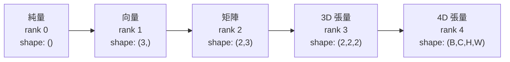
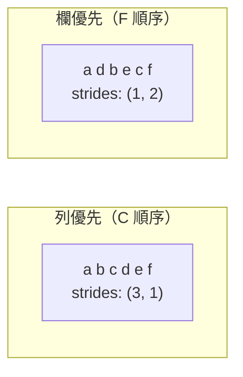
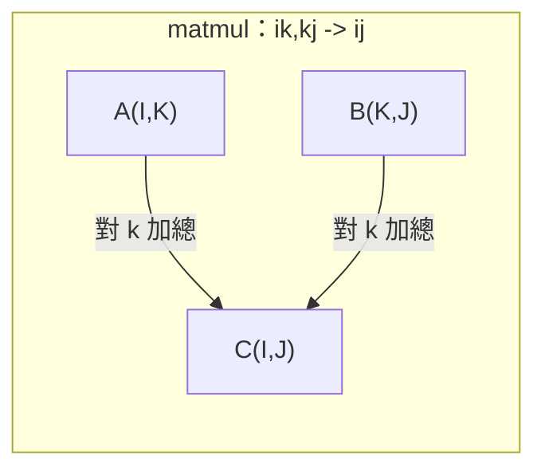

# 張量運算

> 張量是資料和深度學習之間的共通語言。每張影像、每個句子、每個梯度都會經過張量。

**Type:** Build
**Language:** Python
**Prerequisites:** Phase 1, Lessons 01 (Linear Algebra Intuition), 02 (Vectors, Matrices & Operations)
**Time:** ~90 minutes

## 學習目標

- 從零實作張量類別，支援形狀、步幅、重塑、轉置和逐元素運算
- 套用廣播規則，不複製資料就能對不同形狀的張量執行運算
- 使用 einsum 表達式撰寫點積、矩陣乘法、外積和批次運算
- 追蹤多頭注意力每個步驟中的精確張量形狀

## The Problem｜問題

你打造了一個 Transformer，前向傳播看起來很簡潔。執行後卻出現錯誤：`RuntimeError: mat1 and mat2 shapes cannot be multiplied (32x768 and 512x768)`。你盯著形狀看，試著轉置，接著又收到 `Expected 4D input (got 3D input)`。你加上 unsqueeze，其他地方又壞掉了。

形狀錯誤是深度學習程式碼中最常見的錯誤。概念上並不難，因為每種運算都有形狀規則，但錯誤很容易層層累積。Transformer 會串接數十次重塑、轉置和廣播，軸只要弄錯一個，錯誤就會一路擴散。更糟的是，有些形狀錯誤完全不會觸發例外，只會沿著錯誤維度廣播，或沿錯誤軸加總，悄悄產生無用結果。

矩陣能處理兩組事物之間的成對關係，但真實資料不只兩個維度。32 張 224x224 的 RGB 影像組成 4D 張量：`(32, 3, 224, 224)`。有 12 個頭的自我注意力同樣是 4D：`(batch, heads, seq_len, head_dim)`。你需要一種能泛化到任意維度的資料結構，並讓各種運算都能自然組合。這種結構就是張量。熟悉張量運算後，形狀錯誤就很容易除錯。

## The Concept｜核心概念

### 什麼是張量

張量是資料型別一致的多維數字陣列。維度數量稱為**階數**（或**級數**），每個維度稱為一個**軸**。**形狀**則是列出各軸大小的 tuple。



元素總數 = 各軸大小的乘積。形狀為 `(2, 3, 4)` 的張量包含 `2 * 3 * 4 = 24` 個元素。

### 深度學習中的張量形狀

不同類型的資料通常會對應特定的張量形狀。


PyTorch 使用 NCHW（通道在前）；TensorFlow 預設使用 NHWC（通道在後）。資料配置不一致可能造成不易察覺的效能下降或錯誤。

### 記憶體配置的運作方式

記憶體中的 2D 陣列其實是一串 1D 位元組。**步幅**會告訴你沿每個軸移動一步時要跳過多少個元素。



轉置不會搬動資料，只會交換步幅，因此張量會變成**非連續**：同一列的元素在記憶體中不再相鄰。

### 廣播規則

廣播讓你不必複製資料，就能對形狀不同的張量執行運算。從右側對齊形狀，兩個維度相同或其中一個為 1 時就相容。維度較少的形狀會在左側補上 1。

```text
張量 A：      (8, 1, 6, 1)
張量 B：         (7, 1, 5)
補齊後的 B： (1, 7, 1, 5)
結果：         (8, 7, 6, 5)
```

### Einsum：通用張量運算

愛因斯坦求和會用字母標記各個軸。只出現在輸入、沒有出現在輸出的軸會被加總；同時出現在輸入與輸出的軸則會保留。



常見模式：`i,i->`（點積）、`i,j->ij`（外積）、`ii->`（跡）、`ij->ji`（轉置）、`bij,bjk->bik`（批次矩陣乘法）、`bhtd,bhsd->bhts`（注意力分數）。

```figure
tensor-broadcast
```

## Build It｜動手打造

程式碼位於 `code/tensors.py`，以下每個步驟都會參照其中的實作。

### 步驟 1：張量儲存方式與步幅

張量會儲存一維數字清單和形狀中繼資料。步幅則能讓索引邏輯將多維索引映射到一維位置。

```python
class Tensor:
    def __init__(self, data, shape=None):
        if isinstance(data, (list, tuple)):
            self._data, self._shape = self._flatten_nested(data)
        elif isinstance(data, np.ndarray):
            self._data = data.flatten().tolist()
            self._shape = tuple(data.shape)
        else:
            self._data = [data]
            self._shape = ()

        if shape is not None:
            total = reduce(lambda a, b: a * b, shape, 1)
            if total != len(self._data):
                raise ValueError(
                    f"Cannot reshape {len(self._data)} elements into shape {shape}"
                )
            self._shape = tuple(shape)

        self._strides = self._compute_strides(self._shape)

    @staticmethod
    def _compute_strides(shape):
        if len(shape) == 0:
            return ()
        strides = [1] * len(shape)
        for i in range(len(shape) - 2, -1, -1):
            strides[i] = strides[i + 1] * shape[i + 1]
        return tuple(strides)
```

形狀為 `(3, 4)` 時，步幅為 `(4, 1)`：往下一列要跳過 4 個元素，往下一欄要跳過 1 個元素。

### 步驟 2：reshape、squeeze 與 unsqueeze

reshape 會改變形狀，但不會改變元素順序。元素總數必須維持相同。某個維度可使用 `-1`，讓系統自動推算大小。

```python
t = Tensor(list(range(12)), shape=(2, 6))
r = t.reshape((3, 4))
r = t.reshape((-1, 3))
```

squeeze 會移除大小為 1 的軸，unsqueeze 則會插入一個軸。unsqueeze 對廣播很重要：將偏差向量 `(D,)` 加到批次 `(B, T, D)` 時，必須先轉成 `(1, 1, D)`。

```python
t = Tensor(list(range(6)), shape=(1, 3, 1, 2))
s = t.squeeze()
v = Tensor([1, 2, 3])
u = v.unsqueeze(0)
```

### 步驟 3：transpose 與 permute

transpose 會交換兩個軸，permute 則會重新排列所有軸。轉換 NCHW 和 NHWC 格式時就會用到這些操作。

```python
mat = Tensor(list(range(6)), shape=(2, 3))
tr = mat.transpose(0, 1)

t4d = Tensor(list(range(24)), shape=(1, 2, 3, 4))
perm = t4d.permute((0, 2, 3, 1))
```

執行 transpose 或 permute 後，張量在記憶體中會變成非連續。在 PyTorch 中，`view` 無法處理非連續張量，請改用 `reshape`，或先呼叫 `.contiguous()`。

### 步驟 4：逐元素運算與歸約

逐元素運算（加法、乘法、減法）會分別作用在每個元素上，並保留形狀。歸約運算（sum、mean、max）則會消去一個或多個軸。

```python
a = Tensor([[1, 2], [3, 4]])
b = Tensor([[10, 20], [30, 40]])
c = a + b
d = a * 2
s = a.sum(axis=0)
```

CNN 的全域平均池化：`(B, C, H, W).mean(axis=[2, 3])` 會得到 `(B, C)`。NLP 的序列平均池化：`(B, T, D).mean(axis=1)` 會得到 `(B, D)`。

### 步驟 5：使用 NumPy 執行廣播

`tensors.py` 中的 `demo_broadcasting_numpy()` 函式展示了核心模式。

```python
activations = np.random.randn(4, 3)
bias = np.array([0.1, 0.2, 0.3])
result = activations + bias

images = np.random.randn(2, 3, 4, 4)
scale = np.array([0.5, 1.0, 1.5]).reshape(1, 3, 1, 1)
result = images * scale

a = np.array([1, 2, 3]).reshape(-1, 1)
b = np.array([10, 20, 30, 40]).reshape(1, -1)
outer = a * b
```

使用廣播計算兩兩距離：將 `(M, 2)` 重塑為 `(M, 1, 2)`，將 `(N, 2)` 重塑為 `(1, N, 2)`，再相減、平方、沿最後一軸加總並開根號。結果形狀為 `(M, N)`。

### 步驟 6：Einsum 運算

`demo_einsum()` 和 `demo_einsum_gallery()` 函式會逐一示範所有常見模式。

```python
a = np.array([1.0, 2.0, 3.0])
b = np.array([4.0, 5.0, 6.0])
dot = np.einsum("i,i->", a, b)

A = np.array([[1, 2], [3, 4], [5, 6]], dtype=float)
B = np.array([[7, 8, 9], [10, 11, 12]], dtype=float)
matmul = np.einsum("ik,kj->ij", A, B)

batch_A = np.random.randn(4, 3, 5)
batch_B = np.random.randn(4, 5, 2)
batch_mm = np.einsum("bij,bjk->bik", batch_A, batch_B)
```

張量收縮的計算成本，是所有索引大小（保留和加總）的乘積。若 `bij,bjk->bik` 中 B=32、I=128、J=64、K=128，計算量就是 `32 * 128 * 64 * 128 = 33,554,432` 次乘加。

### 步驟 7：透過 einsum 實作注意力機制

`demo_attention_einsum()` 函式會端對端實作多頭注意力。

```python
B, H, T, D = 2, 4, 8, 16
E = H * D

X = np.random.randn(B, T, E)
W_q = np.random.randn(E, E) * 0.02

Q = np.einsum("bte,ek->btk", X, W_q)
Q = Q.reshape(B, T, H, D).transpose(0, 2, 1, 3)

scores = np.einsum("bhtd,bhsd->bhts", Q, K) / np.sqrt(D)
weights = softmax(scores, axis=-1)
attn_output = np.einsum("bhts,bhsd->bhtd", weights, V)

concat = attn_output.transpose(0, 2, 1, 3).reshape(B, T, E)
output = np.einsum("bte,ek->btk", concat, W_o)
```

每個步驟都是張量運算：投影（透過 einsum 執行矩陣乘法）、拆分注意力頭（reshape + transpose）、注意力分數（透過 einsum 執行批次矩陣乘法）、加權總和（透過 einsum 執行批次矩陣乘法）、合併注意力頭（transpose + reshape），以及輸出投影（透過 einsum 執行矩陣乘法）。

## Use It｜開始使用

### 從零實作與 NumPy 的比較

| 運算 | 從零實作（Tensor 類別） | NumPy |
|---|---|---|
| 建立 | `Tensor([[1,2],[3,4]])` | `np.array([[1,2],[3,4]])` |
| 重塑 | `t.reshape((3,4))` | `a.reshape(3,4)` |
| 轉置 | `t.transpose(0,1)` | `a.T` 或 `a.transpose(0,1)` |
| squeeze | `t.squeeze(0)` | `np.squeeze(a, 0)` |
| 加總 | `t.sum(axis=0)` | `a.sum(axis=0)` |
| Einsum | 不適用 | `np.einsum("ij,jk->ik", a, b)` |

### 從零實作與 PyTorch 的比較

```python
import torch

t = torch.tensor([[1, 2, 3], [4, 5, 6]], dtype=torch.float32)
t.shape
t.stride()
t.is_contiguous()

t.reshape(3, 2)
t.unsqueeze(0)
t.transpose(0, 1)
t.transpose(0, 1).contiguous()

torch.einsum("ik,kj->ij", A, B)
```

PyTorch 還提供自動微分、GPU 支援和最佳化的 BLAS 核心。兩者的形狀語意相同。了解從零實作的版本後，PyTorch 的形狀錯誤也會變得容易理解。

### 將每個神經網路層視為張量運算

| 運算 | 張量表示法 | Einsum |
|---|---|---|
| 線性層 | `Y = X @ W.T + b` | `"bd,od->bo"` + 偏差項 |
| 注意力 QKV | `Q = X @ W_q` | `"btd,dh->bth"` |
| 注意力分數 | `Q @ K.T / sqrt(d)` | `"bhtd,bhsd->bhts"` |
| 注意力輸出 | `softmax(scores) @ V` | `"bhts,bhsd->bhtd"` |
| 批次正規化 | `(X - mu) / sigma * gamma` | 逐元素運算 + 廣播 |
| Softmax | `exp(x) / sum(exp(x))` | 逐元素運算 + 歸約 |

## Ship It｜交付成果

本課程會產出兩份可重複使用的提示詞：

1. **`outputs/prompt-tensor-shapes.md`** — 有系統地除錯張量形狀不符的提示詞，包含常見運算（matmul、broadcast、cat、Linear、Conv2d、BatchNorm、softmax）的判斷表和修正查詢表。

2. **`outputs/prompt-tensor-debugger.md`** — 張量形狀錯誤卡住你時，可貼到任意 AI 助理中的逐步除錯提示詞。提供錯誤訊息和張量形狀，就能取得精確修正方式。

## Exercises｜練習

1. **簡單 — reshape 往返。** 取一個形狀為 `(2, 3, 4)` 的張量，依序重塑為 `(6, 4)`、`(24,)`，再轉回 `(2, 3, 4)`。每個步驟都列印一維資料，確認元素順序保持不變。

2. **中等 — 實作廣播。** 擴充 `Tensor` 類別，加入 `broadcast_to(shape)` 方法，將大小為 1 的維度延展至目標形狀。接著修改 `_elementwise_op`，讓它運算前自動執行廣播。使用 `(3, 1)` 和 `(1, 4)` 測試，結果應為 `(3, 4)`。

3. **困難 — 從零實作 einsum。** 實作基本的 `einsum(subscripts, *tensors)` 函式，至少支援點積（`i,i->`）、矩陣乘法（`ij,jk->ik`）、外積（`i,j->ij`）和轉置（`ij->ji`）。解析下標字串、找出收縮索引，並遍歷所有索引組合。將結果與 `np.einsum` 比較。

4. **困難 — 追蹤注意力形狀。** 撰寫函式，輸入 `batch_size`、`seq_len`、`embed_dim` 和 `num_heads`，並列印多頭注意力每個步驟的精確形狀：輸入、Q/K/V 投影、拆分注意力頭、注意力分數、softmax 權重、加權總和、合併注意力頭、輸出投影。與 `demo_attention_einsum()` 的輸出比對。

## Key Terms｜重要詞彙

| 詞彙 | 一般說法 | 實際意義 |
|---|---|---|
| 張量 |「維度更多的矩陣」| 資料型別一致的多維陣列，具有明確的形狀、步幅和運算。 |
| 階數 |「維度數量」| 軸的數量。矩陣的階數是 2，與矩陣秩的意義不同。 |
| 形狀 |「張量的大小」| 列出各軸大小的 tuple。`(2, 3)` 表示 2 列、3 欄。 |
| 步幅 |「記憶體如何配置」| 沿各軸移動一個位置時，要跳過的元素數量。 |
| 廣播 |「形狀不同時它會自動處理」| 一組嚴格規則：從右側對齊，維度必須相同或其中一個為 1。 |
| 連續 |「一般的張量」| 元素依照邏輯排列順序連續儲存在記憶體中，沒有空隙或重新排序。 |
| Einsum |「比較花俏的矩陣乘法寫法」| 通用表示法，可用一行表達張量收縮、外積、跡或轉置。 |
| View |「和 reshape 一樣」| 共用相同記憶體緩衝區、但形狀或步幅中繼資料不同的張量。無法處理非連續資料。 |
| 收縮 |「對索引加總」| 張量間共用的索引所對應元素相乘後再加總的通用運算，結果的階數會降低。 |
| NCHW／NHWC |「PyTorch 和 TensorFlow 的格式」| 影像張量的記憶體配置慣例。NCHW 將通道放在空間維度之前，NHWC 則放在之後。 |

## 延伸閱讀

- [NumPy 廣播](https://numpy.org/doc/stable/user/basics.broadcasting.html) — 標準規則及視覺化範例
- [PyTorch 張量 View](https://pytorch.org/docs/stable/tensor_view.html) — 說明何時會建立 view、何時會複製資料
- [einops](https://github.com/arogozhnikov/einops) — 讓張量重塑更易讀、更安全的函式庫
- [圖解 Transformer](https://jalammar.github.io/illustrated-transformer/) — 將注意力運算中的張量形狀視覺化
- [NumPy 的愛因斯坦求和](https://numpy.org/doc/stable/reference/generated/numpy.einsum.html) — 完整的 einsum 文件與範例
