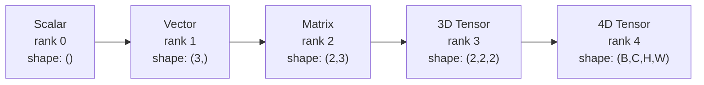
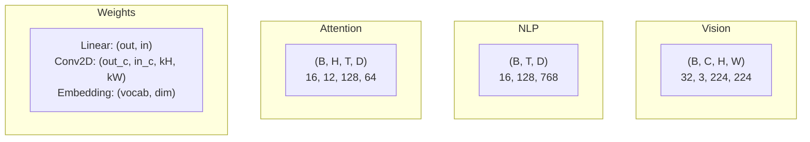
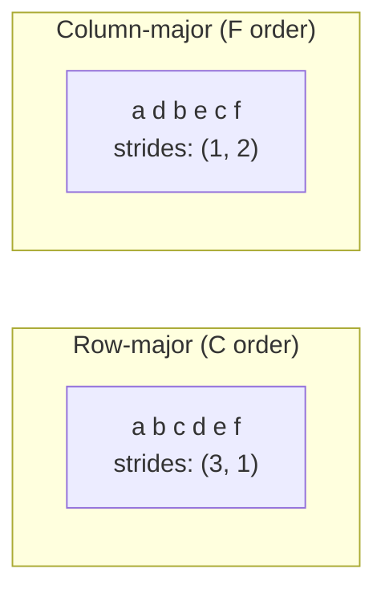
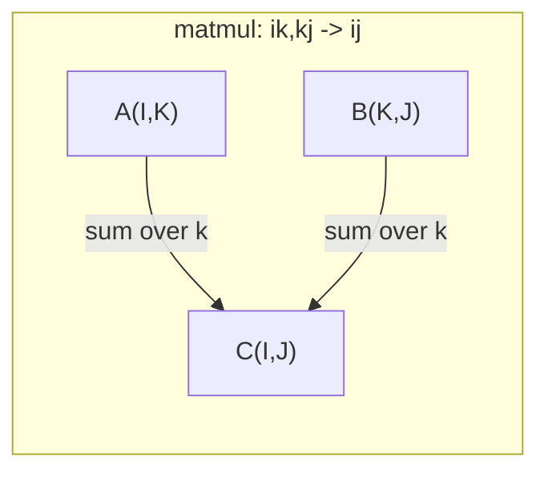

# 張量運算

> 張量（tensor）是資料與深度學習共通的語言。每張影像、每句話、每個梯度都透過張量流動。

**Type:** Build
**Language:** Python
**Prerequisites:** Phase 1, Lessons 01 (Linear Algebra Intuition), 02 (Vectors, Matrices & Operations)
**Time:** ~90 minutes

## Learning Objectives｜學習目標

- 從零實作張量類別（tensor class），加入形狀（shape）、步幅（stride）、重塑（reshape）、轉置（transpose）和逐元素運算（element-wise operations）
- 套用廣播（broadcasting）規則，讓不同形狀的張量不用複製資料也能運算
- 用 einsum（Einstein 求和表示法）表達式表示內積（dot product）、矩陣乘法（matrix multiplication）、外積（outer product）和批次運算
- 追蹤多頭注意力（multi-head attention）每個步驟的精確張量形狀

## The Problem｜問題

你正在建立 Transformer。前向傳遞（forward pass）看起來很乾淨。一執行就出現：`RuntimeError: mat1 and mat2 shapes cannot be multiplied (32x768 and 512x768)`。你盯著形狀看，試著轉置一次，接著又看到 `Expected 4D input (got 3D input)`。你加了 unsqueeze，結果別的地方又壞了。

形狀錯誤是深度學習程式碼中最常見的錯誤。概念上不難——每種運算都有形狀規則——但錯誤會很快連鎖擴大。一個 Transformer 有數十個串在一起的重塑、轉置和廣播。軸放錯一個，錯誤就會一路傳下去。更糟的是，有些形狀錯誤根本不會丟出例外；它們會沿著錯誤的維度廣播，或加總錯誤的軸，悄悄產生垃圾結果。

矩陣處理兩組事物之間的成對關係，但真實資料不只兩個維度。32 張、大小 224x224 的 RGB 影像組成一個 4D 張量：`(32, 3, 224, 224)`。有 12 個注意力頭的自注意力（self-attention）也是 4D：`(batch, heads, seq_len, head_dim)`。你需要一種能泛化至任意維度數量的資料結構，以及能在所有維度上順暢組合的運算。這種結構就是張量。熟悉張量運算後，形狀錯誤就很容易除錯。

## The Concept｜核心概念

### 什麼是張量

張量是具有統一資料型別的多維數值陣列，所有元素都有相同的資料型別。維度數量稱為**張量階數（rank，也稱 order）**。每個維度都是一個**軸（axis）**。**形狀（shape）**是列出各軸大小的 tuple。



元素總數等於所有軸大小的乘積。形狀為 `(2, 3, 4)` 的張量含有 `2 * 3 * 4 = 24` 個元素。

### 深度學習中的張量形狀

不同類型的資料會依照慣例對應特定的張量形狀。



PyTorch 使用 NCHW（通道在前），TensorFlow 預設使用 NHWC（通道在後）。兩者的配置不相符，會造成悄悄降低效能或引發錯誤。

### 記憶體配置（memory layout）如何運作

在記憶體中，2D 陣列會以一維位元組序列儲存。**步幅（stride）**告訴你沿每個軸前進一步要略過多少個元素。



轉置不會搬動資料，只會交換步幅，讓張量變成**非連續（non-contiguous）**——同一列的元素在記憶體中不再相鄰。

### 廣播規則

廣播讓不同形狀的張量不用複製資料也能運算。從右側對齊形狀。兩個維度相等或其中一個為 1 時，就能相容。維度較少的形狀會在左側補上 1。

```
Tensor A:     (8, 1, 6, 1)
Tensor B:        (7, 1, 5)
Padded B:     (1, 7, 1, 5)
Result:       (8, 7, 6, 5)
```

### Einsum：通用張量運算

einsum（Einstein 求和表示法）用字母標記每個軸。出現在輸入、但沒有出現在輸出中的軸會被加總；輸入和輸出中都出現的軸則保留。



常見模式：`i,i->`（內積）、`i,j->ij`（外積）、`ii->`（跡）、`ij->ji`（轉置）、`bij,bjk->bik`（批次矩陣乘法）、`bhtd,bhsd->bhts`（注意力分數）。

```figure
tensor-broadcast
```

## Build It｜動手實作

程式碼位於 `code/tensors.py`。每個步驟都會參照其中的實作。

### 步驟 1：張量儲存方式與步幅

張量會儲存一個攤平的數值清單，以及形狀中繼資料。索引邏輯會根據步幅，把多維索引映射到攤平後的位置。

```python
class Tensor:
    def __init__(self, data, shape=None):
        if isinstance(data, (list, tuple)):
            self._data, self._shape = self._flatten_nested(data)
        elif isinstance(data, np.ndarray):
            self._data = data.flatten().tolist()
            self._shape = tuple(data.shape)
        else:
            self._data = [data]
            self._shape = ()

        if shape is not None:
            total = reduce(lambda a, b: a * b, shape, 1)
            if total != len(self._data):
                raise ValueError(
                    f"Cannot reshape {len(self._data)} elements into shape {shape}"
                )
            self._shape = tuple(shape)

        self._strides = self._compute_strides(self._shape)

    @staticmethod
    def _compute_strides(shape):
        if len(shape) == 0:
            return ()
        strides = [1] * len(shape)
        for i in range(len(shape) - 2, -1, -1):
            strides[i] = strides[i + 1] * shape[i + 1]
        return tuple(strides)
```

形狀為 `(3, 4)` 時，步幅是 `(4, 1)`——往下一列要略過 4 個元素，往下一欄要略過 1 個元素。

### 步驟 2：重塑、squeeze、unsqueeze

重塑會改變形狀，但不會改變元素順序。元素總數必須維持不變。某個維度可用 `-1` 表示，讓系統推算其大小。

```python
t = Tensor(list(range(12)), shape=(2, 6))
r = t.reshape((3, 4))
r = t.reshape((-1, 3))
```

squeeze 會移除大小為 1 的軸；unsqueeze 會插入一個軸。新增軸對廣播很重要——要把偏置（bias）向量 `(D,)` 加到批次 `(B, T, D)`，就需要先增加軸，讓它變成 `(1, 1, D)`。

```python
t = Tensor(list(range(6)), shape=(1, 3, 1, 2))
s = t.squeeze()
v = Tensor([1, 2, 3])
u = v.unsqueeze(0)
```

### 步驟 3：轉置與軸置換

轉置會交換兩個軸；軸置換（permute）會重新排列所有軸。透過這兩種操作，可在 NCHW 和 NHWC 之間轉換。

```python
mat = Tensor(list(range(6)), shape=(2, 3))
tr = mat.transpose(0, 1)

t4d = Tensor(list(range(24)), shape=(1, 2, 3, 4))
perm = t4d.permute((0, 2, 3, 1))
```

轉置或軸置換後，張量在記憶體中會變成非連續。在 PyTorch 中，`view` 無法處理非連續張量——改用 `reshape`，或先呼叫 `.contiguous()`。

### 步驟 4：逐元素運算與歸約

逐元素運算（加法、乘法、減法）會各自作用在每個元素上，並保留形狀。歸約運算（reduction；sum、mean、max）會消去一個或多個軸。

```python
a = Tensor([[1, 2], [3, 4]])
b = Tensor([[10, 20], [30, 40]])
c = a + b
d = a * 2
s = a.sum(axis=0)
```

CNN 的全域平均池化（global average pooling）：`(B, C, H, W).mean(axis=[2, 3])` 會產生 `(B, C)`。NLP 的序列平均池化：`(B, T, D).mean(axis=1)` 會產生 `(B, D)`。

### 步驟 5：用 NumPy 做廣播

`tensors.py` 中的 `demo_broadcasting_numpy()` 函式示範了核心模式。

```python
activations = np.random.randn(4, 3)
bias = np.array([0.1, 0.2, 0.3])
result = activations + bias

images = np.random.randn(2, 3, 4, 4)
scale = np.array([0.5, 1.0, 1.5]).reshape(1, 3, 1, 1)
result = images * scale

a = np.array([1, 2, 3]).reshape(-1, 1)
b = np.array([10, 20, 30, 40]).reshape(1, -1)
outer = a * b
```

使用廣播計算成對距離（pairwise distance）：先把 `(M, 2)` 重塑成 `(M, 1, 2)`，把 `(N, 2)` 重塑成 `(1, N, 2)`；接著相減、平方、沿最後一個軸加總，再開平方。結果形狀為 `(M, N)`。

### 步驟 6：Einsum 運算

`demo_einsum()` 和 `demo_einsum_gallery()` 會逐步示範所有常見模式。

```python
a = np.array([1.0, 2.0, 3.0])
b = np.array([4.0, 5.0, 6.0])
dot = np.einsum("i,i->", a, b)

A = np.array([[1, 2], [3, 4], [5, 6]], dtype=float)
B = np.array([[7, 8, 9], [10, 11, 12]], dtype=float)
matmul = np.einsum("ik,kj->ij", A, B)

batch_A = np.random.randn(4, 3, 5)
batch_B = np.random.randn(4, 5, 2)
batch_mm = np.einsum("bij,bjk->bik", batch_A, batch_B)
```

張量縮約（tensor contraction）的計算成本，是所有索引大小（保留與加總的索引）的乘積。以 `bij,bjk->bik` 為例，當 B=32、I=128、J=64、K=128 時，需要 `32 * 128 * 64 * 128 = 33,554,432` 次乘加運算。

### 步驟 7：用 einsum 實作注意力機制（attention mechanism）

`demo_attention_einsum()` 函式會完整實作多頭注意力。

```python
B, H, T, D = 2, 4, 8, 16
E = H * D

X = np.random.randn(B, T, E)
W_q = np.random.randn(E, E) * 0.02

Q = np.einsum("bte,ek->btk", X, W_q)
Q = Q.reshape(B, T, H, D).transpose(0, 2, 1, 3)

scores = np.einsum("bhtd,bhsd->bhts", Q, K) / np.sqrt(D)
weights = softmax(scores, axis=-1)
attn_output = np.einsum("bhts,bhsd->bhtd", weights, V)

concat = attn_output.transpose(0, 2, 1, 3).reshape(B, T, E)
output = np.einsum("bte,ek->btk", concat, W_o)
```

每一步都是張量運算：投影（透過 einsum 做矩陣乘法）、分割注意力頭（重塑＋轉置）、注意力分數（透過 einsum 做批次矩陣乘法）、加權總和（透過 einsum 做批次矩陣乘法）、合併注意力頭（轉置＋重塑）、輸出投影（透過 einsum 做矩陣乘法）。

## Use It｜實際應用

### 從零實作與 NumPy 比較

| 運算 | 從零實作（Tensor 類別） | NumPy |
|---|---|---|
| 建立 | `Tensor([[1,2],[3,4]])` | `np.array([[1,2],[3,4]])` |
| 重塑 | `t.reshape((3,4))` | `a.reshape(3,4)` |
| 轉置 | `t.transpose(0,1)` | `a.T` 或 `a.transpose(0,1)` |
| squeeze | `t.squeeze(0)` | `np.squeeze(a, 0)` |
| 加總 | `t.sum(axis=0)` | `a.sum(axis=0)` |
| einsum | 不適用 | `np.einsum("ij,jk->ik", a, b)` |

### 從零實作與 PyTorch 比較

```python
import torch

t = torch.tensor([[1, 2, 3], [4, 5, 6]], dtype=torch.float32)
t.shape
t.stride()
t.is_contiguous()

t.reshape(3, 2)
t.unsqueeze(0)
t.transpose(0, 1)
t.transpose(0, 1).contiguous()

torch.einsum("ik,kj->ij", A, B)
```

PyTorch 額外提供 autograd、GPU 支援和最佳化的 BLAS 核心。形狀語意完全相同。了解從零實作的版本，就能看懂 PyTorch 的形狀錯誤。

### 每種神經網路層都是張量運算

| 運算 | 張量形式 | Einsum |
|---|---|---|
| 線性層 | `Y = X @ W.T + b` | `"bd,od->bo"` + 偏置 |
| 注意力 QKV | `Q = X @ W_q` | `"btd,dh->bth"` |
| 注意力分數 | `Q @ K.T / sqrt(d)` | `"bhtd,bhsd->bhts"` |
| 注意力輸出 | `softmax(scores) @ V` | `"bhts,bhsd->bhtd"` |
| 批次正規化（batch normalization） | `(X - mu) / sigma * gamma` | 逐元素＋廣播 |
| Softmax | `exp(x) / sum(exp(x))` | 逐元素＋歸約 |

## Ship It｜交付成果

本課產出兩份可重複使用的 prompt：

1. **`outputs/prompt-tensor-shapes.md`**——一份有系統地除錯張量形狀不相符問題的 prompt。包含常見運算（matmul、broadcast、cat、Linear、Conv2d、BatchNorm、softmax）的決策表，以及修正方式速查表。

2. **`outputs/prompt-tensor-debugger.md`**——一份可貼到任何 AI 助理中的逐步除錯 prompt，協助處理阻礙進度的形狀錯誤。提供錯誤訊息和張量形狀，就能取得精確的修正方式。

## Exercises｜練習

1. **簡單——重塑往返。** 建立一個形狀為 `(2, 3, 4)` 的張量。依序將它重塑為 `(6, 4)`、`(24,)`，再變回 `(2, 3, 4)`。每一步都印出攤平資料，確認元素順序保持不變。

2. **中等——實作廣播。** 為 `Tensor` 類別加入 `broadcast_to(shape)` 方法，將大小為 1 的維度擴展至符合目標形狀。再修改 `_elementwise_op`，讓運算前自動廣播。用 `(3, 1)` 和 `(1, 4)` 測試，結果應為 `(3, 4)`。

3. **困難——從零實作 einsum。** 實作基本的 `einsum(subscripts, *tensors)` 函式，至少支援：內積（`i,i->`）、矩陣乘法（`ij,jk->ik`）、外積（`i,j->ij`）和轉置（`ij->ji`）。解析下標字串，找出要縮約的索引，並遍歷所有索引組合。將結果與 `np.einsum` 比較。

4. **困難——注意力形狀追蹤器。** 撰寫一個函式，輸入 `batch_size`、`seq_len`、`embed_dim` 和 `num_heads`，並印出多頭注意力每個步驟的精確形狀：輸入、Q/K/V 投影、分割注意力頭、注意力分數、softmax 權重、加權總和、合併注意力頭、輸出投影。和 `demo_attention_einsum()` 的輸出比對。

## Key Terms｜關鍵術語

| 術語 | 常見說法 | 實際意義 |
|---|---|---|
| 張量（Tensor） | 「維度比較多的矩陣」 | 具有統一資料型別、明確形狀、步幅和運算的多維陣列 |
| 張量階數（rank） | 「維度數量」 | 軸的數量。矩陣的張量階數是 2，不是矩陣秩 |
| 形狀（shape） | 「張量大小」 | 列出各軸大小的 tuple。`(2, 3)` 代表 2 列、3 欄 |
| 步幅（stride） | 「記憶體如何排列」 | 沿各軸前進一個位置時要略過的元素數量 |
| 廣播（broadcasting） | 「形狀不同也能直接運算」 | 一套嚴格規則：從右側對齊，維度必須相等或其中一個為 1 |
| 連續（contiguous） | 「一般的張量」 | 元素依照邏輯配置，在記憶體中連續儲存，沒有間隔或重新排列 |
| einsum | 「花俏的矩陣乘法寫法」 | 一種通用表示法，可用一行表達任意張量縮約、外積、跡或轉置 |
| view | 「和 reshape 一樣」 | 共用相同記憶體緩衝區、但形狀或步幅中繼資料不同的張量；非連續資料無法使用 |
| 張量縮約（contraction） | 「沿索引加總」 | 張量的共享索引相乘後加總，產生階數較低結果的通用運算 |
| NCHW / NHWC | 「PyTorch 與 TensorFlow 格式」 | 影像張量的記憶體配置慣例。NCHW 把通道放在空間維度前；NHWC 把通道放在後面 |

## Further Reading｜延伸閱讀

- [NumPy Broadcasting](https://numpy.org/doc/stable/user/basics.broadcasting.html) -- 含視覺範例的標準廣播規則
- [PyTorch Tensor Views](https://pytorch.org/docs/stable/tensor_view.html) -- 了解檢視何時可用、何時會複製資料
- [einops](https://github.com/arogozhnikov/einops) -- 讓張量重塑更容易閱讀且安全的函式庫
- [The Illustrated Transformer](https://jalammar.github.io/illustrated-transformer/) -- 視覺化注意力機制中的張量形狀
- [Einstein Summation in NumPy](https://numpy.org/doc/stable/reference/generated/numpy.einsum.html) -- 附範例的完整 einsum 文件
