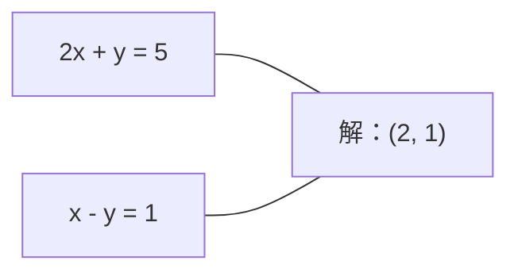
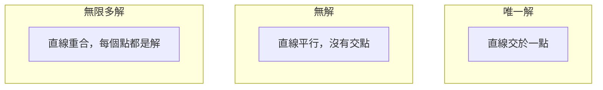

# 線性系統

> 解 Ax = b 是數學中歷史最悠久的問題之一，至今仍支撐著你的神經網路。

**Type:** Build
**Language:** Python
**Prerequisites:** Phase 1, Lessons 01 (Linear Algebra Intuition), 02 (Vectors & Matrices), 03 (Matrix Transformations)
**Time:** ~120 minutes

## Learning Objectives｜學習目標

- 使用含部分選主元與回代的高斯消去法，求解 Ax = b
- 使用 LU、QR 與 Cholesky 分解矩陣，並說明各自適用的情況
- 推導最小平方法的正規方程，並連結至線性迴歸與 Ridge 迴歸
- 使用條件數診斷病態系統，並透過正則化改善其穩定性

## The Problem｜問題

每次訓練線性迴歸時，你都在解線性系統；每次計算最小平方擬合時，也是在解線性系統。神經網路層計算 `y = Wx + b` 時，等於在計算線性系統的一側。加入正則化會修改系統；使用高斯過程時會分解矩陣；計算 Mahalanobis 距離而反矩陣共變異數矩陣時，也是在解線性系統。

方程 Ax = b 無所不在。A 是已知係數矩陣，b 是已知輸出向量，x 則是想求出的未知向量。在線性迴歸中，A 是資料矩陣，b 是目標向量，x 是權重向量。整個模型可歸結為：找出 x，使 Ax 盡可能接近 b。

本課程會從頭建構求解這個方程的主要方法。你將了解為什麼有些方法速度快、有些方法數值穩定；為什麼有些方法只適用於方陣，有些則能處理超定系統；以及矩陣的條件數為何會決定答案是否可信。

## The Concept｜核心概念

### 從幾何角度理解 Ax = b

線性方程組有幾何意義。每個方程都定義一個超平面；解則是所有超平面交會的點（或點集合）。

```text
2x + y = 5          二維空間中的兩條直線。
x - y  = 1          交點為 x=2、y=1。
```



可能出現三種情況：



以矩陣表示時，「唯一解」代表 A 可逆；「無解」代表系統不一致；「無限多解」代表 A 有零空間。多數機器學習問題都沒有精確解，因為方程數（資料點）多於未知數（參數）。這時就要使用最小平方法。

### 以欄觀點與列觀點理解

閱讀 Ax = b 有兩種方式。

**列觀點。** A 的每一列定義一個方程，而每個方程都是超平面。解就是所有超平面的交點。

**欄觀點。** A 的每一欄都是向量。問題變成：A 的各欄要做什麼線性組合，才能得到 b？

```text
A = | 2  1 |    b = | 5 |
    | 1 -1 |        | 1 |

列觀點：同時求解 2x + y = 5 與 x - y = 1。

欄觀點：找出 x1、x2，使得：
  x1 * [2, 1] + x2 * [1, -1] = [5, 1]
  2 * [2, 1] + 1 * [1, -1] = [4+1, 2-1] = [5, 1]   驗算。
```

欄觀點更基本。如果 b 落在 A 的欄空間內，系統就有解；若不在其中，就找欄空間中距離 b 最近的點。這個最近點就是最小平方法的解。

### 高斯消去法

高斯消去法會將 Ax = b 化為上三角系統 Ux = c，再以回代求解。這是最直接的方法。

演算法：

```text
1. 對每一欄 k（主元欄）：
   a. 在第 k 列以下（含第 k 列）找出第 k 欄的最大元素（部分選主元）。
   b. 將該列與第 k 列交換。
   c. 對第 k 列以下的每一列 i：
      - 計算乘數 m = A[i][k] / A[k][k]
      - 將第 k 列乘以 m，再從第 i 列減去。
2. 回代：從最後一個方程開始往上求解。
```

範例：

```text
原始矩陣：
| 2  1  1 | 8 |       R2 = R2 - (2)R1     | 2  1   1 |  8 |
| 4  3  3 |20 |  -->  R3 = R3 - (1)R1 --> | 0  1   1 |  4 |
| 2  3  1 |12 |                            | 0  2   0 |  4 |

                       R3 = R3 - (2)R2     | 2  1   1 |  8 |
                                       --> | 0  1   1 |  4 |
                                           | 0  0  -2 | -4 |

回代：
  -2 * x3 = -4    -->  x3 = 2
  x2 + 2  = 4     -->  x2 = 2
  2*x1 + 2 + 2 = 8 --> x1 = 2
```

高斯消去法的運算量為 O(n^3)。對 1000x1000 系統而言，約需十億次浮點運算。這個方法很快；若要用同一個 A 求解多個系統，還能做得更有效率。

### 為什麼部分選主元很重要

若不選主元，高斯消去法可能失敗或產生無意義的結果。主元為零時會除以零；主元很小時則會放大捨入誤差。

```text
錯誤的主元：                    使用部分選主元：
| 0.001  1 | 1.001 |            先交換列：
| 1      1 | 2     |            | 1      1 | 2     |
                                 | 0.001  1 | 1.001 |
m = 1/0.001 = 1000              m = 0.001/1 = 0.001
R2 = R2 - 1000*R1               R2 = R2 - 0.001*R1
| 0.001  1     | 1.001   |      | 1      1     | 2     |
| 0     -999   | -999.0  |      | 0      0.999 | 0.999 |

x2 = 1.000（正確）              x2 = 1.000（正確）
x1 = (1.001 - 1)/0.001          x1 = (2 - 1)/1 = 1.000（正確）
   = 0.001/0.001 = 1.000        穩定，因為乘數很小。
```

在精度有限的浮點運算中，未選主元的版本可能遺失有效位數。部分選主元會挑選目前可用的最大主元，以降低誤差放大。

### LU 分解

LU 分解會將 A 分解為下三角矩陣 L 與上三角矩陣 U：A = LU。L 矩陣會儲存高斯消去法的乘數；U 矩陣則是消去後的結果。

```text
A = L @ U

| 2  1  1 |   | 1  0  0 |   | 2  1   1 |
| 4  3  3 | = | 2  1  0 | @ | 0  1   1 |
| 2  3  1 |   | 1  2  1 |   | 0  0  -2 |
```

為什麼要分解，而不是直接消去？因為有了 L 與 U 之後，對任意新 b 求解 Ax = b 的成本只需 O(n^2)：

```text
Ax = b
LUx = b
令 y = Ux：
  Ly = b    （前代，O(n^2)）
  Ux = y    （回代，O(n^2)）
```

O(n^3) 的成本只需在分解時付出一次。之後每次求解只需 O(n^2)。如果你要用相同的 A 搭配不同 b 向量求解 1000 個系統，LU 能將總運算量降低約 1000/3 倍。

使用部分選主元時，會得到 PA = LU，其中 P 是記錄列交換的置換矩陣。

### QR 分解

QR 分解會將 A 分解為正交矩陣 Q 與上三角矩陣 R：A = QR。

正交矩陣滿足 Q^T Q = I，其欄向量彼此正交且長度為 1。乘上 Q 會保留長度與角度。

```text
A = Q @ R

Q 的欄向量正交且長度為 1：Q^T Q = I
R 是上三角矩陣

求解 Ax = b：
  QRx = b
  Rx = Q^T b    （只要乘上 Q^T，不需要反矩陣）
  以回代求出 x。
```

使用 QR 求解最小平方問題時，數值穩定性比 LU 更好。Gram-Schmidt 過程會逐欄建立 Q：

```text
給定 A 的欄向量 a1、a2、...：

q1 = a1 / ||a1||

q2 = a2 - (a2 . q1) * q1        （減去投影到 q1 的分量）
q2 = q2 / ||q2||                （正規化）

q3 = a3 - (a3 . q1) * q1 - (a3 . q2) * q2
q3 = q3 / ||q3||

R[i][j] = qi . aj    對 i <= j
```

每一步都會移除沿著先前 q 向量的分量，只留下新的正交方向。

### Cholesky 分解

若 A 是對稱矩陣（A = A^T）且正定（所有特徵值皆為正），就能分解為 A = L L^T，其中 L 是下三角矩陣。這就是 Cholesky 分解。

```text
A = L @ L^T

| 4  2 |   | 2  0 |   | 2  1 |
| 2  5 | = | 1  2 | @ | 0  2 |

L[i][i] = sqrt(A[i][i] - sum(L[i][k]^2 for k < i))
L[i][j] = (A[i][j] - sum(L[i][k]*L[j][k] for k < j)) / L[j][j]    對 i > j
```

Cholesky 的速度約為 LU 的兩倍，儲存空間也只需一半。它只適用於對稱正定矩陣，但這類矩陣非常常見：

- 共變異數矩陣為對稱半正定矩陣（加入正則化後可成為正定矩陣）。
- 高斯過程中的核矩陣為對稱正定矩陣。
- 凸函數在極小值處的 Hessian 矩陣為對稱正定矩陣。
- A^T A 一定是對稱半正定矩陣。

在高斯過程中，先用 Cholesky 分解核矩陣 K，再求解 K alpha = y 以得到預測平均數。Cholesky 因子也能用來計算邊際概似的對數行列式：log det(K) = 2 * sum(log(diag(L)))。

### 最小平方法：Ax = b 沒有精確解時

若 A 為 m x n 且 m > n（方程數多於未知數），這就是超定系統。此時沒有精確解，因此要最小化平方誤差：

```text
最小化 ||Ax - b||^2

這是殘差平方和：
  sum((A[i,:] @ x - b[i])^2 for i in range(m))
```

使誤差最小的解會滿足正規方程：

```text
A^T A x = A^T b
```

推導：展開 ||Ax - b||^2 = (Ax - b)^T (Ax - b) = x^T A^T A x - 2 x^T A^T b + b^T b。對 x 取梯度並令其為零：2 A^T A x - 2 A^T b = 0。

```text
原始系統（超定：4 個方程、2 個未知數）：
| 1  1 |         | 3 |
| 1  2 | x     = | 5 |       沒有任何 x 能同時滿足全部 4 個方程。
| 1  3 |         | 6 |
| 1  4 |         | 8 |

正規方程：
A^T A = | 4  10 |    A^T b = | 22 |
        | 10 30 |            | 63 |

求解：x = [1.5, 1.7]

這就是線性迴歸。x[0] 是截距，x[1] 是斜率。
```

### 正規方程與線性迴歸

兩者完全相連。線性迴歸中的資料矩陣 X 每列代表一筆樣本，每欄代表一個特徵。目標向量 y 的每個元素對應一筆樣本。權重向量 w 滿足：

```text
X^T X w = X^T y
w = (X^T X)^(-1) X^T y
```

這是線性迴歸的封閉形式解。每次呼叫 `sklearn.linear_model.LinearRegression.fit()` 都會計算這個解（或透過 QR、SVD 計算等價解）。

在矩陣中加入正則化項 lambda * I，就得到 Ridge 迴歸：

```text
(X^T X + lambda * I) w = X^T y
w = (X^T X + lambda * I)^(-1) X^T y
```

正則化會改善矩陣的條件性（讓反矩陣更容易精確計算），並將權重往零縮減以避免過度擬合。當 lambda > 0 時，X^T X + lambda * I 一定是對稱正定矩陣，因此可以用 Cholesky 求解。

### 偽逆矩陣（Moore-Penrose）

偽逆矩陣 A+ 將矩陣反轉推廣到非方陣與奇異矩陣。對任意矩陣 A：

```text
x = A+ b

其中 A+ = V Sigma+ U^T    （透過 SVD 計算）
```

Sigma+ 是將每個非零奇異值取倒數後，再轉置所得。如果 A = U Sigma V^T，則 A+ = V Sigma+ U^T。

```text
A = U Sigma V^T        （SVD）

Sigma = | 5  0 |       Sigma+ = | 1/5  0  0 |
        | 0  2 |                | 0  1/2  0 |
        | 0  0 |

A+ = V Sigma+ U^T
```

偽逆矩陣會提供範數最小的最小平方解。系統有以下情況時：
- 唯一解：A+ b 就是該解。
- 無解：A+ b 會給出最小平方解。
- 無限多解：A+ b 會給出 ||x|| 最小的解。

NumPy 的 `np.linalg.lstsq` 與 `np.linalg.pinv` 內部都使用 SVD。

### 條件數

條件數衡量解對輸入微小變動的敏感程度。矩陣 A 的條件數為：

```text
kappa(A) = ||A|| * ||A^(-1)|| = sigma_max / sigma_min
```

其中 sigma_max 與 sigma_min 分別是最大與最小奇異值。

```text
條件良好（kappa 約為 1）：             條件不良（kappa 約為 10^15）：
b 的微小變化 -->                      b 的微小變化 -->
x 的微小變化                        x 的巨大變化

| 2  0 |   kappa = 2/1 = 2          | 1   1          |   kappa 約為 10^15
| 0  1 |   求解安全                    | 1   1+10^(-15) |   解沒有意義
```

經驗法則：
- kappa < 100：安全，解相當精確。
- kappa 約為 10^k：浮點運算會損失約 k 位精度。
- float64 的 kappa 約為 10^16 時：解已沒有意義，矩陣等效於奇異矩陣。

在機器學習中，特徵接近共線時會造成病態。正則化（加入 lambda * I）能將條件數從 sigma_max / sigma_min 改善為 (sigma_max + lambda) / (sigma_min + lambda)。

### 迭代方法：共軛梯度

對於非常大型的稀疏系統（數百萬個未知數），LU 或 Cholesky 等直接方法成本過高。迭代方法會從一個初始估計開始，經過多次迭代逐步改善近似解。

當 A 是對稱正定矩陣時，共軛梯度法（CG）可求解 Ax = b。在精確算術下，它最多 n 次迭代就能找到精確解；若 A 的特徵值聚集，通常會更快收斂。

```text
演算法概要：
  x0 = 初始猜測值（通常為零）
  r0 = b - A x0           （殘差）
  p0 = r0                 （搜尋方向）

  對 k = 0, 1, 2, ...：
    alpha = (rk . rk) / (pk . A pk)
    x_{k+1} = xk + alpha * pk
    r_{k+1} = rk - alpha * A pk
    beta = (r_{k+1} . r_{k+1}) / (rk . rk)
    p_{k+1} = r_{k+1} + beta * pk
    若 ||r_{k+1}|| < tolerance：停止
```

CG 的用途：
- 大規模最佳化（Newton-CG 方法）
- 求解 PDE 離散化系統
- 核矩陣太大而無法分解的核方法
- 作為其他迭代式求解器的預處理方法

收斂速度取決於條件數。系統的條件性越好，收斂越快；這也是正則化有幫助的另一個原因。

### 方法總覽：何時該用哪一種

| 方法 | 條件 | 成本 | 用途 |
|------|------|------|------|
| 高斯消去法 | A 為可逆方陣 | O(n^3) | 一次性求解方陣系統 |
| LU 分解 | A 為可逆方陣 | O(n^3) 分解 + O(n^2) 求解 | 使用相同 A 多次求解 |
| QR 分解 | 任意 A（m >= n） | O(mn^2) | 最小平方問題，數值穩定 |
| Cholesky | A 為對稱正定矩陣 | O(n^3/3) | 共變異數矩陣、高斯過程、Ridge 迴歸 |
| 正規方程 | 超定系統（m > n） | O(mn^2 + n^3) | 線性迴歸（n 小時） |
| SVD／偽逆矩陣 | 任意 A | O(mn^2) | 秩不足系統、範數最小解 |
| 共軛梯度法 | A 為稀疏對稱正定矩陣 | O(n * k * nnz) | 大型稀疏系統，k 為迭代次數 |

### 與機器學習的關聯

本課程介紹的每種方法都會出現在正式環境的機器學習中：

**線性迴歸。** 封閉形式解會求解正規方程 X^T X w = X^T y。可使用 Cholesky（n 小時）、QR（重視數值穩定性時）或 SVD（矩陣可能秩不足時）。

**Ridge 迴歸。** 在 X^T X 加上 lambda * I。由於 lambda > 0 時，X^T X + lambda * I 為對稱正定矩陣，因此正則化系統 (X^T X + lambda * I) w = X^T y 一定能以 Cholesky 求解。

**高斯過程。** 預測平均數需要求解 K alpha = y，其中 K 是核矩陣。標準做法是對 K 進行 Cholesky 分解。對數邊際概似會用到 log det(K) = 2 sum(log(diag(L)))。

**神經網路初始化。** 正交初始化會使用 QR 分解建立欄向量彼此正交且長度為 1 的權重矩陣，避免深層網路中的訊號衰減。

**預處理。** 大規模最佳化器會使用不完全 Cholesky 或不完全 LU，作為共軛梯度求解器的預處理器。

**特徵工程。** X^T X 的條件數可以指出特徵是否共線。若 kappa 很大，應移除部分特徵或加入正則化。

```figure
linear-system-conditioning
```

## Build It

### 步驟 1：使用部分選主元的高斯消去法

```python
import numpy as np

def gaussian_elimination(A, b):
    n = len(b)
    Ab = np.hstack([A.astype(float), b.reshape(-1, 1).astype(float)])

    for k in range(n):
        max_row = k + np.argmax(np.abs(Ab[k:, k]))
        Ab[[k, max_row]] = Ab[[max_row, k]]

        if abs(Ab[k, k]) < 1e-12:
            raise ValueError(f"Matrix is singular or nearly singular at pivot {k}")

        for i in range(k + 1, n):
            m = Ab[i, k] / Ab[k, k]
            Ab[i, k:] -= m * Ab[k, k:]

    x = np.zeros(n)
    for i in range(n - 1, -1, -1):
        x[i] = (Ab[i, -1] - Ab[i, i+1:n] @ x[i+1:n]) / Ab[i, i]

    return x
```

### 步驟 2：LU 分解

```python
def lu_decompose(A):
    n = A.shape[0]
    L = np.eye(n)
    U = A.astype(float).copy()
    P = np.eye(n)

    for k in range(n):
        max_row = k + np.argmax(np.abs(U[k:, k]))
        if max_row != k:
            U[[k, max_row]] = U[[max_row, k]]
            P[[k, max_row]] = P[[max_row, k]]
            if k > 0:
                L[[k, max_row], :k] = L[[max_row, k], :k]

        for i in range(k + 1, n):
            L[i, k] = U[i, k] / U[k, k]
            U[i, k:] -= L[i, k] * U[k, k:]

    return P, L, U

def lu_solve(P, L, U, b):
    n = len(b)
    Pb = P @ b.astype(float)

    y = np.zeros(n)
    for i in range(n):
        y[i] = Pb[i] - L[i, :i] @ y[:i]

    x = np.zeros(n)
    for i in range(n - 1, -1, -1):
        x[i] = (y[i] - U[i, i+1:] @ x[i+1:]) / U[i, i]

    return x
```

### 步驟 3：Cholesky 分解

```python
def cholesky(A):
    n = A.shape[0]
    L = np.zeros_like(A, dtype=float)

    for i in range(n):
        for j in range(i + 1):
            s = A[i, j] - L[i, :j] @ L[j, :j]
            if i == j:
                if s <= 0:
                    raise ValueError("Matrix is not positive definite")
                L[i, j] = np.sqrt(s)
            else:
                L[i, j] = s / L[j, j]

    return L
```

### 步驟 4：使用正規方程求解最小平方問題

```python
def least_squares_normal(A, b):
    AtA = A.T @ A
    Atb = A.T @ b
    return gaussian_elimination(AtA, Atb)

def ridge_regression(A, b, lam):
    n = A.shape[1]
    AtA = A.T @ A + lam * np.eye(n)
    Atb = A.T @ b
    L = cholesky(AtA)
    y = np.zeros(n)
    for i in range(n):
        y[i] = (Atb[i] - L[i, :i] @ y[:i]) / L[i, i]
    x = np.zeros(n)
    for i in range(n - 1, -1, -1):
        x[i] = (y[i] - L.T[i, i+1:] @ x[i+1:]) / L.T[i, i]
    return x
```

### 步驟 5：條件數

```python
def condition_number(A):
    U, S, Vt = np.linalg.svd(A)
    return S[0] / S[-1]
```

## Use It

將各個部分組合起來，在實際資料上執行線性迴歸與 Ridge 迴歸：

```python
np.random.seed(42)
X_raw = np.random.randn(100, 3)
w_true = np.array([2.0, -1.0, 0.5])
y = X_raw @ w_true + np.random.randn(100) * 0.1

X = np.column_stack([np.ones(100), X_raw])

w_ols = least_squares_normal(X, y)
print(f"OLS weights (ours):    {w_ols}")

w_np = np.linalg.lstsq(X, y, rcond=None)[0]
print(f"OLS weights (numpy):   {w_np}")
print(f"Max difference: {np.max(np.abs(w_ols - w_np)):.2e}")

w_ridge = ridge_regression(X, y, lam=1.0)
print(f"Ridge weights (ours):  {w_ridge}")

from sklearn.linear_model import Ridge
ridge_sk = Ridge(alpha=1.0, fit_intercept=False)
ridge_sk.fit(X, y)
print(f"Ridge weights (sklearn): {ridge_sk.coef_}")
```

## Ship It

本課程會產出：
- `code/linear_systems.py`：從頭實作高斯消去法、LU 分解、Cholesky 分解、最小平方法與 Ridge 迴歸
- 一個可執行示範，確認正規方程與 sklearn 的 LinearRegression 會得到相同權重

## Exercises｜練習

1. 使用自己的高斯消去法、LU 求解器與 `np.linalg.solve` 求解系統 `[[1,2,3],[4,5,6],[7,8,10]] x = [6, 15, 27]`。確認三者答案在浮點容許誤差內相同。

2. 產生 50x5 隨機矩陣 X，以及目標 y = X @ w_true + noise。分別使用正規方程、QR（透過 `np.linalg.qr`）、SVD（透過 `np.linalg.svd`）與 `np.linalg.lstsq` 求解 w，並比較四種結果。計算 X^T X 的條件數，說明它如何影響你對各種方法的信任程度。

3. 讓兩欄幾乎相同，以建立近似奇異矩陣（例如 column 2 = column 1 + 1e-10 * noise），然後計算其條件數。使用與未使用正則化（加入 0.01 * I）分別求解 Ax = b，比較解與殘差，並說明正則化為何有幫助。

4. 為 100x100 隨機對稱正定矩陣實作共軛梯度演算法。計算收斂至 1e-8 容許誤差所需的迭代次數，並與理論最大值 n 次比較。

5. 測量 Cholesky 求解器、LU 求解器與 `np.linalg.solve` 在大小為 10、50、200、500 的對稱正定矩陣上的執行時間，並繪圖比較。確認 Cholesky 速度約為 LU 的兩倍。

## Key Terms｜關鍵術語

| 術語 | 常見說法 | 實際意義 |
|------|----------|----------|
| Linear system（線性系統） |「求出 x」| 一組線性方程 Ax = b。求 x 就是找出經轉換 A 後能產生輸出 b 的輸入。 |
| Gaussian elimination（高斯消去法） |「列簡化」| 透過列運算，逐步消除對角線下方的元素，形成可用回代求解的上三角系統。成本為 O(n^3)。 |
| Partial pivoting（部分選主元） |「交換列以求穩定」| 消去第 k 欄前，將該欄絕對值最大的列交換到主元位置，避免除以過小的數。 |
| LU decomposition（LU 分解） |「分解成三角矩陣」| 將 A 寫成 A = LU，其中 L 是儲存乘數的下三角矩陣，U 是消去後的上三角矩陣；可將 O(n^3) 成本分攤到多次求解。 |
| QR decomposition（QR 分解） |「正交分解」| 將 A 寫成 A = QR，其中 Q 的欄向量正交且長度為 1，R 為上三角矩陣。求解最小平方問題時比 LU 穩定。 |
| Cholesky decomposition（Cholesky 分解） |「矩陣的平方根」| 對稱正定矩陣 A 可寫成 A = LL^T，成本是 LU 的一半。適用於共變異數矩陣、核矩陣與 Ridge 迴歸。 |
| Least squares（最小平方法） |「無法精確求解時的最佳擬合」| 系統超定（方程數多於未知數）時，最小化平方殘差總和 ||Ax - b||^2。 |
| Normal equations（正規方程） |「微積分捷徑」| A^T A x = A^T b。將 ||Ax - b||^2 的梯度設為零後得到；這就是線性迴歸的封閉形式解。 |
| Pseudoinverse（偽逆矩陣） |「非方陣的反矩陣」| 透過 SVD 得到 A+ = V Sigma+ U^T，可為任意矩陣（方陣或長方形、奇異或非奇異）提供範數最小的最小平方解。 |
| Condition number（條件數） |「答案有多可信」| kappa = sigma_max / sigma_min，衡量解對輸入擾動的敏感度；大約會損失 log10(kappa) 位精度。 |
| Ridge regression（Ridge 迴歸） |「帶正則化的最小平方」| 求解 (X^T X + lambda I) w = X^T y。加入 lambda I 可改善條件性並將權重往零縮減，避免過度擬合。 |
| Conjugate gradient（共軛梯度法） |「大型矩陣的迭代式 Ax=b」| 用於對稱正定系統的迭代求解器，最多 n 步收斂。適合分解成本過高的大型稀疏系統。 |
| Overdetermined system（超定系統） |「資料比參數多」| m x n 系統中 m > n，沒有精確解。最小平方法會找最佳近似解；每個迴歸問題都是如此。 |
| Back substitution（回代） |「從底部往上求解」| 對上三角系統先解最後一個方程，再往上代入，成本為 O(n^2)。 |
| Forward substitution（前代） |「從頂部往下求解」| 對下三角系統先解第一個方程，再往下代入，成本為 O(n^2)。用於 LU 求解中的 L 步驟。 |

## Further Reading｜延伸閱讀

- [MIT 18.06: Linear Algebra](https://ocw.mit.edu/courses/18-06-linear-algebra-spring-2010/)（Gilbert Strang）-- 線性系統與矩陣分解的權威課程
- [Numerical Linear Algebra](https://people.maths.ox.ac.uk/trefethen/text.html)（Trefethen 與 Bau）-- 理解數值穩定性、條件性與演算法失效原因的標準參考書
- [Matrix Computations](https://www.press.jhu.edu/books/title/10678/matrix-computations)（Golub 與 Van Loan）-- 涵蓋各種矩陣演算法的百科全書式參考書
- [3Blue1Brown: Inverse Matrices](https://www.3blue1brown.com/lessons/inverse-matrices) -- 以視覺方式理解 Ax = b 的幾何意義
