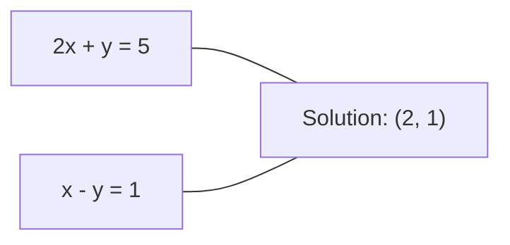
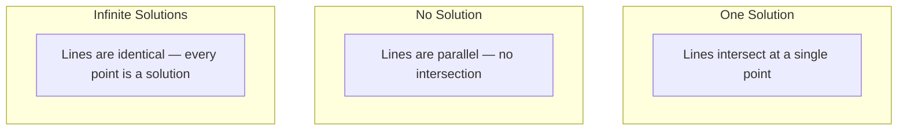

# 線性方程組

> 解 Ax = b 是數學中最古老的問題，至今仍支撐著你的神經網路運作。

**Type:** Build
**Language:** Python
**Prerequisites:** Phase 1, Lessons 01 (Linear Algebra Intuition), 02 (Vectors & Matrices), 03 (Matrix Transformations)
**Time:** ~120 minutes

## Learning Objectives｜學習目標

- 使用帶部分選主元（partial pivoting）的高斯消去法（Gaussian elimination）和回代（back substitution）求解 Ax = b
- 使用 LU 分解（LU decomposition）、QR 分解（QR decomposition）和 Cholesky 分解（Cholesky decomposition）對矩陣做分解，並說明各自何時適用
- 推導最小平方法（least squares）的正規方程組（normal equations），並連結線性迴歸（linear regression）與嶺迴歸（ridge regression）
- 使用條件數（condition number）診斷條件不良（ill-conditioned）的系統，並套用正則化（regularization）使系統穩定

## The Problem｜問題

每次訓練線性迴歸模型，都得解一組線性方程組（linear system）。每次做最小平方法擬合，也是在解線性方程組。神經網路層每次計算 `y = Wx + b`，也就是在計算線性方程組的一側。加入正則化會改變系統。使用高斯過程（Gaussian process）時，你會分解矩陣。為了計算馬氏距離（Mahalanobis distance）而對共變異數矩陣（covariance matrix）求逆時，你也在解線性方程組。

方程式 Ax = b 無所不在。A 是已知係數的矩陣，b 是已知輸出的向量，x 是你想求出的未知數向量。在線性迴歸中，A 是資料矩陣，b 是目標向量，x 是權重向量。整個模型可以簡化為：找出 x，使 Ax 盡可能接近 b。

本課會從零實作求解這個方程式的各種主要方法。你會了解為什麼有些方法速度快、有些方法穩定；為什麼有些方法只適用於方陣、有些方法則能處理超定系統（overdetermined system）；以及為什麼矩陣的條件數會決定解是否有意義。

## The Concept｜核心概念

### Ax = b 的幾何意義

線性方程組有幾何上的解讀方式。每個方程式都定義一個超平面（hyperplane）。解就是所有超平面相交的位置，也可能是一組點。

```
2x + y = 5          Two lines in 2D.
x - y  = 1          They intersect at x=2, y=1.
```



可能出現三種情況：



以矩陣表示時，「唯一解」表示 A 可逆（invertible）；「無解」表示方程組不相容（inconsistent system）；「無限多解」表示 A 有零空間（null space）。多數 ML 問題都落在「沒有精確解」這一類，因為方程式（資料點）的數量比未知數（參數）多。這正是最小平方法派上用場的地方。

### 欄觀點與列觀點

讀取 Ax = b 有兩種方式。

**列觀點（row picture）。** A 的每一列定義一個方程式。每個方程式都是一個超平面。解是它們的交點。

**欄觀點（column picture）。** A 的每一欄都是一個向量。問題變成：A 的各欄要取哪些線性組合（linear combination），才能得到 b？

```
A = | 2  1 |    b = | 5 |
    | 1 -1 |        | 1 |

Row picture: solve 2x + y = 5 and x - y = 1 simultaneously.

Column picture: find x1, x2 such that:
  x1 * [2, 1] + x2 * [1, -1] = [5, 1]
  2 * [2, 1] + 1 * [1, -1] = [4+1, 2-1] = [5, 1]   check.
```

欄觀點更根本。如果 b 落在 A 的欄空間（column space）中，系統就有解。如果 b 不在其中，就找出欄空間中距離 b 最近的點。這個最近點就是最小平方法解。

### 高斯消去法

高斯消去法會將 Ax = b 變換成上三角方程組（upper triangular system）Ux = c，再透過回代求解。這是最直接的方法。

演算法如下：

```
1. For each column k (the pivot column):
   a. Find the largest entry in column k at or below row k (partial pivoting).
   b. Swap that row with row k.
   c. For each row i below k:
      - Compute multiplier m = A[i][k] / A[k][k]
      - Subtract m times row k from row i.
2. Back substitute: solve from the last equation upward.
```

範例：

```
Original:
| 2  1  1 | 8 |       R2 = R2 - (2)R1     | 2  1   1 |  8 |
| 4  3  3 |20 |  -->  R3 = R3 - (1)R1 --> | 0  1   1 |  4 |
| 2  3  1 |12 |                            | 0  2   0 |  4 |

                       R3 = R3 - (2)R2     | 2  1   1 |  8 |
                                       --> | 0  1   1 |  4 |
                                           | 0  0  -2 | -4 |

Back substitute:
  -2 * x3 = -4    -->  x3 = 2
  x2 + 2  = 4     -->  x2 = 2
  2*x1 + 2 + 2 = 8 --> x1 = 2
```

高斯消去法的運算量為 O(n^3)。對 1000x1000 的系統而言，約需十億次浮點運算。如果只需要解一次，速度很快；如果要用相同的 A 解多個系統，還有更有效率的方法。

### 為什麼部分選主元很重要

若不做主元選取，高斯消去法可能會失敗或產生錯誤結果。若主元（pivot）為零，就會除以零；若主元很小，就會放大捨入誤差（rounding error）。

```
Bad pivot:                       With partial pivoting:
| 0.001  1 | 1.001 |            Swap rows first:
| 1      1 | 2     |            | 1      1 | 2     |
                                 | 0.001  1 | 1.001 |
m = 1/0.001 = 1000              m = 0.001/1 = 0.001
R2 = R2 - 1000*R1               R2 = R2 - 0.001*R1
| 0.001  1     | 1.001   |      | 1      1     | 2     |
| 0     -999   | -999.0  |      | 0      0.999 | 0.999 |

x2 = 1.000 (correct)            x2 = 1.000 (correct)
x1 = (1.001 - 1)/0.001          x1 = (2 - 1)/1 = 1.000 (correct)
   = 0.001/0.001 = 1.000        Stable because the multiplier is small.
```

在精度有限的浮點運算（floating-point arithmetic）中，不做主元選取的版本可能會損失許多有效位數。部分選主元（partial pivoting）會選擇目前可用的最大主元，以盡量減少誤差放大。

### LU 分解

LU 分解會將 A 分解成下三角矩陣（lower triangular matrix）L 和上三角矩陣（upper triangular matrix）U：A = LU。L 矩陣會儲存高斯消去法中的乘數；U 矩陣則是消去後的結果。

```
A = L @ U

| 2  1  1 |   | 1  0  0 |   | 2  1   1 |
| 4  3  3 | = | 2  1  0 | @ | 0  1   1 |
| 2  3  1 |   | 1  2  1 |   | 0  0  -2 |
```

為什麼要先做分解，而不是每次都直接消去？因為取得 L 和 U 後，對任何新的 b 解 Ax = b 只需 O(n^2) 的運算量：

```
Ax = b
LUx = b
Let y = Ux:
  Ly = b    (forward substitution, O(n^2))
  Ux = y    (back substitution, O(n^2))
```

O(n^3) 的成本只在分解時支付一次。之後每次求解都只需 O(n^2)。如果要用相同的 A、不同的 b 解 1000 個系統，LU 分解後的總運算量約可縮減為重複做高斯消去法的 3/1000。

搭配部分選主元時，會得到 PA = LU，其中 P 是記錄列交換的置換矩陣（permutation matrix）。

### QR 分解

QR 分解會將 A 分解成正交矩陣（orthogonal matrix）Q 和上三角矩陣 R：A = QR。

正交矩陣滿足 Q^T Q = I。它的欄是標準正交（orthonormal）向量。乘上 Q 會保留長度和角度。

```
A = Q @ R

Q has orthonormal columns: Q^T Q = I
R is upper triangular

To solve Ax = b:
  QRx = b
  Rx = Q^T b    (just multiply by Q^T, no inversion needed)
  Back substitute to get x.
```

解最小平方法問題時，QR 在數值上比 LU 更穩定。Gram-Schmidt 正交化過程（Gram-Schmidt process）會逐欄建立 Q：

```
Given columns a1, a2, ... of A:

q1 = a1 / ||a1||

q2 = a2 - (a2 . q1) * q1        (subtract projection onto q1)
q2 = q2 / ||q2||                (normalize)

q3 = a3 - (a3 . q1) * q1 - (a3 . q2) * q2
q3 = q3 / ||q3||

R[i][j] = qi . aj    for i <= j
```

每一步都會移除沿著先前 q 向量的分量，只留下新的正交方向。

### Cholesky 分解

當 A 是對稱正定矩陣（symmetric positive definite；A = A^T 且所有特徵值（eigenvalues）均為正）時，可以將它分解成 A = L L^T，其中 L 是下三角矩陣。這就是 Cholesky 分解。

```
A = L @ L^T

| 4  2 |   | 2  0 |   | 2  1 |
| 2  5 | = | 1  2 | @ | 0  2 |

L[i][i] = sqrt(A[i][i] - sum(L[i][k]^2 for k < i))
L[i][j] = (A[i][j] - sum(L[i][k]*L[j][k] for k < j)) / L[j][j]    for i > j
```

Cholesky 的速度是 LU 的兩倍，所需儲存空間只有一半。它只適用於對稱正定矩陣，但這類矩陣經常出現：

- 共變異數矩陣是對稱半正定矩陣（symmetric positive semi-definite）；加入正則化後會變成正定矩陣。
- 高斯過程中的核矩陣（kernel matrix）是對稱正定矩陣。
- 凸函數（convex function）在極小值處的海森矩陣（Hessian）是對稱正定矩陣。
- A^T A 永遠是對稱半正定矩陣。

在高斯過程中，你會用 Cholesky 分解核矩陣 K，再解 K alpha = y，以求得預測平均值。Cholesky 因子（Cholesky factor）也能用來計算對數行列式（log determinant），進而求得邊際概似（marginal likelihood）：log det(K) = 2 * sum(log(diag(L)))。

### 最小平方法：Ax = b 沒有精確解時

若 A 是 m x n 矩陣且 m > n（方程式數量比未知數多），這個系統就是超定系統。它沒有精確解。此時要最小化平方誤差：

```
minimize ||Ax - b||^2

This is the sum of squared residuals:
  sum((A[i,:] @ x - b[i])^2 for i in range(m))
```

使誤差最小的解會滿足正規方程組（normal equations）：

```
A^T A x = A^T b
```

推導方式如下：展開 ||Ax - b||^2 = (Ax - b)^T (Ax - b) = x^T A^T A x - 2 x^T A^T b + b^T b。對 x 取梯度並令其等於零：2 A^T A x - 2 A^T b = 0。

```
Original system (overdetermined, 4 equations, 2 unknowns):
| 1  1 |         | 3 |
| 1  2 | x     = | 5 |       No exact x satisfies all 4 equations.
| 1  3 |         | 6 |
| 1  4 |         | 8 |

Normal equations:
A^T A = | 4  10 |    A^T b = | 22 |
        | 10 30 |            | 63 |

Solve: x = [1.5, 1.7]

This is linear regression. x[0] is the intercept, x[1] is the slope.
```

### 正規方程組就是線性迴歸

兩者完全相同。線性迴歸中的資料矩陣 X，每列對應一筆樣本，每欄對應一個特徵。目標向量 y 的每個元素對應一筆樣本。權重向量 w 滿足：

```
X^T X w = X^T y
w = (X^T X)^(-1) X^T y
```

這就是線性迴歸的封閉解（closed-form solution）。每次呼叫 `sklearn.linear_model.LinearRegression.fit()`，都會計算這個解，或透過 QR 或奇異值分解（singular value decomposition，SVD）計算等價的解。

在矩陣中加入正則化項 lambda * I，就會得到嶺迴歸：

```
(X^T X + lambda * I) w = X^T y
w = (X^T X + lambda * I)^(-1) X^T y
```

正則化會改善矩陣的條件數，使求逆更準確，並將權重往零縮減，以避免過度擬合（overfitting）。當 lambda > 0 時，矩陣 X^T X + lambda * I 永遠是對稱正定矩陣，因此可以用 Cholesky 分解求解。

### 廣義反矩陣（pseudoinverse；Moore-Penrose）

廣義反矩陣 A+ 將求逆運算推廣到非方陣和奇異矩陣（singular matrix）。對任何矩陣 A：

```
x = A+ b

where A+ = V Sigma+ U^T    (computed via SVD)
```

Sigma+ 是將每個非零奇異值（singular value）取倒數後，再轉置所得的矩陣。如果 A = U Sigma V^T，則 A+ = V Sigma+ U^T。

```
A = U Sigma V^T        (SVD)

Sigma = | 5  0 |       Sigma+ = | 1/5  0  0 |
        | 0  2 |                | 0  1/2  0 |
        | 0  0 |

A+ = V Sigma+ U^T
```

廣義反矩陣會給出最小範數的最小平方法解（minimum-norm least-squares solution）。如果系統有：
- 唯一解：A+ b 就是該解。
- 無解：A+ b 會給出最小平方法解。
- 無限多解：A+ b 會給出 ||x|| 最小的解。

NumPy 的 `np.linalg.lstsq` 和 `np.linalg.pinv` 都會在內部使用 SVD。

### 條件數

條件數會衡量解對輸入微小變化的敏感程度。矩陣 A 的條件數為：

```
kappa(A) = ||A|| * ||A^(-1)|| = sigma_max / sigma_min
```

其中 sigma_max 和 sigma_min 分別是最大和最小奇異值。

```
Well-conditioned (kappa ~ 1):        Ill-conditioned (kappa ~ 10^15):
Small change in b -->                Small change in b -->
small change in x                    huge change in x

| 2  0 |   kappa = 2/1 = 2          | 1   1          |   kappa ~ 10^15
| 0  1 |   safe to solve            | 1   1+10^(-15) |   solution is garbage
```

經驗法則：
- kappa < 100：安全，解很準確。
- kappa ~ 10^k：浮點運算大約會損失 k 位精度。
- kappa ~ 10^16（float64）：解沒有意義，矩陣在實務上等同於奇異矩陣。

在 ML 中，特徵幾乎共線（collinear）時就會出現條件不良。正則化（加入 lambda * I）可將條件數從 sigma_max / sigma_min 改善為 (sigma_max + lambda) / (sigma_min + lambda)。

### 迭代法：共軛梯度法

若要解含有數百萬個未知數的大型稀疏系統（sparse system），LU 或 Cholesky 等直接法的成本太高。迭代法（iterative method）會在多次迭代中逐步改善初始猜測值，以近似求解。

共軛梯度法（conjugate gradient，CG）可在 A 為對稱正定矩陣時求解 Ax = b。在精確算術下，它至多 n 次迭代就能找到精確解；若 A 的特徵值聚集在一起，實務上通常會更快收斂。

```
Algorithm sketch:
  x0 = initial guess (often zero)
  r0 = b - A x0           (residual)
  p0 = r0                 (search direction)

  For k = 0, 1, 2, ...:
    alpha = (rk . rk) / (pk . A pk)
    x_{k+1} = xk + alpha * pk
    r_{k+1} = rk - alpha * A pk
    beta = (r_{k+1} . r_{k+1}) / (rk . rk)
    p_{k+1} = r_{k+1} + beta * pk
    if ||r_{k+1}|| < tolerance: stop
```

CG 用於：
- 大規模最佳化（Newton-CG 方法）
- 求解偏微分方程（PDE）的離散化系統
- 核矩陣大到無法做矩陣分解時的核方法
- 為其他迭代求解器（iterative solver）做預條件化（preconditioning）

收斂速度取決於條件數。條件較好的系統會更快收斂，這也是正則化有幫助的另一個原因。

### 完整概觀：各方法的適用時機

| 方法 | 條件 | 成本 | 用途 |
|---|---|---|---|
| 高斯消去法 | 方陣、A 非奇異（nonsingular） | O(n^3) | 一次性求解方陣系統 |
| LU 分解 | 方陣、A 非奇異 | O(n^3) 分解 + O(n^2) 求解 | 多次求解相同的 A |
| QR 分解 | 任意 A（m >= n） | O(mn^2) | 最小平方法，數值穩定 |
| Cholesky 分解 | 對稱正定 A | O(n^3/3) | 共變異數矩陣、高斯過程、嶺迴歸 |
| 正規方程組 | 超定系統（m > n） | O(mn^2 + n^3) | 線性迴歸（n 小時） |
| SVD／廣義反矩陣 | 任意 A | O(mn^2) | 秩不足（rank-deficient）系統、最小範數解 |
| 共軛梯度法 | 對稱正定、稀疏 A | O(n * k * nnz) | 大型稀疏系統，k = 迭代次數 |

### 與 ML 的關聯

本課介紹的每種方法都會出現在正式環境 ML 系統中：

**線性迴歸。** 封閉解會求解正規方程組 X^T X w = X^T y。n 小時使用 Cholesky；重視數值穩定性（numerical stability）時使用 QR；矩陣可能秩不足時則使用 SVD。

**嶺迴歸。** 在 X^T X 加上 lambda * I。正則化系統 (X^T X + lambda * I) w = X^T y 永遠可以用 Cholesky 求解，因為當 lambda > 0 時，X^T X + lambda * I 是對稱正定矩陣。

**高斯過程。** 預測平均值需要求解 K alpha = y，其中 K 是核矩陣。標準做法是對 K 做 Cholesky 分解。對數邊際概似會用到 log det(K) = 2 sum(log(diag(L)))。

**神經網路初始化。** 正交初始化（orthogonal initialization）會用 QR 分解產生欄向量互相正交的權重矩陣，避免深層網路中的訊號塌縮。

**預條件化。** 大規模最佳化器會使用不完全 Cholesky 或不完全 LU，作為共軛梯度求解器的預條件子（preconditioner）。

**特徵工程（feature engineering）。** X^T X 的條件數會告訴你資料是否有特徵共線性（feature collinearity）。如果 kappa 很大，就刪除特徵或加入正則化。

```figure
linear-system-conditioning
```

## Build It｜動手實作

### 步驟 1：搭配部分選主元的高斯消去法

```python
import numpy as np

def gaussian_elimination(A, b):
    n = len(b)
    Ab = np.hstack([A.astype(float), b.reshape(-1, 1).astype(float)])

    for k in range(n):
        max_row = k + np.argmax(np.abs(Ab[k:, k]))
        Ab[[k, max_row]] = Ab[[max_row, k]]

        if abs(Ab[k, k]) < 1e-12:
            raise ValueError(f"Matrix is singular or nearly singular at pivot {k}")

        for i in range(k + 1, n):
            m = Ab[i, k] / Ab[k, k]
            Ab[i, k:] -= m * Ab[k, k:]

    x = np.zeros(n)
    for i in range(n - 1, -1, -1):
        x[i] = (Ab[i, -1] - Ab[i, i+1:n] @ x[i+1:n]) / Ab[i, i]

    return x
```

### 步驟 2：LU 分解

```python
def lu_decompose(A):
    n = A.shape[0]
    L = np.eye(n)
    U = A.astype(float).copy()
    P = np.eye(n)

    for k in range(n):
        max_row = k + np.argmax(np.abs(U[k:, k]))
        if max_row != k:
            U[[k, max_row]] = U[[max_row, k]]
            P[[k, max_row]] = P[[max_row, k]]
            if k > 0:
                L[[k, max_row], :k] = L[[max_row, k], :k]

        for i in range(k + 1, n):
            L[i, k] = U[i, k] / U[k, k]
            U[i, k:] -= L[i, k] * U[k, k:]

    return P, L, U

def lu_solve(P, L, U, b):
    n = len(b)
    Pb = P @ b.astype(float)

    y = np.zeros(n)
    for i in range(n):
        y[i] = Pb[i] - L[i, :i] @ y[:i]

    x = np.zeros(n)
    for i in range(n - 1, -1, -1):
        x[i] = (y[i] - U[i, i+1:] @ x[i+1:]) / U[i, i]

    return x
```

### 步驟 3：Cholesky 分解

```python
def cholesky(A):
    n = A.shape[0]
    L = np.zeros_like(A, dtype=float)

    for i in range(n):
        for j in range(i + 1):
            s = A[i, j] - L[i, :j] @ L[j, :j]
            if i == j:
                if s <= 0:
                    raise ValueError("Matrix is not positive definite")
                L[i, j] = np.sqrt(s)
            else:
                L[i, j] = s / L[j, j]

    return L
```

### 步驟 4：使用正規方程組求解最小平方法

```python
def least_squares_normal(A, b):
    AtA = A.T @ A
    Atb = A.T @ b
    return gaussian_elimination(AtA, Atb)

def ridge_regression(A, b, lam):
    n = A.shape[1]
    AtA = A.T @ A + lam * np.eye(n)
    Atb = A.T @ b
    L = cholesky(AtA)
    y = np.zeros(n)
    for i in range(n):
        y[i] = (Atb[i] - L[i, :i] @ y[:i]) / L[i, i]
    x = np.zeros(n)
    for i in range(n - 1, -1, -1):
        x[i] = (y[i] - L.T[i, i+1:] @ x[i+1:]) / L.T[i, i]
    return x
```

### 步驟 5：條件數

```python
def condition_number(A):
    U, S, Vt = np.linalg.svd(A)
    return S[0] / S[-1]
```

## Use It｜實際應用

用真實資料串起各個部分，計算線性迴歸與嶺迴歸：

```python
np.random.seed(42)
X_raw = np.random.randn(100, 3)
w_true = np.array([2.0, -1.0, 0.5])
y = X_raw @ w_true + np.random.randn(100) * 0.1

X = np.column_stack([np.ones(100), X_raw])

w_ols = least_squares_normal(X, y)
print(f"OLS weights (ours):    {w_ols}")

w_np = np.linalg.lstsq(X, y, rcond=None)[0]
print(f"OLS weights (numpy):   {w_np}")
print(f"Max difference: {np.max(np.abs(w_ols - w_np)):.2e}")

w_ridge = ridge_regression(X, y, lam=1.0)
print(f"Ridge weights (ours):  {w_ridge}")

from sklearn.linear_model import Ridge
ridge_sk = Ridge(alpha=1.0, fit_intercept=False)
ridge_sk.fit(X, y)
print(f"Ridge weights (sklearn): {ridge_sk.coef_}")
```

## Ship It｜交付成果

本課會產出：
- `code/linear_systems.py`，包含從零實作的高斯消去法、LU 分解、Cholesky 分解、最小平方法和嶺迴歸
- 一個可執行的示範，證明正規方程組和 sklearn 的 LinearRegression 會得到相同權重

## Exercises｜練習

1. 使用你的高斯消去法、LU 求解器和 `np.linalg.solve`，求解系統 `[[1,2,3],[4,5,6],[7,8,10]] x = [6, 15, 27]`。確認三種方法在浮點容許誤差內得到相同答案。

2. 產生一個 50x5 的隨機矩陣 X，以及目標 y = X @ w_true + noise。使用正規方程組、QR（透過 `np.linalg.qr`）、SVD（透過 `np.linalg.svd`）和 `np.linalg.lstsq` 求解 w。比較四種解，計算 X^T X 的條件數，並說明這個條件數如何影響你對各方法的信任程度。

3. 建立一個近乎奇異的矩陣，方法是讓兩欄幾乎相同（例如，column 2 = column 1 + 1e-10 * noise）。計算它的條件數。在有正則化（加入 0.01 * I）和沒有正則化的情況下分別求解 Ax = b。比較兩種解和殘差，並說明正則化為什麼有幫助。

4. 對一個 100x100 的隨機對稱正定矩陣實作共軛梯度法。計算它在容許誤差 1e-8 下收斂所需的迭代次數，並和理論上最多 n 次迭代比較。

5. 對大小為 10、50、200、500 的對稱正定矩陣，測量你的 Cholesky 求解器、LU 求解器和 `np.linalg.solve` 的執行時間，並繪製結果。確認 Cholesky 的速度大約是 LU 的兩倍。

## Key Terms｜關鍵術語

| 術語 | 常見說法 | 實際意義 |
|---|---|---|
| 線性方程組（linear system） |「求解 x」| 一組線性方程式 Ax = b。求解 x 就是找出經過變換 A 後會產生輸出 b 的輸入。 |
| 高斯消去法（Gaussian elimination） |「列簡化」| 透過列運算，逐步將對角線下方的元素消為零，得到可用回代求解的上三角方程組。運算量為 O(n^3)。 |
| 部分選主元（partial pivoting） |「交換列以提高穩定性」| 在第 k 欄消去前，將該欄絕對值最大的列換到主元位置，避免除以過小的數。 |
| LU 分解（LU decomposition） |「分解成兩個三角矩陣」| 將 A 寫成 A = LU，其中 L 是儲存乘數的下三角矩陣，U 是消去後的上三角矩陣。將 O(n^3) 成本分攤到多次求解。 |
| QR 分解（QR decomposition） |「正交分解」| 將 A 寫成 A = QR，其中 Q 的欄為標準正交向量，R 為上三角矩陣。用於最小平方法時比 LU 穩定。 |
| Cholesky 分解（Cholesky decomposition） |「矩陣的平方根」| 對稱正定矩陣 A 可寫成 A = LL^T。成本是 LU 的一半，常用於共變異數矩陣、核矩陣和嶺迴歸。 |
| 最小平方法（least squares） |「精確解不存在時找最佳擬合」| 當系統超定（方程式比未知數多）時，最小化平方殘差總和 ||Ax - b||^2。 |
| 正規方程組（normal equations） |「微積分的捷徑」| A^T A x = A^T b。令 ||Ax - b||^2 的梯度為零即可得到。這就是線性迴歸的封閉解。 |
| 廣義反矩陣（pseudoinverse） |「非方陣的反矩陣」| 透過 SVD 得到 A+ = V Sigma+ U^T。對任意方陣或長方矩陣、奇異或非奇異矩陣，都能求得最小範數的最小平方法解。 |
| 條件數（condition number） |「這個解有多可靠？」| kappa = sigma_max / sigma_min。衡量解對輸入擾動的敏感度。大約會損失 log10(kappa) 位精度。 |
| 嶺迴歸（ridge regression） |「正則化最小平方法」| 求解 (X^T X + lambda I) w = X^T y。加入 lambda I 可改善條件數，並將權重往零縮減，以避免過度擬合（overfitting）。 |
| 共軛梯度法（conjugate gradient） |「大型矩陣的迭代式 Ax=b 求解法」| 用於對稱正定系統的迭代求解器，至多 n 步即可收斂。適合分解成本太高的大型稀疏系統。 |
| 超定系統（overdetermined system） |「資料比參數多」| m x n 系統中 m > n，因此沒有精確解。最小平方法會找出最佳近似解。每個迴歸問題都是如此。 |
| 回代（back substitution） |「從底部往上解」| 給定上三角方程組，先解最後一個方程式，再逐步向上代回。運算量為 O(n^2)。 |
| 前向代入（forward substitution） |「從頂部往下解」| 給定下三角方程組，先解第一個方程式，再逐步向下代入。LU 求解中的 L 步驟會用到。運算量為 O(n^2)。 |

## Further Reading｜延伸閱讀

- [MIT 18.06: Linear Algebra](https://ocw.mit.edu/courses/18-06-linear-algebra-spring-2010/) (Gilbert Strang) -- 線性系統與矩陣分解的權威課程
- [Numerical Linear Algebra](https://people.maths.ox.ac.uk/trefethen/text.html) (Trefethen & Bau) -- 數值穩定性、條件數及演算法失效原因的標準參考書
- [Matrix Computations](https://www.press.jhu.edu/books/title/10678/matrix-computations) (Golub & Van Loan) -- 涵蓋各種矩陣演算法的百科全書式參考書
- [3Blue1Brown: Inverse Matrices](https://www.3blue1brown.com/lessons/inverse-matrices) -- 以視覺方式理解求解 Ax = b 的幾何意義
