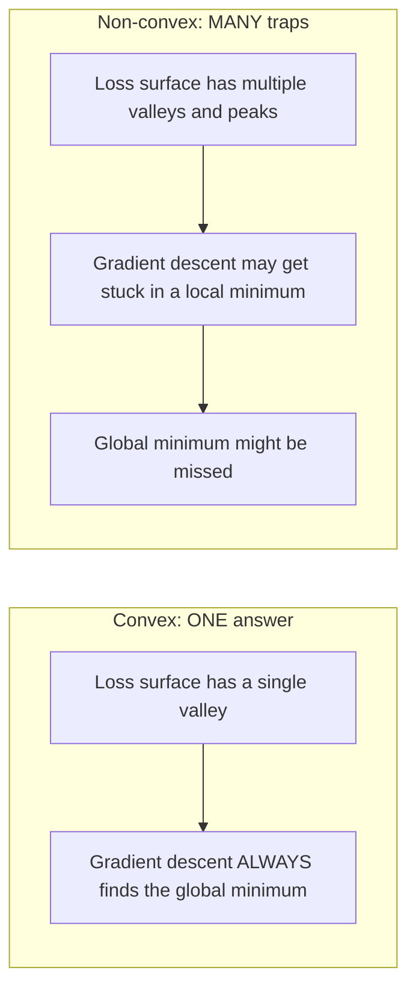
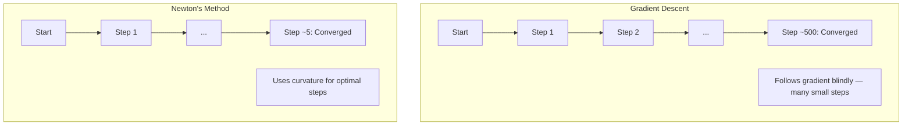
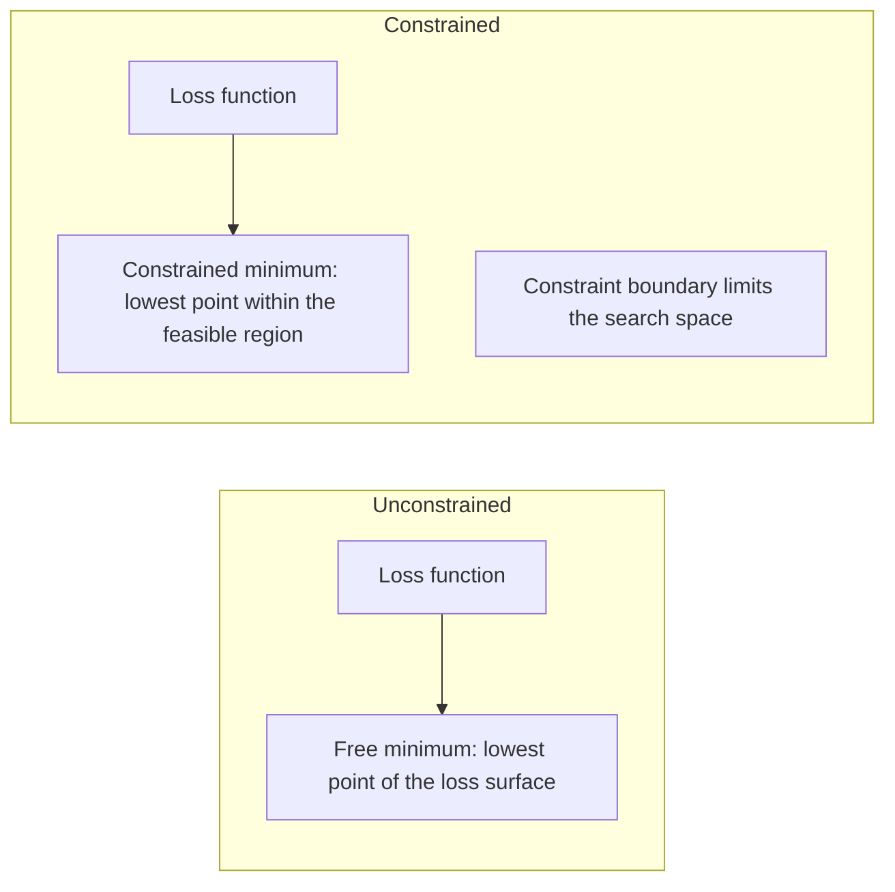
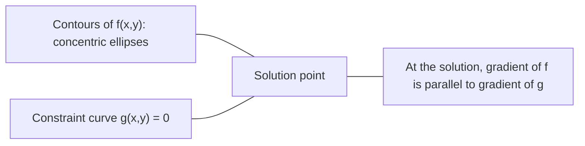

# 凸最佳化

> 凸問題只有一個谷底；神經網路卻有數百萬個。分清兩者很重要。

**Type:** Build
**Language:** Python
**Prerequisites:** Phase 1, Lessons 04 (Calculus for ML), 08 (Optimization)
**Time:** ~90 minutes

## Learning Objectives｜學習目標

- 使用定義、二階導數判別法（second derivative test）和海森矩陣判別法（Hessian test）檢驗函數是否為凸函數（convex function）
- 實作牛頓法（Newton's method），並與梯度下降法（gradient descent）比較其二次收斂（quadratic convergence）
- 使用拉格朗日乘數（Lagrange multiplier）求解受限最佳化（constrained optimization）問題，並解讀 KKT 條件（Karush-Kuhn-Tucker conditions）
- 說明神經網路的損失地景（loss landscape）為何是非凸（non-convex），以及隨機梯度下降法（SGD）仍能找到好解的原因

## The Problem｜問題

第 08 課教過你梯度下降法、動量（momentum）和 Adam。這些最佳化器會沿著任何曲面往下走，但它們不提供任何保證。在非凸地景（non-convex landscape）上使用梯度下降法，可能會掉進不好的局部最小值（local minimum）、卡在鞍點（saddle point），或永遠來回震盪。你還是照用，因為神經網路是非凸的，而且沒有其他選擇。

不過，機器學習中有許多問題是凸的：線性迴歸（linear regression）、邏輯斯迴歸（logistic regression）、支援向量機（support vector machine，SVM）、LASSO、嶺迴歸（ridge regression）。對這些問題，有更有力的方法：具備數學保證的最佳化。一個凸問題只有一個谷底。任何沿著下降方向前進的演算法都會到達全域最小值（global minimum）。不必多次重新啟動，不必安排學習率排程（learning rate schedule），也不用祈禱。

了解凸性（convexity）有三個好處。第一，它能告訴你問題是容易的（凸）還是困難的（非凸）。第二，它讓你能在凸問題上使用牛頓法等更快的工具。第三，它能解釋機器學習中反覆出現的概念：正則化（regularization）其實是限制條件（constraint）、SVM 中的對偶性（duality），以及深度學習為何能在違反凸性所帶來的所有良好性質的情況下仍能運作。

## The Concept｜核心概念

### 凸集合

如果集合 S 中任意兩點之間的線段（line segment）都完全落在 S 內，S 就是凸集合（convex set）。

| 凸集合 | 非凸集合 |
|---|---|
| **矩形**：內部任意兩點都能以一條完全落在矩形內的線段相連 | **星形／新月形**：內部兩點之間的線段可能穿出集合 |
| **三角形**：任意兩個內部點都符合相同性質 | **甜甜圈形／環域**：中間的洞讓某些線段離開集合 |
| 任意兩點之間的線段都落在集合內 | 某些點對之間的線段會離開集合 |

正式判別方式：對 S 中任意兩點 x、y，以及任意 t ∈ [0, 1]，點 tx + (1-t)y 也必須在 S 中。

凸集合的例子：
- 一條線、一個平面，或所有 R^n
- 球（圓、球體、超球體）
- 半空間（halfspace）：{x : a^T x <= b}
- 任意多個凸集合的交集

非凸集合的例子：
- 甜甜圈形（環域）
- 兩個不相交圓的聯集
- 任何帶有「凹痕」或「洞」的集合

### 凸函數

如果函數 f 的定義域是凸集合，而且對定義域中的任意兩點 x、y 及任意 t ∈ [0, 1]，都滿足下列條件，f 就是凸函數：

```
f(tx + (1-t)y) <= t*f(x) + (1-t)*f(y)
```

從幾何上看：函數圖形上任意兩點之間的線段，都會落在圖形上方或與圖形重合。

| 性質 | 凸函數 | 非凸函數 |
|---|---|---|
| **線段判別** | 圖形上任意兩點之間的線段都在曲線**上方或與曲線重合** | 某些點之間的線段會**落到曲線下方** |
| **形狀** | 單一碗狀／谷狀，向上彎曲 | 曲率混雜，具有多個峰與谷 |
| **局部最小值（local minimum）** | 每個局部最小值（local minimum）都是全域最小值 | 可能存在高低不同的多個局部最小值（local minimum） |

常見的凸函數：
- f(x) = x^2（拋物線）
- f(x) = |x|（絕對值函數，absolute value）
- f(x) = e^x（指數函數）
- f(x) = max(0, x)（ReLU，雖然是分段線性函數）
- x > 0 時的 f(x) = -log(x)（負對數）
- 任意線性函數 f(x) = a^T x + b（同時是凸函數和凹函數（concave function））

### 凸性判別

以下有三種實用的判別方式，從最簡單到最嚴格排列。

**判別法 1：二階導數判別法（1D）。** 如果對所有 x 都有 f''(x) >= 0，則 f 為凸函數。

- f(x) = x^2：f''(x) = 2 >= 0，為凸函數。
- f(x) = x^3：f''(x) = 6x，當 x < 0 時為負，因此不是凸函數。
- f(x) = e^x：f''(x) = e^x > 0，為凸函數。

**判別法 2：海森矩陣判別法（多變數）。** 如果對所有 x，海森矩陣（Hessian matrix）H(x) 都是半正定矩陣（positive semidefinite），則 f 為凸函數。海森矩陣是由二階偏導數（second partial derivatives）組成的矩陣。

**判別法 3：定義判別法。** 直接檢查不等式 f(tx + (1-t)y) <= t*f(x) + (1-t)*f(y) 是否成立。適用於難以計算導數的函數。

### 凸性為何重要

凸最佳化（convex optimization）的核心定理：

**對凸函數而言，每個局部最小值（local minimum）都是全域最小值。**

因此梯度下降法不會卡在次佳的局部解。沿著任何下降路徑前進，都會到達相同答案。演算法保證會收斂到最佳解。



帶來的好處：
- 不需要隨機重新啟動
- 不需要複雜的學習率排程（learning rate schedule）
- 可以證明收斂性（收斂速度取決於函數性質）
- 解是唯一的（平坦區域除外）

### 機器學習中的凸與非凸問題

| 問題 | 凸？ | 原因 |
|---------|---------|-----|
| 線性迴歸（均方誤差，mean squared error，MSE） | 是 | 損失對權重而言是二次函數 |
| 邏輯斯迴歸 | 是 | 對數損失（log-loss）對權重而言是凸函數 |
| 支援向量機（合頁損失，hinge loss） | 是 | 線性函數的最大值 |
| LASSO（L1 迴歸，L1 regression） | 是 | 凸函數的總和仍是凸函數 |
| 嶺迴歸（L2） | 是 | 二次函數加二次函數仍為凸函數 |
| 神經網路（任意損失） | 否 | 非線性活化函數（nonlinear activation functions）會形成非凸地景 |
| k-means 分群（k-means clustering） | 否 | 包含離散指派步驟 |
| 矩陣分解（matrix factorization） | 否 | 未知數彼此相乘 |

搭配凸損失的線性模型是凸問題。一旦加入含非線性活化函數的隱藏層（hidden layer），凸性就會消失。

### 海森矩陣

函數 f: R^n -> R 的海森矩陣 H，是由二階偏導數組成的 n x n 矩陣。

```
H[i][j] = d^2 f / (dx_i dx_j)
```

對 f(x, y) = x^2 + 3xy + y^2：

```
df/dx = 2x + 3y       d^2f/dx^2 = 2      d^2f/dxdy = 3
df/dy = 3x + 2y       d^2f/dydx = 3      d^2f/dy^2 = 2

H = [ 2  3 ]
    [ 3  2 ]
```

海森矩陣能反映曲率（curvature）：
- 所有特徵值（eigenvalues）都為正：函數在每個方向都向上彎曲（在該點為凸）
- 所有特徵值都為負：函數向下彎曲（為凹函數，且該點是局部極大值）
- 正負混合：鞍點（saddle point），某些方向向上彎、某些方向向下彎
- 特徵值為零：該方向平坦（退化）

要判定函數是否凸，海森矩陣必須在所有位置都半正定（所有特徵值 >= 0），不能只看單一點。

### 牛頓法

梯度下降法使用一階資訊（梯度）；牛頓法使用二階資訊（海森矩陣）。它會在目前位置建立二次近似（quadratic approximation），並直接跳到該二次近似函數的最小值。

```
Update rule:
  x_new = x - H^(-1) * gradient

Compare to gradient descent:
  x_new = x - lr * gradient
```

牛頓法會用反海森矩陣取代純量學習率。這會依據局部曲率，自動調整步長和方向。



優點：
- 接近最小值時呈二次收斂（quadratic convergence）（每一步的誤差都會平方）
- 不必調整學習率
- 尺度不變（scale-invariant），無論如何參數化問題都能運作

缺點：
- 計算海森矩陣需要 O(n^2) 記憶體，求逆需要 O(n^3) 運算量
- 對有 100 萬個權重的神經網路而言，這代表 10^12 個矩陣元素和 10^18 次運算
- 不適用於深度學習

### 受限最佳化

無約束最佳化（unconstrained optimization）：在所有 x 中最小化 f(x)。
受限最佳化（constrained optimization）：在限制條件下最小化 f(x)。

真實問題都有限制條件。你想降低成本，但預算有限；你想降低誤差，但模型複雜度受到限制。



### 拉格朗日乘數

拉格朗日乘數法會將受限問題轉換成無約束問題。

問題：在等式限制條件（equality constraint）g(x) = 0 下，最小化 f(x)。

解法：引入新的變數 lambda（拉格朗日乘數），建立拉格朗日函數（Lagrangian），求解以下無約束問題：

```
L(x, lambda) = f(x) + lambda * g(x)
```

在解的位置，L 的梯度為零：

```
dL/dx = df/dx + lambda * dg/dx = 0
dL/dlambda = g(x) = 0
```

幾何直覺：在受限最小值處，f 的梯度必須平行於限制條件 g 的梯度。如果兩者不平行，你就可以沿著限制曲面移動，進一步降低 f。



範例：在 x + y = 1 的限制下，最小化 f(x,y) = x^2 + y^2。

```
L = x^2 + y^2 + lambda(x + y - 1)

dL/dx = 2x + lambda = 0  =>  x = -lambda/2
dL/dy = 2y + lambda = 0  =>  y = -lambda/2
dL/dlambda = x + y - 1 = 0

From first two: x = y
Substituting: 2x = 1, so x = y = 0.5, lambda = -1
```

直線 x + y = 1 上距離原點最近的點是 (0.5, 0.5)。

### KKT 條件

KKT 條件會將拉格朗日乘數法推廣到不等式限制條件（inequality constraint）。

問題：在 g_i(x) <= 0（i = 1, ..., m）的限制下，最小化 f(x)。

KKT 條件（最適解的必要條件）：

```
1. Stationarity:    df/dx + sum(lambda_i * dg_i/dx) = 0
2. Primal feasibility:  g_i(x) <= 0  for all i
3. Dual feasibility:    lambda_i >= 0  for all i
4. Complementary slackness:  lambda_i * g_i(x) = 0  for all i
```

互補鬆弛條件（complementary slackness）是關鍵：限制條件要麼處於作用中（active constraint）狀態（g_i = 0，解落在邊界上），要麼乘數為零（該限制條件不起作用）。不影響解的限制條件，其 lambda = 0。

KKT 條件在支援向量機中很重要。支援向量（support vector）是限制條件處於作用中狀態（lambda > 0）的資料點。其他資料點的 lambda = 0，不會影響決策邊界（decision boundary）。

### 將正則化視為受限最佳化

L1 和 L2 正則化並非任意技巧，而是受限最佳化問題的另一種表示方式。

**L2 正則化（L2 regularization，Ridge）：**

```
minimize  Loss(w)  subject to  ||w||^2 <= t

Equivalent unconstrained form:
minimize  Loss(w) + lambda * ||w||^2
```

限制條件 ||w||^2 <= t 定義一個球（在 2D 是圓，在 3D 是球體）。解的位置，就是損失等高線第一次碰到這個球的地方。

**L1 正則化（L1 regularization，LASSO）：**

```
minimize  Loss(w)  subject to  ||w||_1 <= t

Equivalent unconstrained form:
minimize  Loss(w) + lambda * ||w||_1
```

限制條件 ||w||_1 <= t 定義一個菱形（2D 中旋轉的正方形）。

| 性質 | L2 限制（圓形） | L1 限制（菱形） |
|---|---|---|
| **限制區域形狀** | 圓形（高維時為球體） | 菱形（2D 中旋轉的正方形） |
| **損失等高線接觸的位置** | 平滑邊界：圓周上任一點 | 尖角：與某個座標軸對齊 |
| **解的特性** | 權重縮小但不為零 | 部分權重恰好為零（稀疏） |
| **結果** | 權重縮減 | 特徵選擇（feature selection） |

這就解釋了為什麼 L1 會產生稀疏模型（特徵選擇），而 L2 只會縮小權重。菱形的尖角與座標軸對齊。損失等高線更容易碰到尖角，讓一個或多個權重恰好變成零。

### 對偶性

每個受限最佳化問題（原始問題，primal problem）都有一個搭配的對偶問題（dual problem）。對凸問題而言，原始問題和對偶問題的最佳值相同，這就是強對偶性（strong duality）。

拉格朗日對偶函數（dual function）：

```
Primal: minimize f(x) subject to g(x) <= 0
Lagrangian: L(x, lambda) = f(x) + lambda * g(x)
Dual function: d(lambda) = min_x L(x, lambda)
Dual problem: maximize d(lambda) subject to lambda >= 0
```

對偶性的重要之處：
- 對偶問題有時比原始問題更容易求解
- SVM 會以對偶形式求解，問題只與資料點之間的內積（dot product）有關，因此能使用核技巧（kernel trick）
- 對偶問題會提供原始問題最佳值的下界，可用來檢查解的品質

以 SVM 為例：

```
Primal: find w, b that maximize the margin 2/||w|| subject to
        y_i(w^T x_i + b) >= 1 for all i

Dual:   maximize sum(alpha_i) - 0.5 * sum_ij(alpha_i * alpha_j * y_i * y_j * x_i^T x_j)
        subject to alpha_i >= 0 and sum(alpha_i * y_i) = 0

The dual only involves dot products x_i^T x_j.
Replace x_i^T x_j with K(x_i, x_j) to get the kernel trick.
```

### 深度學習為何在非凸情況下仍能運作

神經網路的損失函數極度非凸。依照所有古典判準，最佳化它們應該會失敗；但隨機梯度下降法能可靠地找到好解。以下有幾個原因。

**多數局部最小值（local minimum）已經夠好。** 在高維空間中，梯度為零的隨機臨界點幾乎全是鞍點，而不是局部最小值（local minimum）。少數存在的局部最小值（local minimum），其損失值通常接近全域最小值。在有數百萬維的參數空間中，陷入極差局部最小值（local minimum）的機率非常低。

**真正的障礙是鞍點，而非局部最小值（local minimum）。** 在含有 n 個參數的函數中，鞍點沿著某些方向曲率為正，另一些方向曲率為負。對高維空間中的隨機臨界點（critical point）而言，n 個特徵值全為正（即局部最小值（local minimum））的機率約為 2^(-n)。幾乎所有臨界點都是鞍點。隨機梯度下降法的雜訊有助於逃離鞍點。

**過度參數化（overparameterization）會使地景變平滑。** 參數數量多於訓練樣本的網路，其損失地景更平滑、連通性更高。更寬的網路中，糟糕局部最小值（local minimum）更少。這違反直覺，但有實證支持。

**損失地景的結構：**

| 性質 | 低維空間 | 高維空間 |
|---|---|---|
| **地景** | 許多彼此孤立的峰與谷 | 平滑連通的谷地 |
| **最小值** | 許多孤立的局部最小值（local minimum） | 糟糕的局部最小值（local minimum）少；多數解接近最佳解 |
| **尋找路徑** | 難以找到全域最小值 | 許多路徑都能找到好解 |
| **臨界點** | 局部最小值（local minimum）與鞍點混雜 | 幾乎全是鞍點，而非局部最小值（local minimum） |

**隨機雜訊（stochastic noise）會形成隱式正則化（implicit regularization）。** 小批次隨機梯度下降法會加入雜訊，避免停在尖銳極小值（sharp minimum）。尖銳極小值容易過度擬合（overfitting）；平坦極小值（flat minimum）則有較好的泛化能力（generalization）。雜訊會讓最佳化過程偏向損失地景較平坦的區域。

### 實務上的二階方法

純牛頓法不適用於大型模型。以下幾種近似法能讓二階資訊派上用場。

**有限記憶體 BFGS（Limited-memory BFGS，L-BFGS）：** 使用最近 m 次梯度差分近似反海森矩陣。需要 O(mn) 記憶體，而非 O(n^2)。適用於參數數量最多約 10,000 的問題。常用於傳統 ML（邏輯斯迴歸、條件隨機場（conditional random field，CRF）），但不常用於深度學習。

**自然梯度（natural gradient）：** 使用 Fisher 資訊矩陣（Fisher information matrix；log-likelihood 的期望海森矩陣），而非一般海森矩陣。這會考量機率分布的幾何性質。Kronecker 因子化近似曲率（Kronecker-Factored Approximate Curvature，K-FAC）以 Kronecker 積（Kronecker product）近似 Fisher 矩陣，讓它能實際應用於神經網路。

**免形成海森矩陣的最佳化（Hessian-free optimization）：** 使用共軛梯度法（conjugate gradient）求解 Hx = g，全程不必建立 H。只需要海森矩陣向量積（Hessian-vector product），可透過自動微分（automatic differentiation）在 O(n) 時間內計算。

**對角近似（diagonal approximation）：** Adam 的二階矩（second moment）是海森矩陣對角線的近似。AdaHessian 透過 Hutchinson 估計量（Hutchinson's estimator）使用實際海森矩陣對角元素，進一步擴展這種方法。

| 方法 | 記憶體 | 每步成本 | 適用時機 |
|--------|--------|--------------|-------------|
| 梯度下降法 | O(n) | O(n) | 基準方法、大型模型 |
| 牛頓法 | O(n^2) | O(n^3) | 小型凸問題 |
| L-BFGS | O(mn) | O(mn) | 中型凸問題 |
| Adam | O(n) | O(n) | 深度學習預設方法 |
| K-FAC | O(n) | 每層 O(n) | 研究、大批次訓練 |

```figure
convex-vs-nonconvex
```

## Build It｜動手實作

### 步驟 1：凸性檢查器

建立一個函數，透過抽樣點並檢查凸性定義，實際測試函數是否為凸函數。

```python
import random
import math

def check_convexity(f, dim, bounds=(-5, 5), samples=1000):
    violations = 0
    for _ in range(samples):
        x = [random.uniform(*bounds) for _ in range(dim)]
        y = [random.uniform(*bounds) for _ in range(dim)]
        t = random.uniform(0, 1)
        mid = [t * xi + (1 - t) * yi for xi, yi in zip(x, y)]
        lhs = f(mid)
        rhs = t * f(x) + (1 - t) * f(y)
        if lhs > rhs + 1e-10:
            violations += 1
    return violations == 0, violations
```

### 步驟 2：實作 2D 牛頓法

使用明確的海森矩陣實作牛頓法，並與梯度下降法的收斂速度比較。

```python
def newtons_method(f, grad_f, hessian_f, x0, steps=50, tol=1e-12):
    x = list(x0)
    history = [x[:]]
    for _ in range(steps):
        g = grad_f(x)
        H = hessian_f(x)
        det = H[0][0] * H[1][1] - H[0][1] * H[1][0]
        if abs(det) < 1e-15:
            break
        H_inv = [
            [H[1][1] / det, -H[0][1] / det],
            [-H[1][0] / det, H[0][0] / det],
        ]
        dx = [
            H_inv[0][0] * g[0] + H_inv[0][1] * g[1],
            H_inv[1][0] * g[0] + H_inv[1][1] * g[1],
        ]
        x = [x[0] - dx[0], x[1] - dx[1]]
        history.append(x[:])
        if sum(gi ** 2 for gi in g) < tol:
            break
    return history
```

### 步驟 3：拉格朗日乘數求解器

使用拉格朗日函數上的梯度下降法，求解受限最佳化問題。

```python
def lagrange_solve(f_grad, g_val, g_grad, x0, lr=0.01,
                   lr_lambda=0.01, steps=5000):
    x = list(x0)
    lam = 0.0
    history = []
    for _ in range(steps):
        fg = f_grad(x)
        gv = g_val(x)
        gg = g_grad(x)
        x = [
            xi - lr * (fgi + lam * ggi)
            for xi, fgi, ggi in zip(x, fg, gg)
        ]
        lam = lam + lr_lambda * gv
        history.append((x[:], lam, gv))
    return history
```

### 步驟 4：比較一階方法（first-order method）與二階方法（second-order method）

對相同的二次函數分別執行梯度下降法和牛頓法，計算收斂所需步數。

```python
def quadratic(x):
    return 5 * x[0] ** 2 + x[1] ** 2

def quadratic_grad(x):
    return [10 * x[0], 2 * x[1]]

def quadratic_hessian(x):
    return [[10, 0], [0, 2]]
```

牛頓法會在 1 步內收斂（二次函數的情況下，它是精確的）。由於海森矩陣的特徵值相差 5 倍，會形成狹長的谷地，因此梯度下降法需要數百步。

## Use It｜實際應用

分析凸性有助於選擇 ML 模型和求解器。

對凸問題（邏輯斯迴歸、SVM、LASSO）：
- 使用專用求解器（liblinear、CVXPY、scipy.optimize.minimize 的 method='L-BFGS-B'）
- 預期得到唯一的全域解
- 二階方法實用又快速

對非凸問題（神經網路）：
- 使用一階方法（SGD、Adam）
- 接受解會受初始化和隨機性影響
- 將過度參數化、雜訊和學習率排程（learning rate schedule）視為隱式正則化
- 不要浪費時間尋找全域最小值；好的局部最小值（local minimum）就足夠

```python
from scipy.optimize import minimize

result = minimize(
    fun=lambda w: sum((y - X @ w) ** 2) + 0.1 * sum(w ** 2),
    x0=np.zeros(d),
    method='L-BFGS-B',
    jac=lambda w: -2 * X.T @ (y - X @ w) + 0.2 * w,
)
```

對 SVM 而言，對偶形式讓你能使用核技巧：

```python
from sklearn.svm import SVC

svm = SVC(kernel='rbf', C=1.0)
svm.fit(X_train, y_train)
print(f"Support vectors: {svm.n_support_}")
```

## Exercises｜練習

1. **凸性圖鑑。** 使用檢查器測試下列函數是否為凸函數：f(x) = x^4、f(x) = sin(x)、f(x,y) = x^2 + y^2、f(x,y) = x*y、f(x) = max(x, 0)。說明每個結果為何合理。

2. **牛頓法與梯度下降法競速。** 從起點 (10, 10) 開始，對 f(x,y) = 50*x^2 + y^2 執行兩種方法。各自需要幾步才能讓損失小於 1e-10？當條件數（condition number；海森矩陣最大與最小特徵值的比值）增加時，梯度下降法會有什麼變化？

3. **拉格朗日乘數的幾何意義。** 在 x + 2y = 4 的限制下，最小化 f(x,y) = (x-3)^2 + (y-3)^2。檢查解處 f 的梯度是否平行於 g 的梯度，以驗證解。

4. **正則化限制。** 實作 L1 限制式最佳化：在 |x| + |y| <= 1 的限制下，最小化 (x-3)^2 + (y-2)^2。證明解有一個座標等於零，這正是菱形限制所帶來的稀疏性（sparsity）。

5. **海森矩陣特徵值分析。** 計算 Rosenbrock 函數在 (1,1) 和 (-1,1) 的海森矩陣，並求兩處的特徵值。這些特徵值如何反映最小值處與遠離最小值處的曲率？

## Key Terms｜關鍵術語

| 術語 | 定義 |
|------|---------------|
| 凸集合（convex set） | 集合中任意兩點之間的線段都落在集合內。 |
| 凸函數（convex function） | 函數圖形上任意兩點之間的線段都在圖形上方或與圖形重合。等價地說，海森矩陣在所有位置都半正定。 |
| 局部最小值（local minimum） | 比周圍所有點都低的點。對凸函數而言，每個局部最小值（local minimum）都是全域最小值。 |
| 全域最小值（global minimum） | 函數在整個定義域中的最低點。 |
| 海森矩陣（Hessian matrix） | 所有二階偏導數構成的矩陣，能表示曲率資訊。 |
| 半正定（positive semidefinite） | 所有特徵值都非負的矩陣，是「二階導數 >= 0」的多維延伸。 |
| 條件數（condition number） | 海森矩陣最大與最小特徵值的比值。條件數高會形成狹長谷地，讓梯度下降法變慢。 |
| 牛頓法（Newton's method） | 使用反海森矩陣決定更新方向與步長的二階最佳化器，接近最小值時呈二次收斂（quadratic convergence）。 |
| 拉格朗日乘數（Lagrange multiplier） | 引入此變數，將受限最佳化問題轉成無約束問題。 |
| KKT 條件（KKT conditions） | 不等式限制下最適解的必要條件，是拉格朗日乘數法的推廣。 |
| 互補鬆弛條件（complementary slackness） | 在解處，限制條件要麼生效，要麼其乘數為零；兩者不會同時非零。 |
| 對偶性（duality） | 每個受限問題都有搭配的對偶問題。對凸問題而言，兩者的最佳值相同。 |
| 強對偶性（strong duality） | 原始問題與對偶問題的最佳值相等。對滿足 Slater 條件（Slater's condition）的凸問題成立。 |
| L-BFGS | 近似二階方法，以最近 m 次梯度差分取代完整海森矩陣。 |
| 鞍點（saddle point） | 梯度為零，沿某些方向是局部最小值（local minimum）、沿另一些方向是局部最大值的點。 |
| 過度參數化（overparameterization） | 使用比訓練樣本更多的參數，能平滑損失地景並減少糟糕的局部最小值（local minimum）。 |

## Further Reading｜延伸閱讀

- [Boyd & Vandenberghe: Convex Optimization](https://web.stanford.edu/~boyd/cvxbook/) -- 標準教科書，可免費線上閱讀
- [Bottou, Curtis, Nocedal: Optimization Methods for Large-Scale Machine Learning (2018)](https://arxiv.org/abs/1606.04838) -- 串連凸最佳化理論與深度學習實務
- [Choromanska et al.: The Loss Surfaces of Multilayer Networks (2015)](https://arxiv.org/abs/1412.0233) -- 說明非凸神經網路地景沒有想像中那麼糟
- [Nocedal & Wright: Numerical Optimization](https://link.springer.com/book/10.1007/978-0-387-40065-5) -- 牛頓法、L-BFGS 與受限最佳化的完整參考書
