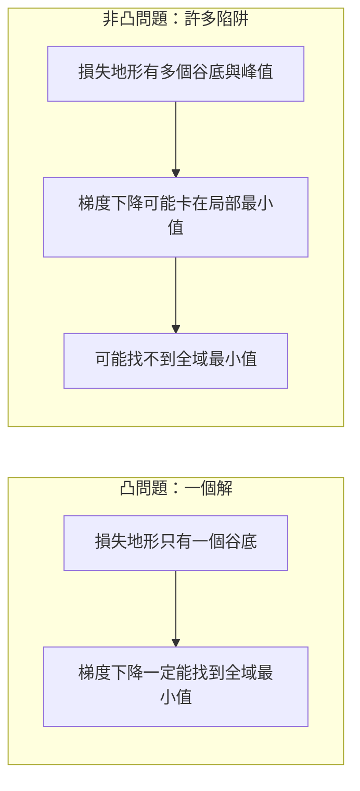
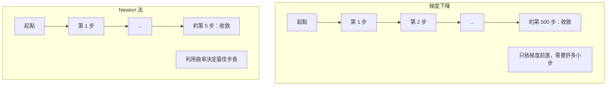
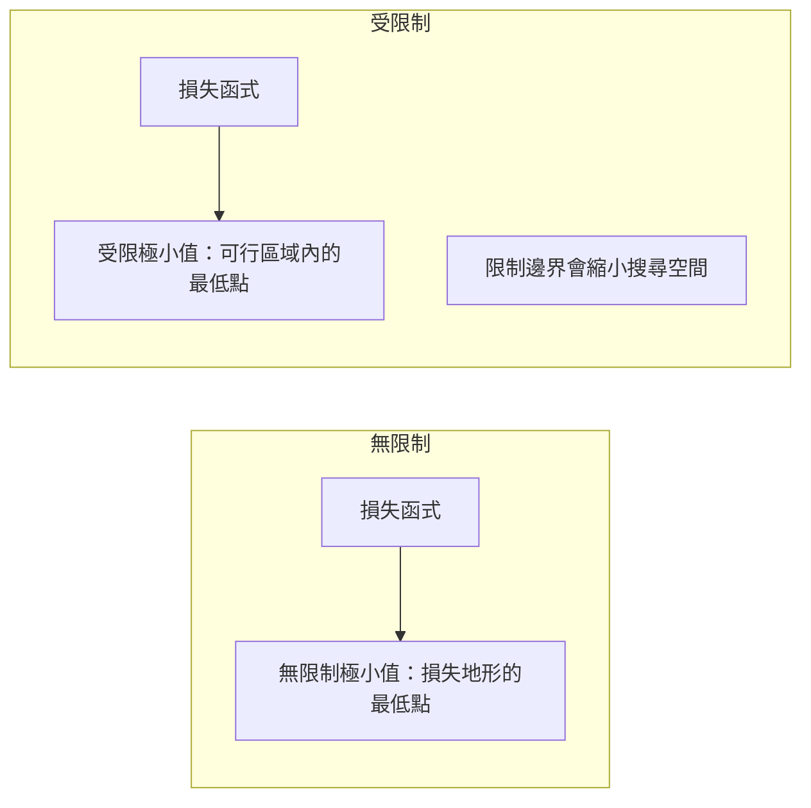
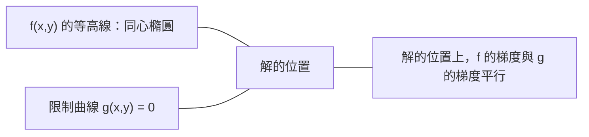

# 凸最佳化

> 凸問題只有一個谷底，神經網路卻有數百萬個。了解兩者差異很重要。

**Type:** Build
**Language:** Python
**Prerequisites:** Phase 1, Lessons 04 (Calculus for ML), 08 (Optimization)
**Time:** ~90 minutes

## Learning Objectives｜學習目標

- 使用定義、二階導數與 Hessian 條件，檢驗函數是否為凸函數
- 實作 Newton 法，並比較其二次收斂速度與梯度下降
- 使用 Lagrange 乘數求解受限最佳化問題，並解讀 KKT 條件
- 說明神經網路的損失地形為何非凸，以及 SGD 為何仍能找到良好解

## The Problem｜問題

第 08 課介紹了梯度下降、動量與 Adam。這些最佳化器會沿著各種曲面往下走，但沒有任何保證。梯度下降在非凸地形上可能落入不佳的局部最小值、卡在鞍點，或永遠震盪。你仍然使用它，因為神經網路是非凸問題，而且沒有其他選擇。

但機器學習中的許多問題是凸問題，例如線性迴歸、邏輯斯迴歸、SVM、LASSO 與 Ridge 迴歸。這類問題有更強的方法：具備數學保證的最佳化。凸問題只有一個谷底，任何沿著下降方向前進的演算法都會抵達全域最小值。不需要重新隨機起始、不需要學習率排程，也不必祈禱。

理解凸性有三個好處。第一，它能告訴你哪些問題容易（凸），哪些問題困難（非凸）。第二，它提供 Newton 法等更快的凸問題工具。第三，它能解釋機器學習中的重要概念：正則化如何等價於限制條件、SVM 中的對偶性，以及深度學習為什麼能在不具備凸性優良性質的情況下運作。

## The Concept｜核心概念

### 凸集合

集合 S 若符合以下性質，就稱為凸集合：S 中任意兩點之間的線段也完全落在 S 內。

| 凸集合 | 非凸集合 |
|---|---|
| **矩形：**內部任意兩點的連線都會留在集合內 | **星形／新月形：**內部兩點之間的線段可能穿出集合 |
| **三角形：**所有內部點都符合相同性質 | **甜甜圈／環形：**中間的洞會讓某些線段離開集合 |
| 任意兩點間的線段都留在集合內 | 有些點對之間的線段會離開集合 |

形式化檢驗：對任意 x、y ∈ S 及 t ∈ [0, 1]，點 tx + (1-t)y 也必須屬於 S。

凸集合範例：
- 一條直線、一個平面，或整個 R^n
- 球（圓、球體、超球體）
- 半空間：{x : a^T x <= b}
- 任意多個凸集合的交集

非凸集合範例：
- 甜甜圈（環形）
- 兩個不相交圓的聯集
- 任何有「凹痕」或「洞」的集合

### 凸函數

若函數 f 的定義域是凸集合，且定義域內任意兩點 x、y 與任意 t ∈ [0, 1] 都滿足以下條件，則 f 是凸函數：

```text
f(tx + (1-t)y) <= t*f(x) + (1-t)*f(y)
```

從幾何角度看：圖形上任意兩點間的線段，都會位於曲線上方或與曲線重合。

| 性質 | 凸函數 | 非凸函數 |
|---|---|---|
| **線段檢驗** | 圖形上任兩點的連線都在曲線**上方或重合** | 有些點對的連線會落在曲線**下方** |
| **形狀** | 向上彎曲的單一碗狀／谷底 | 曲率混合，具有多個峰與谷 |
| **局部最小值** | 每個局部最小值都是全域最小值 | 不同高度可能有多個局部最小值 |

常見凸函數：
- f(x) = x^2（拋物線）
- f(x) = |x|（絕對值）
- f(x) = e^x（指數函數）
- f(x) = max(0, x)（ReLU，分段線性）
- x > 0 時的 f(x) = -log(x)（負對數）
- 任意線性函數 f(x) = a^T x + b（同時是凸函數與凹函數）

### 凸性檢驗

以下三種實用檢驗方法，依難度由低至高排列。

**檢驗 1：二階導數檢驗（一維）。** 若所有 x 都滿足 f''(x) >= 0，則 f 為凸函數。

- f(x) = x^2：f''(x) = 2 >= 0，是凸函數。
- f(x) = x^3：f''(x) = 6x，在 x < 0 時為負值，因此不是凸函數。
- f(x) = e^x：f''(x) = e^x > 0，是凸函數。

**檢驗 2：Hessian 檢驗（多變量）。** 若所有 x 的 Hessian 矩陣 H(x) 都是半正定矩陣，則 f 為凸函數。Hessian 是由二階偏導數構成的矩陣。

**檢驗 3：定義檢驗。** 直接檢查不等式 f(tx + (1-t)y) <= t*f(x) + (1-t)*f(y)。適用於難以計算導數的函數。

### 為什麼凸性很重要

凸最佳化的核心定理：

**對凸函數而言，每個局部最小值都是全域最小值。**

這代表梯度下降不會陷入其他解。任何向下的路徑都會通往相同答案，演算法保證能收斂至最佳解。



結果：
- 不需要隨機重新起始
- 不需要複雜的學習率排程
- 可以證明收斂性（收斂速度取決於函數性質）
- 解唯一（平坦區域除外）

### 機器學習中的凸問題與非凸問題

| 問題 | 凸？ | 原因 |
|---------|------|------|
| 線性迴歸（MSE） | 是 | 損失對權重呈二次形式 |
| 邏輯斯迴歸 | 是 | 對數損失對權重為凸函數 |
| SVM（hinge 損失） | 是 | 線性函數的最大值 |
| LASSO（L1 迴歸） | 是 | 凸函數的總和仍為凸函數 |
| Ridge 迴歸（L2） | 是 | 二次函數加二次函數仍為凸函數 |
| 神經網路（任意損失） | 否 | 非線性啟動函數會產生非凸地形 |
| k-means 分群 | 否 | 包含離散指派步驟 |
| 矩陣分解 | 否 | 含有未知數的乘積 |

使用凸損失的線性模型是凸問題。一旦加入含非線性啟動函數的隱藏層，凸性就會消失。

### Hessian 矩陣

函數 f: R^n -> R 的 Hessian H，是由二階偏導數構成的 n x n 矩陣。

```text
H[i][j] = d^2 f / (dx_i dx_j)
```

對 f(x, y) = x^2 + 3xy + y^2 而言：

```text
df/dx = 2x + 3y       d^2f/dx^2 = 2      d^2f/dxdy = 3
df/dy = 3x + 2y       d^2f/dydx = 3      d^2f/dy^2 = 2

H = [ 2  3 ]
    [ 3  2 ]
```

Hessian 會呈現曲率：
- 特徵值全為正：所有方向都向上彎曲（該點為凸）
- 特徵值全為負：所有方向都向下彎曲（凹，且為局部極大值）
- 正負混合：鞍點（有些方向向上彎，有些方向向下彎）
- 特徵值為零：該方向平坦（退化）

要判斷凸性，Hessian 必須在所有位置都是半正定矩陣（所有特徵值 >= 0），而不只是某個點。

### Newton 法

梯度下降使用一階資訊（梯度）；Newton 法使用二階資訊（Hessian）。它會在目前點建立二次近似，直接跳到該二次函數的極小值。

```text
更新規則：
  x_new = x - H^(-1) * gradient

與梯度下降比較：
  x_new = x - lr * gradient
```

Newton 法以反 Hessian 取代純量學習率，因此會依據局部曲率，自動調整步長與方向。



優點：
- 接近極小值時二次收斂（每一步都會將誤差平方）
- 不需要調整學習率
- 對尺度不敏感（無論如何參數化問題都能運作）

缺點：
- 計算 Hessian 需要 O(n^2) 記憶體，反矩陣需要 O(n^3) 運算
- 對有 100 萬個權重的神經網路而言，會產生 10^12 個元素與 10^18 次運算
- 不適用於深度學習

### 受限最佳化

無限制最佳化：在所有 x 中最小化 f(x)。
受限最佳化：在條件限制下最小化 f(x)。

實際問題都有限制。你想降低成本，但預算有限；你想降低誤差，但模型複雜度有所上限。



### Lagrange 乘數

Lagrange 乘數法會將受限問題轉換成無限制問題。

問題：在 g(x) = 0 的條件下，最小化 f(x)。

作法：引入新變數（Lagrange 乘數 lambda），再求解無限制問題：

```text
L(x, lambda) = f(x) + lambda * g(x)
```

在解的位置，L 的梯度為零：

```text
dL/dx = df/dx + lambda * dg/dx = 0
dL/dlambda = g(x) = 0
```

幾何直覺：受限極小值處，f 的梯度必須平行於限制條件 g 的梯度。若兩者不平行，你就能沿著限制曲面移動並進一步降低 f。



範例：在 x + y = 1 的條件下，最小化 f(x,y) = x^2 + y^2。

```text
L = x^2 + y^2 + lambda(x + y - 1)

dL/dx = 2x + lambda = 0  =>  x = -lambda/2
dL/dy = 2y + lambda = 0  =>  y = -lambda/2
dL/dlambda = x + y - 1 = 0

由前兩式可得：x = y
代入後得：2x = 1，因此 x = y = 0.5，lambda = -1
```

直線 x + y = 1 上距離原點最近的點是 (0.5, 0.5)。

### KKT 條件

Karush-Kuhn-Tucker（KKT）條件將 Lagrange 乘數法推廣到不等式限制。

問題：在 g_i(x) <= 0（i = 1, ..., m）的條件下，最小化 f(x)。

KKT 條件（最佳化的必要條件）：

```text
1. 駐點條件：df/dx + sum(lambda_i * dg_i/dx) = 0
2. 原始可行性：g_i(x) <= 0，對所有 i 均成立
3. 對偶可行性：lambda_i >= 0，對所有 i 均成立
4. 互補鬆弛：lambda_i * g_i(x) = 0，對所有 i 均成立
```

互補鬆弛是關鍵：限制條件要麼是有效的（g_i = 0，解落在邊界上），要麼乘數為零（該限制沒有作用）。不影響解的限制條件，其 lambda = 0。

KKT 條件是 SVM 的核心。支援向量是限制條件有效的資料點（lambda > 0）；其他資料點的 lambda = 0，不會影響決策邊界。

### 將正則化視為受限最佳化

L1 與 L2 正則化並非任意設計的技巧；它們其實是受限最佳化問題的另一種寫法。

**L2 正則化（Ridge）：**

```text
最小化 Loss(w)，限制條件為 ||w||^2 <= t

等價的無限制形式：
最小化 Loss(w) + lambda * ||w||^2
```

限制條件 ||w||^2 <= t 定義一個球（2D 中是圓，3D 中是球體）。解的位置是損失等高線第一次碰到這個球的地方。

**L1 正則化（LASSO）：**

```text
最小化 Loss(w)，限制條件為 ||w||_1 <= t

等價的無限制形式：
最小化 Loss(w) + lambda * ||w||_1
```

限制條件 ||w||_1 <= t 定義一個菱形（2D 中為旋轉的正方形）。

| 性質 | L2 限制（圓形） | L1 限制（菱形） |
|---|---|---|
| **限制形狀** | 圓形（高維時為球體） | 菱形（2D 中為旋轉正方形） |
| **損失等高線接觸處** | 平滑邊界，圓上任意點 | 角落，與座標軸對齊 |
| **解的行為** | 權重很小但不為零 | 部分權重精確為零（稀疏） |
| **結果** | 權重縮減 | 特徵選取 |

這說明了 L1 為何會產生稀疏模型（選取特徵），而 L2 只會縮小權重。菱形的角落與座標軸對齊，損失等高線更容易接觸角落，讓一個或多個權重精確變成零。

### 對偶性

每個受限最佳化問題（原始問題）都有相對應的問題（對偶問題）。對凸問題而言，原始問題與對偶問題具有相同的最佳值，這稱為強對偶性。

Lagrange 對偶函數：

```text
原始問題：最小化 f(x)，限制條件為 g(x) <= 0
Lagrangian：L(x, lambda) = f(x) + lambda * g(x)
對偶函數：d(lambda) = min_x L(x, lambda)
對偶問題：最大化 d(lambda)，限制條件為 lambda >= 0
```

對偶性的重要之處：
- 對偶問題有時比原始問題更容易求解
- SVM 會使用對偶形式求解，此時問題取決於資料點之間的點積（因此能使用核技巧）
- 對偶問題會提供原始最佳值的下界，可用來檢查解的品質

SVM 的原始與對偶形式：

```text
原始問題：找出 w、b，使間隔 2/||w|| 最大，條件為
        y_i(w^T x_i + b) >= 1，對所有 i 均成立

對偶問題：最大化 sum(alpha_i) - 0.5 * sum_ij(alpha_i * alpha_j * y_i * y_j * x_i^T x_j)
        條件為 alpha_i >= 0 且 sum(alpha_i * y_i) = 0

對偶問題只包含點積 x_i^T x_j。
將 x_i^T x_j 替換成 K(x_i, x_j)，就得到核技巧。
```

### 深度學習為何能克服非凸性

神經網路的損失函式高度非凸。依照所有經典標準，最佳化應該會失敗；但隨機梯度下降仍能穩定地找到良好解。以下因素可以解釋這件事。

**多數局部最小值已經足夠好。** 在高維空間中，隨機臨界點（梯度為零的位置）絕大多數是鞍點，而非局部最小值。少數局部最小值的損失通常也接近全域最小值。參數空間有數百萬維時，落入糟糕局部最小值的機率極低。

**真正的障礙是鞍點，而不是局部最小值。** 在含 n 個參數的函數中，鞍點的曲率方向有正有負。在高維空間隨機選出的臨界點，其 n 個特徵值全為正（局部最小值）的機率約為 2^(-n)。幾乎所有臨界點都是鞍點；SGD 的雜訊能幫助模型離開鞍點。

**過度參數化會讓地形變平滑。** 參數數量多於訓練樣本的網路，會有更平滑、連通性更高的損失地形。較寬的網路也較少出現不佳的局部最小值。這違反直覺，但符合實驗觀察。

**損失地形結構：**

| 性質 | 低維空間 | 高維空間 |
|---|---|---|
| **地形** | 許多彼此孤立的峰與谷 | 連通且平滑的谷地 |
| **極小值** | 許多孤立的局部最小值 | 不佳的局部最小值少，多數接近最佳解 |
| **搜尋路徑** | 難以找到全域最小值 | 許多路徑都能通往良好解 |
| **臨界點** | 局部最小值與鞍點混合 | 幾乎都是鞍點，而非局部最小值 |

**隨機雜訊具有隱性正則化效果。** 小批次 SGD 會加入雜訊，避免停留在尖銳的極小值。尖銳極小值容易過度擬合；平坦極小值則有較好的泛化能力。雜訊會使最佳化偏向損失地形中的平坦區域。

### 實務中的二階方法

純 Newton 法不適用於大型模型；若干近似方法能讓二階資訊實際派上用場。

**L-BFGS（有限記憶體 BFGS）：** 使用最近 m 次梯度差近似反 Hessian。記憶體需求為 O(mn)，而非 O(n^2)。適用於最多約 10,000 個參數的問題。常用於傳統機器學習（邏輯斯迴歸、CRF），但不常用於深度學習。

**自然梯度：** 使用 Fisher 資訊矩陣（對數概似的期望 Hessian）取代標準 Hessian，以考量機率分布的幾何性質。K-FAC（Kronecker-Factored Approximate Curvature）會將 Fisher 矩陣近似為 Kronecker 積，讓它適用於神經網路。

**免 Hessian 最佳化：** 使用共軛梯度求解 Hx = g，而不實際建立 H。只需要 Hessian-向量積，透過自動微分即可在 O(n) 時間內計算。

**對角近似：** Adam 的二階動量是 Hessian 對角線的近似。AdaHessian 則透過 Hutchinson 估計量使用實際 Hessian 對角元素。

| 方法 | 記憶體 | 每步成本 | 適用情況 |
|------|--------|----------|----------|
| 梯度下降 | O(n) | O(n) | 基準方法、大型模型 |
| Newton 法 | O(n^2) | O(n^3) | 小型凸問題 |
| L-BFGS | O(mn) | O(mn) | 中型凸問題 |
| Adam | O(n) | O(n) | 深度學習預設方法 |
| K-FAC | O(n) | 每層 O(n) | 研究、大批次訓練 |

```figure
convex-vs-nonconvex
```

## Build It

### 步驟 1：凸性檢查器

建立一個函數，透過取樣多個點並檢查凸性定義，實證測試函數是否為凸函數。

```python
import random
import math

def check_convexity(f, dim, bounds=(-5, 5), samples=1000):
    violations = 0
    for _ in range(samples):
        x = [random.uniform(*bounds) for _ in range(dim)]
        y = [random.uniform(*bounds) for _ in range(dim)]
        t = random.uniform(0, 1)
        mid = [t * xi + (1 - t) * yi for xi, yi in zip(x, y)]
        lhs = f(mid)
        rhs = t * f(x) + (1 - t) * f(y)
        if lhs > rhs + 1e-10:
            violations += 1
    return violations == 0, violations
```

### 步驟 2：實作 2D Newton 法

使用明確的 Hessian 實作 Newton 法，並與梯度下降比較收斂速度。

```python
def newtons_method(f, grad_f, hessian_f, x0, steps=50, tol=1e-12):
    x = list(x0)
    history = [x[:]]
    for _ in range(steps):
        g = grad_f(x)
        H = hessian_f(x)
        det = H[0][0] * H[1][1] - H[0][1] * H[1][0]
        if abs(det) < 1e-15:
            break
        H_inv = [
            [H[1][1] / det, -H[0][1] / det],
            [-H[1][0] / det, H[0][0] / det],
        ]
        dx = [
            H_inv[0][0] * g[0] + H_inv[0][1] * g[1],
            H_inv[1][0] * g[0] + H_inv[1][1] * g[1],
        ]
        x = [x[0] - dx[0], x[1] - dx[1]]
        history.append(x[:])
        if sum(gi ** 2 for gi in g) < tol:
            break
    return history
```

### 步驟 3：Lagrange 乘數求解器

使用 Lagrangian 上的梯度下降求解受限最佳化問題。

```python
def lagrange_solve(f_grad, g_val, g_grad, x0, lr=0.01,
                   lr_lambda=0.01, steps=5000):
    x = list(x0)
    lam = 0.0
    history = []
    for _ in range(steps):
        fg = f_grad(x)
        gv = g_val(x)
        gg = g_grad(x)
        x = [
            xi - lr * (fgi + lam * ggi)
            for xi, fgi, ggi in zip(x, fg, gg)
        ]
        lam = lam + lr_lambda * gv
        history.append((x[:], lam, gv))
    return history
```

### 步驟 4：比較一階方法與二階方法

對同一個二次函數分別執行梯度下降與 Newton 法，計算各自收斂所需步數。

```python
def quadratic(x):
    return 5 * x[0] ** 2 + x[1] ** 2

def quadratic_grad(x):
    return [10 * x[0], 2 * x[1]]

def quadratic_hessian(x):
    return [[10, 0], [0, 2]]
```

Newton 法會在一步內收斂（二次函數可精確求解）。梯度下降則需要數百步，因為 Hessian 特徵值相差 5 倍，形成狹長的谷地。

## Use It

選擇機器學習模型與求解器時，可以直接運用凸性分析。

凸問題（邏輯斯迴歸、SVM、LASSO）：
- 使用專用求解器（liblinear、CVXPY，或以 method='L-BFGS-B' 呼叫 scipy.optimize.minimize）
- 預期會有唯一的全域解
- 二階方法實用且快速

非凸問題（神經網路）：
- 使用一階方法（SGD、Adam）
- 接受解會受到初始化與隨機性影響
- 將過度參數化、雜訊與學習率排程作為隱性正則化
- 不要浪費時間尋找全域最小值，良好的局部最小值就足夠

```python
from scipy.optimize import minimize

result = minimize(
    fun=lambda w: sum((y - X @ w) ** 2) + 0.1 * sum(w ** 2),
    x0=np.zeros(d),
    method='L-BFGS-B',
    jac=lambda w: -2 * X.T @ (y - X @ w) + 0.2 * w,
)
```

對 SVM 而言，對偶形式讓你能使用核技巧：

```python
from sklearn.svm import SVC

svm = SVC(kernel='rbf', C=1.0)
svm.fit(X_train, y_train)
print(f"Support vectors: {svm.n_support_}")
```

## Exercises｜練習

1. **凸性圖鑑。** 使用檢查器測試以下函數是否為凸函數：f(x) = x^4、f(x) = sin(x)、f(x,y) = x^2 + y^2、f(x,y) = x*y、f(x) = max(x, 0)。說明各結果是否合理。

2. **Newton 法與梯度下降競賽。** 從起點 (10, 10) 開始，對 f(x,y) = 50*x^2 + y^2 執行兩種方法。各自需要幾步才能讓損失小於 1e-10？條件數（Hessian 最大與最小特徵值之比）增加時，梯度下降會如何變化？

3. **Lagrange 乘數的幾何意義。** 在 x + 2y = 4 的條件下，最小化 f(x,y) = (x-3)^2 + (y-3)^2。檢查解處 f 的梯度是否平行於 g 的梯度，以驗證結果。

4. **正則化限制。** 實作 L1 限制最佳化：在 |x| + |y| <= 1 的條件下，最小化 (x-3)^2 + (y-2)^2。展示菱形限制如何讓解的一個座標為零（稀疏性）。

5. **Hessian 特徵值分析。** 計算 Rosenbrock 函數在 (1,1) 與 (-1,1) 的 Hessian 與特徵值。這些特徵值如何說明極小值處與遠離極小值處的曲率差異？

## Key Terms｜關鍵術語

| 術語 | 意義 |
|------|------|
| Convex set（凸集合） | 集合中任兩點的連線都留在集合內 |
| Convex function（凸函數） | 圖形上任兩點的連線都在曲線上方或重合。等價條件是 Hessian 處處半正定 |
| Local minimum（局部最小值） | 低於鄰近所有點的點。凸函數的每個局部最小值都是全域最小值 |
| Global minimum（全域最小值） | 函數定義域中的最低點 |
| Hessian matrix（Hessian 矩陣） | 由所有二階偏導數構成的矩陣，可呈現曲率資訊 |
| Positive semidefinite（半正定） | 所有特徵值皆非負的矩陣，是「二階導數 >= 0」的多維類比 |
| Condition number（條件數） | Hessian 最大與最小特徵值的比值。條件數高代表谷地狹長，梯度下降較慢 |
| Newton’s method（Newton 法） | 使用反 Hessian 決定步長與方向的二階最佳化器，在極小值附近呈二次收斂 |
| Lagrange multiplier（Lagrange 乘數） | 用來將受限最佳化問題轉換成無限制問題的變數 |
| KKT conditions（KKT 條件） | 含不等式限制的最佳化必要條件，是 Lagrange 乘數法的推廣 |
| Complementary slackness（互補鬆弛） | 解處的限制條件要麼有效，要麼其乘數為零；兩者不會同時非零 |
| Duality（對偶性） | 每個受限問題都有對應的對偶問題。凸問題的原始與對偶問題有相同最佳值 |
| Strong duality（強對偶性） | 原始與對偶問題的最佳值相等。符合 Slater 條件的凸問題具有此性質 |
| L-BFGS | 以最近 m 次梯度差近似二階資訊，而不儲存完整 Hessian 的方法 |
| Saddle point（鞍點） | 梯度為零，但某些方向是極小值、另一些方向是極大值的點 |
| Overparameterization（過度參數化） | 使用多於訓練樣本數的參數，會讓損失地形平滑並減少不佳的局部最小值 |

## Further Reading｜延伸閱讀

- [Boyd 與 Vandenberghe：Convex Optimization](https://web.stanford.edu/~boyd/cvxbook/) - 可免費線上閱讀的標準教科書
- [Bottou、Curtis、Nocedal：Optimization Methods for Large-Scale Machine Learning（2018）](https://arxiv.org/abs/1606.04838) - 連結凸最佳化理論與深度學習實務
- [Choromanska 等人：The Loss Surfaces of Multilayer Networks（2015）](https://arxiv.org/abs/1412.0233) - 說明非凸神經網路地形沒有想像中糟糕的原因
- [Nocedal 與 Wright：Numerical Optimization](https://link.springer.com/book/10.1007/978-0-387-40065-5) - 涵蓋 Newton 法、L-BFGS 與受限最佳化的完整參考資料
