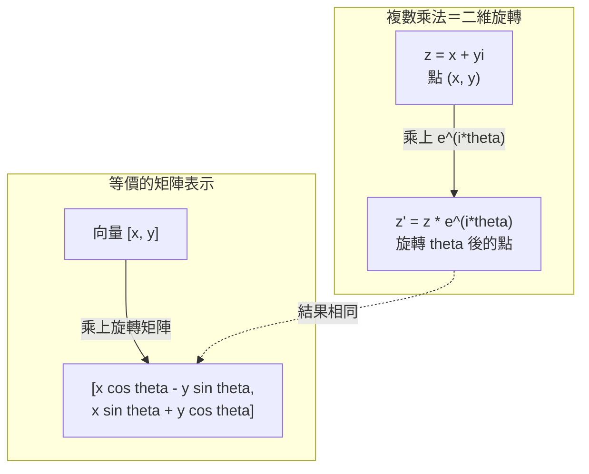
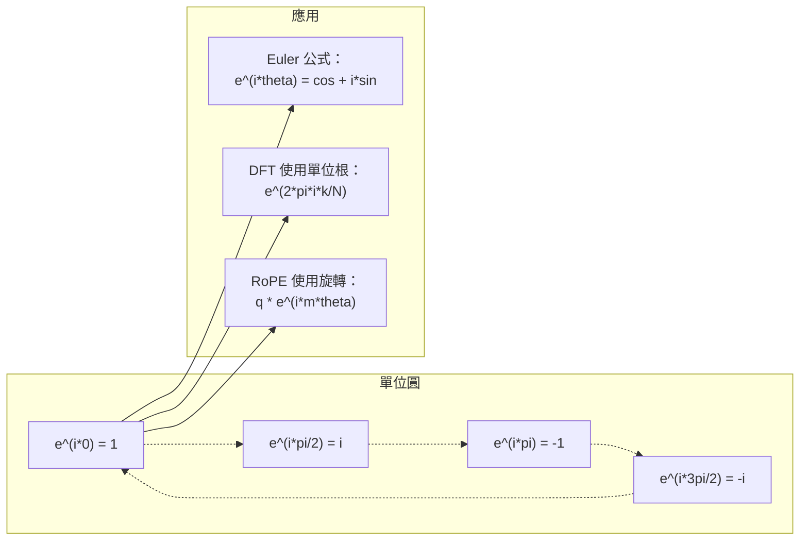

# AI 的複數

> 負一的平方根並非虛構；它是理解旋轉、頻率與大半訊號處理領域的關鍵。

**Type:** Learn
**Language:** Python
**Prerequisites:** Phase 1, Lessons 01-04 (linear algebra, calculus)
**Time:** ~60 minutes

## Learning Objectives｜學習目標

- 使用直角式與極式進行複數加、乘、除與共軛運算
- 使用 Euler 公式轉換複指數與三角函數
- 使用複數單位根實作離散傅立葉轉換
- 說明複數旋轉如何構成 Transformer 中 RoPE 與正弦位置編碼的基礎

## The Problem｜問題

你打開一篇介紹傅立葉轉換的論文，發現到處都是 `i`。再看 Transformer 的位置編碼，會看到不同頻率的 `sin` 與 `cos`，它們正是複指數的實部與虛部。讀到量子計算時，又會發現所有內容都以複數向量空間表示。

複數看起來很抽象。以 -1 的平方根為基礎建立數系，像是數學把戲；但它不是把戲，而是描述旋轉與振盪的自然語言。只要某件事物在旋轉、振動或振盪，複數就是合適的工具。

不了解複數，就無法理解離散傅立葉轉換，也無法理解 FFT、現代語言模型中的 RoPE（旋轉位置嵌入），或原始 Transformer 論文中的正弦位置編碼為什麼採用那些頻率。

本課程會從頭建構複數運算、連結幾何意義，並明確展示複數如何出現在機器學習中。

## The Concept｜核心概念

### 什麼是複數？

複數由兩個部分組成：實部與虛部。

```text
z = a + bi

其中：
  a 是實部
  b 是虛部
  i 是虛數單位，定義為 i^2 = -1
```

就是這樣。你只要把數線延伸成平面：實數位於其中一條軸，虛數位於另一條軸。每個複數都是這個平面上的一個點。

### 複數運算

**加法。** 將實部相加，再將虛部相加。

```text
(a + bi) + (c + di) = (a + c) + (b + d)i

範例：(3 + 2i) + (1 + 4i) = 4 + 6i
```

**乘法。** 使用分配律，並記得 i^2 = -1。

```text
(a + bi)(c + di) = ac + adi + bci + bdi^2
                 = ac + adi + bci - bd
                 = (ac - bd) + (ad + bc)i

範例：(3 + 2i)(1 + 4i) = 3 + 12i + 2i + 8i^2
                            = 3 + 14i - 8
                            = -5 + 14i
```

**共軛。** 將虛部的正負號反轉。

```text
a + bi 的共軛 = a - bi
```

複數與其共軛的乘積一定是實數：

```text
(a + bi)(a - bi) = a^2 + b^2
```

**除法。** 分子與分母同乘分母的共軛。

```text
(a + bi) / (c + di) = (a + bi)(c - di) / (c^2 + d^2)
```

這能消除分母中的虛部，得到乾淨的複數結果。

### 複數平面

複數平面會將每個複數映射為二維點。水平軸是實軸，垂直軸是虛軸。

```text
z = 3 + 2i  對應平面上的點 (3, 2)
z = -1 + 0i 對應實軸上的點 (-1, 0)
z = 0 + 4i  對應虛軸上的點 (0, 4)
```

複數同時是平面上的點，也是從原點出發的向量。這種雙重觀點讓複數在幾何中很有用。

### 極式

平面上的任意點，都能用它到原點的距離，以及它與正實軸之間的角度來表示。

```text
z = r * (cos(theta) + i*sin(theta))

其中：
  r = |z| = sqrt(a^2 + b^2)     （模長）
  theta = atan2(b, a)             （相位或幅角）
```

直角式（a + bi）適合加法；極式（r, theta）則適合乘法。

**極式乘法。** 將模長相乘，角度相加。

```text
z1 = r1 * e^(i*theta1)
z2 = r2 * e^(i*theta2)

z1 * z2 = (r1 * r2) * e^(i*(theta1 + theta2))
```

這就是複數非常適合表示旋轉的原因。乘上一個模長為 1 的複數，就只會產生旋轉。

### Euler 公式

複指數與三角函數之間的橋樑：

```text
e^(i*theta) = cos(theta) + i*sin(theta)
```

這是本課最重要的公式。當 theta = pi 時：

```text
e^(i*pi) = cos(pi) + i*sin(pi) = -1 + 0i = -1

因此：e^(i*pi) + 1 = 0
```

這個方程把五個基本常數（e、i、pi、1、0）連結在一起。

### Euler 公式為什麼與機器學習有關

Euler 公式指出，隨 theta 改變，`e^(i*theta)` 會沿著單位圓移動。theta = 0 時位於 (1, 0)；theta = pi/2 時位於 (0, 1)；theta = pi 時位於 (-1, 0)；theta = 3*pi/2 時位於 (0, -1)。完整旋轉一圈的角度是 theta = 2*pi。

這表示複指數就是旋轉，而旋轉在訊號處理與機器學習中無所不在。

### 與二維旋轉的關聯

將複數 (x + yi) 乘上 e^(i*theta)，就會讓點 (x, y) 繞原點旋轉 theta 角度。

```text
複數乘法旋轉：
  (x + yi) * (cos(theta) + i*sin(theta))
  = (x*cos(theta) - y*sin(theta)) + (x*sin(theta) + y*cos(theta))i

矩陣乘法旋轉：
  [cos(theta)  -sin(theta)] [x]   [x*cos(theta) - y*sin(theta)]
  [sin(theta)   cos(theta)] [y] = [x*sin(theta) + y*cos(theta)]
```

兩者產生完全相同的結果。複數乘法就是二維旋轉；旋轉矩陣只是用矩陣記法表示複數乘法。



### 相量與旋轉訊號

複指數 e^(i*omega*t) 是一個以角頻率 omega 沿單位圓旋轉的點。隨著 t 增加，這個點會沿圓周移動。

旋轉點的實部是 cos(omega*t)，虛部是 sin(omega*t)。正弦訊號就像是旋轉複數在實軸上的投影。

```text
e^(i*omega*t) = cos(omega*t) + i*sin(omega*t)

實部：          cos(omega*t)    -- 餘弦波
虛部：          sin(omega*t)    -- 正弦波
```

這就是相量表示法。你不必追蹤起伏的正弦波，只需追蹤平滑旋轉的箭頭。相位差會變成角度差，振幅變化會變成模長變化，訊號相加則變成向量相加。

### 單位根

N 次單位根是在單位圓上等距排列的 N 個點：

```text
w_k = e^(2*pi*i*k/N)，對 k = 0, 1, 2, ..., N-1
```

N = 4 時，單位根為 1、i、-1、-i（四個羅盤方向）。
N = 8 時，除了四個羅盤方向，還會多出四個對角方向。

單位根是離散傅立葉轉換的基礎。DFT 會將訊號分解成這 N 個等距頻率的成分。

### 與 DFT 的關聯

訊號 x[0]、x[1]、...、x[N-1] 的離散傅立葉轉換為：

```text
X[k] = sum_{n=0}^{N-1} x[n] * e^(-2*pi*i*k*n/N)
```

每個 X[k] 衡量訊號與第 k 個單位根（頻率為 k 的複數正弦波）的相關程度。DFT 會將訊號分解成 N 個旋轉相量，並告訴你每個相量的振幅與相位。

### 為什麼 i 並不虛構

「虛數」這個名稱只是歷史巧合。笛卡兒曾用它來表示輕蔑，但人們最初拒絕負數時，負數也和 i 一樣被視為不真實。負數回答「3 減去多少會得到 5？」虛數單位則回答「什麼數的平方會得到 -1？」

更實用的觀點是：i 是 90 度旋轉運算子。實數乘以 i 一次，會旋轉 90 度到虛軸；再乘一次 i（i^2），再轉 90 度，就會指向負實軸。因此 i^2 = -1。這並不神祕，而是兩次四分之一圈組成的半圈旋轉。

這就是複數在工程領域無所不在的原因。任何旋轉現象——電磁波、量子狀態、訊號振盪或位置編碼——都能自然地用複數描述。

### 複指數與三角函數

Euler 公式出現之前，工程師會以 A*cos(omega*t + phi) 表示訊號，其中 A 是振幅、omega 是頻率、phi 是相位。這種寫法可行，但運算很麻煩；將相位不同的兩個餘弦相加時，必須使用三角恆等式。

使用複指數時，同一個訊號可寫成 A*e^(i*(omega*t + phi))。兩個訊號相加，只要將兩個複數相加；相乘（調變）則是模長相乘、角度相加。相位差變成角度相加，頻率偏移則變成乘上相量。

整個訊號處理領域都改用複指數表示法，因為數學運算更簡潔。「真實訊號」始終是複數表示的實部；虛部則一併保留，讓代數運算自然成立。

### 與 Transformer 的關聯

**正弦位置編碼**（原始 Transformer 論文）：

```text
PE(pos, 2i) = sin(pos / 10000^(2i/d))
PE(pos, 2i+1) = cos(pos / 10000^(2i/d))
```

成對的 sin 與 cos 是不同頻率複指數的實部與虛部。每個頻率都提供不同的位置「解析度」：低頻變化緩慢，表示粗略位置；高頻變化快速，表示細微位置。這些頻率合在一起，為每個位置提供獨特的頻率特徵。

**RoPE（旋轉位置嵌入）** 更進一步，直接用複數旋轉矩陣乘上 query 與 key 向量。兩個 token 的相對位置會轉成旋轉角度，注意力再透過這些旋轉後的向量計算，讓模型藉由複數乘法感知相對位置。

| 運算 | 代數形式 | 幾何意義 |
|----------|-----------------|----------|
| 加法 | (a+c) + (b+d)i | 平面上的向量相加 |
| 乘法 | (ac-bd) + (ad+bc)i | 旋轉並縮放 |
| 共軛 | a - bi | 對實軸鏡射 |
| 模長 | sqrt(a^2 + b^2) | 到原點的距離 |
| 相位 | atan2(b, a) | 與正實軸的夾角 |
| 除法 | 乘以共軛 | 反向旋轉並重新縮放 |
| 次方 | r^n * e^(i*n*theta) | 旋轉 n 次，模長縮放為 r^n |



```figure
roots-of-unity
```

## Build It

### 步驟 1：實作 Complex 類別

建立 Complex 數字類別，支援四則運算、模長、相位，以及直角式與極式之間的轉換。

```python
import math

class Complex:
    def __init__(self, real, imag=0.0):
        self.real = real
        self.imag = imag

    def __add__(self, other):
        return Complex(self.real + other.real, self.imag + other.imag)

    def __mul__(self, other):
        r = self.real * other.real - self.imag * other.imag
        i = self.real * other.imag + self.imag * other.real
        return Complex(r, i)

    def __truediv__(self, other):
        denom = other.real ** 2 + other.imag ** 2
        r = (self.real * other.real + self.imag * other.imag) / denom
        i = (self.imag * other.real - self.real * other.imag) / denom
        return Complex(r, i)

    def magnitude(self):
        return math.sqrt(self.real ** 2 + self.imag ** 2)

    def phase(self):
        return math.atan2(self.imag, self.real)

    def conjugate(self):
        return Complex(self.real, -self.imag)
```

### 步驟 2：極式轉換與 Euler 公式

```python
def to_polar(z):
    return z.magnitude(), z.phase()

def from_polar(r, theta):
    return Complex(r * math.cos(theta), r * math.sin(theta))

def euler(theta):
    return Complex(math.cos(theta), math.sin(theta))
```

確認：`euler(theta).magnitude()` 永遠為 1.0；`euler(0)` 應回傳 (1, 0)；`euler(pi)` 應回傳 (-1, 0)。

### 步驟 3：旋轉

將點 (x, y) 旋轉 theta 角度，只需做一次複數乘法：

```python
point = Complex(3, 4)
rotated = point * euler(math.pi / 4)
```

模長維持不變，只有角度會改變。

### 步驟 4：使用複數運算計算 DFT

```python
def dft(signal):
    N = len(signal)
    result = []
    for k in range(N):
        total = Complex(0, 0)
        for n in range(N):
            angle = -2 * math.pi * k * n / N
            total = total + Complex(signal[n], 0) * euler(angle)
        result.append(total)
    return result
```

這是 O(N^2) 的 DFT。每個輸出 X[k] 都是訊號樣本乘上單位根後的總和。

### 步驟 5：反向 DFT

反向 DFT 會從頻譜還原原始訊號。與正向 DFT 相比，只需改變兩處：反轉指數的正負號，再除以 N。

```python
def idft(spectrum):
    N = len(spectrum)
    result = []
    for n in range(N):
        total = Complex(0, 0)
        for k in range(N):
            angle = 2 * math.pi * k * n / N
            total = total + spectrum[k] * euler(angle)
        result.append(Complex(total.real / N, total.imag / N))
    return result
```

這樣就能完美重建訊號。先做 DFT、再做 IDFT，會以機器精度還原原始訊號，不會遺失資訊。

### 步驟 6：計算單位根

```python
def roots_of_unity(N):
    return [euler(2 * math.pi * k / N) for k in range(N)]
```

確認兩項性質：
- 每個單位根的模長都恰好為 1。
- N 個單位根的總和為零（它們會因對稱性而抵消）。

這些性質讓 DFT 可以反轉。單位根在頻率域構成一組正交基底。

## Use It

Python 內建複數支援，字面值 `j` 代表虛數單位。

```python
z = 3 + 2j
w = 1 + 4j

print(z + w)
print(z * w)
print(abs(z))

import cmath
print(cmath.phase(z))
print(cmath.exp(1j * cmath.pi))
```

對陣列而言，numpy 原生支援複數：

```python
import numpy as np

z = np.array([1+2j, 3+4j, 5+6j])
print(np.abs(z))
print(np.angle(z))
print(np.conj(z))
print(np.real(z))
print(np.imag(z))

signal = np.sin(2 * np.pi * 5 * np.linspace(0, 1, 128))
spectrum = np.fft.fft(signal)
freqs = np.fft.fftfreq(128, d=1/128)
```

## Ship It

執行 `code/complex_numbers.py`，產生 `outputs/skill-complex-arithmetic.md`。

## Exercises｜練習

1. **手算複數運算。** 計算 (2 + 3i) * (4 - i)，並用程式驗證；再計算 (5 + 2i) / (1 - 3i)。將兩個結果畫在複數平面上，確認乘法會旋轉並縮放第一個數。

2. **連續旋轉。** 從點 (1, 0) 開始，連續乘上 e^(i*pi/6) 十二次。確認十二次後會回到 (1, 0)。列印每一步的座標，確認它們描出正十二邊形。

3. **已知訊號的 DFT。** 建立一個由 sin(2*pi*3*t) 與 0.5*sin(2*pi*7*t) 相加而成的訊號，取樣 32 點並執行 DFT。確認振幅頻譜在頻率 3 與 7 處有峰值，且頻率 7 的峰值只有頻率 3 的一半。

4. **視覺化單位根。** 計算 8 次單位根並確認總和為零。再確認任何一個單位根乘上本原根 e^(2*pi*i/8) 後，都會得到下一個單位根。

5. **驗證旋轉矩陣等價性。** 對 10 個隨機角度與 10 個隨機點，確認複數乘法與 2x2 旋轉矩陣的矩陣－向量乘法結果相同，並列印最大數值差異。

## Key Terms｜關鍵術語

| 術語 | 意義 |
|------|------|
| Complex number（複數） | a + bi 形式的數，其中 a 為實部、b 為虛部，且 i^2 = -1 |
| Imaginary unit（虛數單位） | 定義為 i^2 = -1 的 i。它不是哲學意義上的虛構，而是旋轉運算子 |
| Complex plane（複數平面） | x 軸為實數、y 軸為虛數的二維平面，也稱 Argand 平面 |
| Magnitude／modulus（模長） | 點到原點的距離：sqrt(a^2 + b^2)，記作 z 的模長 |
| Phase／argument（相位／幅角） | 與正實軸的夾角：atan2(b, a)，記作 arg(z) |
| Conjugate（共軛） | 對實軸鏡射；a + bi 的共軛是 a - bi |
| Polar form（極式） | 將 z 表示為 r * e^(i*theta)，而非 a + bi，便於乘法運算 |
| Euler's formula（Euler 公式） | e^(i*theta) = cos(theta) + i*sin(theta)，連結複指數與三角函數 |
| Phasor（相量） | 代表正弦訊號的旋轉複數 e^(i*omega*t) |
| Roots of unity（單位根） | N 個複數 e^(2*pi*i*k/N)，k 從 0 到 N-1，在單位圓上等距排列 |
| DFT（離散傅立葉轉換） | 使用單位根將訊號分解成複數正弦波成分 |
| RoPE（旋轉位置嵌入） | 使用複數乘法，在 Transformer 注意力中編碼相對位置 |

## Further Reading｜延伸閱讀

- [Visual Introduction to Euler's Formula](https://betterexplained.com/articles/intuitive-understanding-of-eulers-formula/) - 以幾何直覺介紹 Euler 公式，不需大量數學符號
- [Su 等人：RoFormer（2021）](https://arxiv.org/abs/2104.09864) - 提出使用複數旋轉的 Rotary Position Embedding 論文
- [Vaswani 等人：Attention Is All You Need（2017）](https://arxiv.org/abs/1706.03762) - 包含正弦位置編碼的原始 Transformer 論文
- [3Blue1Brown：Euler's formula with introductory group theory](https://www.youtube.com/watch?v=mvmuCPvRoWQ) - 以視覺方式說明 e^(i*pi) = -1
- [Needham：Visual Complex Analysis](https://global.oup.com/academic/product/visual-complex-analysis-9780198534464) - 充滿幾何洞見的複數視覺化介紹
- [Strang：Introduction to Linear Algebra, Ch. 10](https://math.mit.edu/~linearalgebra/) - 在線性代數與特徵值脈絡中介紹複數
