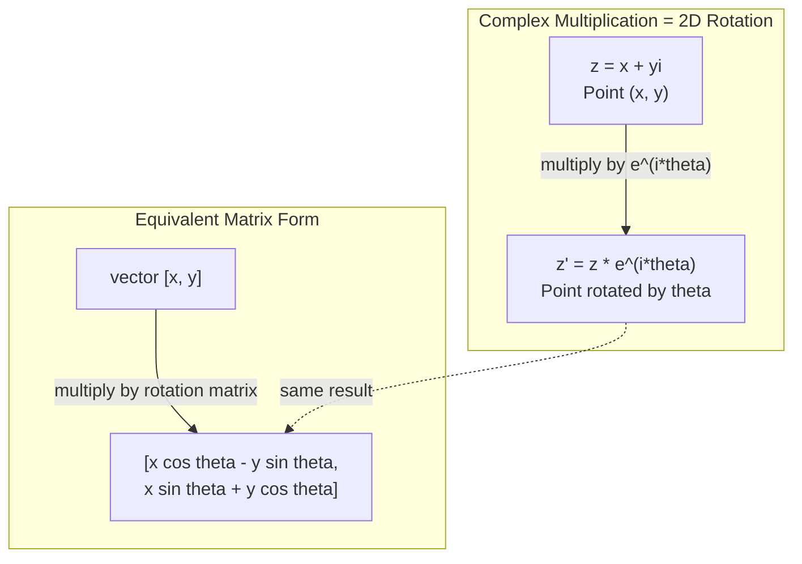
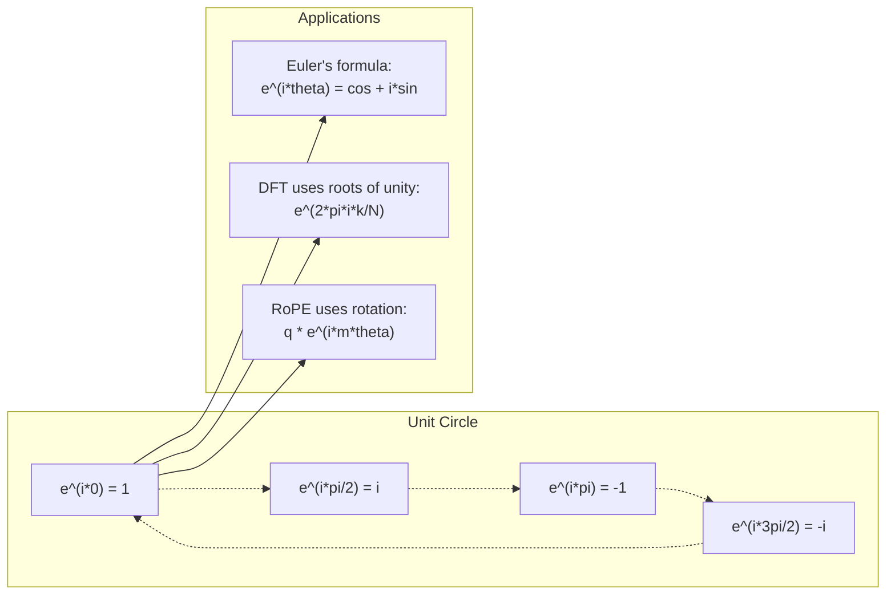

# AI 工程中的複數

> -1 的平方根並非虛構；旋轉、頻率（frequency），甚至半數訊號處理（signal processing），都少不了它。

**Type:** Learn
**Language:** Python
**Prerequisites:** Phase 1, Lessons 01-04 (linear algebra, calculus)
**Time:** ~60 minutes

## Learning Objectives｜學習目標

- 以直角座標形式（rectangular form）和極式（polar form）以直角座標形式和極式實作複數運算：加法、乘法、除法與求共軛（conjugate）
- 運用歐拉公式（Euler's formula），在複指數函數（complex exponentials）和三角函數（trigonometric functions）之間轉換
- 使用單位根（roots of unity）實作離散傅立葉轉換（Discrete Fourier Transform，DFT）
- 說明複數旋轉如何構成 transformer 中的 RoPE（Rotary Position Embedding）和正弦位置編碼（sinusoidal positional encoding）

## The Problem｜問題

你讀一篇傅立葉轉換（Fourier transform）的論文，裡面到處都是 `i`。你看 transformer 的位置編碼（positional encoding），會看到不同頻率下的 `sin` 和 `cos`；它們是複指數函數的實部（real part）和虛部（imaginary part）。你讀量子計算（quantum computing）相關內容，發現所有東西都以複數向量空間（complex vector spaces）表示。

複數（complex numbers）看起來很抽象。以 -1 的平方根為基礎建立數系，感覺像是數學上的取巧。但它並非取巧，而是描述旋轉和振盪的自然語言。任何會旋轉、振動或振盪的現象，都適合用複數處理。

不懂複數，就無法理解離散傅立葉轉換（Discrete Fourier Transform，DFT），也無法理解快速傅立葉轉換（Fast Fourier Transform，FFT）。你也無法理解現代語言模型中的 RoPE（Rotary Position Embedding），或原始 Transformer 論文的正弦位置編碼為何採用那些頻率。

本課會從頭建立複數運算，連結複數與幾何，並明確說明複數在機器學習中的用途。

## The Concept｜核心概念

### 什麼是複數？

複數（complex number）由實部和虛部兩部分組成。

```
z = a + bi

where:
  a is the real part
  b is the imaginary part
  i is the imaginary unit, defined by i^2 = -1
```

就是這樣。你把數線（number line）延伸成一個平面：實數（real number）落在其中一條座標軸上，虛數（imaginary number）則落在另一條軸上。每個複數都是這個平面上的一個點。

### 複數運算

**加法。** 將實部相加，再將虛部相加。

```
(a + bi) + (c + di) = (a + c) + (b + d)i

Example: (3 + 2i) + (1 + 4i) = 4 + 6i
```

**乘法。** 使用分配律，並記得 i^2 = -1。

```
(a + bi)(c + di) = ac + adi + bci + bdi^2
                 = ac + adi + bci - bd
                 = (ac - bd) + (ad + bc)i

Example: (3 + 2i)(1 + 4i) = 3 + 12i + 2i + 8i^2
                            = 3 + 14i - 8
                            = -5 + 14i
```

**共軛（conjugate）。** 將虛部的正負號反轉。

```
conjugate of (a + bi) = a - bi
```

複數與其共軛相乘，結果一定是實數：

```
(a + bi)(a - bi) = a^2 + b^2
```

**除法。** 將分子和分母同乘分母的共軛。

```
(a + bi) / (c + di) = (a + bi)(c - di) / (c^2 + d^2)
```

這樣就能消去分母中的虛部，得到形式簡潔的複數。

### 複數平面

複數平面（complex plane）會把每個複數對應到一個二維平面上的點。水平軸是實軸（real axis），垂直軸是虛軸（imaginary axis）。

```
z = 3 + 2i  corresponds to the point (3, 2)
z = -1 + 0i corresponds to the point (-1, 0) on the real axis
z = 0 + 4i  corresponds to the point (0, 4) on the imaginary axis
```

複數同時是平面上的點，也是從原點（origin）出發的向量（vector）。這種雙重解讀方式，讓複數能用來描述幾何。

### 極式

平面上的任意一點，都能用它到原點的距離，以及它與正實軸的夾角來表示。

```
z = r * (cos(theta) + i*sin(theta))

where:
  r = |z| = sqrt(a^2 + b^2)     (magnitude, or modulus)
  theta = atan2(b, a)             (phase, or argument)
```

直角座標形式（rectangular form）a + bi 適合做加法；極式（polar form）(r, theta) 則適合做乘法。

**極式乘法。** 將模（magnitude，也稱 modulus）相乘，並將角度相加。

```
z1 = r1 * e^(i*theta1)
z2 = r2 * e^(i*theta2)

z1 * z2 = (r1 * r2) * e^(i*(theta1 + theta2))
```

因此複數特別適合描述旋轉。乘上一個模為 1 的複數，就只會旋轉，不會縮放。

### 歐拉公式

複指數函數與三角函數之間的橋梁：

```
e^(i*theta) = cos(theta) + i*sin(theta)
```

這是本課最重要的公式。當 theta = pi 時：

```
e^(i*pi) = cos(pi) + i*sin(pi) = -1 + 0i = -1

Therefore: e^(i*pi) + 1 = 0
```

五個基本常數（e、i、pi、1、0）就這樣連在同一個等式中。

### 歐拉公式為何對 ML 重要

歐拉公式表示，theta 變動時，`e^(i*theta)` 會沿著單位圓（unit circle）移動。theta = 0 時位於 (1, 0)；theta = pi/2 時位於 (0, 1)；theta = pi 時位於 (-1, 0)；theta = 3*pi/2 時位於 (0, -1)。完整旋轉一圈時，theta = 2*pi。

這表示複指數函數就是旋轉，而旋轉在訊號處理（signal processing）和機器學習中無所不在。

### 連結到二維旋轉

將複數 (x + yi) 乘上 e^(i*theta)，就會讓點 (x, y) 繞原點旋轉 theta 角。

```
Rotation via complex multiplication:
  (x + yi) * (cos(theta) + i*sin(theta))
  = (x*cos(theta) - y*sin(theta)) + (x*sin(theta) + y*cos(theta))i

Rotation via matrix multiplication:
  [cos(theta)  -sin(theta)] [x]   [x*cos(theta) - y*sin(theta)]
  [sin(theta)   cos(theta)] [y] = [x*sin(theta) + y*cos(theta)]
```

兩種方法的結果完全相同。複數乘法（complex multiplication）就是二維旋轉；旋轉矩陣（rotation matrix）只是用矩陣表示法寫出的複數乘法。



### 相量（phasor）與旋轉訊號

複指數函數 e^(i*omega*t) 是一個以角頻率（angular frequency）omega 繞單位圓旋轉的點。t 增加時，這個點會沿著圓周前進。

這個旋轉點的實部是 cos(omega*t)，虛部是 sin(omega*t)。正弦訊號（sinusoidal signal）就像是旋轉複數在實軸上的投影。

```
e^(i*omega*t) = cos(omega*t) + i*sin(omega*t)

Real part:      cos(omega*t)    -- a cosine wave
Imaginary part: sin(omega*t)    -- a sine wave
```

這就是相量（phasor）表示法。與其追蹤上下起伏的正弦波（sine wave），不如追蹤平滑旋轉的箭頭。相位偏移（phase shift）變成角度偏移；振幅（amplitude）變化則變成模長變化。訊號相加就像向量相加。

### 單位根

N 次單位根（roots of unity）是單位圓上 N 個等距分布的點：

```
w_k = e^(2*pi*i*k/N)    for k = 0, 1, 2, ..., N-1
```

N = 4 時，單位根為 1、i、-1、-i（四個主要方位點）。
N = 8 時，除了四個主要方位點，還會多出四個對角點。

單位根是離散傅立葉轉換（DFT）的基礎。DFT 會把訊號分解成 N 個等距分布的頻率成分（frequency components）。

### 連結到 DFT

訊號 x[0], x[1], ..., x[N-1] 的離散傅立葉轉換（Discrete Fourier Transform，DFT）為：

```
X[k] = sum_{n=0}^{N-1} x[n] * e^(-2*pi*i*k*n/N)
```

每個 X[k] 都用來衡量訊號與第 k 個單位根，也就是頻率為 k 的複數正弦訊號之間的關聯程度。DFT 會把訊號分解成 N 個旋轉相量，並算出每個相量的振幅和相位（phase）。

### 為什麼 i 並不「虛」

「虛數」這個名稱只是歷史上的偶然。笛卡兒使用這個詞時帶有輕蔑意味。但 i 並不比當年遭人排斥的負數更「不真實」。負數能回答「從 3 減去 5 會得到什麼？」；虛數單位（imaginary unit）則能回答「什麼數平方後會得到 -1？」

更有用的理解方式是：i 可視為將複數旋轉 90 度的算子（rotation operator）。實數乘上 i 一次，就會向虛軸旋轉 90 度；再乘一次（i^2），就會再轉 90 度，指向負實軸。這就是 i^2 = -1 的原因。它一點也不神祕，只是由兩個四分之一圈組成的半圈旋轉。

這就是複數在工程領域無所不在的原因。凡是會旋轉的事物——電磁波、量子態（quantum states）、訊號振盪和位置編碼——都能自然地用複數描述。

### 複指數函數與三角函數

歐拉公式出現以前，工程師會用 A*cos(omega*t + phi) 表示訊號：振幅 A、頻率 omega、相位（phase）phi。這種寫法行得通，但運算很麻煩。要把相位不同的兩個餘弦波（cosine wave）相加，就得使用三角恆等式。

改用複指數函數，同一個訊號就寫成 A*e^(i*(omega*t + phi))。兩個訊號相加，只需把兩個複數相加。將訊號相乘，也就是調變（modulation），只需將模相乘、角度相加。相位偏移會變成角度相加；頻率偏移（frequency shift）則會變成乘上相量。

整個訊號處理領域都改用複指數表示法，因為運算更簡潔。「真實訊號」永遠只是複數表示法的實部。虛部會一併保留，讓所有代數運算自然成立。

### 連結到 transformer

**正弦位置編碼（sinusoidal positional encoding）**（原始 Transformer 論文）：

```
PE(pos, 2i) = sin(pos / 10000^(2i/d))
PE(pos, 2i+1) = cos(pos / 10000^(2i/d))
```

每一組 sin 和 cos 都是不同頻率下複指數函數的實部和虛部。不同頻率能以不同解析度編碼位置。低頻變化緩慢（粗略的位置資訊），高頻變化快速（細緻的位置資訊）。各頻率組合起來，會讓每個位置都有獨特的頻率指紋。

RoPE（Rotary Position Embedding）更進一步，直接讓 query 和 key 向量乘上複數旋轉矩陣。兩個 token 的相對位置會變成旋轉角度。注意力計算會使用旋轉後的向量，透過複數乘法讓模型掌握相對位置。

| 運算 | 代數形式 | 幾何意義 |
|-----------|---------------|-------------------|
| 加法 | (a+c) + (b+d)i | 平面上的向量相加 |
| 乘法 | (ac-bd) + (ad+bc)i | 旋轉並縮放 |
| 共軛 | a - bi | 對實軸鏡射 |
| 模 | sqrt(a^2 + b^2) | 到原點的距離 |
| 相位（phase） | atan2(b, a) | 從正實軸起算的角度 |
| 除法 | 乘上共軛 | 反向旋轉並縮放 |
| 次方 | r^n * e^(i*n*theta) | 旋轉 n 次，縮放 r^n 倍 |



```figure
roots-of-unity
```

## Build It｜動手實作

### 步驟 1：複數類別

建立 Complex 類別，支援算術運算、模、相位，以及直角座標形式與極式之間的轉換。

```python
import math

class Complex:
    def __init__(self, real, imag=0.0):
        self.real = real
        self.imag = imag

    def __add__(self, other):
        return Complex(self.real + other.real, self.imag + other.imag)

    def __mul__(self, other):
        r = self.real * other.real - self.imag * other.imag
        i = self.real * other.imag + self.imag * other.real
        return Complex(r, i)

    def __truediv__(self, other):
        denom = other.real ** 2 + other.imag ** 2
        r = (self.real * other.real + self.imag * other.imag) / denom
        i = (self.imag * other.real - self.real * other.imag) / denom
        return Complex(r, i)

    def magnitude(self):
        return math.sqrt(self.real ** 2 + self.imag ** 2)

    def phase(self):
        return math.atan2(self.imag, self.real)

    def conjugate(self):
        return Complex(self.real, -self.imag)
```

### 步驟 2：極式轉換與歐拉公式

```python
def to_polar(z):
    return z.magnitude(), z.phase()

def from_polar(r, theta):
    return Complex(r * math.cos(theta), r * math.sin(theta))

def euler(theta):
    return Complex(math.cos(theta), math.sin(theta))
```

驗證：`euler(theta).magnitude()` 應永遠等於 1.0。`euler(0)` 應得到 (1, 0)。`euler(pi)` 應得到 (-1, 0)。

### 步驟 3：旋轉

將點 (x, y) 旋轉 theta 角，只需要做一次複數乘法：

```python
point = Complex(3, 4)
rotated = point * euler(math.pi / 4)
```

模長保持不變，只有角度改變。

### 步驟 4：用複數運算實作 DFT

```python
def dft(signal):
    N = len(signal)
    result = []
    for k in range(N):
        total = Complex(0, 0)
        for n in range(N):
            angle = -2 * math.pi * k * n / N
            total = total + Complex(signal[n], 0) * euler(angle)
        result.append(total)
    return result
```

這是 O(N^2) 的 DFT。每個輸出 X[k] 都是訊號樣本乘上單位根後的總和。

### 步驟 5：反離散傅立葉轉換（inverse discrete Fourier transform，IDFT）

反離散傅立葉轉換會從頻譜（spectrum）重建原始訊號。它與正向 DFT 只有兩處不同：指數中的正負號反轉，並且除以 N。

```python
def idft(spectrum):
    N = len(spectrum)
    result = []
    for n in range(N):
        total = Complex(0, 0)
        for k in range(N):
            angle = 2 * math.pi * k * n / N
            total = total + spectrum[k] * euler(angle)
        result.append(Complex(total.real / N, total.imag / N))
    return result
```

這會完美重建訊號。先執行 DFT，再執行 IDFT，就能以機器精度還原原始訊號，不會遺失任何資訊。

### 步驟 6：單位根

```python
def roots_of_unity(N):
    return [euler(2 * math.pi * k / N) for k in range(N)]
```

驗證兩個性質：
- 每個單位根的模都恰好是 1。
- 所有 N 個單位根的總和為零（它們會因對稱性而互相抵消）。

這些性質讓 DFT 可逆。單位根構成頻域（frequency domain）的一組正交基底（orthogonal basis）。

## Use It｜實際應用

Python 內建複數支援；複數常值的字尾 `j` 代表虛數單位。

```python
z = 3 + 2j
w = 1 + 4j

print(z + w)
print(z * w)
print(abs(z))

import cmath
print(cmath.phase(z))
print(cmath.exp(1j * cmath.pi))
```

處理陣列時，numpy 原生支援複數：

```python
import numpy as np

z = np.array([1+2j, 3+4j, 5+6j])
print(np.abs(z))
print(np.angle(z))
print(np.conj(z))
print(np.real(z))
print(np.imag(z))

signal = np.sin(2 * np.pi * 5 * np.linspace(0, 1, 128))
spectrum = np.fft.fft(signal)
freqs = np.fft.fftfreq(128, d=1/128)
```

## Ship It｜交付成果

執行 `code/complex_numbers.py`，產生 `outputs/skill-complex-arithmetic.md`。

## Exercises｜練習

1. **手算複數運算。** 計算 (2 + 3i) * (4 - i)，並用程式碼驗算。接著計算 (5 + 2i) / (1 - 3i)。將兩個結果畫在複數平面上，確認乘法會讓第一個複數旋轉並縮放。

2. **旋轉序列。** 從點 (1, 0) 開始，連續乘上 e^(i*pi/6) 十二次。驗證乘十二次後會回到 (1, 0)。印出每一步的座標，確認它們描出正十二邊形。

3. **已知訊號的 DFT。** 建立一個由 sin(2*pi*3*t) 和 0.5*sin(2*pi*7*t) 相加而成的訊號，取 32 個樣本。執行 DFT，驗證振幅頻譜在頻率 3 和 7 處有峰值，而且頻率 7 的峰值是頻率 3 的一半高。

4. **單位根視覺化。** 計算 8 次單位根，驗證總和為零。再驗證任何一個單位根乘上本原單位根（primitive root of unity）e^(2*pi*i/8) 後，都會得到下一個單位根。

5. **旋轉矩陣等價性。** 對 10 個隨機角度和 10 個隨機點，驗證複數乘法和使用 2x2 旋轉矩陣的矩陣向量乘法結果相同，並印出最大的數值差異。

## Key Terms｜關鍵術語

| 術語 | 定義 |
|------|---------------|
| 複數（complex number） | a + bi 形式的數，其中 a 是實部、b 是虛部，且 i^2 = -1。 |
| 虛數單位（imaginary unit） | i，定義為 i^2 = -1。「虛數」不是哲學意義上的虛構；i 可視為一種旋轉算子。 |
| 複數平面（complex plane） | x 軸為實軸、y 軸為虛軸的二維平面，也稱 Argand 平面。 |
| 模（magnitude／modulus） | 到原點的距離：sqrt(a^2 + b^2)，記作 \|z\|。 |
| 相位（phase）／輻角（argument） | 從正實軸起算的角度：atan2(b, a)，記作 arg(z)。 |
| 共軛（conjugate） | 複數 a + bi 對實軸的鏡射，也就是 a - bi。 |
| 極式（polar form） | 將 z 表示為 r * e^(i*theta)，而非 a + bi；這種形式方便乘法運算。 |
| 歐拉公式（Euler's formula） | e^(i*theta) = cos(theta) + i*sin(theta)，連結指數函數與三角函數。 |
| 相量（phasor） | 代表正弦訊號的旋轉複數 e^(i*omega*t)。 |
| 單位根（roots of unity） | N 個複數 e^(2*pi*i*k/N)，其中 k 為 0 到 N-1；它們在單位圓上等距分布。 |
| DFT | 離散傅立葉轉換（Discrete Fourier Transform），使用單位根將訊號分解為複數正弦成分。 |
| RoPE | Rotary Position Embedding。透過複數乘法，在 transformer 注意力機制中編碼相對位置。 |

## Further Reading｜延伸閱讀

- [Visual Introduction to Euler's Formula](https://betterexplained.com/articles/intuitive-understanding-of-eulers-formula/) - 不需繁複符號，從幾何直覺理解歐拉公式
- [Su et al.: RoFormer (2021)](https://arxiv.org/abs/2104.09864) - 介紹以複數旋轉實作 Rotary Position Embedding 的論文
- [Vaswani et al.: Attention Is All You Need (2017)](https://arxiv.org/abs/1706.03762) - 使用正弦位置編碼的原始 Transformer 論文
- [3Blue1Brown: Euler's formula with introductory group theory](https://www.youtube.com/watch?v=mvmuCPvRoWQ) - 以視覺方式說明為何 e^(i*pi) = -1
- [Needham: Visual Complex Analysis](https://global.oup.com/academic/product/visual-complex-analysis-9780198534464) - 以豐富幾何直覺呈現複數的最佳視覺化教材
- [Strang: Introduction to Linear Algebra, Ch. 10](https://math.mit.edu/~gs/linearalgebra/) - 在線性代數和特徵值的脈絡下介紹複數
